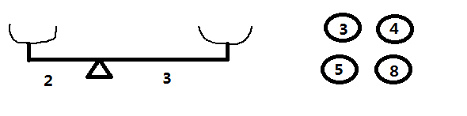
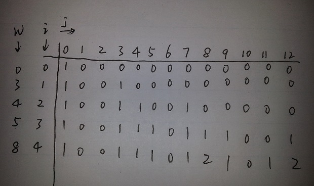

在上一题POJ Problem 1837: Balance中，我们曾讲到，如果只有两个挂钩，问题会好办得多，就拿题目给的样例数据来说：

```
Sample Input
2 4
-2 3
3 4 5 8

Sample Output
2
```

如上图所示，给定重量为3,4,5,8的砝码，放在一个左右臂长分别为2和3的天平上，要使天平平衡，问有多少种方法。

这个问题可以稍加转换，假设放在左边的重量为x，右边为y，则有如下方程组成立：

$$
\begin{cases}
x+y=3+4+5+8=20\\
2x=3y
\end{cases}
$$


马上解出x=12,y=8。这样就相当于把原问题转换为：**已知序列3,4,5,8，问从中取若干个数使和为12（或8）的方案数有多少个？** 因为取出数字和为8，则剩余和为12，所以和为8和12的方案数是相等的。

因为这里只有4个数字，一眼就能看出有(3,4,5)，(4,8)能使和为12，即只有两种方案。如果给的数字较多较大，该怎样写代码求出呢？可以使用动态规划求解。

设dp[i][j]表示从前i个数中选若干个数使得和为j的方案数，则我们可以得到这样的状态转换方程：

$$
\begin{cases}
dp[i][j]=1\qquad\qquad\qquad\qquad\qquad\qquad\qquad\qquad\text{if}i=0\&\&j=0\\
dp[i][j]=dp[i-1][j]\qquad\qquad\qquad\qquad\qquad\qquad\text{if}w[i]>j\\
dp[i][j]=dp[i-1][j]+dp[i-1][j-w[i]]\qquad\quad\text{if}w[i]<=j
\end{cases}
$$


1. 当i=0&&j=0时，dp[i][j]=1表示从0个数中取若干个数使得和为0，当然只有1种方案，那就是什么都不取
2. 当w[i]>j时，第i个数用不上，因为你单个数字都超过j了，怎么使和为j呢，所以直接dp[i][j]=dp[i-1][j]
3. 当w[i]<=j时，第i个数可以用了，这个时候分两种情况，用或者不用第i个数，如果不用，则和w[i]>j时一样dp[i][j]=dp[i-1][j]，如果用的话，则要从前i-1个数中取若干个数使和为j-w[i]，也就是dp[i-1][j-w[i]]，这样总的方案数就是用和不用第i个数的方案数之和，即dp[i][j]=dp[i-1][j]+dp[i-1][j-w[i]]

下面是针对这个例子我手算的一个图：



以上面的内容设计一个OJ题如下：

```
描述：
给定一个正整数数字序列，从中取出若干个数字，使得这些数字之和为某一个特定的值，求所有取法的方案数。

输入：
输入包含多个测试用例，每个测试用例的第一行有两个数N,S，N表示这个数字序列共有多少个数字；S表示取出的数字之和为S。后面一行包含N个正整数。
N,S为0程序结束

输出：
每个测试用例输出一行，表示从N个数中取若干个数使得和为S的方案总数。

样例输入：
4 8
3 4 5 8
4 12
3 4 5 8
10 10
10 9 8 7 6 5 4 3 2 1
0 0

样例输出：
2
2
10
```

知道了状态转换方程，我们可以很快的写出以上OJ的代码：

```cpp
#include <algorithm>
#include <iostream>
#include <vector>
using namespace std;
int main() {
  int n, s, sum;
  while (cin >> n >> s && n && s) {
    vector<int> w(n + 1);
    vector<int> dp(s + 1, 0);

    sum = 0;
    w[0] = 0; /* 额外添加的第0个数字为0 */

    for (int i = 1; i <= n; i++) {
      cin >> w[i];
      sum += w[i]; /* 所有数字之和 */
    }

    if (sum < s) /* 如果所有数字加起来都小于s，则怎么取都不存在和为s的方案 */
    {
      cout << "0" << endl;
      continue;
    }

    sort(w.begin(), w.end()); /* 首先对这些数字从小到大排序，因为取大的数字的时候会用到取小的数字的结果
                               */

    dp[0] = 1; /* 相当于dp[0][0]=1; */

    for (int i = 1; i <= n; i++) {
      for (int j = s; j >= 1; j – ) /* 从后往前测试，这样只需要一行空间 */
      {
        if (w[i] <= j) dp[j] += dp[j - w[i]];
      }
    }
    cout << dp[s] << endl;
  }
  return (0);
}
```

代码中添加了几个操作，首先如果所有数字之和都小于s，则肯定无解；其次，我们先对数字序列从小到大排序，这样DP填表；最后我们填表的时候是从右往左填的，这样只需要一行空间dp[j]，而不是二维dp[i][j]。
