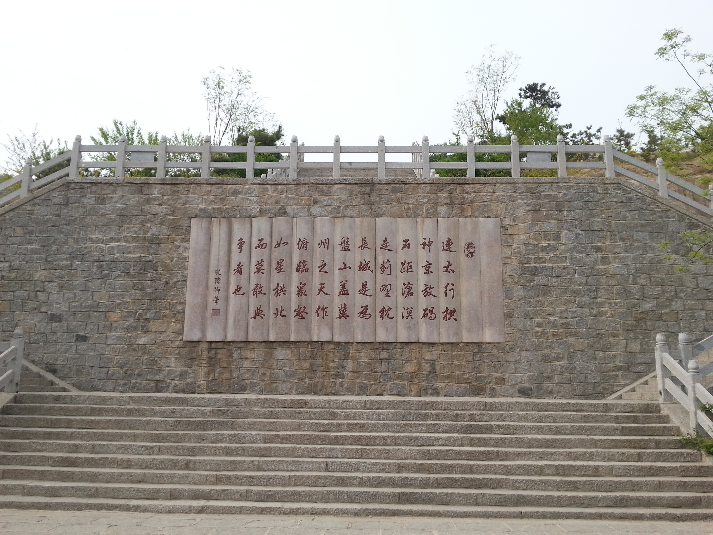

其实很早之前就打算学习繁体字了，但是直接驱动我开始行动的还是上周末的一件事。

上周末组内一起去天津蓟县盘山景区游玩，进入景区看到的第一个“景点”就是下面的乾隆御笔

乾隆《游盘山记》

当时JL师姐念了一遍，有几个繁体字不认识，在场的其他人也都模棱两可。我当时就后悔为什么不早点把繁体字学了呢。所以回所之后马上买了下面的这本《繁简字对照字典》，决定每天看一两页。

《繁简字对照字典》[1]

网上也有《游盘山记》的简体版，如下

连太行，拱神京，放碣石，距沧溟，走蓟野，枕长城，盖蓟州之天作，俯临重壑，如众星拱北而莫敢与争者也。—-乾隆御笔

对照图片中的繁体字，学习一下。

有些繁体字和简体字不是一一对应的，比如同样是“汇”字，“汇聚”对应的繁体字为“匯聚”，而“词汇”对应的繁体字为“詞彙”，这一点需要注意，网上有开源的繁简字转换工具，可以看[这里](http://opencc.byvoid.com/)。

[关于繁简字的争论，网上已经很多了](http://www.zhihu.com/question/25389359)，我也不想评论，我只想说，学习繁体字完全是个人兴趣，我觉得繁体字很美，很有意思，一个字可以研究半天，外出游玩的时候也能顺带“和古人交流交流”，所以就学了-:)

参考：

[1]. 豆瓣读书《繁简字对照字典》：[http://book.douban.com/subject/2234412/](http://book.douban.com/subject/2234412/)