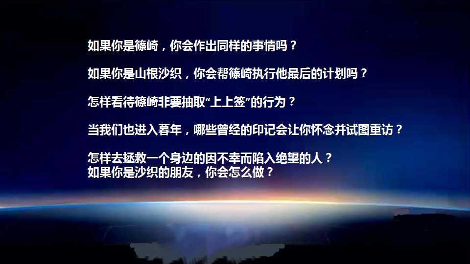

今天参加了[【珞珈阅读广场第89期】《礼物》（影像阅读）](http://www.lib.whu.edu.cn/news/view.asp?id=3354)，感触很多，收获也很多，其中最大的收获就是体会到了交流的乐趣。

![【珞珈阅读广场第89期】《礼物》（影像阅读）[1]](https://i0.wp.com/www.lib.whu.edu.cn/news/tc/readSqua89.jpg)
【珞珈阅读广场第89期】《礼物》（影像阅读）[1]

影片[《礼物》](http://movie.douban.com/subject/25878911/)讲述了一位功成名就的大叔和身为小偷的女生相互救赎的故事。大叔白手起家，一路打拼，最后坐拥万贯家财，却抛弃了妻子和女儿，导致妻子自杀；女生的父亲早逝，母亲生活又不检点，女生曾差点一刀把母亲捅死，为了偿还男朋友的债务，女生甚至当起了小偷。在一次行窃过程中被大叔抓住，大叔要求女生当他的司机和搬运工，带他去东京，给女儿送一个礼物。在去东京的路上，大叔走访了自己曾经到多的很多地方，但大多数都是激情满怀而去，失望而归。到达东京，当女生知道大叔要送给女儿的礼物是自己的心脏，自己的生命的时候，女生陷入了两难的境地。但是女生最终答应的大叔的请求，帮其送出了礼物，大叔得到了救赎，女生也因为大叔的一句“要好好活着”而坚强乐观的面对生活。

90分钟的观影结束之后，主持人抛出了如下几个问题。

关于《礼物》这部电影，主持人提出的若干问题

因为上学期我也参加过珞珈阅读广场的观影活动，当时也体会到了与他人交流的乐趣，现在马上要毕业了，所以跃跃欲试，想和同学们交流一下。正好第一个问题主持人点名叫我谈一谈。我当时谈了一下我对大叔这种献出自己生命拯救外孙女的行为表示了理解，并表示自己也会做出类似的事情。在场的另外一个老师就表达了他的观点，他对日本这种“野蛮粗暴”的拯救方式不太理解，也不太赞同，大叔最后的死亡过程类似于日本武士的剖腹自尽。

关于第三个问题，大家也畅所欲言，从很多个方面谈了自己的想法，大部分还是认为大叔想要给外孙女抽一个好彩头的观点。其实这个观点要到最后大叔把这个“大吉”签绑到外孙女的病床上才能感觉得到，在对后面内容不知道的情况下，我认为最合理的解释应该是这一行为体现了大叔好强甚至“蛮横”的性格，因为他抽签的时候说自己从白手起家到现在亿万富翁，就想中了头彩一样，那么我现在抽签，也要像我经商一样，取得最好的结果。有的同学甚至解读出了大叔“执念”这一层含义。

对于第四个问题，好几个同学分享了自己的经历或者想法。我当时表达了“虽然你现在面临不幸，请不要过多的抱怨，珍惜当下，因为你现在所遭遇的，正是你将来所怀念的；当你再故地重游的时候，也许像这位大叔一样，再也找不到当初那种美好的感觉了。“，并顺带告诉学弟学妹们，珍惜在武大的美好时光，自己马上要毕业了，对武大的一花一木都非常的不舍。

最后一个问题，主持人给出了很好的解答，并且阐明了要拯救一个身处绝望的人的困难性，很精彩。

交流过程中很有意思的一件事情是，主持人给出了这样一个观点”婚姻或家庭不幸的人，其子女的性格往往也会偏离常态，并且子女的婚姻或家庭也很可能会不幸。”，对于这个观点，大家的反应比较激烈，特别是在场的那位老师，表达了他的反对意见。我因为自己的家庭环境原因，反而表示了积极的一面，就是父母婚姻不幸的人，其孩子有可能反而更加珍惜婚姻，珍惜家庭，所以家庭有可能比一般家庭更加幸福。当然也有同学表示对爱的人抓得太紧，有可能适得其反，导致婚姻的破裂。主持人讲了这样一段话，很好的表达了这个观点：

让爱恰到好处－不让疯长的孤独烧毁世界，也不让泛滥的博爱窒息自由。

电影从晚上7:00到8:30，讨论从8:30到10:00。讨论结束的时候，主持人把本期两本书分别赠送给了我和另一位硕士毕业生，我的赠书是[《那一天》](http://book.douban.com/subject/25904481/)。

![赠书《那一天》[2]](https://img1.doubanio.com/lpic/s27950209.jpg)
赠书《那一天》[2]

讨论结束，临走的时候大家还意犹未尽，主持人对大家的讨论表示感谢，此时有一位同学表示主持人的发言也很不错。确实，整个讨论环节，主持人很好的带动起了大家发言的兴趣和积极性，包括问题的设置，主持人的点名提问以及主持人自身精彩的解说，都非常好的带动了现场的气氛，打开了观众的话匣子。不久前我刚好参加过这位主持人主持的”周末艺苑·外院专场“演出，当时主持人随机应变的能力和绝妙的口才给我留下了深刻的印象，学弟不错，加油！

这次观影交流达到了真正交流的目的，观众中有大一大二的新生，有即将毕业的本科生和研究生，也有已经成家的中年老师，大家基于各自的背景，表达自己的想法，聆听他人的观点，达到了很好的思维发散、观点碰撞的目的。此时我想到了高中背的萧伯纳讲过的一句话：

两个人各有一个苹果，交换之后，每个人还是只有一个苹果；然而，当两个人各有一种思想，交换之后，每个人却拥有了两种思想。

前几天观看了踪点剧社的两部毕业大戏《理想》和《禁闭》，两部很有深意的话剧，话剧结束的时候，也有一个短暂的交流会，也很精彩。

人很多时候会沉浸在自我的世界中，产生很多偏见，此时不妨听一听他人的观点，也许会豁然开朗或眼前一亮，觉得世界真奇妙。最后用H老师的一句话结束：**技术上要多钻研，技术外要多沟通，生存两个法则。**

希望每个人都能发现并享受交流的乐趣。

参考：

[1]. 珞珈阅读广场第89期公告：[http://www.lib.whu.edu.cn/news/view.asp?id=3354](http://www.lib.whu.edu.cn/news/view.asp?id=3354)

[2]. 豆瓣读书《那一天》：[http://book.douban.com/subject/25904481/](http://book.douban.com/subject/25904481/)