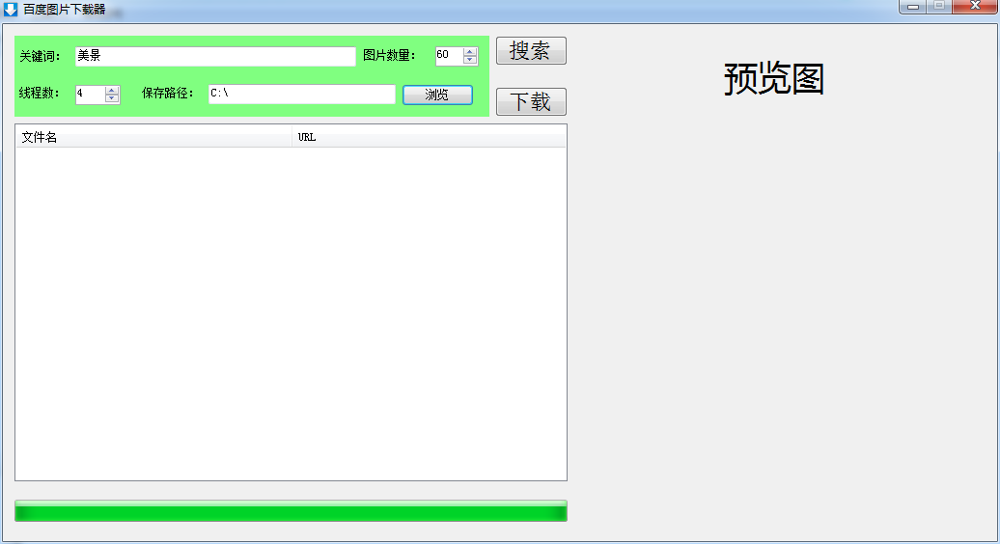
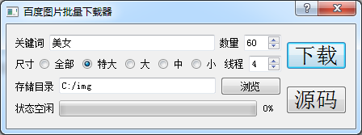
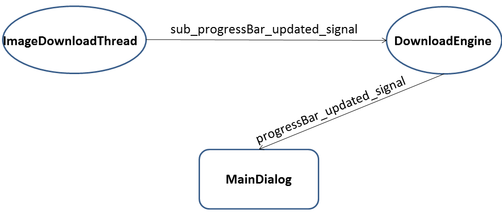

去年暑假在北大计算所实习的时候，任务之一就是批量下载百度图片。当时没学python，用c#实现了一个简易版本的批量下载器，如下图。


C#版本百度图片批量下载器（抓的是百度的wap站点，现在好像不能用了）

当时“时间紧，任务重“，既没仔细研究百度图片API，也没处理好界面线程阻塞的问题。这个问题其实很有意思，趁着暑假在家，实现了一个比较完美的python版本，先上效果图。


python3版本百度图片批量下载器

新版使用了[python-3.4.3.amd64.msi](https://www.python.org/ftp/python/3.4.3/python-3.4.3.amd64.msi) + [PyQt5-5.5-gpl-Py3.4-Qt5.5.0-x64.exe](http://sourceforge.net/projects/pyqt/files/PyQt5/PyQt-5.5/PyQt5-5.5-gpl-Py3.4-Qt5.5.0-x64.exe) + [eric6-6.0.8.zip](http://downloads.sourceforge.net/project/eric-ide/eric6/stable/6.0.8/eric6-6.0.8.zip?r=http%3A%2F%2Fsourceforge.net%2Fprojects%2Feric-ide%2Ffiles%2Feric6%2Fstable%2F&ts=1439435222&use_mirror=nchc) + [cx_Freeze-4.3.4-cp34-none-win_amd64.whl](http://www.lfd.uci.edu/~gohlke/pythonlibs/3i673h27/cx_Freeze-4.3.4-cp34-none-win_amd64.whl)，完整项目在[我的GitHub上](https://github.com/01joy/BaiduImageDownloader)。大致有如下几点工作：

1. 研究百度图片API，获取原始图片URL列表
2. 使用python3进行多线程下载
3. 利用pyqt5实现界面
4. 利用cx_Freeze4打包整个程序

下面记录每个步骤的要点，供后人参考。

# 百度图片API

正常使用百度图片搜索的时候，URL是这样的：

http://image.baidu.com/search/index?ct=201326592&z=0&tn=baiduimage&ipn=r&word=%E6%AD%A6%E6%B1%89%E5%A4%A7%E5%AD%A6&pn=0&istype=2&ie=utf-8&oe=utf-8&cl=2&lm=-1&st=-1&fr=&fmq=1439374041843_R&ic=0&se=&sme=&width=0&height=0&face=0

里面有很多参数，有些我们并不需要，精简之后大概是这样的：

http://image.baidu.com/i?tn=baiduimage&ie=utf-8&word=%E7%BE%8E%E5%A5%B3&pn=&rn=&z=

word为搜索关键词；pn为page number~~当前是第几页，~~**实际含义是image id**，表示第几张图片，从0开始；rn为每一页的图片数量，最大为60；z表示图片尺寸，z=9特大尺寸，z=3大尺寸，z=2中等尺寸，z=1小尺寸，z=0所有尺寸。

但是这个URL是给”人“看的，下一页的图片是动态加载的，其html代码的图片URL数量固定。一番查询之后发现，将tn=baiduimage换成tn=resultjson_com能获取到所有图片URL的json，json当然是给”猴“看的，这样就能轻松获取到所有图片的URL。

慢着，仔细看看json中的objURL，是一串连”猴“都看不懂的字符串，原来百度把图片真实URL加密了，好在加密方法是简单的字符映射，参考[这篇博客](http://blog.csdn.net/hbuxiaoshe/article/details/44780653)成功解密。

**更新：tn=resultjson_com的objURL是加密了，但是tn=resultjson的objURL并没有加密，所以采用tn=resultjson最佳。**

通过控制pn和rn就能获取指定数量的图片URL，但是我发现rn最大只能为60，并且不同的pn可能会有相同的图片url（比如[pn=0](http://image.baidu.com/i?tn=resultjson_com&ie=utf-8&word=mit&pn=0&rn=60&z=9)和[pn=1](http://image.baidu.com/i?tn=resultjson_com&ie=utf-8&word=mit&pn=1&rn=60&z=9)都有ippr_z2C$qAzdH3FAzdH3Fooo_z&e3Bd8vs7k_z&e3Bv54_z&e3BvgAzdH3F7rs5w1utsjAzdH3Fda8nAzdH3Fa080AzdH3Fda8na080aldm9bb8m_z&e3B3r2这个objURL），所以使用python的集合（set）去重。

**更新：pn实际上指图片的id，pn=0、rn=60能获取到从0\~59这60个URL列表，pn=1、rn=60能获取到从1\~60这60个URL列表，所以pn=0和pn=1的列表中当然有59个是重复的。正确的做法是pn=0、rn=60获取0\~59这60个URL列表，然后pn=60、rn=60获取60\~119这60个列表，以此类推，这样获取到的URL就不会有重复的了。**

获取图片URL列表的简要代码如下：
```python
def ParseJSON(self, pn, rn, st):
    url = 'http://image.baidu.com/i?tn=resultjson_com&amp;amp;ie=utf-8&amp;amp;word=%s&amp;amp;pn=%d&amp;amp;rn=%d&amp;amp;z=%d'%(self.word, pn, rn, self.size)
    #print(url)
    request = urllib.request.Request(url = url, headers = my_header)
    html = urllib.request.urlopen(request).read()
    hjson = json.loads(html.decode('gbk'))
    for i in range(0, len(hjson['data'])-1):#最后一个数据为空
        img_url = self.DecodeURL(hjson['data'][i]['objURL'])
        if img_url not in st:
            st.add(img_url)#去重
            self.progressBar_updated_signal.emit()#更新进度条
```

DecodeURL是解密函数。很奇怪，json最后一个数据是空的。

**更新：文章末尾的最新代码已经不需要set去重和DecodeURL解密了。**

# python3多线程下载

多线程下载图片主要参考了[这个例子](http://my.oschina.net/yulongjiang/blog/182508)，只是将其转换为python3的形式，不得不感叹python的易用性，创建线程和下载图片一两行代码就可以完成，太方便了。这个例子有点像单生产者多消费者模型，创建了4个线程之后，并不需要告诉a线程下载哪几张图片，这4个线程会自定从队列里获取，互斥变量的访问也不会出错，减轻了程序员很多任务。

关于python抓取网络资源的介绍，[这篇博客](http://www.cnblogs.com/txw1958/archive/2011/12/21/2295698.html)介绍得很全面。有些URL并不是图片的真正地址，访问之后还会进行跳转，这种情况在使用urlretrieve下载图片时可能会抛出URLError异常。其他还可能遇到timeout、HTTPError、OSError等异常，可以使用下面的方式一次性捕获所有异常。

```python
try:
    urllib.request.urlretrieve(img_url, self.dir + '/' + img_url.split('/')[-1])
except Exception as e:
    print("—–%s: %s—–n"%(type(e), img_url))
```

# pyqt5实现界面

大二大三的时候接触过c++ qt4 gui编程，现在改python了，不过基本思想差不多，pyqt和c++qt的api基本相同，所以借助[eric6](http://downloads.sourceforge.net/project/eric-ide/eric6/stable/6.0.8/eric6-6.0.8.zip?r=http%3A%2F%2Fsourceforge.net%2Fprojects%2Feric-ide%2Ffiles%2Feric6%2Fstable%2F&ts=1439435222&use_mirror=nchc)实现了python和qt的联接。

关于eric的使用教程，网上很多，[这个](http://blog.csdn.net/idber/article/details/40076821)讲解很详细，不过如果在windows上，安装没那么复杂，安装eric之前先安装好python3和pyqt5就行了，不用任何配置。eric熟练之后很方便了，直接拖拽控件画界面。

在使用pyqt5的时候有一些坑需要注意，尤其是我使用的是最新版的python3和qt5，网上的资料不是很多。我遇到的两个主要坑是qt的信号和槽以及界面线程阻塞的问题。

```python
def on_download_pushButton_clicked(self):
    if self.check_option() == 1:
        de = DownloadEngine(self.word_lineEdit.text(), self.size_radio_group.checkedId(), self.num_spinBox.value(), self.dir_lineEdit.text(), self.thread_spinBox.value(),self.progressBar)
        de.Run()
        msg_box = QMessageBox(QMessageBox.Information, "提示", "下载完毕")
        msg_box.exec_()
```

上面这一段是我最开始的按钮槽函数，点击下载按钮之后，实例化一个DownloadEngine，然后de.Run()开始下载，要等到下载完毕de.Run()返回后，流程才会往下走，弹出提示框。但是下载过程耗时较长，这样整个界面线程阻塞，程序出现假死状态。

后来参考[A](http://blog.csdn.net/a359680405/article/details/45220663)、[B](https://gist.github.com/mauriciodev/1118585)两个例子，令DownloadEngine继承QThread，用de.start()开启一个新的下载线程，界面线程继续往下走，当de下载完毕后，发送download_done_signal信号，界面接收到该信号后弹出提示框。第二版程序大概如下：

```python
def on_download_pushButton_clicked(self):
    if self.check_option() == 1:
        de = DownloadEngine(self.word_lineEdit.text(), self.size_radio_group.checkedId(), self.num_spinBox.value(), self.dir_lineEdit.text(), self.thread_spinBox.value(), self.progressBar)
        de.start()
        de.download_done_signal.connect(self.download_done_slot)
```

一切似乎很正确，但是点击下载按钮后程序崩溃，提示pythonw.exe已停止工作，我开始以为是python或者pyqt5的问题，重装一遍问题依旧。百思不得其解之后，用命令行运行py程序，cmd提示QThread: Destroyed while thread is still running，[原来de是该函数的局部变量，当de.start()后，函数继续往下走直到结束，但是de的下载任务可能还没完成，所以导致上面的错误。解决办法就是将de变为该类的成员变量，将de改为self.de。](http://www.360doc.com/content/13/0719/13/9934052_301060189.shtml)

有了这一个编写信号和槽函数的经验之后，准备实现进度条的功能，同样要保证界面线程不阻塞，所以创建了progressBar_updated_signal信号和相应槽函数。

但是因为界面是直接和DownloadEngine联系的，但真正的下载工作是在ImageDownloadThread完成，所以progressBar_updated_signal信号最原始的发出地是ImageDownloadThread。这里面的信号传递关系如下图所示：


“进度条更新”信号传递关系

python3多线程下载代码如下：

```python
# -*- coding: utf-8 -*-
import urllib.request
import json
import socket
import queue
from PyQt5.QtCore import *

global my_header
my_header = {'User-Agent':'Mozilla/5.0'}
global bad
bad = 0

class ImageDownloadThread(QThread):
    sub_progressBar_updated_signal = pyqtSignal()
    def __init__(self,queue_in, dir_in): #进程间通过队列通信，所以每个进程需要用到同一个队列初始化
        super(ImageDownloadThread,self).__init__()
        self.my_queue=queue_in
        self.dir = dir_in
        #self.setDaemon(True) #守护线程
        self.start() #启动线程

    #使用队列实现进程间通信
    def run(self):
        while (True):
            global bad
            img_url = self.my_queue.get()
            socket.setdefaulttimeout(5)#这里对整个socket层设置超时时间。后续连接中如果再使用到socket，不必再设置
            try:
                urllib.request.urlretrieve(img_url, self.dir + '/' + img_url.split('/')[-1])
            except Exception as e:
                print("—–%s: %s—–n"%(type(e), img_url))
                bad += 1

            self.sub_progressBar_updated_signal.emit()
            if self.my_queue.empty():
                break
        self.my_queue.task_done() #当使用者线程调用 task_done() 以表示检索了该项目、并完成了所有的工作时，那么未完成的任务的总数就会减少。

class DownloadEngine(QThread):
    download_done_signal = pyqtSignal(int)
    status_changed_signal = pyqtSignal(str)
    progressBar_updated_signal = pyqtSignal()
    def __init__(self, word_in, size_in, num_in, dir_in, thread_num_in):
        super(DownloadEngine,self).__init__()
        self.word = urllib.parse.quote(word_in)
        self.size = size_in
        self.num = num_in
        self.dir = dir_in
        self.thread_num = thread_num_in

    def ParseJSON(self, pn, rn, qe):
        url = 'http://image.baidu.com/i?tn=resultjson&ie=utf-8&word=%s&pn=%d&rn=%d&z=%d'%(self.word, pn, rn, self.size)
        #print(url)
        request = urllib.request.Request(url = url, headers = my_header)
        html = urllib.request.urlopen(request).read()
        hjson = json.loads(html.decode('gbk'))
        for i in range(0, len(hjson[‘data’])-1):#最后一个数据为空
            qe.put(hjson['data'][i]['objURL'])
            self.progressBar_updated_signal.emit()#更新进度条

    def GetImgUrlQueue(self):
        img_url_queue = queue.Queue(0)
        if self.num <= 60:
            self.ParseJSON(0, self.num, img_url_queue)
        else:
            n = self.num / 60
            n = int(n)
        for i in range(n):
            self.ParseJSON(i * 60, 60, img_url_queue)
            self.ParseJSON(n * 60, self.num – n * 60, img_url_queue)
        return img_url_queue

    def sub_update_progressBar(self):
        self.progressBar_updated_signal.emit()

    def run(self):
        global bad
        bad = 0
        self.status_changed_signal.emit('获取URL')
        img_url_queue = self.GetImgUrlQueue()
        threads = []
        self.status_changed_signal.emit(‘下载图片’)
        #多线程爬去图片
        for i in range(self.thread_num):
            thread=ImageDownloadThread(img_url_queue, self.dir)
            thread.sub_progressBar_updated_signal.connect(self.sub_update_progressBar)
            threads.append(thread)
        #合并进程，当子进程结束时，主进程才可以执行
        for thread in threads:
            thread.wait()
        self.status_changed_signal.emit('下载完成')
        self.download_done_signal.emit(bad)
```

pyqt5界面代码如下：

```python
# -*- coding: utf-8 -*-

"""
Module implementing MainDialog.
"""

from PyQt5.QtCore import *
from PyQt5.QtWidgets import *

from Ui_main import Ui_Dialog
from DownloadEngine import DownloadEngine

import webbrowser

class MainDialog(QDialog, Ui_Dialog):
    """
    Class documentation goes here.
    """
    def __init__(self, parent=None):
        """
        Constructor

        @param parent reference to the parent widget (QWidget)
        """
        super(MainDialog, self).__init__(parent)
        self.setupUi(self)
        self.size_radio_group = QButtonGroup()
        self.size_radio_group.addButton(self.total_radioButton, 0)
        self.size_radio_group.addButton(self.XL_radioButton, 9)
        self.size_radio_group.addButton(self.L_radioButton, 3)
        self.size_radio_group.addButton(self.M_radioButton, 2)
        self.size_radio_group.addButton(self.S_radioButton, 1)
        self.count = 0

    def check_option(self):
        if self.word_lineEdit.text() == "":
            msg_box = QMessageBox(QMessageBox.Warning, "警告", "请输入搜索关键词！")
            msg_box.exec_()
            return 0
        if self.dir_lineEdit.text() == "":
            msg_box = QMessageBox(QMessageBox.Warning, "警告", "请选择图片存储目录！")
            msg_box.exec_()
            return 0
        return 1

    @pyqtSlot()
    def on_dir_pushButton_clicked(self):
        """
        Slot documentation goes here.
        """
        # TODO: not implemented yet
        dir = QFileDialog.getExistingDirectory(self, "选择图片存储目录",".")
        self.dir_lineEdit.setText(dir)

    @pyqtSlot()
    def on_download_pushButton_clicked(self):
        """
        Slot documentation goes here.
        """
        # TODO: not implemented yet
        self.progressBar.setValue(0)
        if self.check_option() == 1:
            self.progressBar.setMaximum(self.num_spinBox.value())
            self.download_pushButton.setEnabled(False)
            self.de = DownloadEngine(self.word_lineEdit.text(), self.size_radio_group.checkedId(), self.num_spinBox.value(), self.dir_lineEdit.text(), self.thread_spinBox.value())
            self.de.start()
            self.de.status_changed_signal.connect(self.status_changed_slot)
            self.de.download_done_signal.connect(self.download_done_slot)
            self.de.progressBar_updated_signal.connect(self.progressBar_updated_slot)

    @pyqtSlot()
    def on_src_pushButton_clicked(self):
        """
        Slot documentation goes here.
        """
        # TODO: not implemented yet
        webbrowser.open("https://github.com/Beeder/BaiduImageDownloader")

    def progressBar_updated_slot(self):
        self.count += 1
        self.progressBar.setValue(self.count)

    def status_changed_slot(self, tip):
        self.status_label.setText(tip)
        self.count = 0
        if tip != '下载完成':
            self.progressBar.setValue(0)

    def download_done_slot(self, bad):
        msg_box = QMessageBox(QMessageBox.Information, "提示", "下载完毕n成功%d,失败%d"%(self.num_spinBox.value() – bad, bad))
        msg_box.exec_()
        self.download_pushButton.setEnabled(True)

if __name__ == "__main__":
    import sys
    app = QApplication(sys.argv)
    Dialog = MainDialog()
    Dialog.show()
    sys.exit(app.exec_())
```

# cx_Freeze4打包

目前有好几个python打包程序，但是只有cx_Freeze明确表示支持python3，所以非他莫属了。

在[sourceforge](http://sourceforge.net/projects/cx-freeze/files/4.3.3/)下载cx_Freeze-4.3.3.win-amd64-py3.4.msi，安装；根据[官方指南](http://cx-freeze.readthedocs.org/en/latest/distutils.html)编写setup.py代码，将setup.py放到工程根目录下，执行python setup.py bdist_msi；报错`AttributeError:’module’object has no attribute ‘fix_up_module’。[原来这是cx_Freeze-4.3.3版本的一个bug](http://stackoverflow.com/questions/25367441/python-into-msi-exe-using-cx-freeze-error-message)，[利用替换的方法，安装4.3.4版本，问题解决](http://blog.csdn.net/lawme/article/details/44094429)。

打包完成之后生成一个BaiduImageDownloader-0.1-amd64.msi文件，拷贝到其他电脑上也可正常运行。Winows7 64位用户可以[点击下载BaiduImageDownloader-0.1-amd64.msi](https://github.com/Beeder/BaiduImageDownloader/blob/master/dist/BaiduImageDownloader-0.1-amd64.msi?raw=true)。

（完）