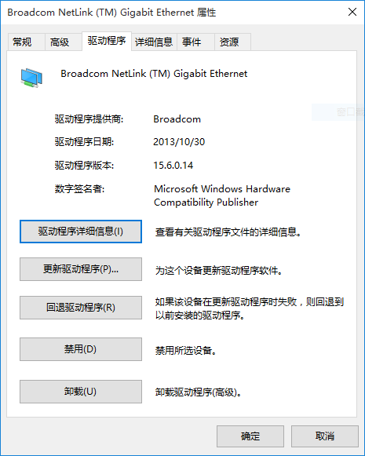
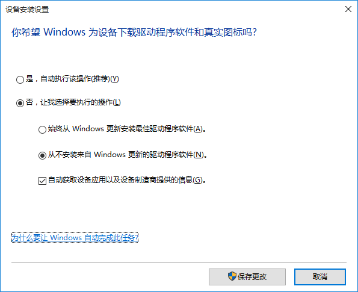
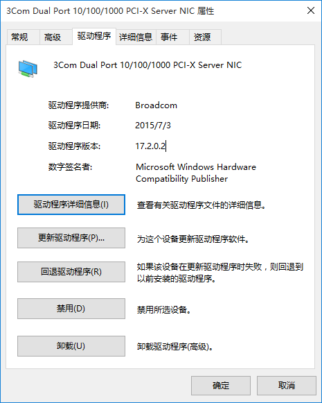

安装WIN10一个月以来，校园有线网经常间歇性断网，通常是20分钟不到就断了，需要重启或者把有线连接关闭再打开才可以。在微博上问过微软客服也无果，[后来Google到某国外的解决办法](http://www.pcadvisor.co.uk/forum/windows-29/windows-10-no-internet-trough-ethernet-4540238/)，现记录如下。

说到底WIN10断网的问题还是和驱动有关，先看一下我的有线网卡Broadcom NetLink (TM) Gigabit Ethernet，驱动信息是这样的：

还是13年的驱动，版本号是15.6.0.14，于是第一想到的是更新驱动。点击驱动右键选更新->自动搜索更新的驱动程序软件->提示“已安装适合设备的最佳驱动程序软件”，但这明明不是最新的驱动啊！

[于是在Broadcom的官网上找到了最新驱动win_b57_x64-17.2.0.2](https://www.broadcom.com/support/ethernet-nic-netxtreme-i-desktop-mobile)，版本号是17.2.0.2，更新日期2015-10-27，原来这才是最新的驱动。

（**2018.1.25**更新：上面的地址已失效，[最新地址请点击此处](https://www.broadcom.cn/products/ethernet-connectivity/controllers/bcm5720#downloads)，并选择DOWNLOADS→Software→NetLink®/NetXtreme® I Desktop/Mobile/Server (x64)，[也可以从本站下载](win_b57_x64-17.2.0.2.zip)。）

在安装最新驱动之前，我们需要关闭WIN10的自动更新驱动功能，因为WIN10会认为它的15.6.0.14版本是最新的，在windows update时把实际最新的17.2.0.2版本替换掉。具体做法是在Cortana中搜索“**更改设备安装设置**”并打开，选择否，从不安装来自Windows更新的驱动程序软件，如下。

然后[重启进入安全模式](http://jingyan.baidu.com/article/fea4511a72cb38f7ba912543.html)，再次在设备管理器中右键点击网卡驱动，选择更新->浏览计算机以查找驱动程序软件->从计算机的设备驱动程序列表中选取->点击从磁盘安装按钮->浏览找到你之前在网上下载的最新驱动（*.inf格式）->选中->依次确定。刷新之后再次查看驱动信息如下：

可以看到驱动已经更新到最新的版本了。再次重启进入正常模式，目前用了两天了也没有再断过网。

其他WIN10驱动问题应该也可以用类似的方法解决。

（话说我的WIN10偶尔会死机，就是用着用着突然鼠标和键盘完全动不了了，只能强制重启，有谁知道这是怎么回事吗？）