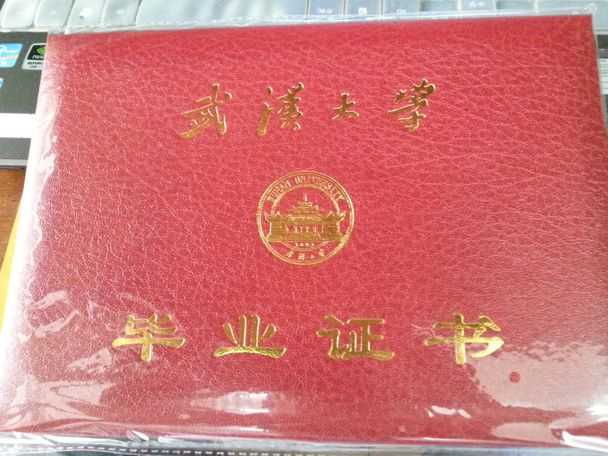
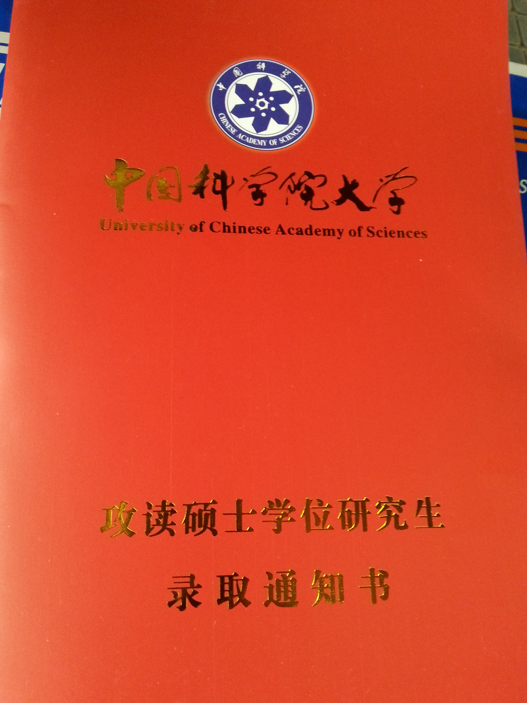
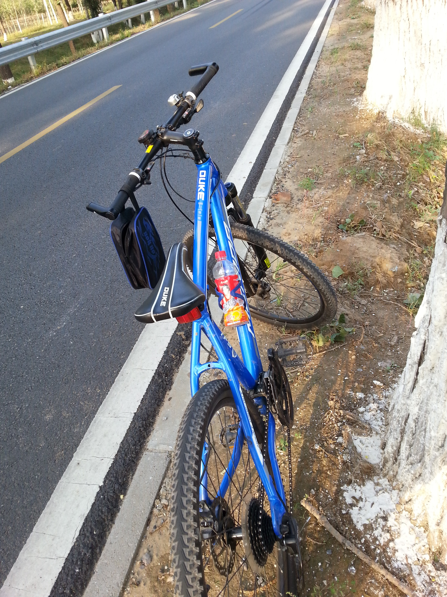
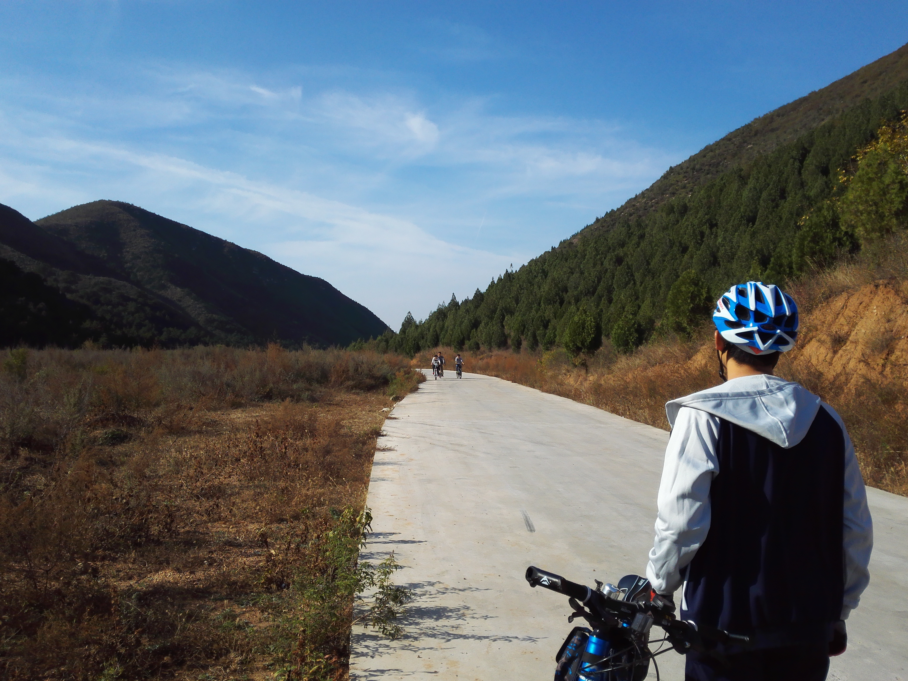
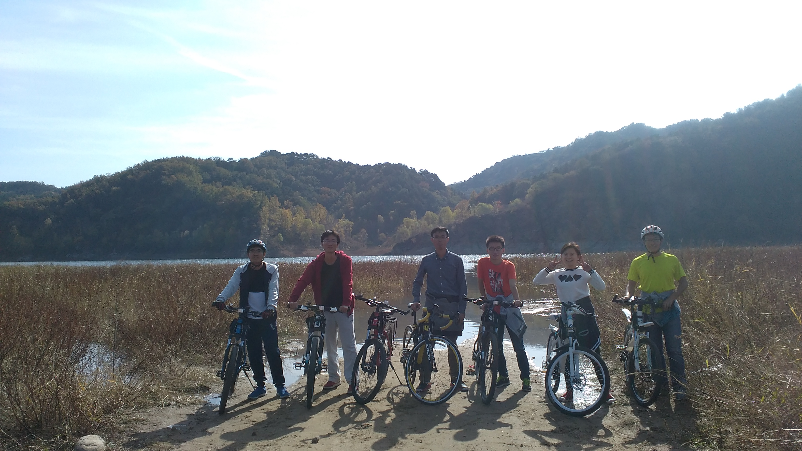

2015年过得好快，梳理一下，2015年的时间线大概是这样的：

3月来北京计算所做毕设→5月返回武大修改论文→5月30公开答辩→6月毕业季→7月回北京计算所→8月回家陪父母→9月国科大开学→持续高强度的学习→2016元旦还在图书馆研究NPC问题。

2015年给我的总体感受是很忙，但忙的事情都很琐碎，并没有什么大的里程碑事件，不过以下三件事情我认为值得一提。

1. 本科四年修成正果，研究生三年新的起航

2. 买了一辆属于自己的山地车，1k2，虽然是二手的，但足够我骑着它去看世界了:-) 

也许是在城市里待久了，我特别享受这种亲近大自然的感觉，蓝天、白云、草原、大海这些美景永远也看不够。

3. 在国科大认识了两个好基友，虽然都是单身汪，但至少想看电影吃火锅的时候还可以有个伴。（此处居然少了三人合照）

2015年共写了14篇博客，包含3篇技术博客，bitjoy.net 历史累计PV1039，UV520，IP502。

展望2016年，大的方向基本都确定了，目标如下：

1. 完成国科大下学期的课程任务
2. 接手pLink软件
3. 刷完LeetCode所有题目
4. 读10本书
5. 去电影院看10场电影（2015下半年在怀柔村里没看一部电影/(ㄒoㄒ)/~~）
6. 改正坐姿

大家一起见证！