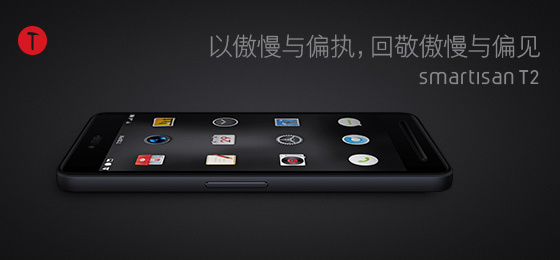

突然发现，从小到大，自己做事都做得很慢，别人一会做完的作业，我可能要花好几个小时。但拿作业一对比，明显能看出差距，自己精雕细琢的作品不是别人随随便便就能比的。

最近几次和同学合作完成大作业也遇到了类似的情况，数据抓取的同学给我的数据，不是格式不对就是内容缺胳膊少腿，质量极其差，还不愿修改，曰：只是做一个演示系统，有数据就行了。他不知道他这样的数据给我，我们后面做得再好，最终的演示效果也不会好，他这样的随意，后面的人不知要多花多少时间来弥补。我也无意跟他多费口舌，自己挽起袖子重做了他的工作。

类似的事情，我遇到的不在少数，和别人沟通的时间远远超过了自己完成任务的时间。所以往往一个很简单的工作，我要花比别人多两到三倍的时间。这个过程就像工匠在雕琢自己的作品，是不计时间的，直到自己认为完美为止。这大概就是老罗所说的工匠精神吧。

在一个完美主义者的眼里，这是一个千疮百孔的世界。

糟糕的文档排版，错别字和错误标点一堆，一群人并排走挡了后面或对面的人，开水房离宿舍十万八千里，蚊香的设计，电脑接口位置的设计，U盘接口的设计，凸出的摄像头，插队，说脏话。。。

当然也有同学劝我，这些东西差不多就行了，何必花这么多时间做这么好干什么，还不如去看个电影打个球。也经常听人说Take it easy，别太认真，认真你就输了。

但是我始终相信，态度决定一切。你一天认真做了，别人不一定看得到，但坚持一个月甚至一年，总会有志同道合的人发现你，而你的坚持也将一点点的改变这个行业这个世界。就像老罗做手机，虽然销量不怎么样，但他的工匠精神、他的情怀，值得每一个人尊敬。T2统一听筒和各种传感器的位置、消失的电源键、消失的SIM卡插槽、消失的金属中框断点完全是超出iPhone的美好设计。希望老罗的情怀之路能够坚持下去、越走越远。

