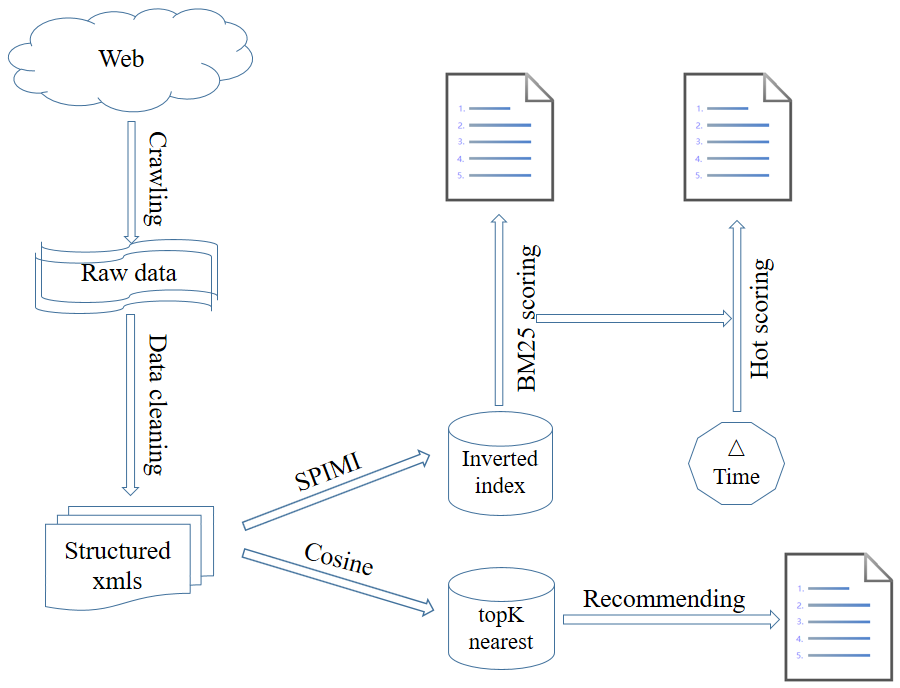

我们上网用得最多的一项服务应该是搜索，不管大事小情，都喜欢百度一下或谷歌一下，那么百度和谷歌是怎样从浩瀚的网络世界中快速找到你想要的信息呢，这就是搜索引擎的艺术，属于信息检索的范畴。

这学期学习了《现代信息检索》课程，使用的是Stanford的教材[Introduction to Information Retrieval](http://nlp.stanford.edu/IR-book/)，网上有电子版，大家可以参考。

本课程的大作业是完成一个新闻搜索引擎，要求是这样的：定向采集3-4个新闻网站，实现这些网站信息的抽取、索引和检索。网页数目不少于10万条。能按相关度、时间和热度（需要自己定义）进行排序，能实现相似新闻的自动聚类。

截止日期12月31日，我们已经在规定时间完成了该系统，自认为检索效果不错，所以在此把过程记录如下，欢迎讨论。

网上有很多开源的全文搜索引擎，比如Lucene、Sphinx、Whoosh等，都提供了很好的API，开发者只需要调用相关接口就可以实现一个全功能的搜索引擎。不过既然学习了IR这门课，自然要把相关技术实践一下，所以我们打算自己实现一个搜索引擎。

这是简介部分，主要介绍整个搜索引擎的思路和框架。

上图为本搜索引擎的框架图。首先爬虫程序从特定的几个新闻网站抓取新闻数据，然后过滤网页中的图片、视频、广告等无关元素，抽取新闻的主体内容，得到结构化的xml数据。然后一方面使用内存式单遍扫描索引构建方法（SPIMI）构建倒排索引，供检索模型使用；另一方面根据向量空间模型计算两两新闻之间的余弦相似度，供推荐模块使用。最后利用概率检索模型中的BM25公式计算给定关键词下的文档相关性评分，BM25打分结合时间因素得到热度评分，根据评分给出排序结果。

在后续博文中，我会详细介绍每个部分的实现。

---

完整可运行的新闻搜索引擎Demo请看我的Github项目[news_search_engine](https://github.com/01joy/news_search_engine)。

以下是系列博客：

[和我一起构建搜索引擎（一）简介](https://bitjoy.net/posts/2016-01-04-introduction-to-building-a-search-engine-1/)

[和我一起构建搜索引擎（二）网络爬虫](https://bitjoy.net/posts/2016-01-04-introduction-to-building-a-search-engine-2/)

[和我一起构建搜索引擎（三）构建索引](https://bitjoy.net/posts/2016-01-07-introduction-to-building-a-search-engine-3/)

[和我一起构建搜索引擎（四）检索模型](https://bitjoy.net/posts/2016-01-07-introduction-to-building-a-search-engine-4/)

[和我一起构建搜索引擎（五）推荐阅读](https://bitjoy.net/posts/2016-01-09-introduction-to-building-a-search-engine-5/)

[和我一起构建搜索引擎（六）系统展示](https://bitjoy.net/posts/2016-01-09-introduction-to-building-a-search-engine-6/)

[和我一起构建搜索引擎（七）总结展望](https://bitjoy.net/posts/2016-01-09-introduction-to-building-a-search-engine-7/)