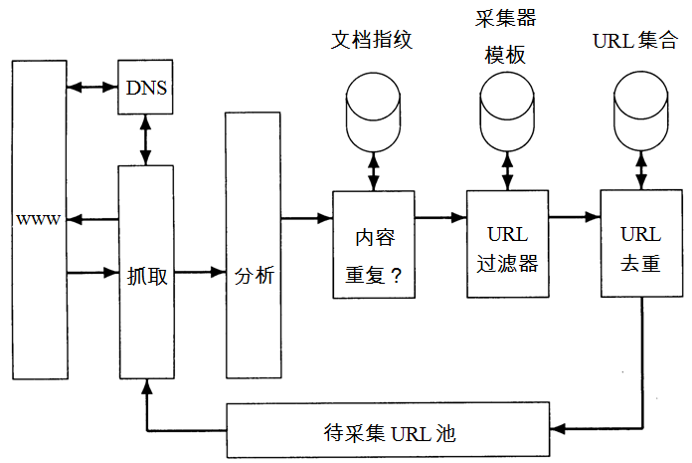
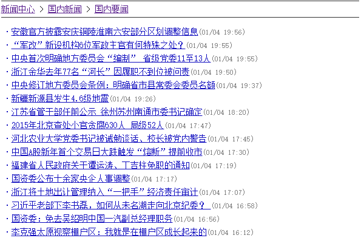
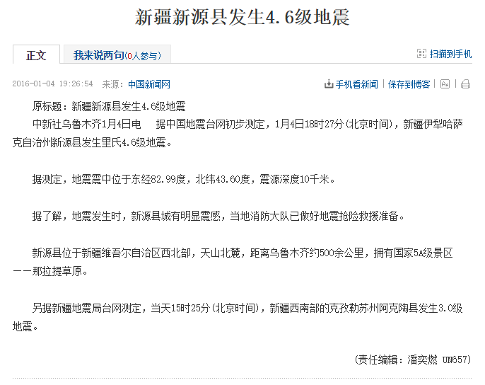
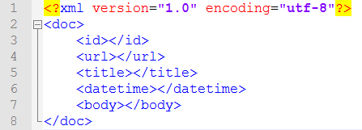

网络爬虫又称网络蜘蛛、Web采集器等，它是一种按照一定的规则，自动地抓取万维网信息的程序或者脚本。

我们在设计网络爬虫的时候需要注意两点：

**鲁棒性**。Web中有些服务器会制造采集器陷阱（spider traps），这些陷阱服务器实际上是Web页面的生成器，它能在某个域下生成无数网页，从而使采集器陷入到一个无限的采集循环中去。采集器必须能从这些陷阱中跳出来。当然，这些陷阱倒不一定都是恶意的，有时可能是网站设计疏忽所导致的结果。

**礼貌性**。Web服务器具有一些隐式或显式的政策来控制采集器访问它们的频率。设计采集器时必须要遵守这些代表礼貌性的访问政策。

采集器的基本架构如下图所示。



基本上是“抓取→分析→得到新的URL→再抓取→再分析”这样一个死循环过程。

以上内容摘自王斌老师翻译的《信息检索导论》课本。

由于我们要做的是一个新闻搜索引擎，所以抓取的是新闻数据，对于爬虫，网上也有很多的开源程序，如nutch等，Github上还有人专门开发了抓取新闻的组件[newspaper](https://github.com/codelucas/newspaper)，可以很方便的提取新闻标题、正文、时间等信息。不过用python写爬虫也是分分钟的事情，下面我们一起来试一试。

首先找一个新闻网站，为简单起见，要找那种结构清晰、html代码便于解析的门户网站，比如[搜狐新闻](http://news.sohu.com/1/0903/61/subject212846158.shtml)、[参考消息](http://www.cankaoxiaoxi.com/china/szyw/)等。

搜狐新闻的国内要闻列表如下：



结构非常清楚，左边是带URL的标题，右边括号里有新闻时间。这一页列表就有200条新闻，如果我们要获取1000条，只要不断模拟点击下一页即可。下一页的URL也只是在首页的基础上加上_xxx.shtml，xxx就是不同的页码。

查看列表的html源码，得知列表都在类名为newsblue1的td中，所以只需要解析html源码就可以得到新闻标题、URL和时间，python解析html可以用BeautifulSoup包，非常方便。

进入到新闻详细页面，正文部分如下：



查看html源码，正文位于类名为text clear的div中，据此可以很方便的提取新闻正文。

得到一条新闻的所有数据之后，我们需要将之结构化成xml文件，借助相应的xml包可以很方便的完成这项工作。xml格式定义如下：



注意爬虫需要访问网络，难免会出现一些异常，所以捕获异常是非常有必要的。另外，搜狐每篇新闻正文后面都会有一段’//’开始的注释，这个需要过滤掉，短于140个字的新闻我也过滤掉了。整个搜索系统的配置参数都存储在config.ini文件中。

下面是完整的python 3.4+代码。

```python
# -*- coding: utf-8 -*-
"""
Created on Sat Dec 19 11:57:01 2015

@author: bitjoy.net
"""

from bs4 import BeautifulSoup
import urllib.request
import xml.etree.ElementTree as ET
import configparser

def get_news_pool(root, start, end):
    news_pool = []
    for i in range(start,end,-1):
        page_url = ''
        if i != start:
            page_url = root +'_%d.shtml'%(i)
        else:
            page_url = root + '.shtml'
        try:
            response = urllib.request.urlopen(page_url)
        except Exception as e:
            print("—–%s: %s—–"%(type(e), page_url))
            continue
        html = response.read()
        soup = BeautifulSoup(html)
        td = soup.find('td', class_ = "newsblue1")
        a = td.find_all('a')
        span = td.find_all('span')
        for i in range(len(a)):
            date_time = span[i].string
            url = a[i].get('href')
            title = a[i].string
            news_info = ['2016-'+date_time[1:3]+'-'+date_time[4:-1]+':00',url,title]
            news_pool.append(news_info)
    return(news_pool)

def crawl_news(news_pool, min_body_len, doc_dir_path, doc_encoding):
    i = 1
    for news in news_pool:
        try:
            response = urllib.request.urlopen(news[1])
        except Exception as e:
            print("—–%s: %s—–"%(type(e), news[1]))
            continue
        html = response.read()
        soup = BeautifulSoup(html)
        try:
            body = soup.find('div', class_ = "text clear").find('div').get_text()
        except Exception as e:
            print("—–%s: %s—–"%(type(e), news[1]))
            continue
        if '//' in body:
            body = body[:body.index('//')]
            body = body.replace(" ", "")
        if len(body) <= min_body_len:
            continue
        doc = ET.Element("doc")
        ET.SubElement(doc, "id").text = "%d"%(i)
        ET.SubElement(doc, "url").text = news[1]
        ET.SubElement(doc, "title").text = news[2]
        ET.SubElement(doc, "datetime").text = news[0]
        ET.SubElement(doc, "body").text = body
        tree = ET.ElementTree(doc)
        tree.write(doc_dir_path + "%d.xml"%(i), encoding = doc_encoding, xml_declaration = True)
        i += 1

if __name__ == '__main__':
    config = configparser.ConfigParser()
    config.read('../config.ini', 'utf-8')
    root = 'http://news.sohu.com/1/0903/61/subject212846158'
    news_pool = get_news_pool(root, 854, 849)
    crawl_news(news_pool, 140, config['DEFAULT']['doc_dir_path'], config['DEFAULT']['doc_encoding'])
    print('done!')
```
---

完整可运行的新闻搜索引擎Demo请看我的Github项目[news_search_engine](https://github.com/01joy/news_search_engine)。

以下是系列博客：

[和我一起构建搜索引擎（一）简介](https://bitjoy.net/posts/2016-01-04-introduction-to-building-a-search-engine-1/)

[和我一起构建搜索引擎（二）网络爬虫](https://bitjoy.net/posts/2016-01-04-introduction-to-building-a-search-engine-2/)

[和我一起构建搜索引擎（三）构建索引](https://bitjoy.net/posts/2016-01-07-introduction-to-building-a-search-engine-3/)

[和我一起构建搜索引擎（四）检索模型](https://bitjoy.net/posts/2016-01-07-introduction-to-building-a-search-engine-4/)

[和我一起构建搜索引擎（五）推荐阅读](https://bitjoy.net/posts/2016-01-09-introduction-to-building-a-search-engine-5/)

[和我一起构建搜索引擎（六）系统展示](https://bitjoy.net/posts/2016-01-09-introduction-to-building-a-search-engine-6/)

[和我一起构建搜索引擎（七）总结展望](https://bitjoy.net/posts/2016-01-09-introduction-to-building-a-search-engine-7/)