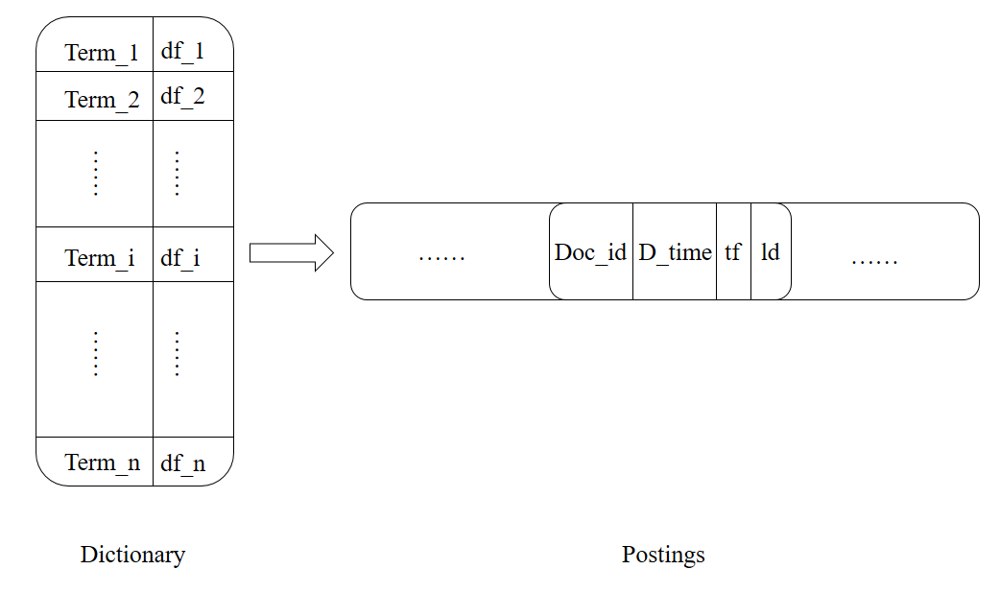
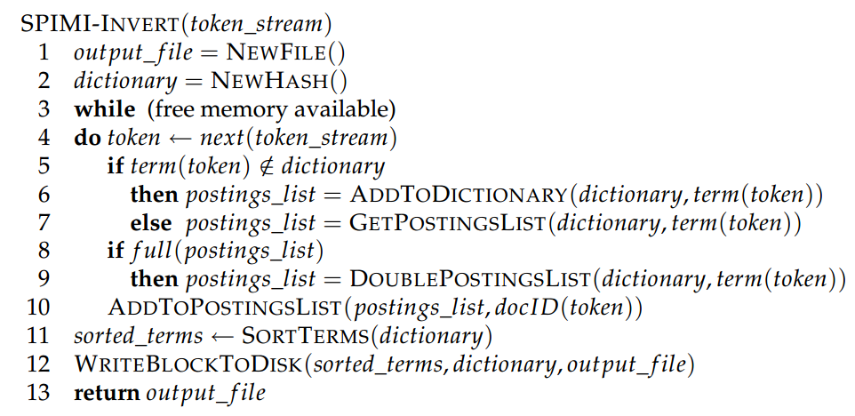

目前正是所谓的“大数据”时代，数据量多到难以计数，怎样结构化的存储以便于分析计算，是当前的一大难题。上一篇博客我们简单抓取了1000个搜狐新闻数据，搜索的过程就是从这1000个新闻中找出和关键词相关的新闻来，那么怎样快速搜索呢，总不可能依次打开xml文件一个字一个字的找吧，这时就需要借助倒排索引这个强大的数据结构。

在讲倒排索引之前，我们先介绍一下布尔检索。布尔检索只是简单返回包含某个关键词的文档，比如查询“苹果手机”，则返回所有包含“苹果”和“手机”关键词的文档，布尔检索并不对返回结果排序，所以有可能返回的第一个文档是“某个男孩边吃苹果边玩手机…“。

实现布尔检索并不难，我们需要构建一个如下图的词项文档矩阵：


图1. 布尔检索中的词项文档矩阵

每行对应一个词项，每列对应一个文档，如果该值为1，表示该行词项出现在该列文档中。比如词项”苹果“出现在doc1和doc3文档中，如果我们要找同时出现”苹果“和”手机“的文档，只需把他们对应的向量取出来进行”与“操作，此为101&011=001，所以doc3同时出现了”苹果“和”手机“两个关键词，我们将其返回。

布尔检索虽然很快，但是它也有很多缺陷，比如不能对结果排序，词项只有出现和不出现两种状态，但是一篇文档中出现10次“苹果“和只出现1次”苹果“，他们的相关度肯定是不相同的。所以需要对布尔检索进行改进。

在扫描文档时，不但记录某词项出现与否，还记录该词项出现的次数，即词项频率(tf)；同时我们记录该文档的长度(ld)，以及某词项在不同文档中出现的次数，即文档频率(df)。


图2. 倒排索引结构图

这样我们就得到了如上图的倒排索引。左边部分被称为词典，存储的是1000个新闻中所有不同的词项；右边部分被称为倒排记录表，存储的是出现Term_i的那些文档信息。倒排索引中存储的变量都是为了给后续检索模型使用。

讲到这里，我们需要解决如下几个问题。

1. 怎样得到一篇文档中的所有词项。给我们一篇新闻稿子，人类很容易分辨出”苹果“和”手机“是两个不同的词项，但是计算机怎么知道是这两个词呢？为什么不是”苹”、”国手“和”机“呢？这就需要进行中文分词，我们可以借助开源的[jieba中文分词组件](https://github.com/fxsjy/jieba)来完成，jieba分词能够将一个中文句子切成一个个词项，这样我们就可以统计tf, df了。
2. 有些词，如”的“、”地“、”得“、”如果“等，几乎每篇文档都会出现，他们起不到很好的区分文档的效果，这类词被称为”停用词“，我们需要把他们去掉。去停词的步骤可以在jieba分词之后完成。
3. 怎样存储倒排记录表。假设1000个文档共有20000个不同的词项，如果用类似图1的矩阵形式存储，需要耗费1000*20000=2*10^7个存储单元，但是图1往往是一个稀疏矩阵，因为一个文档中可能只出现了200个不同的词项，剩余的19800个词项都是空的。用矩阵方式存储时空效率都不高。所以我们可以采用图2的方式，词典用B-树或hash存储，倒排记录表用邻接链表存储方式，这样能大大减少存储空间。如果我们要将图2保存到数据库，可以对倒排记录表序列化成一个长的字符串，写入到一个单元格，读取的时候再反序列化。比如每个Doc内部用’\t’连接，Doc之间用’\n’连接，读取的时候split即可。

倒排索引构建算法使用内存式单遍扫描索引构建方法（SPIMI），其实就是依次对每篇新闻进行分词，如果出现新的词项则插入到词典中，否则将该文档的信息追加到词项对应的倒排记录表中。SPIMI的伪代码如下：


图3. SPIMI算法伪代码

下面是构建索引的所有代码：

```python
# -*- coding: utf-8 -*-
"""
Created on Sat Dec 5 23:31:22 2015

@author: bitjoy.net
"""

from os import listdir
import xml.etree.ElementTree as ET
import jieba
import sqlite3
import configparser

class Doc:
    docid = 0
    date_time = ''
    tf = 0
    ld = 0
    def __init__(self, docid, date_time, tf, ld):
        self.docid = docid
        self.date_time = date_time
        self.tf = tf
        self.ld = ld
    def __repr__(self):
        return(str(self.docid) + '\t' + self.date_time + '\t' + str(self.tf) + '\t' + str(self.ld))
    def __str__(self):
        return(str(self.docid) + '\t' + self.date_time + '\t' + str(self.tf) + '\t' + str(self.ld))

class IndexModule:
    stop_words = set()
    postings_lists = {}

    config_path = ''
    config_encoding = ''

    def __init__(self, config_path, config_encoding):
        self.config_path = config_path
        self.config_encoding = config_encoding
        config = configparser.ConfigParser()
        config.read(config_path, config_encoding)
        f = open(config['DEFAULT']['stop_words_path'], encoding = config['DEFAULT']['stop_words_encoding'])
        words = f.read()
        self.stop_words = set(words.split('\n'))

    def is_number(self, s):
        try:
            float(s)
            return True
        except ValueError:
            return False

    def clean_list(self, seg_list):
        cleaned_dict = {}
        n = 0
        for i in seg_list:
            i = i.strip().lower()
            if i != '' and not self.is_number(i) and i not in self.stop_words:
                n = n + 1
            if i in cleaned_dict:
                cleaned_dict[i] = cleaned_dict[i] + 1
            else:
                cleaned_dict[i] = 1
        return n, cleaned_dict

    def write_postings_to_db(self, db_path):
        conn = sqlite3.connect(db_path)
        c = conn.cursor()

        c.execute("'DROP TABLE IF EXISTS postings'")
        c.execute("'CREATE TABLE postings(term TEXT PRIMARY KEY, df INTEGER, docs TEXT)'")

        for key, value in self.postings_lists.items():
            doc_list = '\n'.join(map(str,value[1]))
            t = (key, value[0], doc_list)
            c.execute("INSERT INTO postings VALUES (?, ?, ?)", t)

        conn.commit()
        conn.close()

    def construct_postings_lists(self):
        config = configparser.ConfigParser()
        config.read(self.config_path, self.config_encoding)
        files = listdir(config['DEFAULT']['doc_dir_path'])
        AVG_L = 0
        for i in files:
            root = ET.parse(config['DEFAULT']['doc_dir_path'] + i).getroot()
            title = root.find('title').text
            body = root.find('body').text
            docid = int(root.find('id').text)
            date_time = root.find('datetime').text
            seg_list = jieba.lcut(title + '。' + body, cut_all=False)

            ld, cleaned_dict = self.clean_list(seg_list)

            AVG_L = AVG_L + ld

            for key, value in cleaned_dict.items():
                d = Doc(docid, date_time, value, ld)
                if key in self.postings_lists:
                    self.postings_lists[key][0] = self.postings_lists[key][0] + 1 # df++
                    self.postings_lists[key][1].append(d)
                else:
                    self.postings_lists[key] = [1, [d]] # [df, [Doc]]
                    AVG_L = AVG_L / len(files)
                    config.set('DEFAULT', 'N', str(len(files)))
                    config.set('DEFAULT', 'avg_l', str(AVG_L))
        
        with open(self.config_path, ‘w’, encoding = self.config_encoding) as configfile:
            config.write(configfile)
            self.write_postings_to_db(config[‘DEFAULT’][‘db_path’])

if __name__ == "__main__":
    im = IndexModule('../config.ini', 'utf-8')
    im.construct_postings_lists()
```

运行之后会在./data/下生成一个ir.db数据库文件，这就是构建好的索引数据库。

---

完整可运行的新闻搜索引擎Demo请看我的Github项目[news_search_engine](https://github.com/01joy/news_search_engine)。

以下是系列博客：

和我一起构建搜索引擎（一）简介

和我一起构建搜索引擎（二）网络爬虫

和我一起构建搜索引擎（三）构建索引

和我一起构建搜索引擎（四）检索模型

和我一起构建搜索引擎（五）推荐阅读

和我一起构建搜索引擎（六）系统展示

和我一起构建搜索引擎（七）总结展望