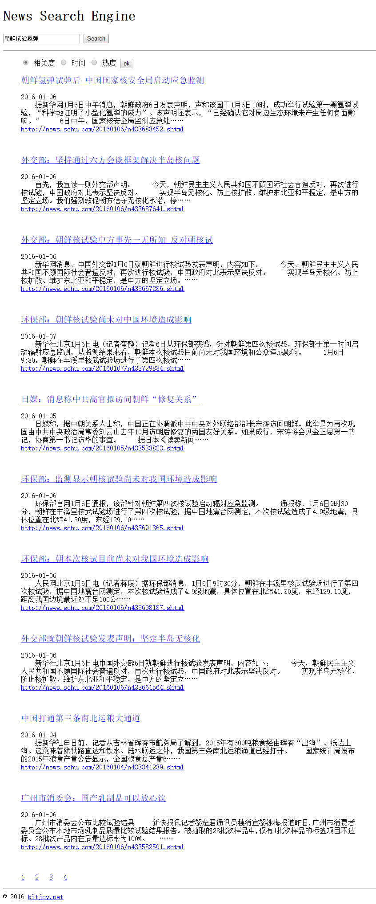
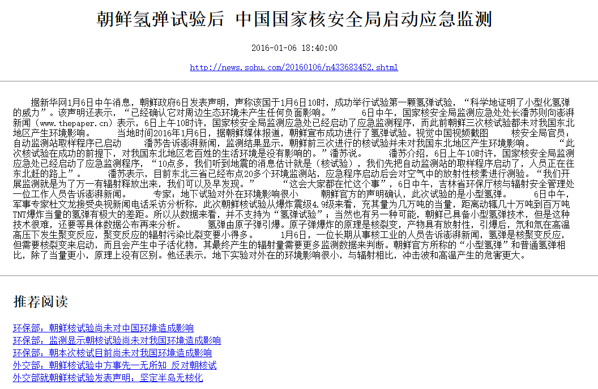

前几个博客已经介绍完搜索引擎的所有功能，为了实现更好的用户体验，需要一个web界面。这一部分是另一个队员做的，我这里借用他的代码。

我们利用开源的[Flask Web框架](http://flask.pocoo.org/)搭建了展示系统，搜索引擎只需要两个界面，一个是搜索界面，另一个是展示详细新闻的页面（实际搜索引擎没有这个页面）。编写好这两个模板页面并调用前面给出的接口，得到数据，展示出来就可以。

这一部分没有太多需要讲解的算法，直接上效果图（点击图片可以查看大图）。

图1. 搜索页面

图2. 新闻详情页面

由于数据量不大，只有1000条新闻，所以第一页中后面几个结果相关度就不是很高了。但是经过测试，在大数据量的情况下，不论是搜索的速度、准确率、召回率以及推荐阅读的相关度，都达到了不错的效果。

---

完整可运行的新闻搜索引擎Demo请看我的Github项目[news_search_engine](https://github.com/01joy/news_search_engine)。

以下是系列博客：

[和我一起构建搜索引擎（一）简介](https://bitjoy.net/posts/2016-01-04-introduction-to-building-a-search-engine-1/)

[和我一起构建搜索引擎（二）网络爬虫](https://bitjoy.net/posts/2016-01-04-introduction-to-building-a-search-engine-2/)

[和我一起构建搜索引擎（三）构建索引](https://bitjoy.net/posts/2016-01-07-introduction-to-building-a-search-engine-3/)

[和我一起构建搜索引擎（四）检索模型](https://bitjoy.net/posts/2016-01-07-introduction-to-building-a-search-engine-4/)

[和我一起构建搜索引擎（五）推荐阅读](https://bitjoy.net/posts/2016-01-09-introduction-to-building-a-search-engine-5/)

[和我一起构建搜索引擎（六）系统展示](https://bitjoy.net/posts/2016-01-09-introduction-to-building-a-search-engine-6/)

[和我一起构建搜索引擎（七）总结展望](https://bitjoy.net/posts/2016-01-09-introduction-to-building-a-search-engine-7/)

