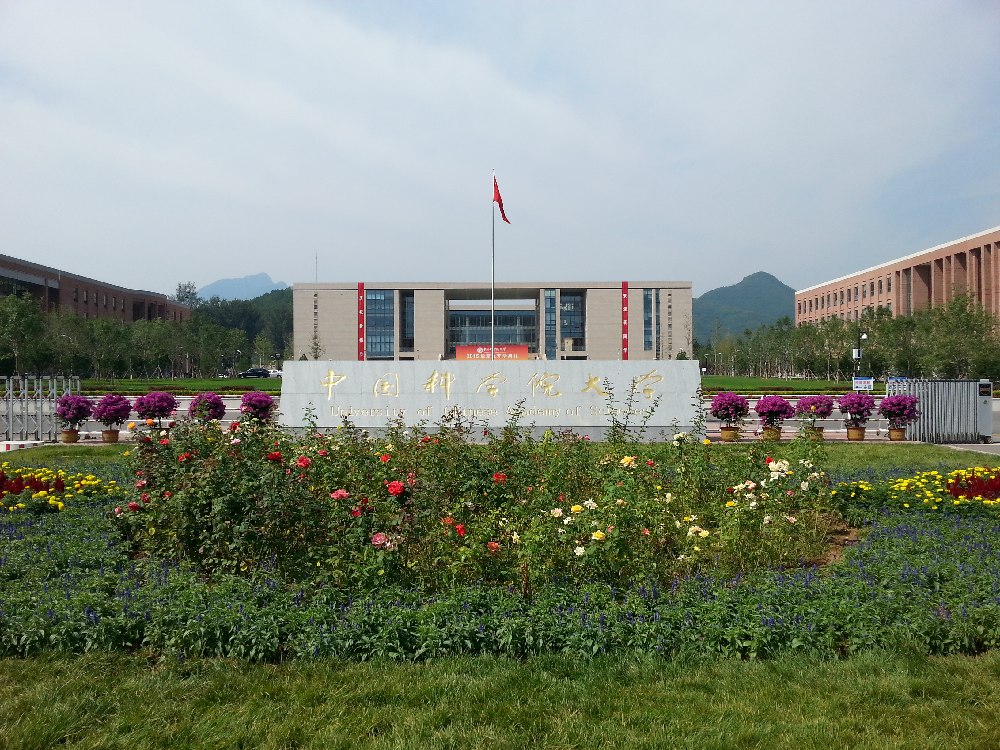
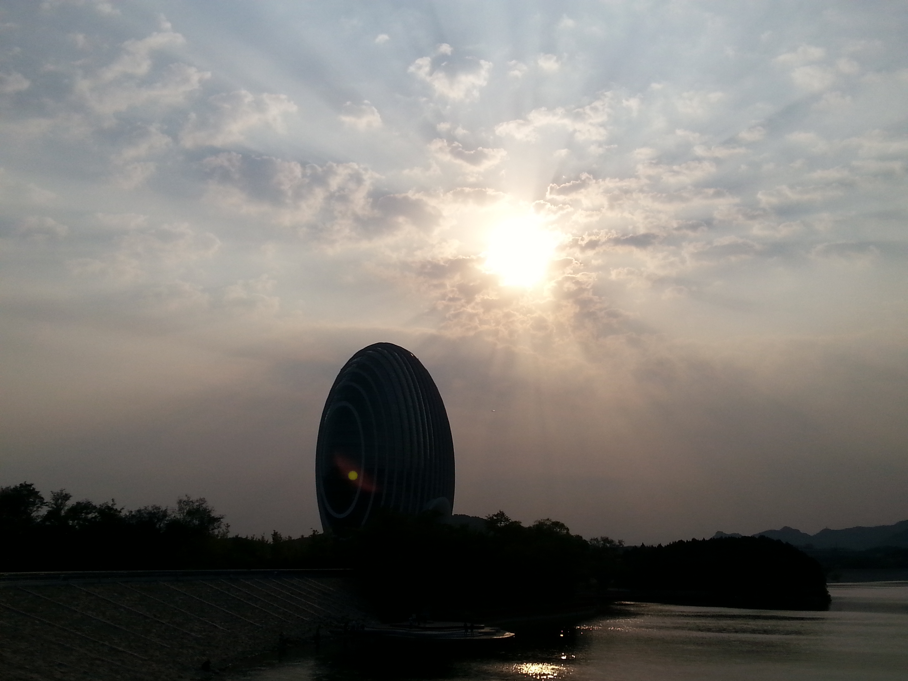
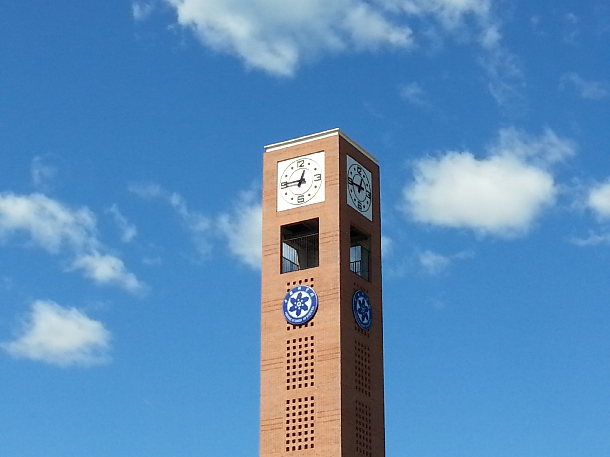
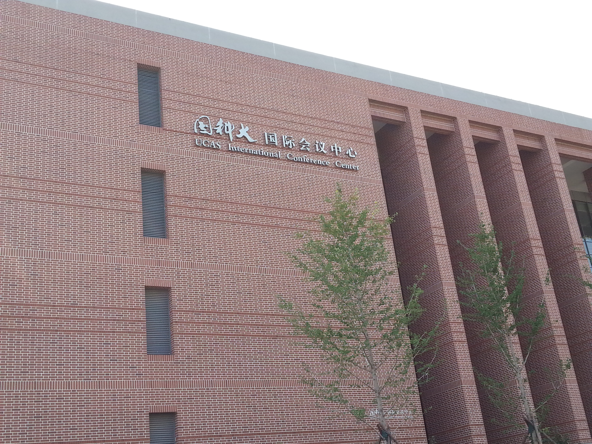
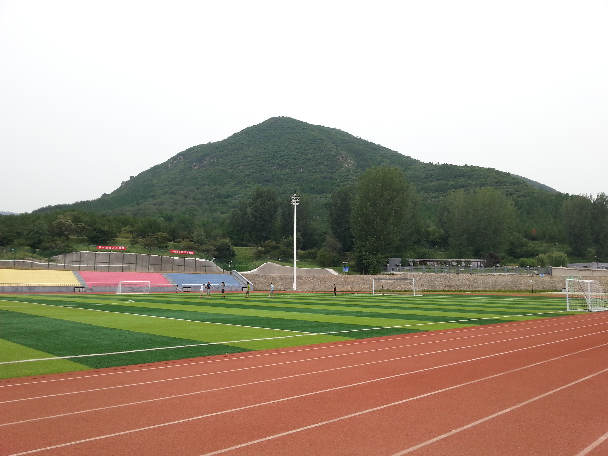
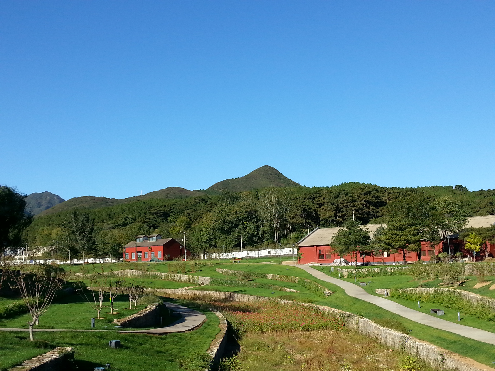
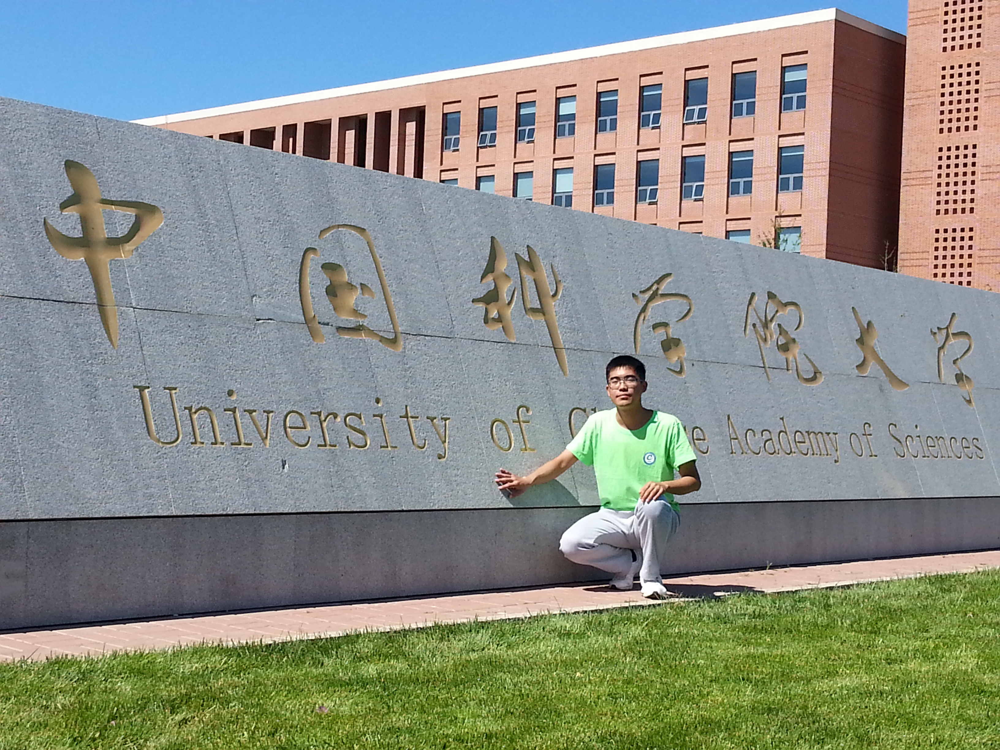
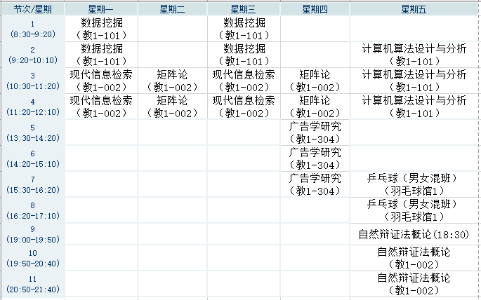

现在是2016年2月4日，距离农历新年不到4天，结束了半年的国科大研一生活，躺在被窝里，松了一口气……

来国科大之前，在贴吧上了解到国科大雁栖湖校区地处偏远农村，周边几乎没有娱乐场所；但同时学校的软硬件设施非常的棒：豪华单人间，研究员甚至院士亲自授课等等。所以对国科大雁栖湖校区满是憧憬。至今还清楚的记得坐校车从玉泉路过来时，沿途看到APEC主会场的鸟蛋、国科大桥、钟楼以及国科大正门几个大字时的激动心情~

 

入住国科大，着实被UCAS的蓝天白云、青山绿水给迷住了。

   

当然，凡事有利必有弊，因为这里远离市区，环境好，但正因为远离市区，几乎没有年轻人的娱乐活动，想要看个电影唱个歌少说也得跑城里，再要想感受下帝都奢靡的生活，必须各种倒车近2个小时到市里。

研一这上学期，半年只进市里两次，一次是买山地车，一次是回所里开会。购物主要靠天猫超市。

九十月份，大家都和大一新生似的，各种疯玩，野长城、雁栖湖、慕田峪、青龙峡、密云水库。进入十一月，新鲜劲过去了，又开始各种赶大小作业，复习考试。

这是我这学期的课表，看着课好像不多，每天都有半天休息，但是真的感觉回到了大三呀！尤其数据挖掘、信息检索、矩阵论一周上两次课，当天上完的课如果没有及时复习，隔一天再学新内容完全跟不上啊，而且矩阵论每次课都有好多作业啊，这数学课不做练习完全消化不了呀。更神的课还要数周五的卜神算法，君不见，每到周四晚上，西A、西B两栋宿舍，灯火通明，大家都在熬夜赶算法作业啊，不熬个两三点都不好意思和别人说你熬夜了呀。[大家可以感受一下我整理的卜神算法作业~~](https://bitjoy.net/posts/2016-01-29-algorithm-design-and-analysis-by-dbu/)

正是因为这奇葩的课程安排，这半年几乎没有12点前睡过觉，估计平均是1:30才睡觉，早上8点多才起，中午也没午休。想想大学的时候按时作息，真是惭愧。期间有一次听说搜狐一同届华科毕业生猝死，朋友圈传得沸沸扬扬，大伙都吓得要命，纷纷表示绝不熬夜，早睡早起，我那天也是吓坏了，决定早睡，11:30就爬床上了，但是不知道是因为紧张还是熬夜习惯了，辗转反侧，到12点多才睡着的。

我们研一在国科大上课是有补助的，但是在帝都完全不够用啊，而且CS相关的几个所补助都比ICT高，so当时还公车上书，各种写联名信、起义，经过半年之久的持久战，所里终于答应从2016年开始给我们涨500块钱的工资。涨了之后差不多够吃饭了。

虽然这半年课业繁重，但是也抽空锻炼了身体，天气不是很冷的时候，隔一天就会去夜跑；而且选了乒乓球课，从直拍转为了横拍，并且在课上结识了路路，打球好厉害的一个女生，每次老师来指导的时候，都叫路路温柔点 O__O “…

另外花了一千多块钱买了一辆二手山地车，骑着到处转悠了一下。很有缘的是，认识了一位才女。本来我们骑行社一块去美利达准备买车，但是由于种种原因我和小欣都没买，然后我们一块坐小黑车回村，在车上聊着聊着就认识，没想到后来还成为了好朋友，小欣的台球和乒乓球都打得不错，琴棋书画样样精通。突然发现身边的学霸才子佳人好多，更加深刻感受到有些东西不是你努力就能够弥补的，天赋、眼界、才艺、品味、性格……

来国科大的这半年，自我感觉变化最大的是自己变得爱说话了，而且带着一种zhuang bi气息，不知道是不是受某几个我一直崇拜的人的影响。有时候静下心来想想都不敢相信之前的话是我说的，和大学时的我完全判若两人。当然这种事情有利也有弊，还在慢慢找平衡点，可能正如CL说的“话怎么说是一回事，内心要知道自己想要的”。

这半年突然害怕一个人上学，一个人吃饭，一个人自习了，更喜欢face-to-face的交谈，少了对网络的依赖，不知道是不是因为性格的变化、环境的变化、抑或是认识的人多了，有了念想。

半年时光，认识了不多不少几个好朋友：良辰、发文章、牛牛、欣儿、路路，有你们真好，谢谢你们~

2016猴赛雷，即将从研一的上课转入课题组工作，很关键的一年，加油！

