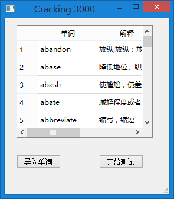
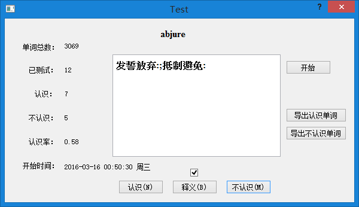
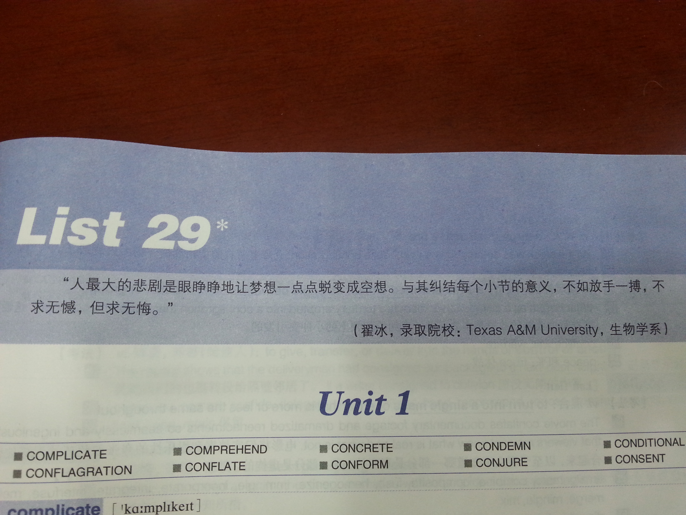

yn说最近在备考GMAT和托福，把手机都清理了只为专心学习。xx说TCP/IP大作业要用Qt做一个网络监控的软件，问我Qt好不好学。

GRE遇见Qt，会擦出怎样的火花呢~没错，我用Qt写了一个强化背诵GRE单词的软件——Cracking 3000

 

当时的一本GRE单词书有3000个单词，用杨鹏17天刷过之后，很多都记不住，于是想有没有办法把记不住的单词筛选出来，集中力量强化记忆。网上已经有3000的Excel表，所以我很自然的想到了把表格导入软件，用软件快速测试，并把不认识的单词筛选到新的Excel表格中。这样就可以把不认识的单词表打印出来，记完之后再导入软件进行新一轮的测试筛选，直到不认识的单词数为零。

有了软件需求，代码实现起来就很快了。由于当时用Qt库比较多，所以直接拿来用了。软件实现这一块，主要是Excel表格的导入和导出，需要查一些文档，其他的就很简单了。

虽然和GRE纠缠了一个多月，最终却没有考，但是想起当初早上6点爬起来背单词，晚上回宿舍抹黑写代码的情景，心情还是有一点小小的激动！以后类似的体验估计不会太多吧。

最后祝yn GT考试顺利，xx大作业圆满完成！

[Cracking_3000软件安装包及说明](Cracking_3000.zip)