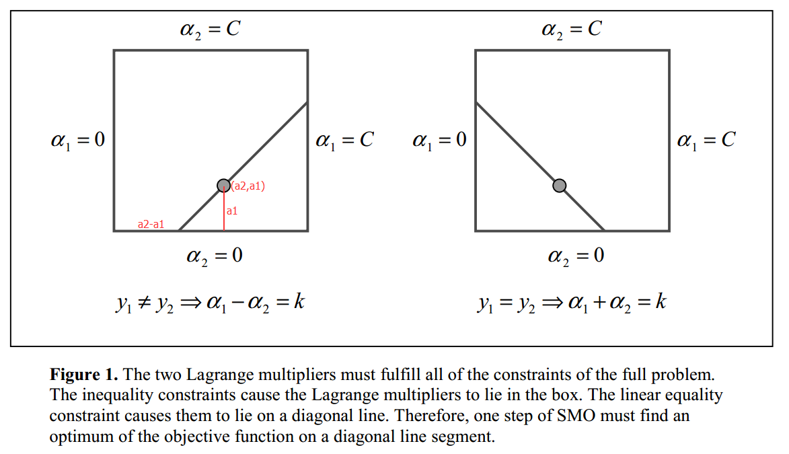

# SVM回顾


支持向量机（SVM）的一大特点是最大化间距（max margin）。对于如上图的二分类问题，虽然有很多线可以将左右两部分分开，但是只有中间的红线效果是最好的，因为它的可活动范围（margin）是最大的，从直观上来说很好理解。

对于线性二分类问题，假设分类面为

$$\begin{equation} u=\vec w \cdot \vec x-b \end{equation}$$

则margin为

$$\begin{equation} m=\frac{1}{||w||_2} \end{equation}$$

根据max margin规则和约束条件，得到如下优化问题，我们要求的就是参数\(\vec w\)和\(b\)：

$$\begin{equation} \min\limits_{\vec w,b}\frac{1}{2}||\vec w||^2 \quad\text{subject to}\quad y_i(\vec w\cdot \vec x_i-b) \geq 1, \forall i,\end{equation}$$

对于正样本，类标号\(y_i\)为+1，反之则为-1。根据拉格朗日对偶，(3)可以转换为如下的二次规划（QP）问题，其中\(\alpha_i\)为拉格朗日乘子。

$$\begin{equation} \min\limits_{\vec \alpha}\Psi(\vec\alpha)=\min\limits_{\vec \alpha}\frac{1}{2}\sum_{i=1}^N\sum_{j=1}^Ny_iy_j(\vec x_i\cdot\vec x_j)\alpha_i\alpha_j-\sum_{i=1}^N\alpha_i,\end{equation}$$

其中N为样本数量。上式还需满足如下两个约束条件：

$$\begin{equation} \alpha_i\geq 0, \forall i,\end{equation}$$

$$\begin{equation} \sum_{i=1}^Ny_i\alpha_i=0.\end{equation}$$

一旦求解出所有的拉格朗日乘子，则我们可以通过如下的公式得到分类面参数\(\vec w\)和\(b\)。

$$\begin{equation}\vec w=\sum_{i=1}^Ny_i\alpha_i\vec x_i,\quad b=\vec w\cdot\vec x_k-y_k\quad\text{for some}\quad\alpha_k>0.\end{equation}$$

当然并不是所有的数据都可以完美的线性划分，可能有少量数据就是混在对方阵营，这时可以通过引入松弛变量\(\xi_i\)得到软间隔形式的SVM：

$$\begin{equation} \min\limits_{\vec w,b,\vec\xi}\frac{1}{2}||\vec w||^2+C\sum_{i=1}^N\xi_i \quad\text{subject to}\quad y_i(\vec w\cdot \vec x_i-b) \geq 1-\xi_i, \forall i,\end{equation}$$

其中的\(\xi_i\)为松弛变量，能假装把错的样本分对，\(C\)对max margin和margin failures的trades off。对于这个新的优化问题，约束变成了一个box constraint：

$$\begin{equation}0\leq\alpha_i \leq C,\forall i.\end{equation}$$

而松弛变量\(\xi_i\)不再出现在对偶公式中了。

对于线性不可分的数据，可以用核函数\(K\)将其投影到高维空间，这样就可分了，由此得到一般的分类面公式：

$$\begin{equation}u=\sum_{j=1}^Ny_j\alpha_jK(\vec x_j,\vec x)-b,\end{equation}$$

终极优化问题就变成了下面这个样子：

$$\begin{equation} \min\limits_{\vec \alpha}\Psi(\vec\alpha)=\min\limits_{\vec \alpha}\frac{1}{2}\sum_{i=1}^N\sum_{j=1}^Ny_iy_jK(\vec x_i,\vec x_j)\alpha_i\alpha_j-\sum_{i=1}^N\alpha_i,\\0\leq\alpha_i \leq C,\forall i,\\ \sum_{i=1}^Ny_i\alpha_i=0.\end{equation}$$

要满足的KKT条件为：

$$
\begin{equation}
\alpha_i = 0 \Leftrightarrow y_iu_i \geq 1,
0 < \alpha_i < C \Leftrightarrow y_iu_i = 1,
\alpha_i = C \Leftrightarrow y_iu_i \leq 1.
\end{equation}
$$

# SMO算法

为了求解式(11)，SMO算法通过启发式方法选择两个\(\alpha_i,\alpha_j\)当变量，固定其他\(\alpha_k\)，然后用解析的方法求解两个变量的二次规划问题。关于这两个变量的解应该更接近原始的二次规划问题，更重要的是，这时子问题可以通过解析方法求解，避免了矩阵运算，大大提高了整个算法的计算速度。如此，SMO算法将原问题不断分解为子问题并对子问题求解，进而达到求解原问题的目的。

不失一般性，假设选择的两个拉格朗日乘子是\(\alpha_1,\alpha_2\)，因为\(\alpha_i\)和变量\(x_i\)是一一对应的，所以也可以说选择了变量\(x_1,x_2\)。固定其他变量\(\alpha_i (i=3,4,…,N)\)

此时，式(11)的优化问题转换为如下的优化问题：

$$\begin{equation} \min\limits_{\alpha_1,\alpha_2}W(\alpha_1,\alpha_2)=\frac{1}{2}K_{11}\alpha_1^2+\frac{1}{2}K_{22}\alpha_2^2+y_1y_2K_{12}\alpha_1\alpha_2\\-(\alpha_1+\alpha_2)+y_1\alpha_1\sum_{i=3}^Ny_i\alpha_iK_{i1}+y_2\alpha_2\sum_{i=3}^Ny_i\alpha_iK_{i2}\end{equation}$$

满足

$$\begin{equation}\alpha_1y_1+\alpha_2y_2=-\sum_{i=3}^Ny_i\alpha_i=\zeta\end{equation}$$

因为只有\(\alpha_1,\alpha_2\)是变量，其他\(\alpha_i (i=3,4,…,N)\)是固定的（可以认为是常数），所以式(13)省略了不含\(\alpha_1,\alpha_2\)的常数项。又因为\(y_i=\pm 1\)，\(\alpha_i\)有限制(9)，所以\(\alpha_1,\alpha_2\)被限制在\([0,C]\times[0,C]\)的盒子里，且位于对角线上，如图Figure 1.



由于\(\alpha_2^{new}\)需满足(9)，所以最优值\(\alpha_2^{new}\)的取值范围必须满足条件

$$\begin{equation}L\leq\alpha_2^{new}\leq H\end{equation}$$

其中L与H是\(\alpha_2^{new}\)所在的对角线段端点的界。如果\(y_1\neq y_2\)（Figure 1.左图），则

$$\begin{equation}L=max(0,\alpha_2^{old}-\alpha_1^{old}),\quad H=min(C,C+\alpha_2^{old}-\alpha_1^{old}).\end{equation}$$

如果\(y_1= y_2\)（Figure 1.右图），则

$$\begin{equation}L=max(0,\alpha_2^{old}+\alpha_1^{old}-C),\quad H=min(C,\alpha_2^{old}+\alpha_1^{old}).\end{equation}$$

令

$$\begin{equation}\eta=K(\vec x_1,\vec x_1)+K(\vec x_2,\vec x_2)-2K(\vec x_1,\vec x_2).\end{equation}$$

因为\(y_i=\pm 1\)，所以\(y_i^2=1\)，式(14)同乘以\(y_1\)，用\(\alpha_2\)表示\(\alpha_1\)并代入式(13)，得到只含一个变量\(\alpha_2\)的表达式，该表达式对\(\alpha_2\)求偏导并等于0，求出\(\alpha_2\)的更新公式为：

$$\begin{equation}\alpha_2^{new}=\alpha_2^{old}+\frac{y_2(E_1-E_2)}{\eta},\end{equation}$$

其中\(E_i=u_i-y_i\)是第\(i\)个样本的训练误差。经过截断之后的\(\alpha_2^{new}\)为：

$$
\begin{equation}
\alpha_2^{new, clipped} =
\begin{cases}
H, & \mbox{if }\alpha_2^{new}\geq H;\\
\alpha_2^{new}, & \mbox{if }L < \alpha_2^{new} < H;\\
L, & \mbox{if }\alpha_2^{new}\leq L.
\end{cases}
\end{equation}
$$

将\(\alpha_2^{new,clipped}\)的结果代入式(14)，得到\(\alpha_1\)的更新公式：

$$\begin{equation}\alpha_1^{new}=\alpha_1^{old}+y_1y_2(\alpha_2^{old}-\alpha_2^{new,clipped}).\end{equation}$$

当\(0 < \alpha_1^{new} < C\)时，由式(12)中间的条件可以得到阈值\(b_1\)的更新公式：

$$\begin{equation}b_1^{new}=b^{old}-E_1-y_1K_{11}(\alpha_1^{new}-\alpha_1^{old})-y_2K_{21}(\alpha_2^{new,clipped}-\alpha_2^{old}),\end{equation}$$

同理，当\(0 < \alpha_2^{new,clipped} < C\)时，得到阈值\(b_2\)的更新公式：

$$\begin{equation}b_2^{new}=b^{old}-E_2-y_1K_{12}(\alpha_1^{new}-\alpha_1^{old})-y_2K_{22}(\alpha_2^{new,clipped}-\alpha_2^{old}).\end{equation}$$

综合以上，阈值\(b\)的更新公式为：

$$
\begin{equation}
b^{new}=
\begin{cases}
b_1^{new}, & \mbox{if } 0 < \alpha_1^{new} < C; \\
b_2^{new}, & \mbox{if } 0 < \alpha_2^{new,clipped} < C;\\
(b_1^{new}+b_2^{new})/2, & \mbox{otherwise}.
\end{cases}
\end{equation}
$$

至此，如果我们选定了两个变量\(\alpha_2,\alpha_1\)，则可以通过公式(19)和(21)来更新它们，并通过公式(24)更新阈值\(b\)，通过多次迭代逼近最优结果。但是怎样选择\(\alpha_2,\alpha_1\)呢，SMO通过启发式方法选择！

对于第一个样本\(\alpha_2\)，我们选择违反KKT条件式(12)（最严重）的样本\(\alpha_2\)；由式(19)可知，\(\alpha_2^{new}\)是依赖于\(|E_1-E_2|\)的，为了加快计算，一种简单的做法是选择\(\alpha_1\)，使其对应的\(|E_1-E_2|\)最大。

至此，我们有了启发式选择两个变量\(\alpha_2,\alpha_1\)的方法，以及求解这两个变量二次规划的解析方法，下面介绍SMO算法的具体实现。

# MATLAB代码实现

算法伪代码如下：

输入：训练数据\(T=\{(\vec x_1,y_1),(\vec x_2,y_2),…,(\vec x_N,y_N)\}\)，其中\(\vec x_i \in R^n\)，\(y_i\in\{-1,+1\}\)，\(i=1,2,…,N\)，精度为\(\epsilon\)。

输出：拉格朗日乘子\(\vec\alpha=\{\alpha_1,\alpha_2,…,\alpha_N\}\)和阈值\(b\)的近似解。

1. 初始化\(\vec \alpha=\vec 0, b=0\)
2. 选一个违反KKT条件的变量\(\alpha_2\)
3. 选一个使得\(|E_1-E_2|\)最大的变量\(\alpha_1\)
4. 根据公式(19)~(21)更新变量\(\alpha_2,\alpha_1\)
5. 根据公式(22)~(24)更新阈值\(b\)
6. 如果不满足结束条件，则转2；否则算法结束

算法的结束条件是：如果所有变量都已经检查过，且没有变量可以进一步优化时，算法结束。

下面是SMO算法的MATLAB简化实现，省略了论文[1]的公式(19)。代码主流程参考论文[1]中的伪代码，部分实现细节参考[2]。

本代码和MATLAB自带的seqminopt.m算法接口相同，可直接替换使用。[下载代码](bitjoy_seqminopt.m)。

```matlab
function [alphas, offset] = bitjoy_seqminopt(data, targetLabels, boxConstraints, ...
    kernelFunc, smoOptions)
 
% https://bitjoy.net/posts/2016-05-02-svm-smo-algorithm/
% 参考文献:
% [1] A Fast Algorithm for Training  Support Vector Machines,
%     http://research.microsoft.com/pubs/69644/tr-98-14.pdf
% [2] CSDN, http://blog.csdn.net/techq/article/details/6171688
 
N = length(data); % 样本数量
alphas = zeros([N,1]); % 所有拉格朗日乘子初始化为0
offset = 0.0; % 偏移量b也初始化为0
 
numChanged = 0; % 拉格朗日乘子改变的个数
examineAll = 1; % 是否需要检查所有拉格朗日乘子
 
% 主流程
while numChanged > 0 || examineAll
    numChanged = 0;
    if examineAll == 1
        for i = 1 : N
            numChanged = numChanged + examineExample(i);
        end
    else
        for i = 1 : N
            if alphas(i) ~= 0 && alphas(i) ~= boxConstraints(i)
                numChanged = numChanged + examineExample(i);
            end
        end
    end
    if examineAll == 1
        examineAll = 0;
    elseif numChanged == 0
        examineAll = 1;
    end
end
 
    % 计算当前参数下第idx个样本的函数输出
    function [svm_o] = wxpb(idx)
        svm_o = 0.0;
        for j = 1 : N
            svm_o = svm_o + alphas(j) * targetLabels(j) * kernelFunc(data(j,:),data(idx,:));
        end
        svm_o = svm_o + offset;
    end
 
    % 选定第二个变量i2后，根据max|E1-E2|的启发式规则，选择i1；
    % 如果没有满足条件的i1，返回-1.
    function [i1] = selectSecondChoice(i2, E2)
        i1 = -1;
        maxDelta = -1;
        for j = 1 : N
            if j ~= i2 && alphas(j) ~= 0 && alphas(j) ~= boxConstraints(j)
                Ej = wxpb(j) - targetLabels(j);
                if abs(E2 - Ej) > maxDelta
                    i1 = j;
                    maxDelta = abs(E2 - Ej);
                end
            end
        end
    end
 
    % 根据选定的两个变量i1,i2，代入更新公式计算；
    % 最后还更新了偏移量offset，也就是y=wx+b中的b。
    function [flag] = takeStep(i1, i2)
        alpha1 = alphas(i1);
        y1 =  targetLabels(i1);
        E1 = wxpb(i1) - y1;
        alpha2 = alphas(i2);
        y2 =  targetLabels(i2);
        E2 = wxpb(i2) - y2;
        s = y1 * y2;
        if y1 ~= y2
            L = max(0, alpha2 - alpha1);
            H = min(boxConstraints(i2), boxConstraints(i1) + alpha2 - alpha1);
        else
            L = max(0, alpha2 + alpha1 - boxConstraints(i1));
            H = min(boxConstraints(i2), alpha2 + alpha1);
        end
        if L == H
            flag = 0;
            return;
        end
        k11 = kernelFunc(data(i1,:),data(i1,:));
        k12 = kernelFunc(data(i1,:),data(i2,:));
        k22 = kernelFunc(data(i2,:),data(i2,:));
        eta = k11 + k22 - 2 * k12;
        if eta > 0
            a2 = alpha2 + y2 * (E1 - E2) / eta;
            %截断
            if a2 < L
                a2 = L;
            elseif a2 > H
                a2 = H;
            end
        else % 并未处理该case，论文[1]公式(19)有更详细的方法
            flag = 0;
            return;
        end
        if abs(a2 - alpha2) < eps * (a2 + alpha2 + eps)
            flag = 0;
            return;
        end
        a1 = alpha1 + s * (alpha2 - a2);
        alphas(i1) = a1;
        alphas(i2) = a2;
         
        % 更新offset
        b1 = offset - E1 - y1 * k11 * (a1 - alpha1) - y2 * k12 * (a2 - alpha2);
        b2 = offset - E2 - y1 * k12 * (a1 - alpha1) - y2 * k22 * (a2 - alpha2);
        if a1 > 0 && a1 < boxConstraints(i1)
            offset = b1;
        elseif a2 > 0 && a2 < boxConstraints(i2)
            offset = b2;
        else
            offset = (b1 + b2) / 2;
        end
        flag = 1;
    end
 
    % 检查样本。
    % 首先判断i2是否满足KKT条件，如果不满足，
    % 则根据启发式规则再选择i1样本，
    % 然后更新i1和i2的拉格朗日乘子。
    function [flag] = examineExample(i2)
        y2 =  targetLabels(i2);
        alpha2 = alphas(i2);
        E2 = wxpb(i2) - y2;
        r2 = E2 * y2;
        if (r2 < -smoOptions.TolKKT && alpha2 < boxConstraints(i2)) || (r2 > smoOptions.TolKKT && alpha2 > 0)
            i1 = selectSecondChoice(i2, E2);
            if i1 == -1
                i1 = floor(1 + rand() * N); % 随机选一个i1
                while i1 == i2
                    i1 = floor(1 + rand() * N);
                end
                flag = takeStep(i1,i2);
            else
                flag = takeStep(i1,i2);
            end
        else
            flag = 0;
        end
    end
end
```

参考资料

[1]. [J.C. Platt: A Fast Algorithm for Training Support Vector Machines](http://research.microsoft.com/pubs/69644/tr-98-14.pdf)

[2]. [CSDN, techq, SVM算法实现（一）](http://blog.csdn.net/techq/article/details/6171688)

[3]. [国科大叶齐祥老师机器学习方法与应用课程资料](https://bitjoy-1255847119.cos.ap-beijing.myqcloud.com/blog/2016/05/%E6%9D%BF%E4%B9%A6%E6%9D%90%E6%96%99-4.2-SVM-SMO.pdf)

[4]. [支持向量机（SVM）的详细推导过程及注解（一）](http://blog.sina.com.cn/s/blog_4298002e010144k8.html)