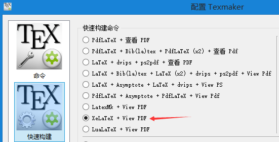
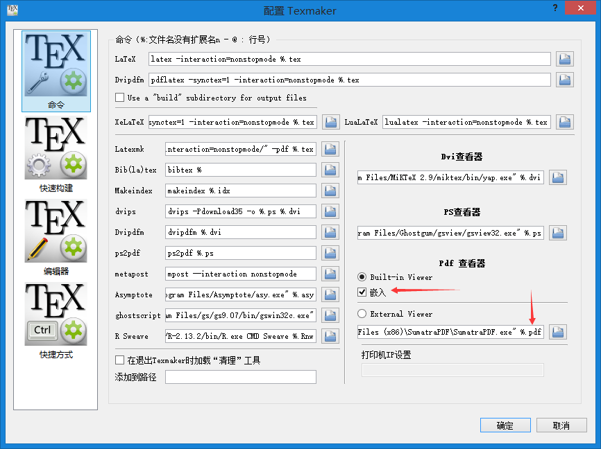
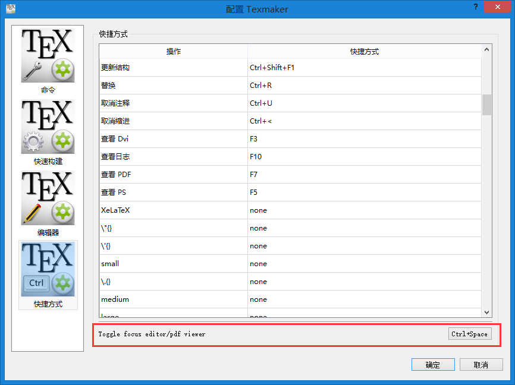

\(\LaTeX\)的强大我就不赘述了，这里简单介绍一下怎样在Windows快速配置一个完美好用的\(\LaTeX\)环境。

我大学刚接触\(\LaTeX\)的时候，使用的是[CTeX](http://www.ctex.org/HomePage)，CTeX是一个大礼包，整合了编译器编辑器等，但是由于久不更新，很多宏包和语法都变了，而且CTeX附带的WinEdt是商业软件，30天之后需要收费，我又不想用盗版，所以就打算自己配置\(\LaTeX\)环境。

目前使用的是[MiKTeX](http://miktex.org/)+[Texmaker](http://www.xm1math.net/texmaker/)的完美组合！MiKTeX是\(\LaTeX\)编译器，Texmaker是\(\LaTeX\)编辑器。两者都是开源软件。

MiKTeX非常棒的地方在于“MiKTeX has the ability to install needed packages automatically (on-the-fly)”，就是说，你用MiKTeX时，不需要担心某个宏包是否存在，你只管用就是了，MiKTeX会在你第一次用到某个宏包时，自动从网上下载，非常方便。正因为这样，MiKTeX的安装包很小，只有175MB。当然，因为是on-the-fly的，所以必须联网使用，而且MiKTeX只有Windows版本。

MiKTeX自带了一个[TeXworks](https://www.tug.org/texworks/)编辑器的，但是这软件用户体验并不好。我以前一直都用WinEdt，很好用，但是它是商业软件，我又不想盗版（说到底是没钱…），所以换了Texmaker。Texmaker可以媲美WinEdt，软件布局合理，各种快捷键用起来也很方便。不过在上手之前要简单配置一下。

如果是写英文文章，点击“快速构建”左边的箭头（或者F1快捷键），就能一键编译并刷新pdf视图。但是默认的快速构建使用的引擎是PdfLaTeX，如果你是中文用户，使用了xeCJK宏包，则必须使用XeLaTeX引擎编译，所以依次点击“选项->配置Texmaker->（左边）快速构建”，选择快速构建命令为”XeLaTeX + View PDF”。

构建好的PDF默认是以弹窗的形式展现的，我们可以设置让代码和PDF并排显示，这样方便在PDF和源代码之间切换，配置如下：

Texmaker自带了一个PDF阅读器，当然你也可以使用外部阅读器，比如非常棒的[Sumatra PDF](http://www.sumatrapdfreader.org/free-pdf-reader.html)，只需填入Sumatra PDF的路径跟上%.pdf，并选中External Viewer。

Texmaker还有一个很好用的功能是“正向/反向搜索”。反向搜索是点击PDF某个位置，会跳到tex源代码对应位置，快捷方式是ctrl+click。正向搜索是点击tex源代码某个位置，会跳到PDF对应的位置，默认快捷方式ctrl+space，但是这个快捷方式好像用不了，可以自行配置成其他快捷方式，比如ctrl+1，我当时是打开下图的快捷方式窗口才发现这个问题的。

正反向搜索都可以通过鼠标右键菜单实现，但是快捷键还是更方便的。最重要的一点是，源文件*.tex所在路径不能有中文！！！要不然正反向搜索不能用，这点很重要，我当时郁闷了好久。

另外还可以配置一下编辑器的字体，勾选”Backup documents every 10 min”之类的。

OK，大功告成，这种三段式的界面、F1快速构建以及正向/反向搜索，用起来真是太顺手了，Just Enjoy \(\LaTeX\)~

下面是我常用的\(\LaTeX\)中文模板：

[LaTeXDemo.pdf](LaTeXDemo.pdf)

[LaTeXDemo.tex](LaTeXDemo.tex)