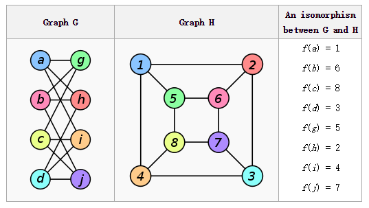

你是否想过如下问题：怎样向色盲证明两只袜子的颜色是不一样的？怎样证明两个图是不同构的？怎样证明一个数是二次非剩余的？

咋听起来觉得很有意思吧，色盲是区分不了颜色的，怎么能让他相信两只袜子的颜色不一样呢。图同构问题目前既没有被证明属于P，也没有被证明属于NP-Complete。二次非剩余问题也没有被证明属于NP。

这些听起来很“难”的问题，却可以通过交互式证明进行证明，下面先通过“向色盲证明两只袜子的颜色不同”这个有趣的例子一窥交互式证明的强大。

# 向色盲证明两只袜子的颜色不同

P有一只红袜子和黄袜子，她的一个色盲朋友V不相信P的袜子颜色不同，P如何才能让V相信这是真的呢？一个简单的办法如下：

1. P把两只袜子给V，V每只手拿了一只袜子
2. P转过身背对V
3. V抛一枚硬币，如果头面朝上，则保持两只袜子不动，否则交换左右手的袜子
4. P转过身，V问P是否交换过袜子
5. 如果P回答错误，则V不相信；否则，重复100次实验，如果P都回答正确，则V相信这两只袜子是不同颜色的

如果两只袜子的颜色确实不一样，则P通过区分两只袜子的颜色能正确回答V有没有交换过袜子。但是如果两只袜子颜色一样，则不管V有没有交换过，P都无法分辨这两只袜子，所以只好猜V有没有交换，而猜对的概率只有1/2，重复100次，都猜对的概率只有\((1/2)^{100}\)，这是一个非常小的数，可以认为几乎不会发生，即出错的概率极低。

这就是交互式证明的一个例子，上述证明有三个特点：1）交互过程，整个证明需要P和V进行交互才能完成；2）具有随机性，即V需要抛一枚硬币，来决定是否交换袜子；3）零知识，虽然V最终相信了这两只袜子是不同颜色的，但V还是不知道这两只袜子是什么颜色的。

下面我们给出交互式证明的形式化定义。

# 交互式证明（Interactive Proofs, IP）

令\(k\)是\(N\rightarrow N\)的一个函数，我们称语言\(L\)属于\(IP[k]\)，如果存在一个\(k(|x|)\)多项式时间概率图灵机TM \(V\)，使得：

$$
\begin{equation}
\begin{cases}
x\in L \Longrightarrow\exists P\quad Pr[V \text{ accepts }x, V(x)=1]\geq 2/3 \\
x\notin L \Longrightarrow\forall P\quad Pr[V \text{ accepts }x, V(x)=1]\leq 1/3
\end{cases}
\end{equation}
$$

定义

$$IP=\underset{c}{\bigcup} IP[n^c]$$

上述定义的第一条称为“完备性”（Completeness）：如果\(x\in L\)，则存在一个证明者P（prover），使得验证者V（verfier）能以多项式时间接受\(x\)，且接受的概率大于2/3；第二条称为“可靠性”（Soundness），如果\(x\notin L\)，则对于所有证明者P，V接受\(x\)的概率都不会超过1/3。

对应到上面的例子，完备性：当两只袜子的颜色确实不同时，V接受的概率为1>2/3；可靠性：当两只袜子的颜色相同时，重复100次实验，V接受的概率只有\((1/2)^{100}<1/3\)。

IP这个复杂性类就是所有IP[k]的并集。在IP中，P的能力是无穷的，但它不一定是诚实的；V能力较弱，只能进行多项式时间的计算。

下面我们给出另外两个交互式证明的协议。

# 图不同构（Graph Non-isomorphism, GNI）的交互式证明

如果图\(G_1\)和\(G_2\)可以通过对顶点进行恰当标记来将它们转换为同一个图，则称\(G_1\)和\(G_2\)同构，记为\(G_1\cong G_2\)。换句话说，如果\(G_1\)和\(G_2\)同构，则在\(G_1\)的所有顶点标签上存在一个置换\(\pi\)使得\(\pi (G_1)=G_2\)，其中\(\pi (G_1)\)是将\(\pi\)作用到\(G_1\)的各个顶点上之后得到的图。下图就是两个同构图，右边给出了置换\(\pi\)。

图同构的补集为图不同构（Graph Non-isomorphism, GNI），即判定给定的两个图是否不同构。下面是GNI的一个交互式证明过程。

给定两个图\(G_1\)和\(G_2\)，证明者P想要向验证者V证明\(G_1\ncong G_2\)。

1. V：随机选一个\(i\in \{1,2\}\)，对\(G_i\)做一个随机的置换，得到新图\(H\)，则有\(H\cong G_i\)，将\(H\)发送给P
2. P：发送\(j\)给V
3. V：如果\(i\neq j\)，则拒绝；否则重复100次实验，都有\(i==j\)，则相信\(G_1\ncong G_2\)

完备性：如果\(G_1\ncong G_2\)，则\(H\)只和\(G_1, G_2\)中的一个图同构，P因为能力无穷，一定能找出和\(H\)同构的图\(G_j\)，且满足\(j==i\)。

可靠性：如果\(G_1\cong G_2\)，则\(H\)和\(G_1, G_2\)都同构，所以P无法区分，只好猜一个\(j\)，所以\(j==i\)的概率只有1/2，重复100次实验，P都猜对的概率只有\((1/2)^{100}<1/3\)。

零知识：虽然V相信了\(G_1\ncong G_2\)，但V对于P怎样证出来的一无所知。

P.S.

有趣的是，关于图同构问题，芝加哥大学的科学家[László Babai](http://people.cs.uchicago.edu/~laci/quasipoly.html)最近给出了一个伪多项式时间的算法，被称为是计算机理论界近10年最重要的成果。

1. [New algorithm cracks graph problem](https://www.sciencenews.org/article/new-algorithm-cracks-graph-problem)
2. [A Quasipolynomial Time Algorithm for Graph Isomorphism: The Details](https://jeremykun.com/2015/11/12/a-quasipolynomial-time-algorithm-for-graph-isomorphism-the-details/)
3. [Graph Isomorphism in Quasipolynomial Time](http://arxiv.org/abs/1512.03547)
4. [图同构在P/NP问题上重大突破，计算机理论10年最重要成果](http://chuansong.me/n/1924231)

# 二次非剩余（Quadratic non-residuosity, QNR）的交互式证明

如果存在整数\(b\)使得\(a\equiv b^2(\mod p)\)，则称整数\(a\)是模\(p\)的二次剩余，并称\(b\)是\(a\)模\(p\)的平方根。显然，\(-b\)是\(a\)模\(p\)的另一个平方根，而且\(a\)模\(p\)不存在其他平方根，因为\(x^2-a=0\)在域\(GF(p)\)上至多有两个解。

类似的，如果不存在整数\(b\)使得\(a\equiv b^2(\mod p)\)，则称整数\(a\)是模\(p\)的二次非剩余（Quadratic non-residuosity, QNR），记为\(< a, p>\in QNR\)。下面是QNR的一个交互式证明过程。

给定一个素数\(p\)和另一个整数\(a\)，P要向V证明\(< a, p>\in QNR\)。

1. V：取模\(p\)的随机数\(r(\mod p)\)和随机数\(b\in\{0,1\}\)，如果\(b=0\)，发送\(r^2(\mod p)\)给P；否则发送\(a\cdot r^2(\mod p)\)给P
2. P：发送\(b’\)给V
3. V：如果\(b’\neq b\)，则拒绝；否则重复100次实验，都有\(b’=b\)，则相信\(< a, p>\in QNR\)

完备性：如果\(< a, p>\in QNR\)，则\(< a \cdot r^2,p>\in QNR\)，但\(< r^2, p>\notin QNR\)，所以P能区分\(a\cdot r^2\)和\(r^2\)，即总能回答正确使得\(b’=b\)。

可靠性：\(< a, p>\notin QNR\)，则\(< a \cdot r^2,p>\notin QNR\)，且\(< r^2, p>\notin QNR\)，即\(a\cdot r^2\)和\(r^2\)都是二次剩余，所以P无法区分，只能瞎猜，正确的概率为1/2，重复100次，都回答正确的概率只有\((1/2)^{100}<1/3\)。

零知识：虽然V相信了\(< a, p>\in QNR\)，但V对于P怎样证出来的一无所知。

---

交互式证明的零知识真是有趣，它是密码学中大量研究工作的基础。很多场合都可能会用到零知识证明，比如要向别人证明你有密码，但又不透露密码；要向别人证明你会解某道题，但又不透露解题过程；要让别人相信你知道怎样从甲地到乙地，但又不告诉别人从甲到乙的路……

交互式证明是这学期选修《高级算法》时接触的，主要参考书目[Computational Complexity: A Modern Approach](http://theory.cs.princeton.edu/complexity/)