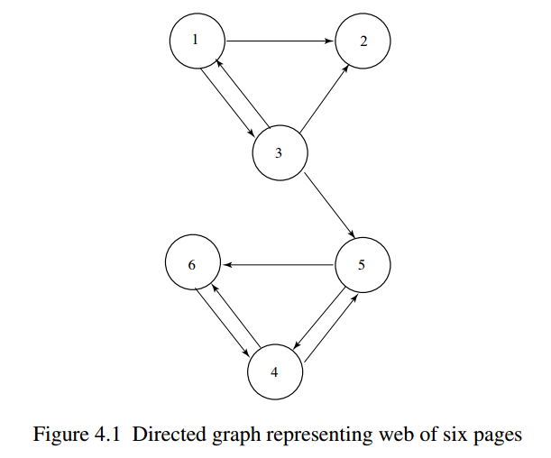
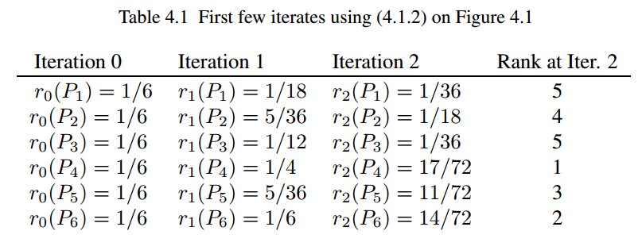
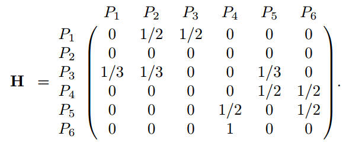
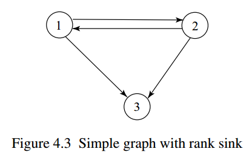
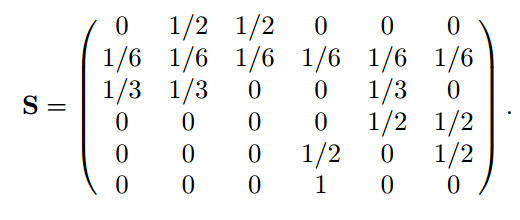
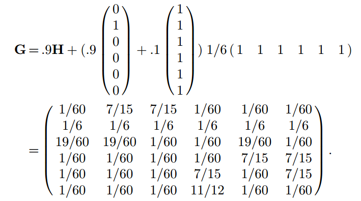
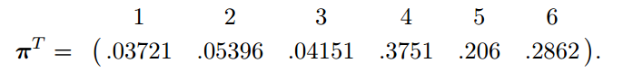

之前写了[七篇博客](https://bitjoy.net/categories/%E5%92%8C%E6%88%91%E4%B8%80%E8%B5%B7%E6%9E%84%E5%BB%BA%E6%90%9C%E7%B4%A2%E5%BC%95%E6%93%8E/)详细介绍了搜索引擎的工作原理。彼时的搜索引擎主要讲查询和网页的**相关性**匹配，是动态的、在线的、实时的。相关性匹配有一个问题，网页很容易作弊，比如可以在一个网页中写满诸如“免费”、“美容”之类的垃圾关键词，进而提升查询相关性。但是用户在查询时，一定希望返回的网页比较**权威可信**，比如同样搜索“苹果电脑”，排名第一的应该是Apple的官网，而不应该是中关村在线之类的第三方网站。

权威性是一个静态的（或者说变化较慢的）衡量网页重要性的指标。但是应该怎样度量权威性呢，[HITS算法](https://en.wikipedia.org/wiki/HITS_algorithm)使用authority来度量，即指向自身的网页数量越多，则自身的authority值越大。谷歌的[PageRank算法](https://en.wikipedia.org/wiki/PageRank)是用PageRank值来衡量权威性的。[HITS和PageRank一个比较大的区别是HITS和查询有关，而PageRank和查询无关，所以PageRank可以离线计算。](http://blog.sina.com.cn/s/blog_72995dcc01013bkb.html)下面主要介绍PageRank算法。

PageRank’s thesis is that a webpage is important if it is pointed to by other important pages.

我先不加解释的给出PageRank的公式，然后带领大家一步步推导出这个公式。

$$\pi^T=\pi^T(\alpha S+(1-\alpha)E)$$

我们首先明确目标：PageRank计算的是网页的静态权威度（PR值），也就是如果给定了一个网络结构，则每个网页的PR值就可以通过PageRank算法计算出。假设网页\(P_i\)的PR值为\(r(P_i)\)，则\(r(P_i)\)等于所有指向\(P_i\)的网页的PR值之和，即

$$\begin{equation}r(P_i)=\sum\limits_{P_j\in B_{P_i}}\frac{r(P_j)}{|P_j|}\end{equation}$$

其中\(B_{P_i}\)为指向\(P_i\)的网页集合，\(|P_j|\)为\(P_j\)的出边的数量。这个式子很好理解，包括两方面内容：1）\(\sum\limits_{P_j\in B_{P_i}}\)表示如果指向\(P_i\)的网页数量越多，说明网页\(P_i\)越重要；2）\(\frac{r(P_j)}{|P_j|}\)表示如果\(P_j\)指向的页面数量越少，但有一个指向了\(P_i\)，说明网页\(P_i\)越重要（如果一个大牛写了很多推荐信（\(|P_j|\)大），则这些推荐信的效力就下降了，如果大牛只给你写了推荐信（\(|P_j|=1\)），则这封推荐信的效力一定很高）。

(1)式有一个问题，初始给定一个网络结构时，并不知道\(r(P_i), r(P_j)\)，如何计算呢？Brin和Page利用递归的思想求解，初始假设所有网页的PR值相等，都为\(\frac{1}{n}\)，其中\(n\)为网络中网页的数量。则第\(k+1\)轮的PR计算公式为：

$$\begin{equation}r_{k+1}(P_i)=\sum\limits_{P_j\in B_{P_i}}\frac{r_k(P_j)}{|P_j|}\end{equation}$$

初始对所有网页\(P_i\)有\(r_0(P_i)=\frac{1}{n}\)，迭代\(k\)步之后，可以计算出所有网页的PR值，然后按PR值从大到小排序，就可以知道每个网页的重要性了。

对于上图的小网络，我们可以计算出其每一步的PR值：

可以看到经过2次迭代之后，节点4的PR值最大，从图中也可以看出，节点4的出入边较多，它可能比较重要。

注意到对于(2)式，当\(i,j\)之间有边时，\(\frac{1}{|P_j|}\)相当于对\(P_j\)出度的归一化，设矩阵\(H\)为图的邻接矩阵的行归一化矩阵，对于上图，为

设行向量\(\pi^{(k)T}\)为第\(k\)轮迭代时所有网页的PR值，则式(2)可以转换为如下的矩阵形式：

$$\begin{equation}\pi^{(k+1)T}=\pi^{(k)T}H\end{equation}$$

初始有\(\pi^{(0)T}=\frac{1}{n}e^T\)，\(e^T\)为全1的行向量。我们可以从(3)式观测出几点信息：

* (3)式的每一轮计算涉及到向量和矩阵的乘法，复杂度为\(O(n^2)\)，\(n\)为矩阵\(H\)的大小
* \(H\)是一个稀疏矩阵，因为大部分网页只和很少的网页有链接关系，所以上述向量和矩阵的乘法复杂度还可以降低
* \(H\)有点像马尔科夫链中的随机转移矩阵，但又不完全是，因为如果有dangling nodes，则这一行就是全0，所以\(H\)被称为substochastic matrix

上图中的节点3就是一个dangling node，它只有入边，没有出边，也就是说，每一轮迭代，PR值只会流入3号节点，不会从3号节点流出，久而久之，3就像一个水槽(sink)一样，吸走了大部分的PR，导致PR值虚高。

所以问题随之而来，怎样保证(3)式一定能够收敛到一个平稳概率分布\(\pi^T\)，\(\pi^T\)和\(\pi^{(0)T}\)有关吗，怎样解决dangling nodes问题，等等。此时需要引入一点马尔科夫链理论的知识。

在马尔科夫理论呢中，如果一个矩阵\(P\)是随机的（stochastic）、不可约的（irreducible）和非周期的（aperiodic），则对于任意的起始向量，都能收敛到一个唯一的平稳正向量。所以如果PageRank矩阵\(H\)满足上述三个条件，则可以用幂法（Power Method）找到一个平稳概率分布\(\pi^T\)。[幂法](https://en.wikipedia.org/wiki/Power_iteration)是用来计算最大特征值的特征向量。因为\(H\)的最大特征值为1，所以可以用幂法找到稳态时（\(\pi^T=\pi^TH\)）的概率分布\(\pi^T\)。

下面我们就将矩阵\(H\)调整为随机的（stochastic）、不可约的（irreducible）和非周期的（aperiodic）。

行随机矩阵是指行和为1的非负矩阵。如果图中含有dangling nodes，则\(H\)不是随机的，比如上面的例子，第二行为全0。所以第一个调整是对于所有dangling nodes，都加上一个随机跳转向量\(e^T/n\)，含义就是如果进入死胡同（dangling nodes），则随机跳转到网络中的任意一个网页。定义向量\(a\)：

$$\begin{equation}a_i=\begin{cases}1\quad\text{if page}~i\text{ is a dangling node}\\0\quad\text{otherwise}\end{cases}\end{equation}$$

则新的Google矩阵为：

$$\begin{equation}S=H+a\frac{1}{n}e^T\end{equation}$$

新矩阵\(S\)就是一个行随机矩阵了。对于上图的例子，有

为了保证矩阵\(S\)满足[不可约性（irreducible）](http://mathworld.wolfram.com/ReducibleMatrix.html)和[非周期性（aperiodic）](https://en.wikipedia.org/wiki/Aperiodic_graph)，必须使\(S\)对应的图是强连通的且每个节点有自回路。所以再次调整为：

$$\begin{equation}G=\alpha S+(1-\alpha)\frac{1}{n}ee^T\end{equation}$$

令

$$\begin{equation}E=\frac{1}{n}ee^T\end{equation}$$

则得到本博客开头的Google矩阵公式：

$$\begin{equation}G=\alpha S+(1-\alpha)E\end{equation}$$

\(E\)即为随机平均游走矩阵。矩阵\(G\)也很好解释，大家上网的时候以\(\alpha\)的概率沿着某个网页里面的链接一步步深入进去（\(S\)），当沿着链接走累的时候，以\(1-\alpha\)的概率在地址栏输入一个新地址，随机跳走了（\(E\)）。

此时的矩阵\(G\)满足随机性（stochastic）、不可约性（irreducible）和非周期性（aperiodic），所以可以根据幂法（Power Method）找到一个平稳概率分布\(\pi^T\)，\(\pi^T_i\)就衡量了网页\(P_i\)的重要性或者权威性。

此时只剩下参数\(\alpha\)了，\(\alpha\)平衡了网络结构和随机游走。如果\(\alpha\)很小，则\(1-\alpha\)大，\(G\)就退化成一个人造随机网络，不能很好的反应真实的网络结构。如果\(\alpha\)很大，则有可能不能得到一个稳态分布，或者幂法会失效。当\(\alpha\approx 1\)时，幂法失效，且\(\pi^T(\alpha)\)对\(H\)的微小扰动很敏感。Google的选择是\(\alpha=0.85\)。

将(5)式带入(6)式，得到

$$\begin{equation}G=\alpha H+(\alpha a+(1-\alpha)e)\frac{1}{n}e^T\end{equation}$$

(9)式就非常好计算了，只涉及到向量和矩阵的乘法，而且矩阵\(H\)还是稀疏矩阵，复杂度还可以降低。

幂法（Power Method）求解PageRank稳态分布就是不断计算下面的等式：

$$\begin{equation}\pi^{(k+1)T}=\pi^{(k)T}G=\alpha \pi^{(k)T}H+(\alpha\pi^{(k)T}a+1-\alpha)e^T/n\end{equation}$$

当前后两次的\(\pi^{(k+1)T}\)和\(\pi^{(k)T}\)变化小于某个阈值时，算法收敛，所以算法实现是非常容易的。Brin and Page在他们1998年的论文中提到，只需要50-100次迭代运算就可以收敛了。

对于上图的例子，令\(\alpha=0.9\)，解得

利用幂法解得稳态分布为

所以这6个网页的排名为4>6>5>2>3>1。

真正的搜索引擎应该综合了网页的静态权威性（如PageRank值）和查询的相关性，每个网站都有一个PR值，具体可以[点此查询](http://pr.chinaz.com/)。

本博客主要内容参考Google’s PageRank and Beyond: The Science of Search Engine Rankings[1]，插图即为该书封面；如果想快速了解PageRank，可以参考[2]；[3]的讲解也很详细。

1. [http://geza.kzoo.edu/~erdi/patent/langvillebook.pdf](http://geza.kzoo.edu/~erdi/patent/langvillebook.pdf)
2. [http://www.cs.cmu.edu/~elaw/pagerank.pdf](http://www.cs.cmu.edu/~elaw/pagerank.pdf)
3. [http://www.ams.org/samplings/feature-column/fcarc-pagerank](http://www.ams.org/samplings/feature-column/fcarc-pagerank)
