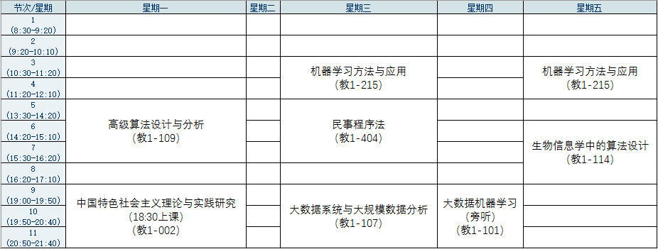
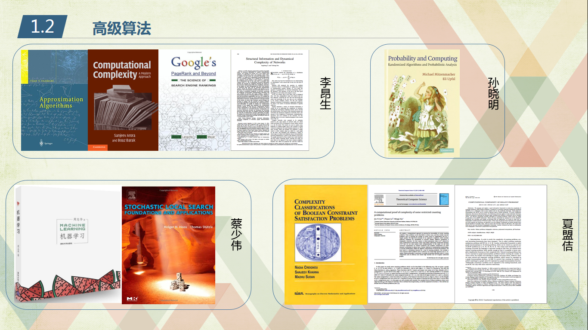
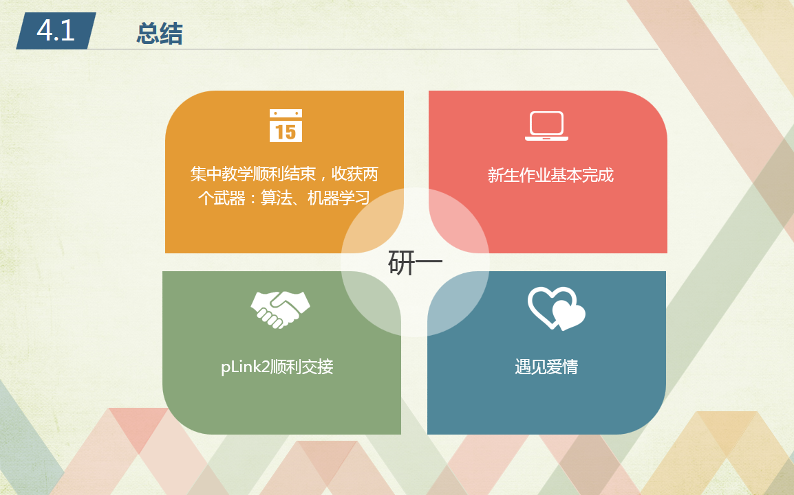

半年的时光又过去了，圆满结束了一年的集中教学任务，离开了美丽的雁栖湖，回到闹市中关村。

这半年基本上延续了研一上学期的高强度学习，四门硬课。《高级算法》这门课由四位大师级的老师授课，内容囊括了近似算法、计算复杂性、随机算法、局部搜索、全息规约等，完全是神一样的课。最后复习的时候，大家都生不如死啊，不过经过一个月的挑灯夜战，我还是取得了97分的好成绩，值了。

《大数据系统与大规模数据分析》这门课的老师是一个年轻的海归，要求很严格，有专门的算法检查平时作业是否抄袭，真的有好几个同学因为抄袭而得0分。这门课的大作业是在GraphLite上实现SVD，我带领队员经过一个月的努力比较圆满的完成了大作业，感谢组里的编程大神。

《机器学习方法与应用》是面向电子学院的课程，讲得太简单，考试基本是概念题，不建议选修。

《生物信息学中的算法设计》这门课其实应该叫统计机器学习在生物信息领域的应用，讲的内容比《机器学习方法与应用》的内容更深更广。不过内容太多也难以消化，好好做大作业应该会有不少收获。

集中教学一年，研一上的GPA是87分，研一下的GPA是89.3分，平均是88.1分。

除了完成若干个课程大作业，这学期还完成了两个组内大作业，分别是倒排索引和蛋白质搜索引擎，也多谢XN和我一起查Bug、对答案。（天啊，我半年是做了多少个大作业啊…）

这半年每周二回所和师姐交接任务，真是要感谢天真呆萌的JL师姐，当初保研的时候就被师姐的热情所感染，现在又有幸接替师姐的接力棒，好幸运。

要说上半年最大的收获，应该是收获了一枚女朋友吧\~没错，就是我~这篇博客~里提到的欣欣\~真的没想到这么聊得来，一起吃饭、看电影、聊代码、骑行、游山玩水。这半年拍的照片，比我前22年拍的照片还多。和她在一起很开心，不过有时候也会很累，身体累（羸弱），有时候也心累，毕竟课程压力和组内压力摆在那里，白天去玩了，晚上还是要加班补回来的。有时候冷落了她，也会感到愧疚不安，特别是我在复习《高级算法》期间，两人都很少见面，那一次是真的惹欣欣生气了:-(

总结一下在雁栖湖一年的收获，大致有如下图的四个方面：

看看[年初计划](https://bitjoy.net/posts/2016-01-03-2016-happy-new-year/)的完成情况：

1. ~完成国科大下学期的课程任务：完成~
2. ~接手pLink软件：完成~
3. 刷完LeetCode所有题目：上半年基本没刷题，下半年一定完成
4. 读10本书：目前读了《数学之美》、《大话设计模式》、《我不知道该说什么，关于死亡还是爱情》、《男人来自火星、女人来自金星，卷I》，还差6本，下半年加油！
5. 去电影院看10场电影：目前看了《美人鱼》、《北京遇上西雅图之不二情书》、《忍者神龟2：破影而出》，还差好多…
6. 改正坐姿：有一段时间刻意改正了，但是这东西貌似改不过来？

下半年就进入实验室，开始科研实战了，做交联的师兄师姐都毕业了，留下我一个人，感觉好艰难，希望我能顺利进入角色，协助师兄把文章发了，维护好pLink2的软件，并且开发集群版。