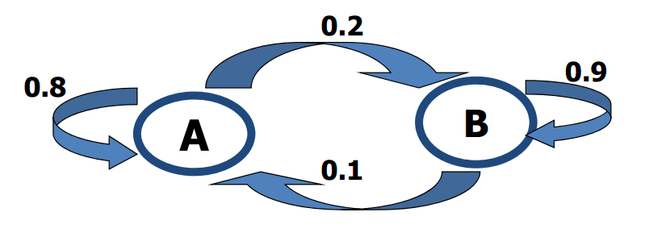
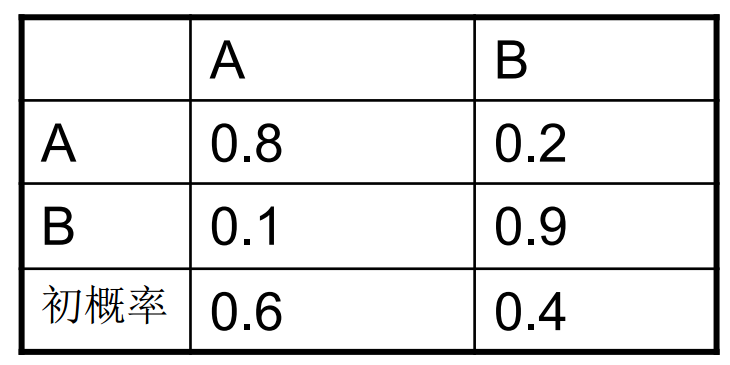
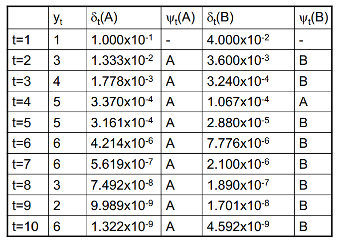
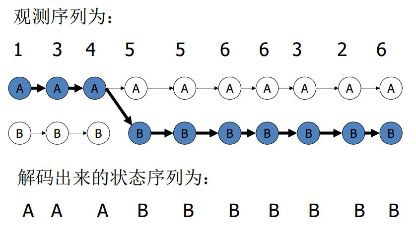

[隐马尔可夫模型](https://zh.wikipedia.org/wiki/%E9%9A%90%E9%A9%AC%E5%B0%94%E5%8F%AF%E5%A4%AB%E6%A8%A1%E5%9E%8B)（Hidden Markov Model, HMM）是统计模型，它用来描述一个含有隐含未知参数的马尔可夫过程。其难点是从可观察的参数中确定该过程的隐含参数。然后利用这些参数来作进一步的分析，例如模式识别。

先举一个简单的例子以直观地理解HMM的实质——韦小宝的骰子。

假设韦小宝有两个骰子，一个正常的骰子A，A以1/6的概率均等的出现每个点；一个不正常的骰子B，B出现5,6点数的概率为0.3，出现其他点数的概率为0.1。显然投掷B更容易出现大的点数。每次试验**第一次投掷时**，韦小宝会以0.4的概率出千（即投掷B）。但是在一次试验中，韦小宝不太可能一直出千，所以骰子会在A、B之间转换，比如这次投了B，下次可能会以0.1的概率投A。A、B之间的转移概率如下图。

某一次试验，我们观察到韦小宝掷出的骰子序列为\(O=(1,3,4,5,5,6,6,3,2,6)\)，请问韦小宝什么时候出千了。这个问题就可以通过HMM求解。

HMM有2个状态：

1. 观测状态。我们观察到的骰子序列称为观测状态\(\mathbf{Y}=\{y_1,y_2,…,y_T\}\)
2. 隐状态。隐含在每个观测状态里面的是隐状态\(\mathbf{X}=\{x_1,x_2,…,x_T\}\)

T是时间，也可以认为是观测的次数。HMM有3个参数：

1. 初始分布\(\mathbf{\mu}=(\mu_i)\)，\(\mu_i=Pr(x_1=i)\)，即第一次观测时，每个隐状态出现的概率
2. 转移概率矩阵\(A=(a_{ij})\)，\(a_{ij}=Pr(x_{t+1}=j|x_t=i)\)，即t时刻的隐状态为i，t+1时刻转移到隐状态j的概率
3. 发射概率矩阵\(B=(b_{il})\)，\(b_{il}=Pr(y_t=l|x_t=i)\)，即t时候隐状态为i的情况下，观测到状态为l的概率

参数\(\mathbf{\lambda=\{\mu,A,B\}}\)称为HMM的模型参数。具体到上面的例子，我们有初始分布和转移概率为：

发射概率为：

观测状态为\(\mathbf{Y}=(1,3,4,5,5,6,6,3,2,6)\)，问题就是求解出隐状态\(\mathbf{X}\)，此问题被称为HMM的解码问题，可以由著名的[维特比算法（Viterbi algorithm）](https://zh.wikipedia.org/wiki/%E7%BB%B4%E7%89%B9%E6%AF%94%E7%AE%97%E6%B3%95)解决。

解码问题是要求出使得观测状态\(Y\)出现概率最大的隐状态\(X\)，假设有N个隐状态（本例为2），共有T个时刻（本例为10），则每个时刻有N个取值可能，则共有\(N^T\)条可能的隐状态链（本例为\(2^{10}\)）。我们需要求出每一条隐状态链下T个发射概率的乘积，然后取最大值，这是指数时间复杂度的（\(O(N^T)\)）。

但是Viterbi算法是一个动态规划算法，只需多项式时间即可解决该问题。该算法的原理很好理解，假设我们求得到\(s_{i2}\)的最大概率路径为下图中的红线\(s_{11}\rightarrow s_{22}\rightarrow … s_{i2}\)，则在求经过\(s_{i2}\)到\(s_{(i+1)1}\)的最大概率路径时，不需要再测试\(s_{13}\rightarrow s_{21}\rightarrow s_{i2}\rightarrow s_{(i+1)1}\)这条路径（下图蓝线），因为显然已经知道红线概率大于蓝线概率了。图中还有很多类似蓝线的路径都可以不用计算了，大大提高了求解速度。

因为计算第\(i+1\)时刻的累积概率只和第\(i\)时刻的概率有关，每次至多计算\(N*N\)个概率乘积（可以从\(i\)时刻的\(N\)个状态到达\(i+1\)时刻的某个状态，\(i+1\)时刻共有\(N\)个状态），最多计算T次（共T个时刻），所以时间复杂度降到了\(O(N^2T)\)。

下面我们形式化的描述Viterbi算法。

假设\(\delta_t(i)\)为\(t\)时刻取到隐状态\(i\)，且1~t的观测状态都符合观测值\(Y\)的各个路径的最大概率，即

$$
\begin{equation}\delta_t(i)=\underset{i_1,…,i_{t-1}}{\max}Pr(X_t=i,X_{t-1}=i_{t-1},…,X_1=i_1,Y_t=y_t,…,Y_1=y_1|\mathbf{\lambda})\end{equation}
$$

联系上图，可认为\(\delta_t(i)\)为红线。则递推公式为：

$$
\begin{equation}\delta_{t+1}(i)=b_{iy_{t+1}}\underset{j}{\max}(\delta_t(j)a_{ji})\end{equation}
$$

由\(j\)到\(i\)的转移概率，再乘上\(i\)发射\(y_{t+1}\)的概率。

在初始时刻\(t=1\)，有：

$$
\begin{equation}\delta_1(i)=\mu_ib_{iy_1}\end{equation}
$$

最后的全局最大概率为\(\underset{j}{\max}\delta_T(j)\)。为了得到完整路径，我们保留每一隐状态取得最大概率时的上一隐状态，即：

$$
\begin{equation}\psi_{t+1}(i)=j^*\end{equation}
$$

其中\(j^*\)要满足

$$
\begin{equation}\delta_{t+1}(i)=b_{iy_{t+1}}\delta_t(j^*)a_{j^*i}\end{equation}
$$

最后使用如下回溯法得到所有最佳隐状态：

$$\begin{equation}X_T=i^*\in\{i:\delta_T(i)=\underset{j}{\max}\delta_T(j)\}\end{equation}$$

$$\begin{equation}X_t=\psi_{t+1}(X_{t+1})\end{equation}$$

下面我们利用Viterbi算法来求解韦小宝的骰子这个例子。

\(t=1\)时，\(y_1=1\)，有\(\delta_1(A)=0.6*1/6=0.1\)，\(\delta_1(B)=0.4*0.1=0.04\)。

\(t=2\)时，\(y_2=3\)，有：

1. 隐状态为A：a）A->A有\(\delta_2(A)=(1/6)*0.1*0.8=1.33*10^{-2}\)；b）B->A有\(\delta_2(A)=(1/6)*0.04*0.1=6.6*10^{-4}\)。所以A->A，\(\psi_2(A)=A\)。
2. 隐状态为B：a）A->B有\(\delta_2(B)=0.1*0.1*0.2=2*10^{-3}\)；b）B->B有\(\delta_2(B)=0.1*0.04*0.9=3.6*10^{-3}\)。所以B->B，\(\psi_2(B)=B\)。
如此计算下去，可以得到如下表：

\(t=10\)时最大概率为\(\delta_{10}(B)\)，经过回溯得到最佳隐状态为：

所以HMM很神奇吧，可以抓住韦小宝从第5次开始就一直在出千，而且出千之后，掷出的点数大部分为5和6。

Viterbi算法还可用于解决语音识别或者拼音输入法。我们知道中文的一个拼音可以对应多个汉字，连续的一段拼音就能组成成千上万种可能的句子，哪一个句子才是最佳候选呢？我们可以把每个拼音当成观测状态，同音的汉字当成可能的隐状态。通过背景语料库统计得到每个汉字出现在词首的概率、汉字之间的转移概率和汉字与拼音之间的发射概率，这样我们就能得到模型参数，然后利用Viterbi算法求解出一个最佳的隐状态序列，这样就能完成一个简易的拼音输入法。

HMM在实际中主要有3个方面的应用，分别是：

1. 从一段观测序列\(\mathbf{Y}\)及已知模型\(\mathbf{\lambda=(\mu,A,B)}\)出发，估计出隐状态\(\mathbf{X}\)的最佳值，称为解码问题，这是状态估计问题。这篇博客讨论的就是这个问题。
2. 从一段观测序列\(\mathbf{Y}\)出发，估计模型参数组\(\mathbf{\lambda=(\mu,A,B)}\)，称为学习问题，就是参数估计问题。
3. 对于一个特定的观测链\(\mathbf{Y}\)，已知它可能是由已经学习好的若干模型之一所得的观测，要决定此观测究竟是得自其中哪一个模型，这称为识别问题，就是分类问题。

关于HMM的学习问题和识别问题，请听下回分解。