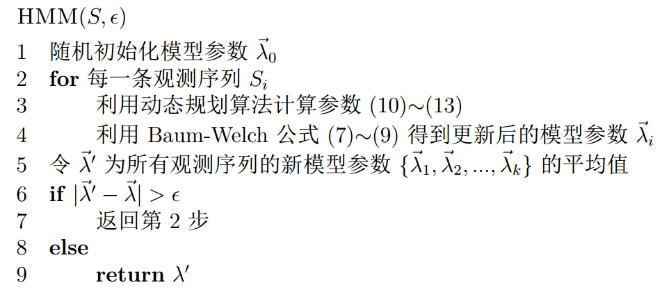

上一回介绍了HMM的解码问题，今天我们介绍HMM的学习问题和识别问题，先来看学习问题。

---

正如上一回结束时所说，**HMM的学习问题**是：仅已知观测序列\(\vec y\)，要估计出模型参数组\(\vec\lambda=(\mu,A,B)\)，其中\(\mu\)为初始概率分布向量，\(A\)为转移概率矩阵，\(B\)为发射概率矩阵。

# 算法设计

求解HMM的参数学习问题，就是求解如下的最优化问题：

$$\begin{equation} P(\vec Y = \vec y|\hat \lambda)=\max\limits_{\vec \lambda} P(\vec Y = \vec y|\vec \lambda)\end{equation}$$

也就是找一个参数\(\vec \lambda\)，使得模型在该参数下最有可能产生当前的观测\(\vec y\)。如果使用极大似然法求解，对于似然函数\(P(\vec Y=\vec y|\vec \lambda)=\sum\limits_{i_1,…,i_T}\mu_{i_1}b_{i_1y_1}a_{i_1i_2}…a_{i_{T-1}i_T}b_{i_Ty_T}\)而言，这个最大值问题的计算量过大，在实际中是不可能被采用的。为此，人们构造了一个递推算法，使其能相当合理地给出模型参数\(\vec \lambda\)的粗略估计。其核心思想是：并不要求备选\(\vec\lambda\)使得\(P(\vec Y=\vec y|\vec \lambda)\)达到最大或局部极大，而只要求使\(P(\vec Y=\vec y|\vec \lambda)\)相当大，从而使计算变为实际可能。

# EM算法

为此，我们定义一个描述模型“趋势”的量\(Q(\vec\lambda^*|\vec\lambda)\)代替似然函数\(P(\vec Y=\vec y|\vec\lambda)\)，其定义为：

$$\begin{equation} Q(\vec\lambda^*|\vec\lambda)=\sum\limits_{\vec x}P(\vec x,\vec y|\vec\lambda)\ln P(\vec x,\vec y|\vec\lambda^*)\end{equation}$$

利用在\(0 < x < 1\)时，不等式\(\ln x\leq x-1\)成立，可以证明：

$$\begin{equation} Q(\vec\lambda^*|\vec\lambda)-Q(\vec\lambda|\vec\lambda)\leq P(\vec Y=\vec y|\vec\lambda^*)-P(\vec Y=\vec y|\vec\lambda)\end{equation}$$

由此可见，对于固定的\(\vec\lambda\)，只要\(Q(\vec\lambda^*|\vec\lambda)>Q(\vec\lambda|\vec\lambda)\)，就有\(P(\vec Y=\vec y|\vec\lambda^*)>P(\vec Y=\vec y|\vec\lambda)\)。于是想把模型\(\vec\lambda_m\)修改为更好的模型\(\vec\lambda_{m+1}\)，只需找\(\vec\lambda_{m+1}\)使得：

$$\begin{equation}Q(\vec\lambda_{m+1}|\vec\lambda_m)=\sup_{\vec\lambda}Q(\vec\lambda|\vec\lambda_m)\end{equation}$$

即只要把\(Q(\vec\lambda|\vec\lambda_m)\)关于\(\vec\lambda\)的最大值处取成\(\vec\lambda_{m+1}\)，就有\(P(\vec Y=\vec y|\vec\lambda_{m+1})>P(\vec Y=\vec y|\vec\lambda_m)\)。

这样得到的模型序列\(\{\vec\lambda_m\}\)能保证\(P(\vec Y=\vec y|\vec\lambda_m)\)关于\(m\)是严格递增的，虽然在这里还不能在理论上证明\(P(\vec Y=\vec y|\vec\lambda_m)\)收敛到\(\max_{\vec\lambda}P(\vec Y=\vec y|\vec\lambda)\)，但是当\(m\)充分大时，\(\vec\lambda_m\)也还能提供在实际中较为满意的粗略近似。

综上论述，我们把如上得到的近似模型列\(\vec\lambda_m\)的方法归结为两个步骤：

1. E步骤（求期望）：计算$$\begin{equation}Q(\vec\lambda^*|\vec\lambda)=\sum\limits_{\vec x}P(\vec x,\vec y|\vec\lambda)\ln P(\vec x,\vec y|\vec\lambda^*)\end{equation}$$
2. M步骤（求最大）：求\(\vec\lambda_{m+1}\)使$$\begin{equation}Q(\vec\lambda_{m+1}|\vec\lambda_m)=\sup_{\vec\lambda}Q(\vec\lambda|\vec\lambda_m)\end{equation}$$

这两个步骤合起来构成的算法，称为期望最大化（Expectation-maximization, EM）算法。EM算法是针对在测量数据不完全时，求参数的一种近似于最大似然估计的统计方法。

# Baum-Welch算法

隐Markov模型中的M-步骤的解可以有显式表示，这就是一组把模型参数修改为新的模型参数的递推公式，这组公式正好是在隐Markov模型中普遍应用的著名的Baum-Welch公式。

$$\begin{equation}\hat\mu_i^{m+1}=\frac{P(\vec Y=\vec y,X_1=i|\vec\lambda_m)}{P(\vec Y=\vec y|\vec\lambda_m)}=\gamma_1(i)\end{equation}$$

$$\begin{equation}\hat a_{ij}^{m+1}=\frac{\sum\limits_{t=1}^{T-1}P(X_t=i,X_{t+1}=j|\vec Y=\vec y,\vec\lambda_m)}{\sum\limits_{t=1}^{T-1}P(X_t=i|\vec Y=\vec y,\vec\lambda_m)}\triangleq\frac{\sum\limits_{t=1}^{T-1}\xi_t(i,j)}{\sum\limits_{t=1}^{T-1}\gamma_t(i)}\end{equation}$$

$$\begin{equation}\hat b_{il}^{m+1}=\frac{\sum\limits_{t=1}^TP(\vec Y=\vec y,X_t=i|\vec\lambda_m)I_{\{l\}}(y_t)}{\sum\limits_{t=1}^TP(\vec Y=\vec y,X_t=i|\vec\lambda_m)}\triangleq\frac{\sum\limits_{t=1,y_t=l}^T\gamma_t(i)}{\sum\limits_{t=1}^T\gamma_t(i)}\end{equation}$$

Baum-Welch算法用到了如下几个公式：

* 向前算法，\(\alpha_t(i)=P(Y_1=y_1,…,Y_t=y_t,X_t=i|\lambda)\)，满足前\(t\)个状态，推进到满足前\(t+1\)个状态（\(t\rightarrow t+1\)）：\(\begin{equation}\alpha_1(i)=\mu_ib_{iy_1}\quad \alpha_{t+1}(i)=\sum\limits_j\alpha_t(j)a_{ji}b_{iy_{t+1}}\end{equation}\)
* 向后算法，\(\beta_t(i)=P(Y_{t+1}=y_{t+1},…,Y_T=y_T|X_t=i,\lambda)\)，满足后\(t-1\)个状态，推进到满足后\(t\)个状态（\(t+1\rightarrow t\)）：\(\begin{equation}\beta_T(i)=1\quad \beta_t(i)=\sum\limits_j\beta_{t+1}(j)a_{ij}b_{jy_{t+1}}\end{equation}\)
* 向前向后算法，满足所有观测状态，且\(t\)时刻的隐状态为\(i\)：\(\begin{equation}\gamma_t(i)=P(X_t=i|\vec Y=\vec y,\vec\lambda)=\frac{P(\vec Y=\vec y,X_t=i|\vec\lambda)}{\sum\limits_iP(\vec Y=\vec y,X_t=i|\vec\lambda)}=\frac{\alpha_t(i)\beta_t(i)}{\sum\limits_i\alpha_t(i)\beta_t(i)}\end{equation}\)
* 以及记号\(\begin{equation}\xi_t(i,j)\triangleq P(X_t=i,X_{t+1}=j|\vec Y=\vec y,\vec\lambda)=\frac{\alpha_t(i)a_{ij}b_{jy_{t+1}}\beta_{t+1}(j)}{\sum\limits_i\alpha_t(i)\beta_t(i)}\end{equation}\)

# 算法流程

最后，我们可以将Baum-Welch公式应用于EM算法中的M步骤，来逐步改进模型参数\(\vec\lambda\)。为了使训练结果更加可信，通常应该有多条观测序列。假设输入为所有\(k\)次观测序列集合\(S\)和收敛阈值\(\epsilon\)，输出为训练得到的模型参数\(\hat{\vec\lambda}\)，则基于Baum-Welch公式的EM算法求解HMM学习问题的伪代码如下：

现在要求解另一个韦小宝的骰子的问题：韦小宝有两个有偏的骰子A,B，A,B掷出相同点数的概率不同，每次韦小宝随机拿一个骰子并投掷，记录下正面朝上的点数，重复100次，得到一条长度为100的点数序列，如此重复100次，得到100条类似的序列。现只给定这100条点数序列，要求解出韦小宝每次投掷的是哪个骰子，并分析这两个骰子有什么区别。

这就是一个典型的HMM的参数学习问题，利用上述伪代码可以很快的求解出模型参数\(\vec\lambda\)，A,B的发射概率就是它们的不同点。

---

**HMM的识别问题**是：对于一个特定的观测链\(\vec y\)，已知它可能是由已经学习好的若干模型之一所得的观测，要决定此观测究竟是得自其中哪一个模型，这称为识别问题。

判决步骤：

1. 根据参数求出在每一个模型中，出现给定样本的概率\(P(\vec Y=\vec y|\lambda_k)\)，归一化就得到给定样本来自每个模型的概率\(P(\lambda_k|\vec Y=\vec y)\)。
2. 利用贝叶斯原理，就可以得到最好模型的猜测。

本博客开头提到，要求解\(P(\vec Y=\vec y|\lambda)\)需要指数时间（\(O(N^T)\)）：$$\begin{equation}P(\vec Y=\vec y|\vec \lambda)=\sum\limits_{i_1,…,i_T}\mu_{i_1}b_{i_1y_1}a_{i_1i_2}…a_{i_{T-1}i_T}b_{i_Ty_T}\end{equation}$$

所以可以利用向前算法（式(10)）或者向后算法（式(11)），对应的结果分别为：

$$\begin{equation}P(\vec Y=\vec y|\lambda)=\sum_{i=1}^N\alpha_T(i)\end{equation}$$

$$\begin{equation}P(\vec Y=\vec y|\lambda)=\sum_{i=1}^N\beta_1(i)\mu_ib_{iy_1}\end{equation}$$

然后利用贝叶斯公式得到\(P(\lambda_k|\vec Y=\vec y)\)，使结果最大的\(k\)即为所求模型。