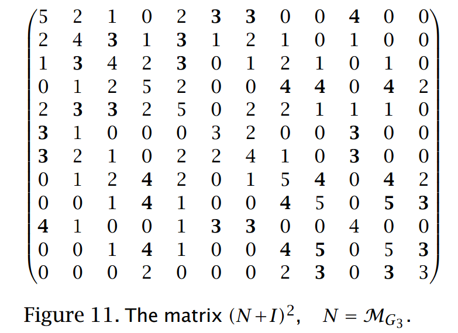

马尔可夫聚类算法（The Markov Cluster Algorithm, MCL）是一种快速可扩展的基于图的聚类算法。它的基本思想为：在一个稀疏图G中，如果某个区域A是稠密的（是一个聚类），则在A中随机游走k步，还在A内的概率很大，也就是说，A内的k步路径（k-length path）很多。所以我们可以在图中随机游走k步，如果某个区域连通的概率很大，则该区域是一个聚类。随机游走的下一步只和当前所处节点有关，也就是说这是一个马尔可夫的随机游走过程。

我们用一个例子来演示马尔可夫聚类算法的过程。

上图是一个很小的网络，我们用肉眼大概能看出有三个聚类，分别是左边的{1,6,7,10}，中间的{2,3,5}和右边的{4,8,9,11,12}。我们用MCL看看结果如何。

为了随机游走，我们常用邻接矩阵来表示图，如果i,j有边，则N[i][j]=1，否则N[i][j]=0。又随机游走可能有自回路，所以加上单位矩阵I，得到矩阵N+I。

MCL有两个关键的步骤，分别是Expansion和Inflation。

**Expansion**就是不断对矩阵进行幂次运算，相当于随机游走。假设随机游走了2步，则得到如下图的关联矩阵\((N+I)^2\)，第1行第10列为4，说明1到10的2-length path有4条：1→6→10，1→7→10，1→1→10，1→10→10。随机游走k步之后，\((N+I)^k[i][j]\)越大，说明\(i\)和\(j\)之间的连通性越强。

$$\begin{equation}Expand(M)=M^k\end{equation}$$

**Inflation**是为了增强更强的连接，减弱更弱的连接，只有这样才能得到边界比较明确的聚类。MCL的做法是对元素做幂次运算，然后按列归一化，公式为：

$$\begin{equation}(\Gamma_rM)_{pq}=\frac{(M_{pq})^r}{\sum_{i=1}^k(M_{iq})^r}\end{equation}$$

参数经验值是\(k=r=2\)。不断做Expansion和Inflation操作，直到算法收敛，得到若干个聚类。[中间过程请点此查看](mcl-3.pdf)，下图为最终结果。

从图中可以看出，和1有边的只剩下6,7,10了，所以得到聚类{1,6,7,10}，同理能得到聚类{2,3,5}和{4,8,9,11,12} ，和我们肉眼得到的结果是一致的。

MCL算法的原理很简单，得到的聚类效果也不错。下面总结一下MCL的算法过程：

1. 给定无向图G，Expansion和Inflation的参数\(k\)和\(r\)
2. 生成G的邻接矩阵\(N\)
3. 添加自回路，得到矩阵\(N+I\)
4. 循环对\(N+I\)做Expansion和Inflation操作，即计算公式(1)和(2)，直到收敛
5. 根据最终得到的矩阵，进行划分聚类

此算法是我在上《生物信息学中的算法设计》课上是学到的，当时觉得这个算法真是神奇，如此简单，但又如此有效，实在高明。查阅文献得知，此为[Stijn van Dongen的博士论文](http://www.micans.org/mcl/)，本博客的图片均来自其博士论文，想深入了解图聚类算法，请[下载他的论文](http://micans.org/mcl/lit/svdthesis.pdf.gz)。

