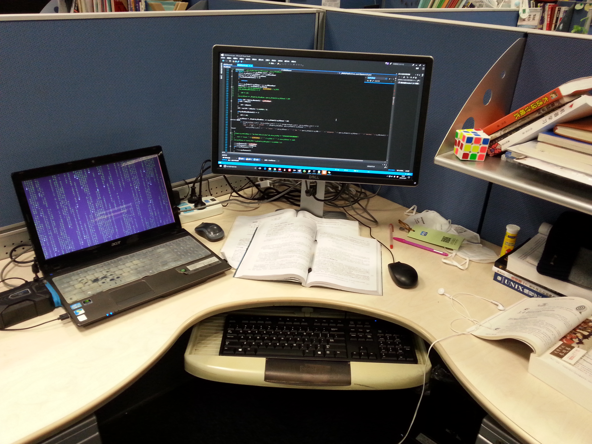
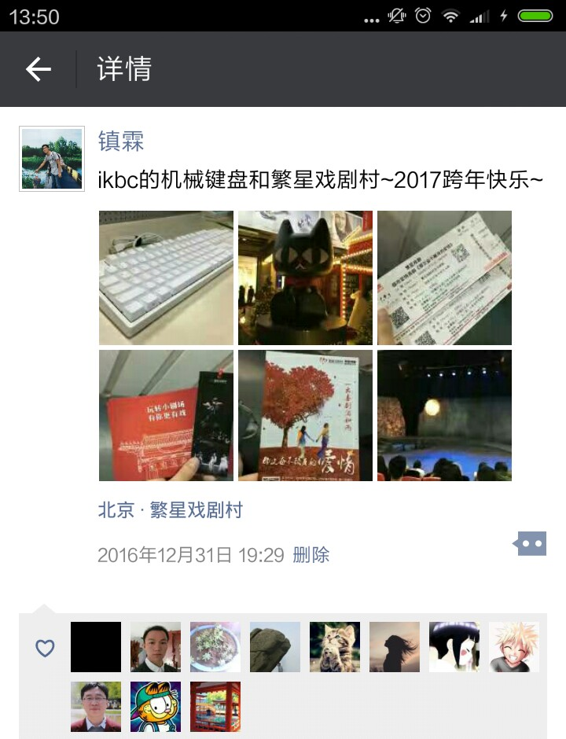
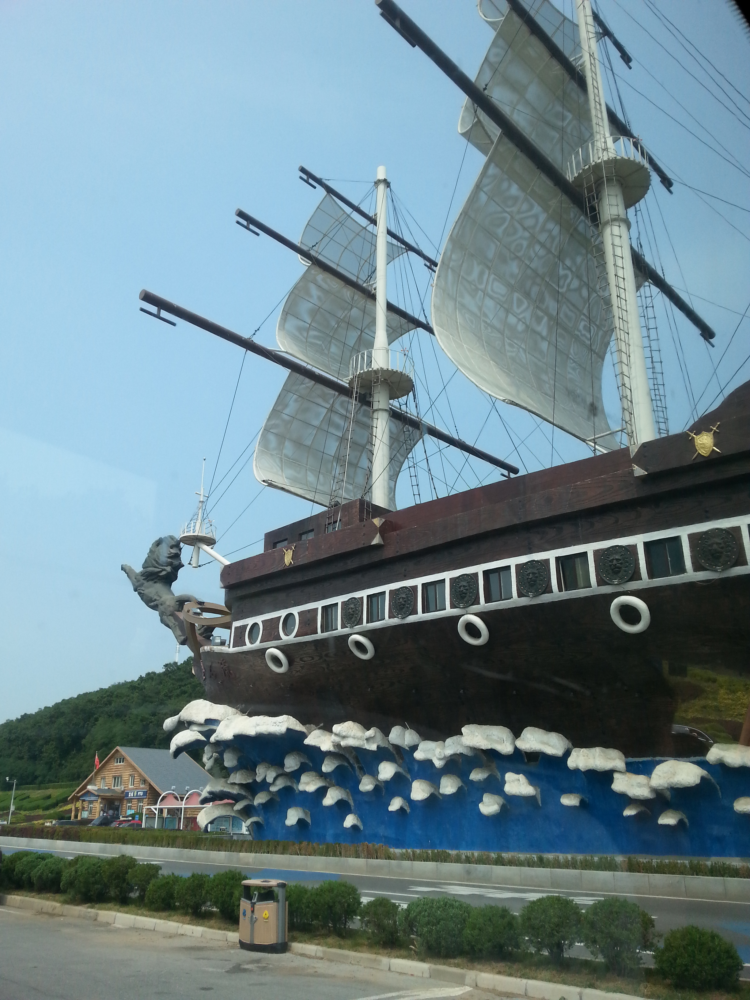
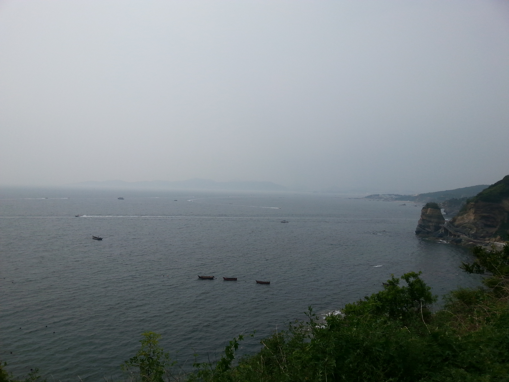

2017农历新年的钟声都已经敲响了，我这2016的年终总结才开始动笔。

2016年，经历了很多，也成长了很多，遇到了很多曾经以为只会出现在电视剧中的场景，令人开始怀疑这个世界。前几天在朋友圈看到一个同学发的状态，觉得很适合作为这篇年终总结的开端。（同学你要是觉得被侵权了，告诉我，我立马删掉:-)）

> 每个家庭的故事都会是一部长篇史诗。曾经总以为很多情节只会出现在电视剧中，现实的生活很是平淡无味，没有任何波澜，偶尔甚至还会抱怨一下自己不是故事的女主角，其不知现实的生活相比于电视剧，往往是有过之而无不及。
> 今天哥哥来电话了，从“天津”，一个美丽的谎言，一直在继续，还会坚持很久…
> 奶奶很开心…
> ——by angel

**关于学习和科研**。[上半年在雁栖湖完成了研一的下半个学期，完完全全的结束了自己的学生时代。](https://bitjoy.net/posts/2016-08-20-2016-mid-year-summary/)下半年开始进入实验室，直面惨淡的科研。原本以为会由组里的大师兄超哥指导我，没想到中秋前3天，直接接到H Boss的指令，要在中秋前完成一项我从来没做过的评测。不知道怎样设计实验，不知道怎样计算评价指标，甚至连需要评测的软件都不熟。不过好在加班加点完成了。

凌乱的工位

从9月到10月中旬，一直在各种数据集上做各种对比评测，基本上一周做完一个评测数据集，完成一份报告，直接提交给H Boss，下一周在做另一个评测的同时，要根据导师的反馈建议修改完上一个评测报告。这一个多月的时间，共完成了5份报告共计14个版本，真的是要吐了。

后来发现pLink要比对手慢，于是就尝试各种加速策略。开始从外围查找原因，尝试了各种策略，虽然多多少少能加速，但是效果都不完美，有可能对精度有影响。直到12月份，借助谷歌的开源性能分析工具gperftools才找到了软件的性能瓶颈，开始优化并取得了好几倍的加速效果。12月份对软件本身的性能优化大概是我这半年做的唯一一个和计算机本身有点关系的工作吧，可能也是为数不多的我比较享受的一件事。

整个这半年的工作，都是H Boss御驾亲征，亲自指导，当然这样有利有弊。好处是能直接和H Boss对话，机会难得呀，H那种严于律己、追求完美的品质，H的为人处世、口才都是非常值得我学习的。坦白说，虽然我只是无名小卒一个，但从小到大，真正让我从心里佩服的人没几个，H Boss绝对算是其中之一。当然不便之处也非常明显，首先会感觉特别累和压抑，除了每周一次的面谈，每天的邮件，还经常在晚上11点多收到老师的工作微信。所以这半年确实不轻松，工作日晚上基本都在加班，而且加班到晚上11点也是常事，周末也至少工作一天。几乎没有时间运动，身体素质应该下降了不少。与人的沟通也非常少，好几个师兄师姐都问我为啥看我整天都在工位上坐着，好像从来没有动过。夸张点说就是每天晚上下班要走的时候，才发现自己这一天还没有说话。

当然半年高强度的工作，也有不少的收获，基本摸清了pLink代码的来龙去脉，也加速了两三倍，自己的表现也稍微得到了老师和同学的肯定。不过我自己还是不太满意的，加速并没有达到理想的效果。

**关于亲情**。随着我们两兄弟的大学毕业，家里的情况也在稍稍好转，但是只能算是曲折前进吧。以前小的时候，都是爸妈两个人闹，现在哥哥出场了，真是可笑。谈了快两年的女朋友，女方父母又是要查户口本，又是催着要付定金，说什么不给定金就要拉回老家相亲。这TM比电视剧还荒唐，真把自己当商品了，是不是给的钱多就跟谁呀，混蛋。哥哥也不是个省油的灯，分手之后没过多久说什么被公司派去新加坡学习了，去了之后，连个固定的联系方式都没有，三天两头失联，都老大不小的人了，还让父母担心。工作了两年，一分钱都没攒到，连大学的助学贷款都要我这个还在上学的弟弟替他还。女朋友分手也就算了，没赚到钱也不要紧，关键是你不能让家人这样担心你呀，你定期给家人打个电话，说说你到底在哪里干什么，既然到了新加坡，发几张国外的照片回来分享一下，不可以吗？已经两年过年没回家了，而且两年除夕居然连个电话都没有，这不是不孝是什么，混蛋。

今年妈妈也终于愿意外出挣钱了，虽然不多，但是起码在和爸爸一起努力。家里装修好了一层房子，但是也就是把墙什么的弄好了，家具还没制备。本来想着过年回家给家里买个小米电视，但是爸妈死活说不要买，现在买了也就过年看几天，不划算。后来只好作罢。放假给老爸买的红米手机，终于在除夕这一天拿到手了。给爸妈包的红包，也在按计划逐年的递增着。

自己有时候也埋怨家里，为什么家境这么的不堪，为什么父母没有达到我理想的高度，为什么哥哥这么不争气，为什么没有人关心我。但是埋怨有用吗，肯定是没用的，还是要看各自的造化。

**关于爱情**。我还是太幼稚，看看我的家境吧，有哪个女生愿意摊上我家这些破事呢，我就不应该奢望有什么爱情。不过今年上半年，爱情确实来过，抛开所有的一切，纯粹的校园爱情。可是10月份的一件事，彻底打醒了我，爱情没有那么简单，需要考虑的问题太多了。关于那段时间的记忆，写过很多文字，也流过很多泪。回顾整个下半年，欣欣和我的状态都不太好，除了那件事的原因，和工作变化也有很大的关系。我们都从雁栖湖到中关村，需要经历一个由学生到科研工作者的角色转变，面对科研的未知，都显得有些手足无措。科研的不顺，生活的压力以及家里的一些烦心事，一股脑的涌向了我们，矛盾也时有发生。经历过不少的磕磕绊绊，总算顺利度过了2016年，没有了热恋时期的疯狂，生活终要归于平淡。正所谓陪伴是最长情的告白，爱情的意义是否就在于两个人一起经历，一起成长呢。让我们共同守护。

**关于友情**。是的，我还欠很多人一顿饭。很多同学，如果长时间不见面，恐怕真的要忘掉了。

**关于个人提高**。上半年忙于课程学习，下半年忙于科研，花在个人提高上的时间真的是太少了。不过感谢有欣欣一直做我的榜样，我现在的小目标就是希望比欣欣看更多的书、刷更多的题。

另外下半年回到市区之后，也去了一些之前没去过的地方，比如：清华艺术博物馆、繁星戏剧村、中国美术馆、三联书店、香山等地。其中前两个地方都是和欣欣一起去的，感觉超棒~第一次看达芬奇的特展，开始了解这样一个天才，后来还看过他的传记；第一次去剧院看话剧，感觉和看电影完全不一样，小剧场的效果也是棒棒的。2016年12月31日也是一个值得纪念的日子：

2017跨年活动~

今年借着CNCP2016会议的机会，去了一次大连，见识了一下海滨城市的风貌，后来还跑去渤海学游泳，海水很脏，而且咸得发苦。希望今后每年都去一个除了上班地点和家里之外的第三个城市。

大连滨海国家地质公园

大连滨海国家地质公园

最后看看[年初计划](https://bitjoy.net/posts/2016-01-03-2016-happy-new-year/)的完成情况：

1. ~完成国科大下学期的课程任务：完成~
2. ~接手pLink软件：完成~
3. 刷完LeetCode所有题目：进度147/461，没有完成
4. ~读10本书：目前读了《数学之美》、《大话设计模式》、《我不知道该说什么，关于死亡还是爱情》、《男人来自火星、女人来自金星，卷I》、《只有医生知道，卷I》、《文学的种子》、《讲理》、《暗时间》、《达·芬奇传：放飞的心灵》、《人间失格》，刚好10本，圆满完成任务:-)~
5. 去电影院看10场电影：目前看了《美人鱼》、《北京遇上西雅图之不二情书》、《忍者神龟2：破影而出》、《七月与安生》、《湄公河行动》、《比利·林恩的中场战事》、《你的名字》、《血战钢锯岭》，只有8场，其中7场是和欣欣一起看的~
6. 改正坐姿：有一段时间刻意改正了，但是这东西貌似改不过来？

除了LeetCode完成度太差之外，其他计划完成度还是蛮高的。下面定一下2017年的年度计划：

1. 发表pLink 2文章
2. 至少完成毕业工作的80%
3. 刷完LeetCode所有简单题和中等题，找工作之前最好刷完两遍
4. 找到一个满意的工作
5. 读10本书
6. 去电影院看10场电影
7. 看一场话剧（音乐会、歌剧等都可以）
8. 学会游泳
9. 去第三个城市

简短总结一下我的2016：完成了由上课到科研的转变；开始有能力感恩家人；遇到了欣欣，由一个人变成了两个人；第一次去剧场看话剧。展望2017，找工作和准备毕业迫在眉睫，注定又是繁忙的一年！

最后用汪老师的年终总结PPT封面的一句话来结束吧：

