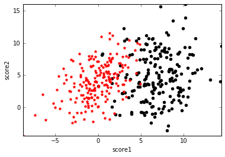

最近实验室在组织学习[NG的机器学习视频](http://open.163.com/special/opencourse/machinelearning.html)，我也跟进了一下。讲到逻辑回归那一课，一直想不明白，逻辑回归到底是怎样分类的？逻辑回归的分类面在哪里？逻辑回归有像SVM的max margin那样清晰的推导过程吗？为什么需要Sigmoid函数？今天就让我们来一窥逻辑回归的始末。

假设有一堆学生样本，为了简单起见，只有两个特征，分别是两门课的分数score1和score2，类标号y表示这个学生是否能被录取。可视化如下图，黑点表示y=1即被录取，红点表示y=0即未被录取，可以看到黑点处在score1和score2都比较高的区域。我们的任务就是给定这些训练样本，需要确定一个分类面来划分这两类数据。

分类面的实质就是\(y=\mathbf{w^T x}+b\)，其中\(\mathbf{w}\)和\(\mathbf{x}\)都是向量，对应到本例中，展开为\(y=w_1x_1+w_2x_2+b\)。所以，寻找分类面的过程就是寻找倾斜度\(\mathbf{w}\)和截距\(b\)。

因为分类的结果是离散的，只有0或者1，可以用感知机来分类。即

但是怎样找这里的\(\mathbf{w}\)和\(b\)使得分类结果最好呢，我们需要定义一个优化的目标函数或者说损失函数。这里只能定义为分类错误的个数，只能一点点挪动超平面来找分类错误最少的超平面了，即只能用暴力枚举的方法来找\(\mathbf{w}\)和\(b\)。

另一种方法是令我们的分类面算出来的值和真实标号越接近越好，即最小化误差\((\mathbf{w^T}x^{(i)}+b-y^{(i)})^2\)，然后通过梯度下降求解\(\mathbf{w}\)和\(b\)。

但是这会有一个问题，对于上图数据，可以求到一个比较好的分类面，如下左图。但是如果数据中出现了如下右图右边的一个离群点或者噪声，为了最小化这个点的误差，即\((\mathbf{w^T}x^{(i)}+b-1)^2\)，导致分类面往右偏了，这一偏直接导致很多y=1的样本分类错误。所以这种最小化误差的方法对离群点很敏感。

  |  
:-------------------------:|:-------------------------:

假设分类超平面还是\(f(\mathbf{x})=\mathbf{w^T x}+b\)，我们希望的分类效果是这样的：\(f(\mathbf{x})=0\)是分类面；\(f(\mathbf{x})>0\)分类为1，且不管\(f(\mathbf{x})\)多大，都分为1；\(f(\mathbf{x})<0\)分类为0，且不管\(f(\mathbf{x})\)多小，都分为0。

因为类标号是离散的{0,1}，所以想到把\(f(\mathbf{x})\)映射到[0,1]之间，即\(g(f(\mathbf{x}))\)。为了满足上述条件，\(g(f(\mathbf{x}))\)需要满足：

1. \(g(0)=0.5\)，即在分类面上无法判断类标号是0还是1
2. 当\(f(\mathbf{x})>0\)时，\(g(f(\mathbf{x}))>0.5\)
3. 当\(f(\mathbf{x})\rightarrow+\infty\)，\(g(f(\mathbf{x}))\rightarrow 1\)，且\(g'(f(\mathbf{x}))\rightarrow 0\)，即对于上右图右边的离群点，分类为1，且导数趋近于0，表示对其不敏感
4. 当\(f(\mathbf{x})<0\)时，\(g(f(\mathbf{x}))<0.5\)
5. 当\(f(\mathbf{x})\rightarrow-\infty\)，\(g(f(\mathbf{x}))\rightarrow 0\)，且\(g'(f(\mathbf{x}))\rightarrow 0\)，和第3点类似

满足上述性质的函数之一就是Sigmoid函数，其定义域为\([-\infty,+\infty]\)，值域为[0,1]，正好把原始的函数结果\(f(\mathbf{x})\)映射到了[0,1]，而概率的取值范围正好是[0,1]，所以Sigmoid函数正好可以作为分类为1的概率。

所以逻辑回归最终的形式就是：

$$g(\mathbf{x})=\frac{1}{1+e^{-(\mathbf{w^T x}+b)}}$$

分类面依然还是\(f(\mathbf{x})=\mathbf{w^T x}+b=0\)，因为\(f(\mathbf{x})=0\)时，\(g(\mathbf{x})=0.5\)，正好满足上述条件1。

Sigmoid函数的另一个优点是，它把原始函数值映射到了概率空间，这样就可以用极大似然的方法求解参数\(\mathbf{w}\)和\(b\)。下面用参数\(\mathbf{\theta}\)代表参数\(\mathbf{w}\)和\(b\)，用\(h_{\mathbf{\theta}}(\mathbf{x})\)代表\(g(f(\mathbf{x}))\)。则有：

$$P(y=1|\mathbf{x};\mathbf{\theta})=h_{\mathbf{\theta}}(\mathbf{x})$$

$$P(y=0|\mathbf{x};\mathbf{\theta})=1-h_{\mathbf{\theta}}(\mathbf{x})$$

合并成一个式子就是：

$$P(y|\mathbf{x};\mathbf{\theta})=h_{\mathbf{\theta}}(\mathbf{x})^y(1-h_{\mathbf{\theta}}(\mathbf{x}))^{1-y}$$

由于所有样本独立同分布（I.I.D.），似然函数就是

$$L(\mathbf{\theta})=P(\mathbf{y}|X;\mathbf{\theta})=\prod\limits_{i}P(y^{(i)}|\mathbf{x}^{(i)};\mathbf{\theta})=\prod\limits_{i}h_{\mathbf{\theta}}(\mathbf{x}^{(i)})^{y^{(i)}}(1-h_{\mathbf{\theta}}(\mathbf{x}^{(i)}))^{1-y^{(i)}}$$

最大化似然的含义就是，在给定样本\(X\)的情况下，我们想找一个参数\(\mathbf{\theta}\)，使得观测到类标号\(\mathbf{y}\)的概率最大。

最大化似然等价于最大化log似然，log展开之后就是：

$$l(\mathbf{\theta})=logL(\mathbf{\theta})=\sum\limits_{i}y^{(i)}logh_{\mathbf{\theta}}(\mathbf{x}^{(i)})+(1-y^{(i)})log(1-h_{\mathbf{\theta}}(\mathbf{x}^{(i)}))$$

而很巧的是，最大化log似然，其实等效于最小化log对数损失。对于单个样本，损失为：

$$cost(h_{\theta}(\mathbf{x}),y) = \begin{cases}-log(h_{\theta}(\mathbf{x})) & \text {if y=1} \\ -log(1-h_{\theta}(\mathbf{x})) & \text{if y=0} \end{cases}$$

即如果正确类标号是1，但算出来的\(h_{\theta}(\mathbf{x})\)很接近0的话，则损失\(-log(h_{\theta}(\mathbf{x}))\)就会很大。类标号为0的情况类似。把这两种情况合成一个式子就是：

$$cost(h_{\theta}(\mathbf{x}),y) = -ylog(h_{\theta}(\mathbf{x})) – (1-y)log(1-h_{\theta}(\mathbf{x}))$$

所有样本的损失之和就是：

$$J(\mathbf{\theta})=cost(h_{\theta}(X),\mathbf{y}) = \sum\limits_{i}-y^{(i)}logh_{\mathbf{\theta}}(\mathbf{x}^{(i)})-(1-y^{(i)})log(1-h_{\mathbf{\theta}}(\mathbf{x}^{(i)}))$$

所以最大化对数似然\(\max l(\mathbf{\theta})\)和最小化对数损失\(\min J(\mathbf{\theta})\)是等效的！最优化求解的方法用梯度下降和牛顿法都可以。

和Sigmoid很像的函数还有很多，比如y=arctan(x)也可以，不过Sigmoid有一个很好的特点，即它的导数可以由自身算出来，\(f'(x)=f(x)(1-f(x))\)。

---

传统的逻辑回归只能处理二分类问题，那么怎样将其扩展到解决多分类问题呢？有两种方法，一种方法是建立k个二元分类器，比如类标号有A,B,C，则建立3个二元分类器，分别是1）A和非A；2）B和非B；3）C和非C。训练每个2元分类器时，都对所有的数据重新标号为0或1，这样共需要训练k个二元分类器。

还有一种方法是直接将二元逻辑回归推广到多元回归，即Softmax回归，[有关Softmax回归的内容，请参考此博客，非常详细](http://ufldl.stanford.edu/wiki/index.php/Softmax%E5%9B%9E%E5%BD%92)。简单来说，二元逻辑回归的假设函数是：多元Softmax回归的假设函数在形式上有所不同：其中是模型的参数。请注意这一项对概率分布进行归一化，使得所有概率之和为1。

Softmax回归的损失函数如下，其实就是logistic回归损失函数的推广：

二元逻辑回归是多元Softmax回归在k=2时的特例，令k=2并利用Softmax回归参数冗余的特点，可以得到一般形式的二元逻辑回归假设函数，具体可以看原博客。

面对一个多元分类问题，是选择Softmax回归还是k个二元分类器呢，这取决于你的类别之间是否互斥，如果互斥，可以用Softmax回归，否则，请用k个二元分类器。

这就是逻辑回归的理论知识，下一篇博客将介绍逻辑回归在Python中的应用。

参考：

* http://www.cnblogs.com/sparkwen/p/3441197.html
* https://tech.meituan.com/intro_to_logistic_regression.html
* http://blog.csdn.net/bitcarmanlee/article/details/51165444
* http://ufldl.stanford.edu/wiki/index.php/Softmax%E5%9B%9E%E5%BD%92