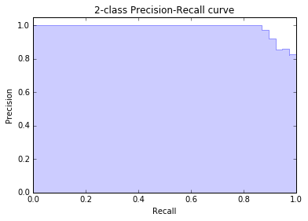

上一篇博客主要介绍了逻辑回归的理论知识，这篇博客咱们用Python机器学习包sklearn中的LogisticRegression做一个分类的实例。

数据还是学生样本，只有两个特征，分别是两门课的分数score1和score2，类标号y表示这个学生是否能被录取。先上分类效果图：


完整的Python代码如下：

```python
# -*- coding: utf-8 -*-
"""
Created on Wed Nov 08 17:49:41 2017
 
@author: zhenlin
"""
 
import numpy as np  
import pandas as pd
from sklearn.cross_validation import train_test_split
from sklearn.linear_model import LogisticRegression
import matplotlib.pyplot as plt
from sklearn.metrics import precision_recall_curve
from sklearn.metrics import classification_report
 
# 1. 构造数据
 
sample_number = 200
 
# 第一个高斯分布参数
mean1 = [0, 4] # 两个维度上的均值
cov1 = [[5, 3], [3, 10]] # 两个维度的协方差矩阵，必须满足对称半正定
 
# 第二个高斯分布参数
mean2 = [7, 5]
cov2 = [[7, 2], [2, 15]]
 
# 从两个二元高斯分布中随机采样数据点
class1_x1, class1_x2 = np.random.multivariate_normal(mean1, cov1, sample_number).T # .T表示转置
class2_x1, class2_x2 = np.random.multivariate_normal(mean2, cov2, sample_number).T
 
# 两个高斯分布对应两个类标号
data = [[class1_x1[i],class1_x2[i],0] for i in range(sample_number)]+[[class2_x1[i],class2_x2[i],1] for i in range(sample_number)]
 
# 填充到pandas中
data = pd.DataFrame(data,columns=['score1','score2','result'])
 
score_data = data[['score1','score2']]
result_data = data['result']
 
# 2. 训练模型
 
average_precision = 0 # 平均准确度
iters = 10 # 交叉验证次数
 
for i in xrange(iters):
    # 数据划分，80%用于训练，20%用于预测
    x_train, x_test, y_train, y_test = train_test_split(score_data, result_data, test_size = 0.2)
    # 构造默认逻辑回归模型
    model = LogisticRegression()
    # 训练
    model.fit(x_train, y_train)
    # 预测
    predict_y = model.predict(x_test)
    # 计算测试集上的准确度
    average_precision += np.mean(predict_y == y_test)
 
average_precision /= iters
  
# 3. 绘制分类面 - 法1
 
x1_min, x1_max = score_data['score1'].min() - .5, score_data['score1'].max() + .5
 
def generate_face(prob):
    y = -np.log(1.0 / prob - 1.0)
    n = 500
    x1 = np.linspace(x1_min, x1_max, n)
    # w1x1+w2x2+b=y
    x2 = (-model.coef_[0][0] / float(model.coef_[0][1])) * x1 + (y - model.intercept_) / float(model.coef_[0][1])
    return x1, x2
 
pos_data = data[data['result'] == 1]
neg_data = data[data['result'] == 0]
plt.scatter(x = pos_data['score1'], y = pos_data['score2'], color = 'black', marker = 'o')
plt.scatter(x = neg_data['score1'], y = neg_data['score2'], color = 'red', marker = '*')
 
face_04_x1, face_04_x2 = generate_face(0.4)
face_05_x1, face_05_x2 = generate_face(0.5)
face_06_x1, face_06_x2 = generate_face(0.6)
 
plt.plot(face_04_x1, face_04_x2)
plt.plot(face_05_x1, face_05_x2)
plt.plot(face_06_x1, face_06_x2)
plt.xlim(score_data['score1'].min(), score_data['score1'].max())
plt.ylim(score_data['score2'].min(), score_data['score2'].max())
plt.xlabel('score1')
plt.ylabel('score2')
plt.legend(['prob_threshold = 0.4', 'prob_threshold = 0.5', 'prob_threshold = 0.6'], loc='center left', bbox_to_anchor=(1, 0.865))
plt.show()
 
 
# 4. 绘制分类面 - 法2
 
pos_data = data[data['result'] == 1]
neg_data = data[data['result'] == 0]
 
h = 0.02
s1_min, s1_max = score_data['score1'].min() - .5, score_data['score1'].max() + .5
s2_min, s2_max = score_data['score2'].min() - .5, score_data['score2'].max() + .5
 
# 生成s1在[s1_min, s1_max]，且s2在[s2_min, s2_max]的网格数据点
# meshgrid含义参见：http://blog.sciencenet.cn/blog-791749-675394.html
s1, s2 = np.meshgrid(np.arange(s1_min, s1_max, h), np.arange(s2_min, s2_max, h))
# 把两个坐标的值按列拼在一起构成二维数据点
Z = model.predict(np.c_[s1.ravel(), s2.ravel()])
 
# 绘制边界和散点
Z = Z.reshape(s1.shape)
# 坐标点是(s1[i], s2[i])，对应颜色是Z[i]，颜色主题使用plt.cm.Paired
plt.pcolormesh(s1, s2, Z, cmap = plt.cm.Paired)
plt.scatter(x = pos_data['score1'], y = pos_data['score2'], color = 'black', marker = 'o')
plt.scatter(x = neg_data['score1'], y = neg_data['score2'], color = 'red', marker = '*')
plt.xlim(s1.min(), s1.max())
plt.ylim(s2.min(), s2.max())
plt.xlabel('score1')
plt.ylabel('score2')
plt.show()
 
# 5. 评估模型
 
# 对于测试数据，模型输出1的概率
answer = model.predict_proba(x_test)[:,1]
 
# 计算不同概率阈值下的P和R
precision, recall, thresholds = precision_recall_curve(y_test, answer)
 
# prob > 0.5的报告为1
report = answer > 0.5
 
print(classification_report(y_test, report, target_names = ['neg', 'pos']))
print('average precision: %f'%average_precision)
 
# 6. 绘制PRC曲线
 
# step阶跃图，在点(recall[i],precision[i])进行跳变
plt.step(recall, precision, color='b', alpha=0.2, where='post')
# 对PRC下方填充颜色
plt.fill_between(recall, precision, step='post', alpha=0.2, color='b')
 
plt.xlabel('Recall')
plt.ylabel('Precision')
plt.ylim([0.0, 1.05])
plt.xlim([0.0, 1.0])
plt.title('2-class Precision-Recall curve')
plt.show()
```

下面将逐模块介绍代码细节，大神可以略过。

# 一、构造数据

数据的来源可以有很多种方式，sklearn包中自带7个[Toy datasets](http://scikit-learn.org/stable/datasets/index.html#toy-datasets)，比如我们耳熟能详的鸢尾花卉数据集iris和手写数字数据集digits。为了学一学numpy，我们尝试自行构造数据集，这样也方便读者重复。我们可以从两个不同参数的高斯分布中采样相同数量的数据点，由于数据包含两个维度(score1, score2)，所以必须是二维高斯分布。二维高斯分布概率密度函数为：


参数包括：


\(\mu\)中的\(\mu_X\)和\(\mu_Y\)分别表示两个维度上的均值，\(\Sigma\)是这两个维度上的协方差矩阵，需要满足对称半正定。

numpy中的[random.multivariate_normal](https://docs.scipy.org/doc/numpy-1.13.0/reference/generated/numpy.random.multivariate_normal.html)可以从多元正态分布中进行采样，传入的参数包括均值mean, 协方差矩阵cov和采样数据点个数。比如本文中第二类数据点的均值为[7,5]，表示在score1维上的均值为7，在score2维上的均值为5，从图上黑点的横纵坐标分布也可以看出来；协方差矩阵为\(\begin{bmatrix}7 & 2\\2 & 15\end{bmatrix}\)，表示score1和score2上的方差分别为7和15，然后标准差的积再乘以相关系数等于2。用这些参数调用multivariate_normal就能得到对应二维平面\(x_1Ox_2\)上的数据点了。

最后，给两类数据点贴上不同的类标号，填充到Pandas中就大功告成了。Pandas中每一行表示一个样本，共有三列，分别表示score1、score2和result，其中result就是类标号。

# 二、训练模型

由于是直接调用sklearn中的逻辑回归函数，所以这一步非常简单。为了评估模型的准确度，我们做了一个交叉验证，即随机把数据分成80%用于训练，20%用于预测，重复10次，求预测准确度的平均值。这可以用模型选择中的[train_test_split](http://scikit-learn.org/stable/modules/generated/sklearn.model_selection.train_test_split.html)快速完成。

调用sklearn.linear_model.LogisticRegression()就能得到一个逻辑回归模型，该函数有很多参数，但是作为入门，所有参数都使用默认值。训练直接调用model.fit(x,y)，预测直接调用model.predict(x)。需要注意的是，model中带了很多成员变量，比如训练得到的分类面参数coef_和intercept_等，后面会用到。

# 三、绘制分类面（法1）

上一篇博客提到，虽然\(f(\mathbf{x})\)被Sigmoid函数映射到了概率空间，但逻辑回归的分类面还是\(f(\mathbf{x})=\mathbf{w^T x}+b=0\)。model通过fit函数训练之后，就能得到分类面的法向量\(\mathbf{w}\)（coef_）和截距\(b\)（intercept_），也就是说对于分类面\(w_1x_1+w_2x_2+b=0\)，我们已经知道了\(w_1\)、\(w_2\)和\(b\)，所以就可以在平面\(x_1Ox_2\)上画出这条直线了。具体的方法就是使用np.linspace先在\(x_1\)上选取足够多的点，代入\(w_1x_1+w_2x_2+b=0\)得到对应的\(x_2\)。该分类面如下图的prob_threshold=0.5。


事实上，逻辑回归的分类面可以不止一个，我们上面得到的分类面是\(f(\mathbf{x})=0\)，代入到\(g(\mathbf{x})\)就是\(g(\mathbf{x})=0.5\)，也就是说当逻辑回归计算到的概率>=0.5分类为1，<0.5分类为0。但是我们也可以提高这个阈值，比如要求概率>=0.6分类为1，<0.6分类为0，这时，相当于我们对于分类为1的阈值提高了，要求更严格了，所以分类面应该向右边黑点方向移动。

求解prob_threshold=0.6的分类面也不难，令\(g(\mathbf{x})=0.6\)，得到\(f(\mathbf{x})=-lg(\frac{1}{0.6}-1)\)，剩下的过程和\(f(\mathbf{x})=0\)是一样的。由此得到的分类面如上图的prob_threshold=0.6那条线，确实在prob_threshold=0.5的右边。类似的，可以画出prob_threshold=0.4的分类面。

# 四、绘制分类面（法2）

还有一种简单粗暴的方法可以快速绘制出分类面。分类面的本质是在该分类面左右两侧的类标签不一样，如果我们把平面上所有点都预测一遍，对预测值为1的标上一种颜色，对预测值为0的标上另一种颜色，那么这两种颜色的交界处自然就是分类面了。

首先，我们使用np.meshgrid生成网格数据点，关于np.meshgrid的用法，[这篇博客](http://blog.sciencenet.cn/blog-791749-675394.html)的介绍很好理解。然后对所有网格数据点调用model.predict进行预测。最后使用plt.pcolormesh的[plt.cm.Paired](https://matplotlib.org/examples/color/colormaps_reference.html)颜色主题进行着色，即类标签为1的一种颜色，类标签为0的另一种颜色。最后把原始训练数据点画上去，就得到博客开篇的那张分类面图：


# 五、评估模型

model.predict是直接预测出类标号1或者0，而model.predict_proba是给出类标号分别为1和0的概率，用户可以自行根据prob_threshold进行分类。

```python
precision, recall, thresholds = precision_recall_curve(y_test, answer)
```

[precision_recall_curve](http://scikit-learn.org/stable/modules/generated/sklearn.metrics.precision_recall_curve.html)的参数是正确答案y_test和model.predict_proba预测出来的概率，返回值分别表示不同threshold阈值下的precision和recall。sklearn官方的例子如下：

```python
y_true = np.array([0, 0, 1, 1])
y_scores = np.array([0.1, 0.4, 0.35, 0.8])
precision, recall, thresholds = precision_recall_curve(y_true, y_scores)
```

得到的结果如下：

```python
precision
array([ 0.66..., 0.5 , 1. , 1. ])
recall
array([ 1. , 0.5, 0.5, 0. ])
thresholds
array([ 0.35, 0.4 , 0.8 ])
```

比如当threshold=0.4时，表示>=0.4分类为1，<0.4分类为0，则预测结果为[0,1,0,1]。正确率为预测为1的结果中对了几个1/2=0.5，召回率为召回了多少个正确答案为1的结果1/2=0.5。其他阈值的计算类似。

最后调用classification_report会算出不同类别的precision、recall和F1，以及对应的支持数据个数。

```python
             precision    recall  f1-score   support
 
        neg       0.89      1.00      0.94        42
        pos       1.00      0.87      0.93        38
 
avg / total       0.94      0.94      0.94        80
 
average precision: 0.925000
```

# 六、绘制PRC曲线

PRC曲线就是precision recall curve，由于上一步已经调用precision_recall_curve得到了不同阈值下的precision和recall，这一步直接拿来用就好了。为了防止画出来的曲线抖动形成毛刺，我们使用plt.step阶跃函数来绘制，起到平滑的作用。最后使用plt.fill_between填充曲线下方的面积。得到下图：



至此，整个示例讲解完毕。

如果要使用逻辑回归处理多分类问题，只需要构造好多标签的训练数据就好了，剩下的就交给模型自己处理。LogisticRegression的multi_class参数可以设置使用何种策略求解多分类问题，one-vs-rest (OvR)即构建k个二元分类器，multinomial即使用Softmax回归，默认使用OvR。


参考：
* http://blog.csdn.net/u011721501/article/details/49661585