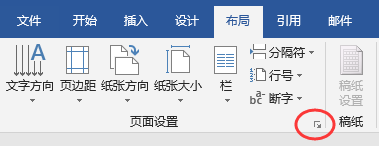

最近导师给我批注文章，说我的Word文档的批注行距极大，从入学到现在一直都是如此，对他造成了极大的困扰，希望我能解决这个问题。

但是我自己用Word2016查看导师的批注，看不出行距极大的问题，显示完全是正常的。后来猜测导师用的是旧版的Word2010，于是在虚拟机中安装了Word2010，进行测试。

经过长时间的Debug，终于发现问题所在。Word针对批注有一个默认的样式，为“**批注文字（使用前隐藏）**”，可以点击样式右下角的箭头，或者直接按快捷键Ctrl+Shift+Alt+S调出样式窗口。然后点击底部的管理样式就可以看到所有的样式了。有意思的是，批注文字样式默认是隐藏的，所以在下图的样式列表中是找不到这个样式的。

找到批注文字样式，点击修改，在弹出的窗口中点击左下角的格式，选择段落，就可以看到批注的默认格式了。段落格式看不出什么异常，Word2016和Word2010的批注段落格式都是一样的，其中“如果定义了文档网格，则对齐到网格”都是默认选中的。

有意思的是，Word2016和Word2010对网格的默认设置却不一样。在布局、页面设置中点击右下角的箭头，打开页面设置对话框。切换到文档网格选项卡。

Word2016默认指定了行网格，而Word2010默认却是无网格。因为批注文字样式中选中了“**如果定义了文档网格，则对齐到网格**”这个选项，Word2016默认指定了行网格，所以批注文字会对齐到行网格，导致行间距太大，Word2010默认没有指定任何网格，所以其批注文字的行间距是正常。

Word2016文档网格，默认指定了行网格

Word2010文档网格，默认无网格

解决办法就是，修改Word2016的设置，选中“无网格”，并设置为默认值，这样以后新建的Word文档默认都是无网格，批注的行间距也就正常了。
