这篇博客把1.15和1.17两次课内容合并到一起，因为两次课的内容都是BP及公式推导，和之前的[Neural Networks and Deep Learning（二）BP网络](https://bitjoy.net/posts/2018-12-14-neutral-networks-and-deep-learning-2-bp/)内容基本相同，这里不再赘述。下面主要列一些需要注意的知识点。

使用神经网络进行表示学习，不用输入的x直接预测输出，而是加一个中间层（图中橙色神经元），让中间层对输入层做一定的变换，然后中间层负责预测输出是什么。那么中间层能学到输入层的特征，相当于表示学习，自动学习特征。对于word2vec，中间层就是词向量。

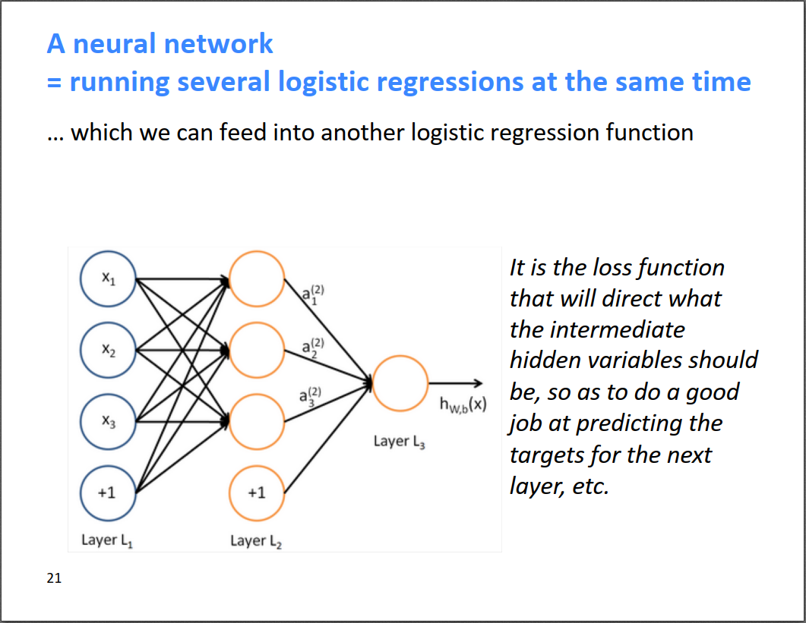

命名实体识别（Named Entity Recognition, NER），任务是把一个句子中的一些实体词识别出来，比如下图中识别出地点LOC、机构ORG和人名PER等。通常采用的方法是把需要判断类型的词及其周围的几个词的词向量拼接起来，输入到神经网络进行分类。但是由于一个句子中真正的实体词较少，而很多其他词Others会很多，导致样本不均衡，此时需要进行采样，具体方法可以搜索怎样处理NER样本不均衡的问题。

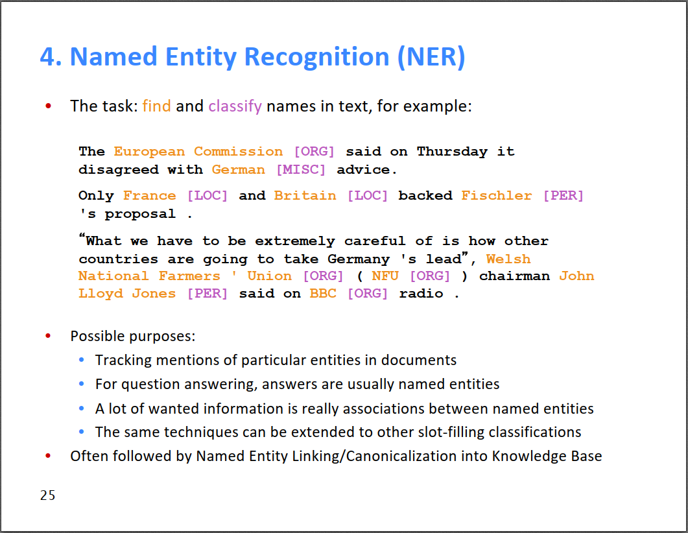
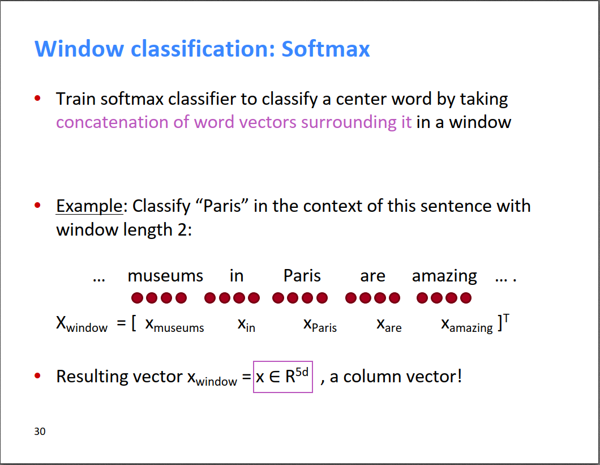
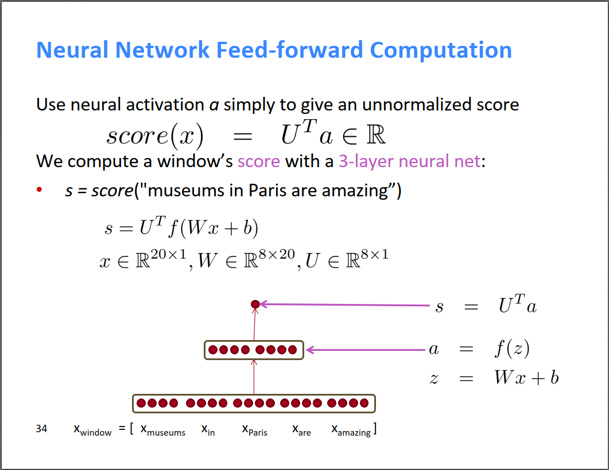

我们知道词向量其实是NLP实际任务中的副产品，任何一个NLP任务都可以得到词向量。这就存在一个问题，当我们在实现一个具体的NLP任务时，是使用预训练的词向量，还是根据实际任务现场训练一个词向量呢？建议是，如果有可用的预训练词向量，则最好使用预训练词向量。因为预训练的词向量通常在很大规模的数据集上进行过训练，词向量的质量还不错，而某个具体的NLP任务的样本数可能不太多，导致训练得到的词向量还没人家预训练的好。所以，如果实际任务的数据量较小，则用预训练的词向量；否则，可以尝试一下根据实际任务fine tune词向量。

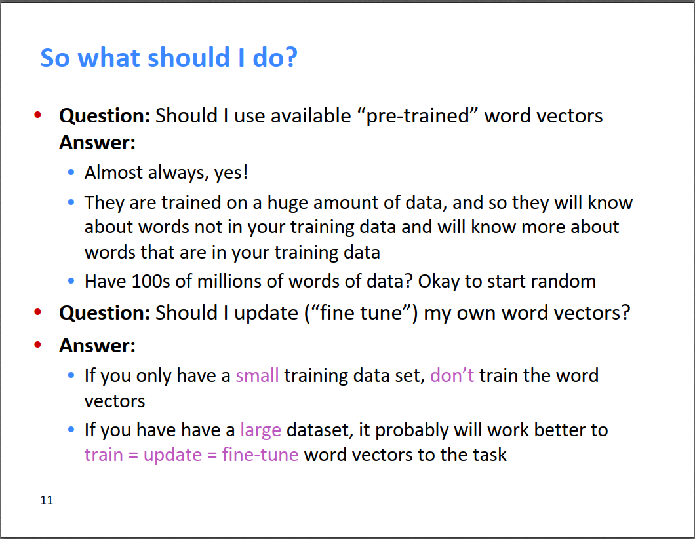

这节课的核心就是不断使用链式法则对BP算法求导，然后反向传播。在反向传播的过程中，可以利用上游计算好的梯度，增量式的更新下游的梯度，如下图所示，就是公式[downstream gradient] = [upstream gradient] × [local gradient]。这个在之前[介绍BP网络](https://bitjoy.net/posts/2018-12-14-neutral-networks-and-deep-learning-2-bp/)的时候也提到过，其实就是那篇博客的(BP2)公式，误差对\(w\)的偏导可以通过误差对\(b\)的偏导乘以神经元输出得到。

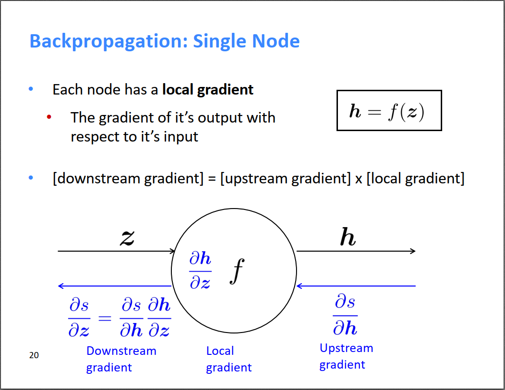

当有多个输入的时候，也是一样，只不过local gradients变为了多个分支。

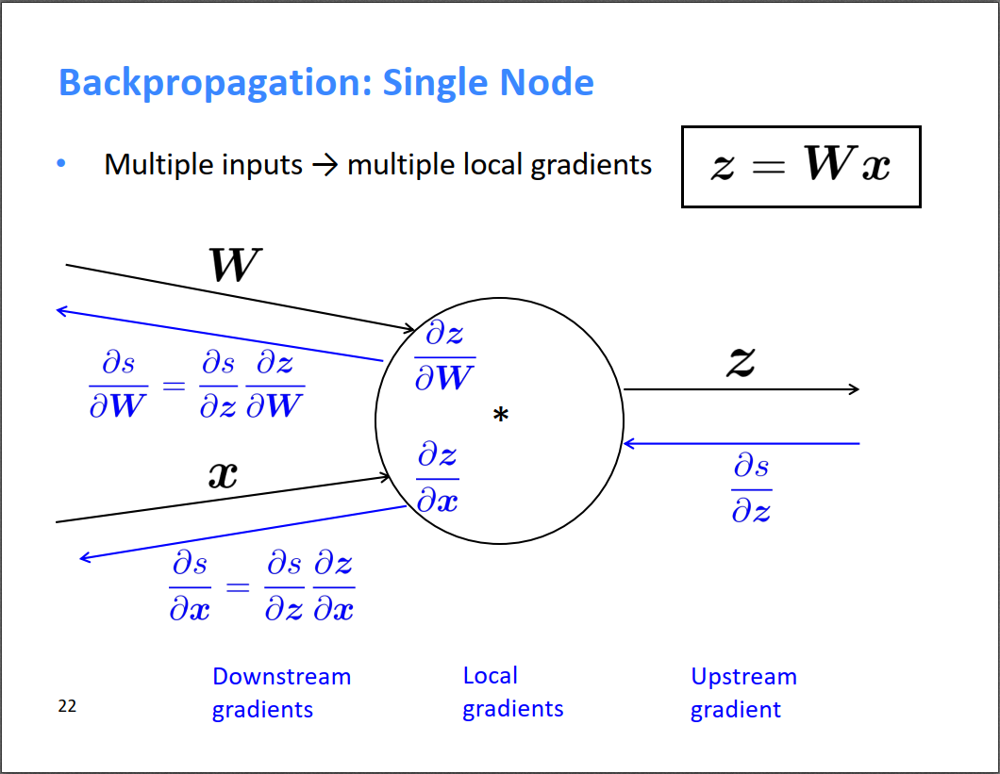

很有意思的是老师总结到：加法相当于把上游的梯度分发给下游；max相当于路由；乘法相当于开关。听老师讲下面的实例会有切身的体会。

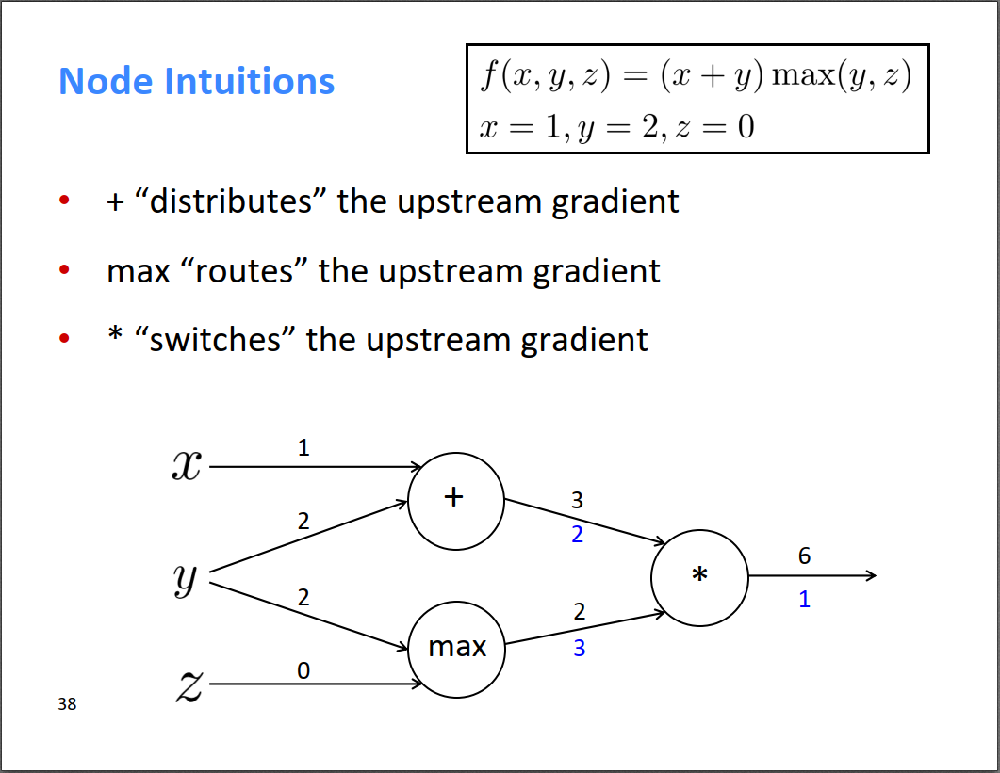

当然，现在的流行的神经网络框架都帮我们完成了自动求导，我们只需要把local gradient定义好，框架会自动帮我们进行反向传播。需要定义的就两点，一个是正向经过该神经元，output=forward(intput)；另一个是反向经过该神经元时，input_gradient=backward(output_gradient)。下面第二个图是一个很简单的例子，定义了forward和backward两个操作。

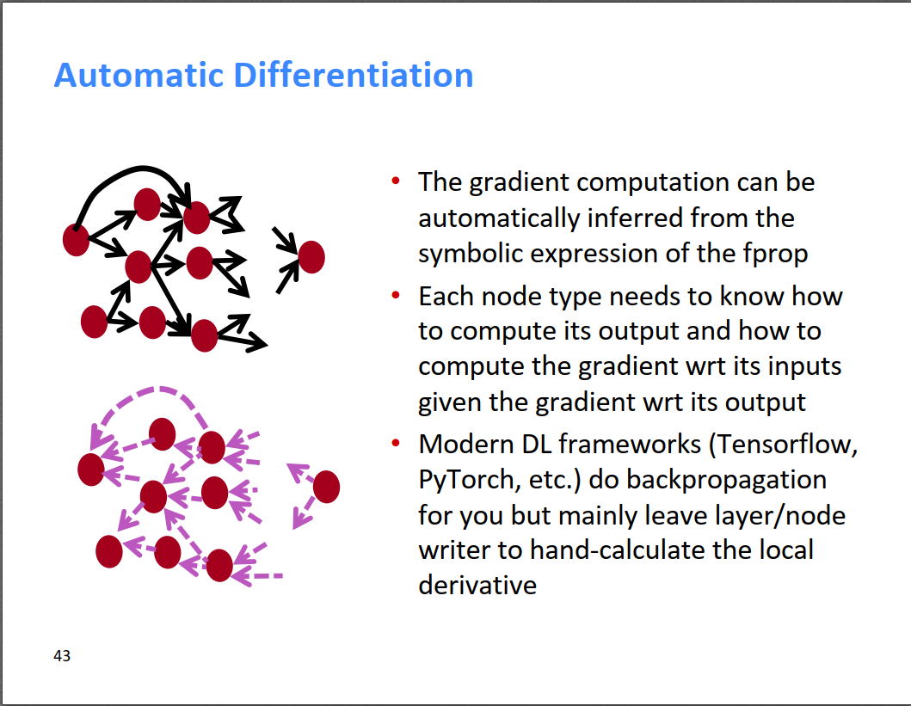  |  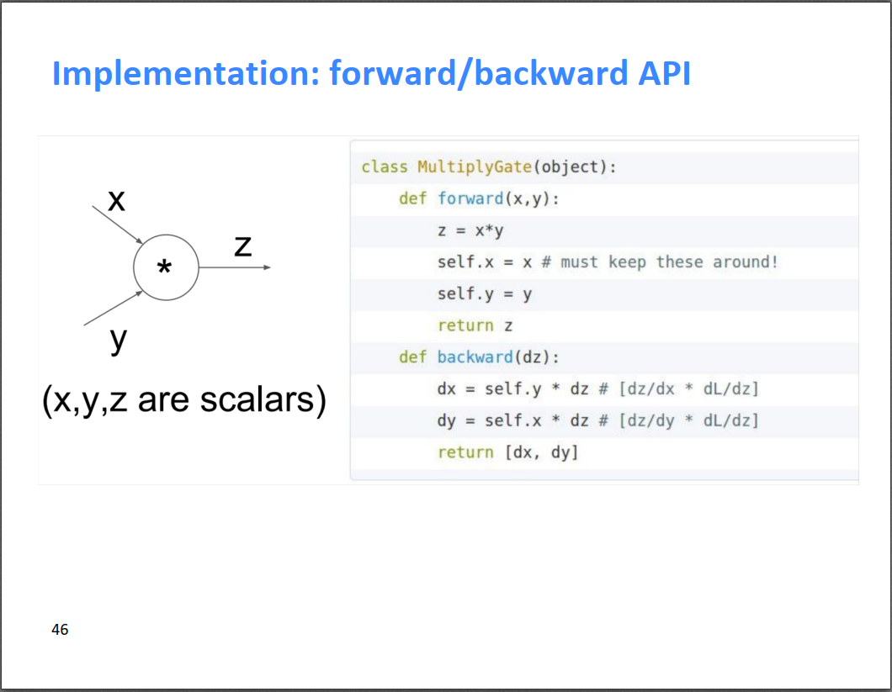
:-------------------------:|:-------------------------:

最后，简要介绍了6个注意事项：

* 使用正则化避免过拟合
* 使用python的向量和矩阵运行，而不是for循环，前者相比于后者有~10x加速
* 目前流行的非线性激活函数是ReLU，Sigmoid和tanh比较少用了
* 参数（权重）初始化，初始值最好是随机的很小的值，有一些专门的策略，如Xavier
* sgd优化器效果还不错，不过目前流行的优化器是Adam
* 学习率最好是10的倍数，而且可以成10倍的放大或缩小；一些fancy的优化器会对设定的学习率进行逐步缩减（比如Adam），所以对于这些优化器，一开始的学习率可以设大一点，比如0.1

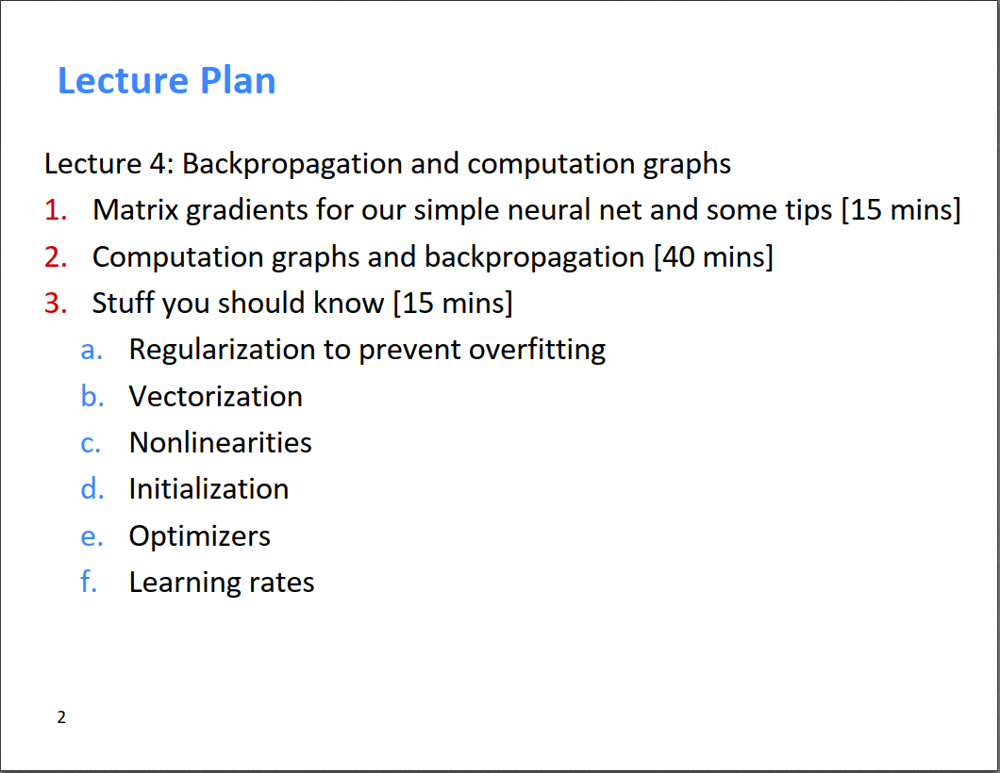

最后是本周作业，包含两部分内容，一部分是手动求导，编辑公式太麻烦了，我就写在了纸上，大家可以参考这位仁兄的[解答](https://github.com/lrs1353281004/CS224n_winter2019_notes_and_assignments/blob/master/homework_my_solution/homework2/written_part.pdf)。另一部分是根据手动推导的梯度公式，补充word2vec算法中的求解梯度的算法以及sgd更新公式，如果是第一次接触这方面内容，可以参考这位仁兄的[实现](https://github.com/lrs1353281004/CS224n_winter2019_notes_and_assignments/tree/master/homework_my_solution/homework2)。

但是，根据上一篇博客的介绍，word2vec除了可以根据作业中的极大似然的方法求解，还可以用3层全连接网络来实现，相比于极大似然更简洁也更容易理解，具体可以参考[这篇博客](https://towardsdatascience.com/implementing-word2vec-in-pytorch-skip-gram-model-e6bae040d2fb)以及[这篇具体实现](https://github.com/Andras7/word2vec-pytorch)。