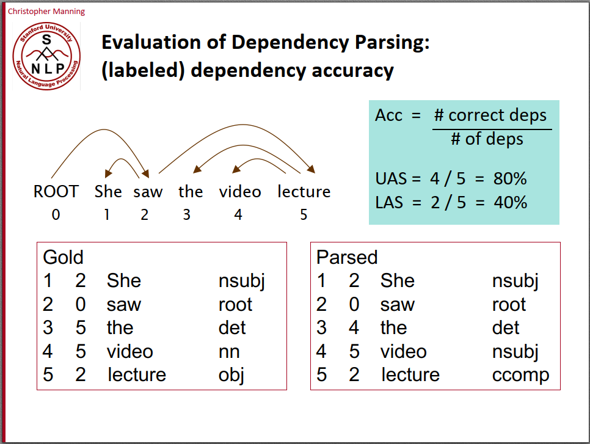
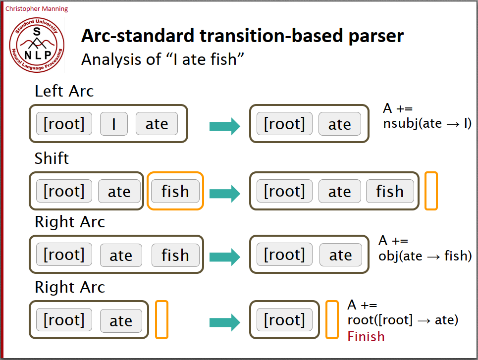
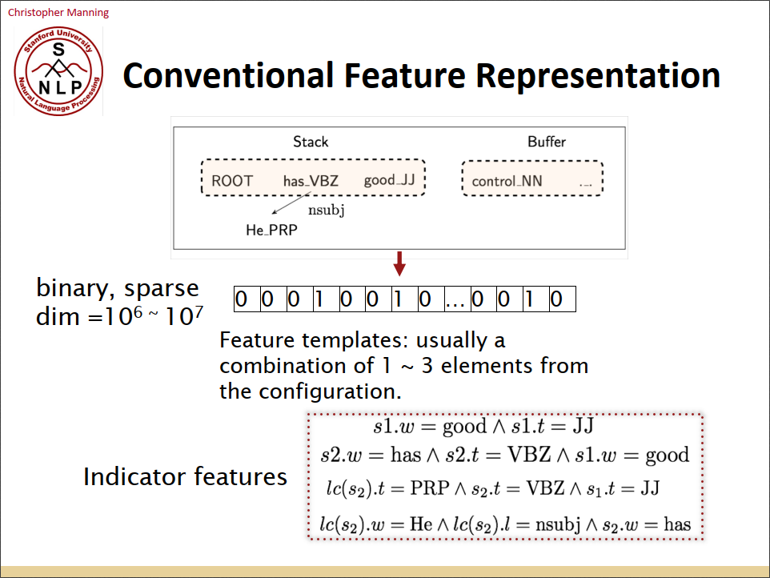
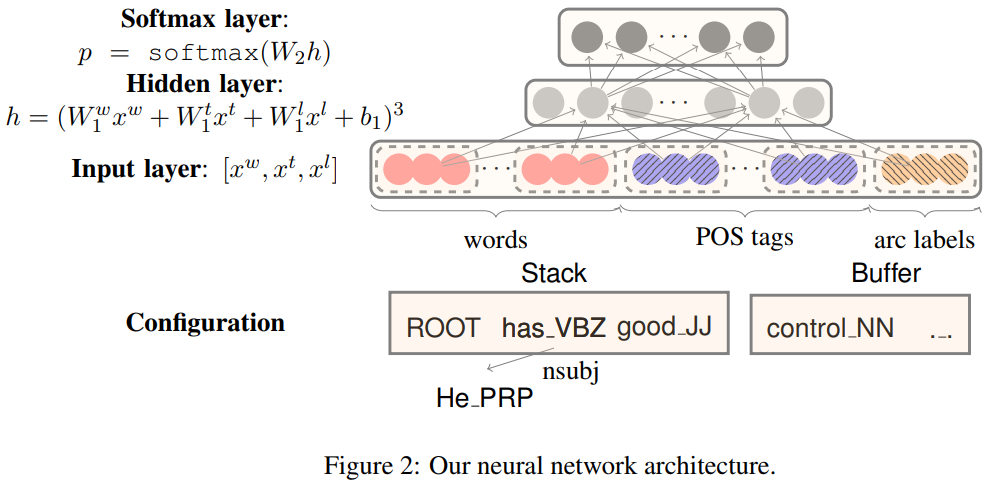

Dependency Parsing是指对句子进行语法分析并画出句子成分的依赖关系，比如对于句子“She saw the video lecture”，首先可以分析出主语、谓语、宾语等句子成分；其次可以分析出依赖关系，比如saw依赖于She等。这就是句法分析。完成句法分析的算法被称为句法分析器parser，一个parser的性能可以用UAS和LAS来衡量，UAS就是parse出来的依赖关系对比正确依赖关系的正确率，LAS就是句子成分分析的正确率。

那么，为什么需要句法分析呢？因为：(i)了解句子结构能更好的理解句子的含义；(ii)人们在交流的时候，通过组合简单的句子成分来表达复杂的含义；(iii)我们需要知道句子中成分之间的依赖关系，以此来正确解读句子的含义。

其实说到底就是为了更正确的理解句子含义。比如对于句子“San Jose cops kill man with knife”这个句子就有歧义，with knife到底是修饰man还是修饰kill，句子的意思大不相同。如果新闻小编学过NLP的话，大概不会写出这种歧义的句子。

句法分析有很多算法，本世纪初当机器学习兴起后，Nivre等人提出了基于转移的句法分析器。该算法维护一个堆栈stack，用来存放已经分析过的词，以及一个buffer，用来存放还未分析的词。初始时，stack只有一个额外添加的[root]节点，buffer保存了完整的句子。然后，对于buffer中的每一个词，有三种操作，分别是：(i)shift，将buffer中的一个词压入stack；(ii)left arc，对于stack中的词，如果栈的第二个元素是栈顶元素的依赖项，则把第二个元素出栈；(iii)right arc，对于stack中的词，如果栈顶元素是栈的第二个元素的依赖项，则把栈顶元素出栈。如此循环，直到buffer为空以及stack中只剩下[root]。

对于上述算法，核心问题是，对于stack+buffer的不同状态，应该选择shift、left arc和right arc中的哪个操作呢？对于本世纪初的研究者来说，他们选择了机器学习方法。很简单嘛，每一个stack+buffer的状态相当于输入，3种操作相当于输出，把这个问题建模成分类问题不就行了吗。于是Nivre等人对每一个stack+buffer的状态，人工抽取出很多的特征，然后使用logistic或者svm进行分类。但是，当时的特征设计都是0/1状态的，特征向量很稀疏；特征又多，抽取特征很花时间。

当神经网络火了之后，人们自然想到了用神经网络替代logistic或svm，提出了新的句法分析器，该课程老师所在团队就是这么干的。他们对于每一个stack+buffer的状态，抽取出words、POS tags和arc labels三种不同类型的特征，都用词向量来表示。然后输入只有一个隐层的全连接网络，效果立马超过了之前所有人工设计的特征和方法。基于这个工作，后续又有很多改进版本。

[https://nlp.stanford.edu/pubs/emnlp2014-depparser.pdf](https://nlp.stanford.edu/pubs/emnlp2014-depparser.pdf)

好了，上述就是这节课的主要内容，由于本人对句法分析不太感兴趣，没有亲自做作业，大家可以参考别人的[解答](https://github.com/lrs1353281004/CS224n_winter2019_notes_and_assignments/tree/master/homework_my_solution/homework3)。