今天要介绍一个新的NLP任务——语言模型（Language Modeling, LM），以及用来训练语言模型的一类新的神经网络——循环神经网络（Recurrent Neural Networks, RNNs）。

语言模型就是预测一个句子中下一个词的概率分布。如下图所示，假设给定一个句子前缀是the students opened their，语言模型预测这个句子片段下一个词是books、laptops、exams、minds或者其他任意一个词的概率。形式化表示就是计算概率

$$\begin{eqnarray}P(x^{(t+1)}|x^{(t)},…,x^{(1)})\tag{1}\end{eqnarray}$$

\(x^{(t+1)}\)表示第\(t+1\)个位置（时刻）的词是\(x\)，\(x\)可以是词典\(V\)中的任意一个词。

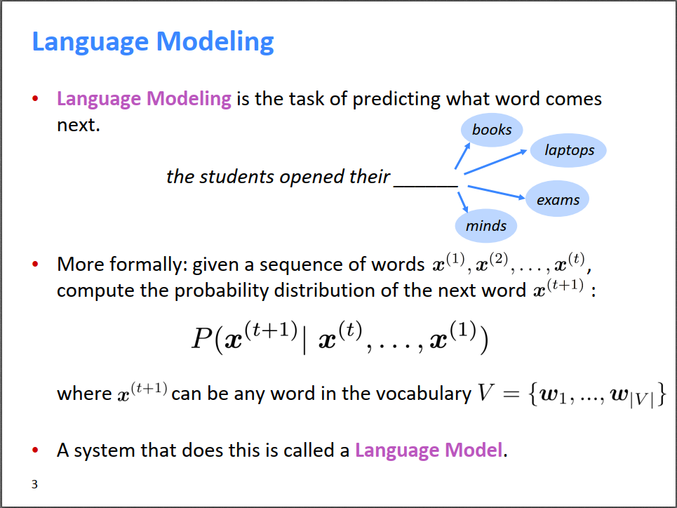

既然语言模型在给定前t个词之后可以预测第t+1个词的概率，那么预测到第t+1个词之后，又可以递归的根据前t+1个词预测第t+2个词，如此不断的进行下去，就可以预测一整个句子的概率了。所以，也可以把语言模型看做一个可以计算一个句子出现的概率的系统，形式化表示就是如果一个句子是\(x^{(1)},…,x^{(T)}\) ，那么语言模型可以计算句子概率

$$\begin{eqnarray}P(x^{(1)},…,x^{(T)})& = & P(x^{(1)})\times P(x^{(2)}|x^{(1)})\times…\times P(x^{(T)}|x^{(T-1)},…,x^{(1)}) \tag{2}\\& = & \prod_{t=1}^T P(x^{(t)}|x^{(t-1)},…,x^{(1)})\tag{3}\end{eqnarray}$$

可以看到(3)式连乘的项就是(1)式，所以这两个定义的内涵是一样的。

那么语言模型有什么用呢？它的用处可大了，比如现在的输入法会根据前一个输入的词预测下一个将要输入的词，此所谓智能输入法；比如在百度或谷歌搜索时，输入前几个关键词，搜索引擎会自动预测接下来可能的几个词；比如网上有很多智能AI会自动生成新闻、诗歌；还比如用在语音识别、机器翻译、问答系统等等。可以说语言模型是很多NLP任务的基础模块，具有非常重要的作用。

在前-深度学习时代，人们使用n-gram方法来学习语言模型。对于一个句子，n-gram表示句子中连续的n个词，比如还是上图的例子，n-gram对于n=1,2,3,4的结果是：

* 1-grams (unigrams): “the”, “students”, “opened”, “their”
* 2-grams (bigrams): “the students”, “students opened”, “opened their”
* 3-grams (trigrams): “the students opened”, “students opened their”
* 4-grams: “the students opened their”

n-gram方法有一个前提假设，即假设每个词出现的概率只和前n-1个词有关，比如2-gram对于每个词出现的概率只和前面一个词有关，和更前面的词以及后面的词都没有关系，所以我们有如下图的assumption。又这是一个条件概率，展开之后得到如下除法的形式。n-gram的计算方法就是，统计语料库中出现\(x^{(t)},…,x^{(t-n+2)}\)的次数（分母），以及在这个基础上再接一个词\(x^{(t+1)}\)的次数\(x^{(t+1)},x^{(t)},…,x^{(t-n+2)}\)（分子），用后者除以前者来近视这个条件概率。

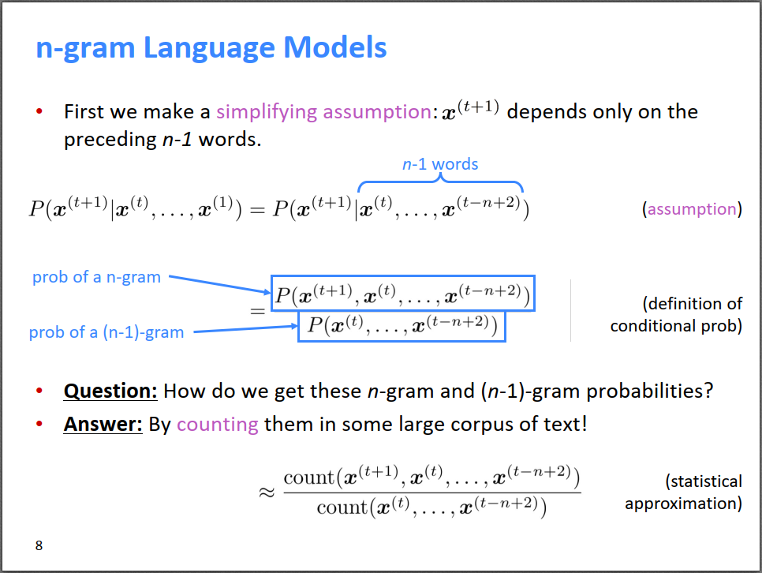

举个例子，假设完整的句子是as the proctor started the clock, the students opened their，需要预测下一个词的概率分布。对于4-gram方法，则只有students opened their对下一个词有影响，前面的词都没有影响。然后我们统计训练集语料库中发现，分母students opened their出现1000次，其后接books即students opened their books出现了400次，所以P(books|students opened their)=400/1000=0.4。类似的，可以算出下一个词为exams的概率是0.1。所以4-gram方法认为下一个词是books的概率更大。

需要提醒的是，n-gram方法在统计语料库中的n-gram时，对词的顺序是有要求的，即必须要和给定的n-gram的顺序一样才能对频数加1，比如这个例子中只有出现和students opened their顺序一样才行，如果是their students opened则不行。这很好理解，词的顺序不一样，含义都变了，肯定不行。

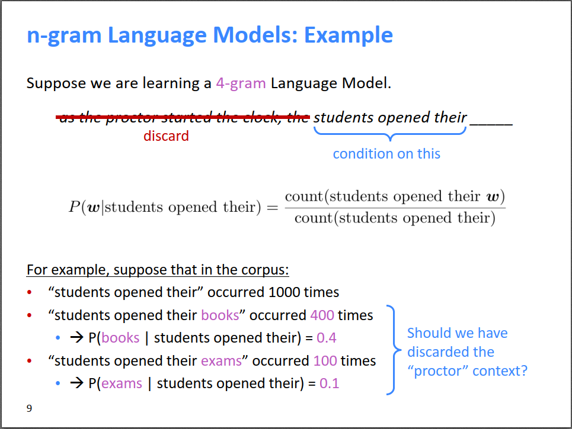

n-gram方法虽然能够work，比如对于上面的例子，预测出books和exams看起来和前面几个词搭配得很好；但是，它有不少的问题，还是上面的例子，其实考虑更前面的词proctor以及clock的话，这很明显是考试场景，后面出现exams的概率应该比books更高才对。

具体来说，n-gram方法有以下不足：

1. 考虑的状态有限。n-gram只能看到前n-1个词，无法建模长距离依赖关系，上面就是一个很好的例子。
2. 稀疏性问题。对于一个稀有的（不常见的）w，如果他的词组没有在语料库中出现，则分子为0，但w很有可能是正确的，概率至少不能是0啊。比如students opened their petri dishes，对于学生物的学生来说是有可能的，但如果students opened their petri dishes没有在语料库中出现的话，petri dishes的概率就被预测为0了，这是不合理的。当然这个问题可以通过对词典中所有可能的词组频率+1平滑来部分解决。
3. 更严重的稀疏性问题是，如果分母的词组频率在语料库中是0，那么所有w对应的分子的词组频率就更是0了，根本就没法计算概率。这种情况只能使用back-off策略，即如果4-gram太过于稀疏了，则降到3-gram，分母只统计opened their的频率。一般的，虽然n-gram中的n越大，语言模型预测越准确，但其稀疏性越严重，这是肯定的啦。n其实就相当于维度，我们知道在空间中，维度越高越稀疏，高维空间非常稀疏。对于n-gram，一般取n<=5。
4. 存储问题，需要存储所有n-gram的频率，如果n越大，这种n-gram的组合越多，所以存储空间呈幂次上升。

下面是一个更直观的3-gram稀疏性问题的例子，由于语料库中统计到的today the company和today the bank的词组频率相同，导致company和bank算出来的概率相等，无法区分。就是因为这两个3-gram在预料中出现都比较少，很稀疏，导致统计数据难以把他们区分开来。

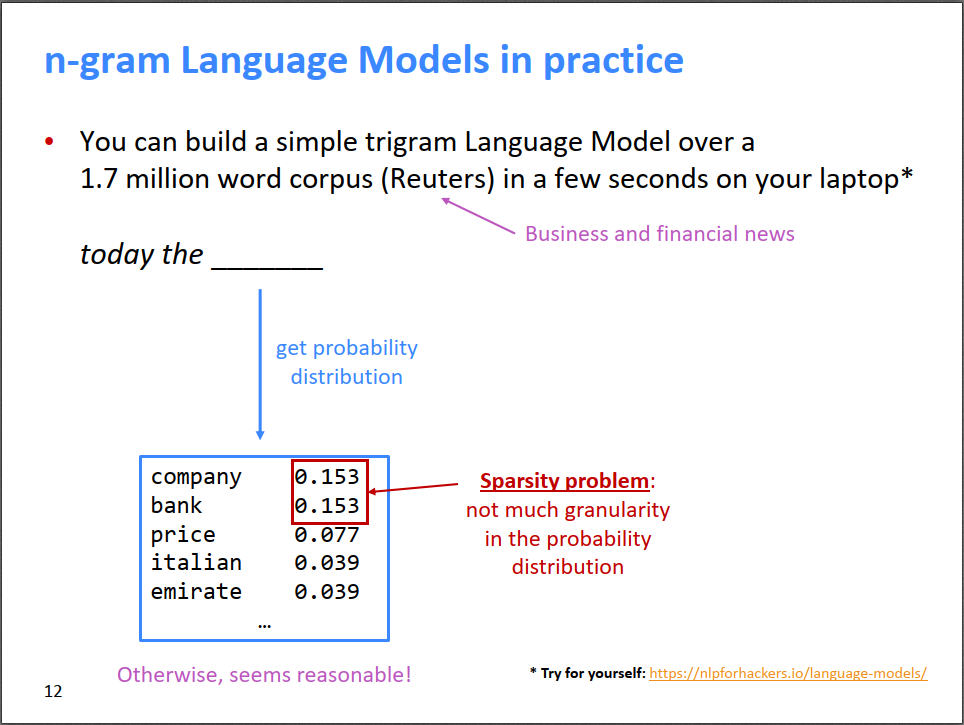

n-gram的方法太过于简单了，只要对语料库进行计数即可，小学生都会做。当神经网络出现之后，人们自然想能否用神经网络来学习语言模型。上一次课我们知道命名实体识别NER的方法是对一个词开一个小窗口，然后利用词向量和全连接网络识别词的类别。仿照这个方法，也可以用基于窗口的方法来学习语言模型。

如下图所示，假设固定窗口大小是4，则只有预测词前4个词对待预测词有影响，即the students opened their；然后我们把四个词的词向量拼接起来，得到长向量\(e\)，作为神经网络的输入；然后接一个隐藏层；最后是一个softmax层输出。输出层的维度\(\hat y\in R^{|V|}\)，即预测了词典\(V\)中所有词的概率分布，概率越大则该位置出现这个词的可能性越高。

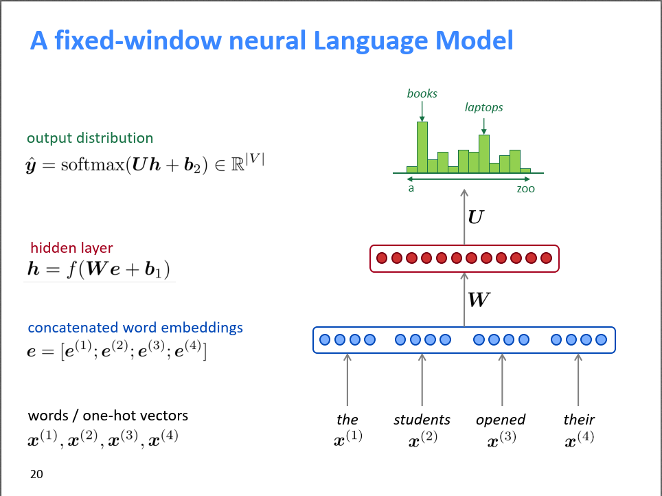

固定窗口的神经语言模型相比于n-gram，优点是：

1. 不存在稀疏性问题。因为它不要求语料库中出现n-gram的词组，它仅仅是把每个独立的单词的词向量组合起来。只要有词向量，就有输入，至少整个模型能顺利跑通。
2. 节省存储空间，不需要存储n-gram的组合，只需要存储每个独立的词的词向量。没有组合爆炸的问题。

依然存在的问题是：

1. 固定窗口大小还是太小了，受限于窗口大小，不能感知远距离的关系。
2. 增大窗口大小，权重矩阵\(W\)也要相应的增大，导致网络变得复杂。事实上，窗口大小不可能足够大。
3. 输入\(e^{(1)},…,e^{(4)}\)对应W中的不同列，即每个\(e\)对应的权重完全是独立的，没有某种共享关系，导致训练效率比较低。这一点还不太理解，可能要和RNN对比之后才知道。

这些问题主要跟窗口大小是固定的有关，为了解决这些问题，我们需要一个对窗口大小没有限制的神经网络。

RNN横空出世，它的结构如下图所示。RNN没有所谓窗口的概念，它的输入可以是任意长度，特别适合对顺序敏感的序列问题进行建模。还是以本文的语言模型the students opened their为例，介绍一下RNN的内部结构。对于\(t\)时刻（位置）的输入词\(x^{(t)}\)来说，首先把它转换为词向量\(e^{(t)}\)，作为RNN真正的输入；然后对于隐藏层，它的输入来自两部分，一部分是\(t\)时刻的输入的变换\(W_ee^{(t)}\)，另一部分是上一刻的隐状态的变换\(W_hh^{(t-1)}\)，这两部分组合起来再做一个非线性变换，得到当前层的隐状态\(h^{(t)}\)；最后，隐状态再接一个softmax层，得到该时刻的输出概率分布\(\hat y^{(t)}\)。

需要注意的是：

* 每一个时刻\(t\)都可以有输出，下图仅展示了最后时刻\(t=4\)时的输出
* \(h^{(0)}\)是初始隐状态，可以是根据之前的学习经验设置的，也可以是随机值，也可以是全0
* 整个网络中，所有时刻的\(W_e, W_h, U, b_1, b_2\)都是同一个参数，即不同时刻的权重是共享的，唯二不同的是不同时刻的输入\(x^{(t)}\)和隐状态\(h^{(t)}\)
* 这里的词向量\(e\)可以是pre-trained得到的，然后固定不动了；也可以根据实际任务进行fine-tune；甚至可以完全随机，在实际任务中现场学习。就像上次课讲的，最好还是用pre-trained的词向量，如果数据量很大的话，再考虑fine-tune

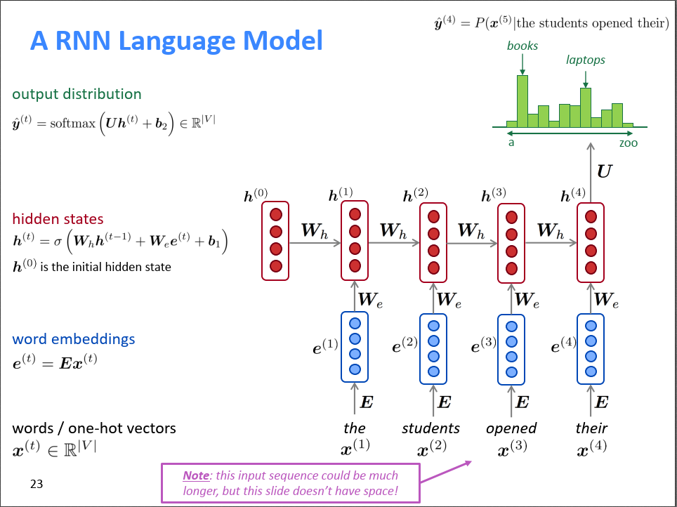

RNN相比于固定窗口的神经网络，其优势是：

1. 不受输入长度限制，可以处理任意长度的序列
2. 状态\(t\)可以感知很久以前的状态，比如前面的例子，可以感知proctor和clock（只是上图限于空间没有画出来）
3. 模型大小是固定的，因为不同时刻的参数\(W_e, W_h, U, b_1, b_2\)都是共享的，不受输入长度的影响
4. 所有参数\(W_e, W_h, U, b_1, b_2\)是共享的，训练起来更高效

存在的不足：

1. 训练起来很慢，因为后续状态需要用到前面的状态，是串行的，难以并行计算
2. 虽然理论上t时刻可以感知很久以前的状态，但实际上很难，因为梯度消失的问题

训练RNN依然是梯度下降。首先我们需要定义损失函数，RNN在\(t\)时刻的输出是预测第\(t+1\)个词的概率分布\(\hat y^{(t)}\)；而对于训练集中给定的文本来说，第\(t+1\)个词是已知的某个词，所以真实答案\(y^{(t)}\)其实是一个one-hot向量，在第\(x^{(t+1)}\)位置为1，其他位置为0。所以如果是交叉熵损失函数的话，表达式如下图中间的等式。RNN整体的损失就是所有时刻的损失均值。

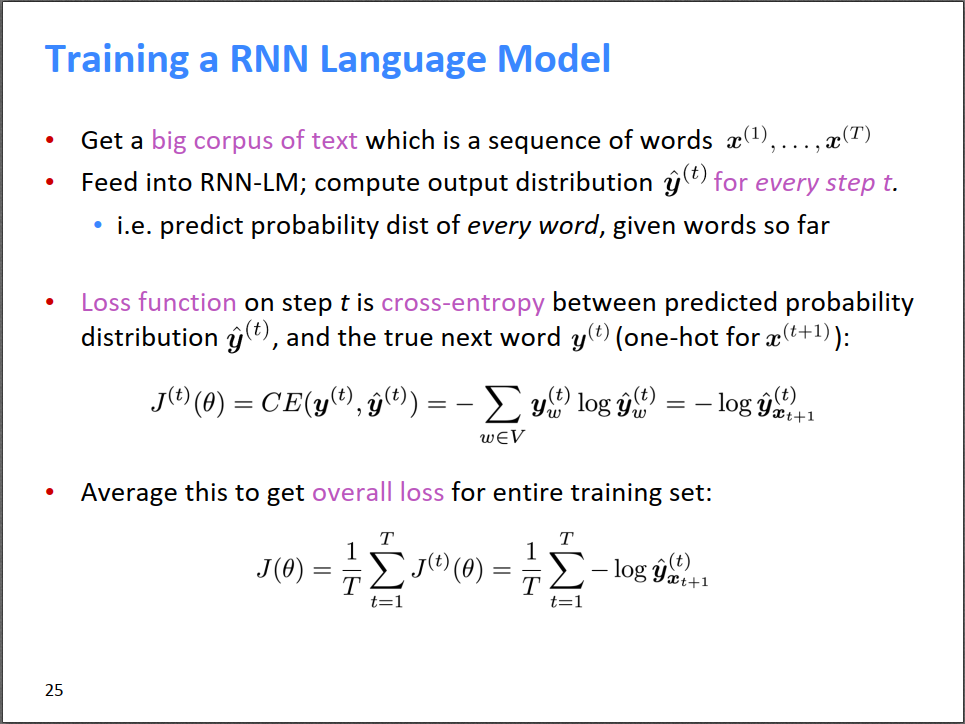

因为完整的语料库通常是非常大，比如上百万篇文章，这么长的输入，训练起来就很费劲，所以输入RNN的往往是以句子或者单篇文档为单位，然后使用SGD，小batch进行批量训练。

---

接下来介绍RNN中的BP算法，由于课上的内容没有细节，本博客参考网上的资料整理如下。

RNN中的BP算法本质上和之前介绍过的[全连接中的BP算法](https://bitjoy.net/posts/2018-12-14-neutral-networks-and-deep-learning-2-bp/)是一样的，只不过因为RNN和时间有关，而且每个时间点的权重是共享的，导致RNN中的BP算法稍显复杂，而且名称也不太一样，叫做backpropagation through time, BPTT。为了和网上资料的符号一致，这一小节没有采用PPT上的符号，而是使用了LeCun等人的Nature文章里面的图，更加简洁。

RNN的网络结构如下图所示，左边是未展开的形式，可以看到整个网络看起来就三个参数\(U, W, V\)，右边是根据时间展开的网络图，所有时刻的权重矩阵\(U, W, V\)是一样的。进一步，为了便于理解，把输出的符号由\(o\)改为\(y\)。

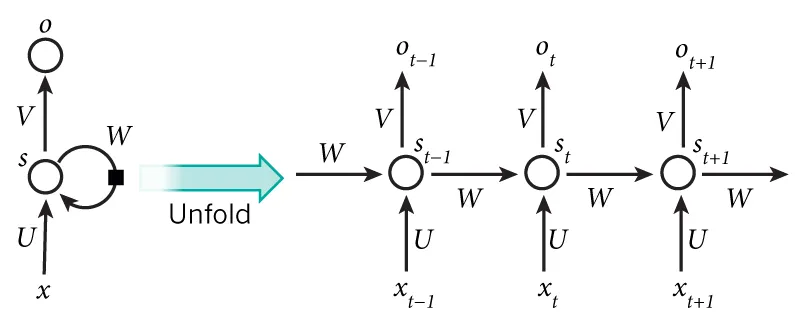
https://www.nature.com/articles/nature14539

RNN的前向传播公式如下，可以看到非常简单漂亮。其中(4)式的激活函数\(\sigma\)可以是tanh或者ReLU之类的。

$$\begin{eqnarray}s_t=\sigma (Ux_t+Ws_{t-1})\tag{4}\end{eqnarray}$$

$$\begin{eqnarray}\hat y_t=softmax(Vs_t)\tag{5}\end{eqnarray}$$

RNN某一时刻\(t\)的交叉熵损失函数为：

$$\begin{eqnarray}E_t(y_t,\hat y_t)=-y_t\log\hat y_t\tag{6}\end{eqnarray}$$

总的交叉熵损失函数为：

$$\begin{eqnarray}E(y,\hat y)\tag{7} & = & \sum_t E_t(y_t,\hat y_t) \\ & = & -\sum_t y_t \log\hat y_t\tag{8}\end{eqnarray}$$

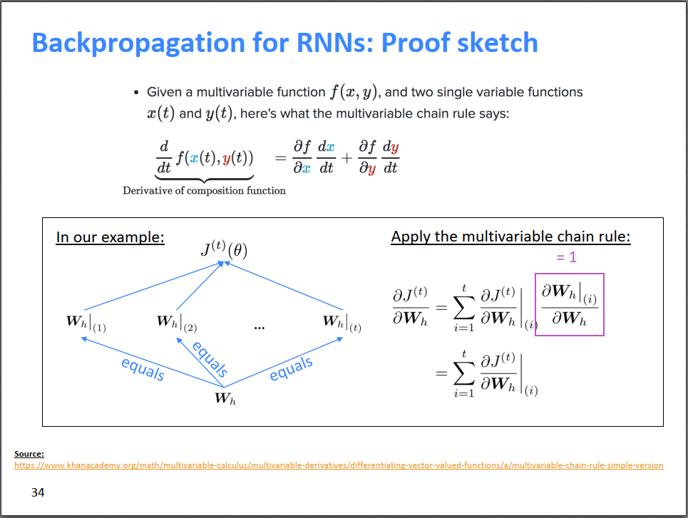
https://www.khanacademy.org/math/multivariable-calculus/multivariable-derivatives/differentiating-vector-valued-functions/a/multivariable-chain-rule-simple-version

根据多元函数的导数的链式法则（上图及链接），总的损失函数对每个参数的偏导等于每个时刻的损失对每个参数的偏导之和，比如有：

$$\begin{eqnarray}\frac{\partial E}{\partial W} = \sum\limits_{t} \frac{\partial E_t}{\partial W}\tag{9}\end{eqnarray}$$

所以接下来，我们以\(t=3\)时刻的损失为例，推导\(E_3\)对参数\(V,W,U\)的偏导。

$$\begin{eqnarray}\frac{\partial E_3}{\partial V}&=&\frac{\partial E_3}{\partial \hat{y}_3}\frac{\partial\hat{y}_3}{\partial V}\tag{10}\\&=&\frac{\partial E_3}{\partial \hat{y}_3}\frac{\partial\hat{y}_3}{\partial z_3}\frac{\partial z_3}{\partial V}\tag{11}\\&=&-y_3\cdot\frac{1}{\hat y_3}\cdot\hat y_3\cdot(1-\hat y_3)\otimes s_3\tag{12}\\&=&y_3(\hat y_3-1) \otimes s_3\tag{13} \end{eqnarray}$$

其中(11)中的\(z_3=Vs_3\)，根据推导结果可知，\(t\)时刻的损失对\(V\)的偏导只和\(t\)时刻的状态有关，算起来比较简单。但是\(t\)时刻的损失对\(W,U\)的偏导可就不一样了，先来看\(W\)：

$$\begin{eqnarray}\frac{\partial E_3}{\partial W} &= \frac{\partial E_3}{\partial \hat{y}_3}\frac{\partial\hat{y}_3}{\partial s_3}\frac{\partial s_3}{\partial W}\tag{14}\end{eqnarray}$$

上式\(s_3=\sigma(Ux_3+Ws_2)\)，因为\(s_2\)根据公式(4)又进一步依赖于\(s_1,s_0\)，而\(s_2,s_1,s_0\)都包含\(W\)项，所以不能简单将\(s_2\)看成常数。根据上图的多元函数的导数的链式法则，有：

$$\begin{eqnarray} \frac{\partial E_3}{\partial W} &= \sum\limits_{k=0}^{3} \frac{\partial E_3}{\partial \hat{y}_3}\frac{\partial\hat{y}_3}{\partial s_3}\frac{\partial s_3}{\partial s_k}\frac{\partial s_k}{\partial W}\tag{15} \end{eqnarray}$$

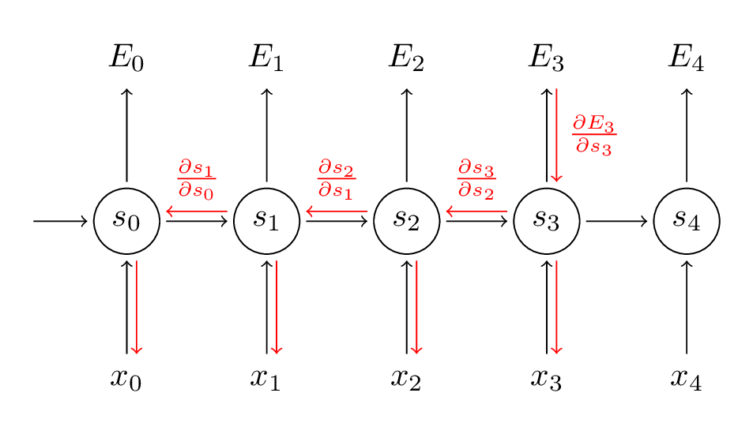

而公式(15)中的\(\frac{\partial s_3}{\partial s_k}\)本身又可以根据链式法则展开为\(\frac{\partial s_3}{\partial s_1} =\frac{\partial s_3}{\partial s_2}\frac{\partial s_2}{\partial s_1}\)，所以偏导数就变成了：

$$\begin{eqnarray} \frac{\partial E_3}{\partial W} &= \sum\limits_{k=0}^{3} \frac{\partial E_3}{\partial \hat{y}_3}\frac{\partial\hat{y}_3}{\partial s_3} \left(\prod\limits_{j=k+1}^{3} \frac{\partial s_j}{\partial s_{j-1}}\right) \frac{\partial s_k}{\partial W}\tag{16} \end{eqnarray}$$

进一步根据公式(4)有：

$$\begin{eqnarray} \frac{\partial E_3}{\partial W} &= \sum\limits_{k=0}^{3} \frac{\partial E_3}{\partial \hat{y}_3}\frac{\partial\hat{y}_3}{\partial s_3} \left(\prod\limits_{j=k+1}^{3}W^Tdiag[\sigma'(s_{j-1})]\right) \frac{\partial s_k}{\partial W}\tag{17} \end{eqnarray}$$

如果考虑总的损失\(E\)对\(W\)的偏导，则更复杂：

$$\begin{eqnarray} \frac{\partial E}{\partial W} &= \sum\limits_{t=0}^T\sum\limits_{k=0}^{t} \frac{\partial E_t}{\partial \hat{y}_t}\frac{\partial\hat{y}_t}{\partial s_t} \left(\prod\limits_{j=k+1}^{t}W^Tdiag[\sigma'(s_{j-1})]\right) \frac{\partial s_k}{\partial W}\tag{18} \end{eqnarray}$$

类似的，有：

$$\begin{eqnarray} \frac{\partial E}{\partial U} &= \sum\limits_{t=0}^T\sum\limits_{k=0}^{t} \frac{\partial E_t}{\partial \hat{y}_t}\frac{\partial\hat{y}_t}{\partial s_t} \left(\prod\limits_{j=k+1}^{t}W^Tdiag[\sigma'(s_{j-1})]\right) \frac{\partial s_k}{\partial U}\tag{19} \end{eqnarray}$$

如果定义\(\gamma=||W^T||\)，则在公式(18)和(19)中的括号里面包含有\(\gamma^{t-k}\)。[这篇论文](http://proceedings.mlr.press/v28/pascanu13.pdf)证明了，如果\(W^T\)的最大特征值小于1，则公式(18)和(19)的左边将以指数形式下降，造成梯度消失问题；类似的，如果\(W^T\)的最大特征值大于1，则公式(18)和(19)的左边将以指数形式上升，造成梯度爆炸问题。其实如果把\(W^T\)看作一个标量，如果这个标量小于1，则它的指数次方肯定就非常小了，导致左边出现梯度消失；类似的，如果这个标量大于1，则它的指数次方就非常大，导致左边梯度爆炸。

因此，虽然RNN理论上能建立长距离依赖关系，但由于梯度爆炸或梯度消失问题，实际上学到的还是短期的依赖关系。梯度爆炸还好办一些，会出现超过最大值导致NaN系统崩溃问题，梯度消失问题就难以被发现和处理了，下一课介绍的LSTM和GRU能比较好的解决梯度消失问题。

参考资料：

* [Recurrent Neural Networks Tutorial, Part 3 – Backpropagation Through Time and Vanishing Gradients](http://www.wildml.com/2015/10/recurrent-neural-networks-tutorial-part-3-backpropagation-through-time-and-vanishing-gradients/)
* [循环神经网络RNN 梯度推导(BPTT)](https://ilewseu.github.io/2017/12/30/RNN%E7%AE%80%E5%8D%95%E6%8E%A8%E5%AF%BC/)
* [Multivariable chain rule, simple version](https://www.khanacademy.org/math/multivariable-calculus/multivariable-derivatives/differentiating-vector-valued-functions/a/multivariable-chain-rule-simple-version)

---

使用RNN进行文本生成，如下图所示。注意上一步的输出正好是下一步的输入，这样语义才连贯！

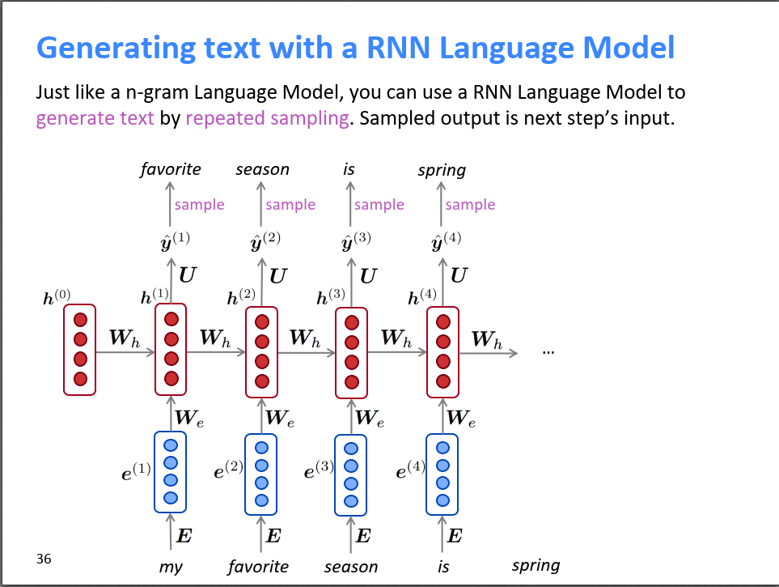

最后，语言模型的评价指标是perplexity——困惑度，其计算公式如下。由图可知，困惑度和损失函数是正相关的，损失越低，则困惑度也越小，模型性能越好。

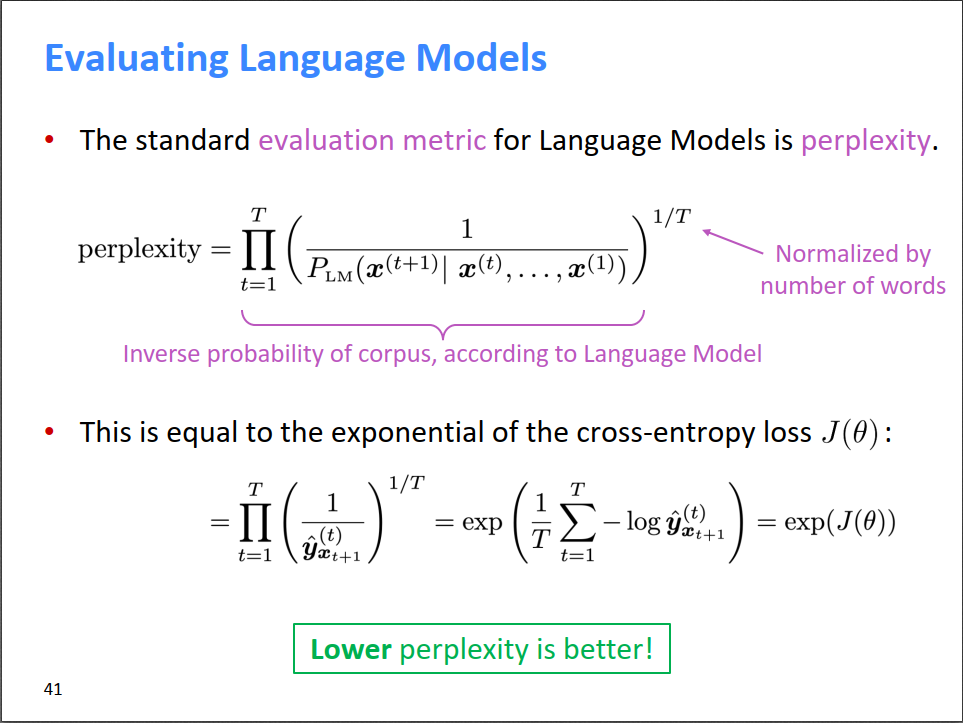

最后皮一下，本节课介绍的RNN是香草味的RNN——就是很普通的RNN，下一节课将介绍更加fancy的RNN，如LSTM和GRU。

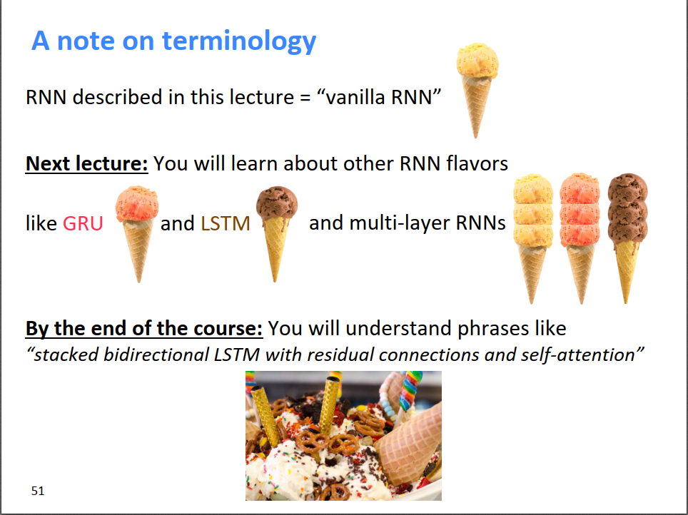