# 梯度消失

今天介绍RNN的梯度消失问题以及为了解决这个问题引出的RNN变种，如LSTM何GRU。

在[上一篇博客](https://bitjoy.net/posts/2019-07-31-cs224n-0124-language-models-and-rnns/)中，通过公式推导，我们已经解释了RNN为什么容易产生梯度消失或梯度爆炸的问题，核心问题就是RNN在不同时间步使用共享参数\(W\)，导致\(t+n\)时刻的损失对\(t\)时刻的参数的偏导数存在\(W\)的指数形式，一旦\(W\)很小或很大就会导致梯度消失或梯度爆炸的问题。下图形象的显示了梯度消失的问题，即梯度不断反传，梯度不断变小（箭头不断变小）。

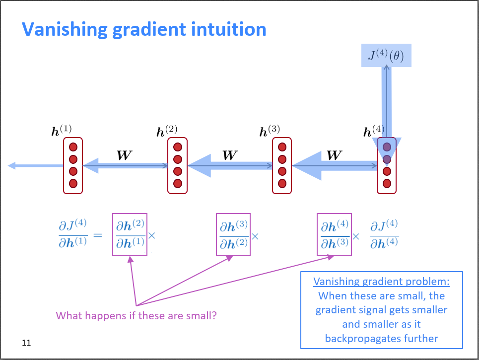

梯度消失会带来哪些问题呢？一个很明显的问题就是参数更新更多的受到临近词的影响，那些和当前时刻\(t\)较远的词对当前的参数更新影响很小。如下图所示，\(h^{(1)}\)对\(J^{(2)}(\theta)\)的影响就比对\(J^{(4)}(\theta)\)的影响大。久而久之，因为梯度消失，我们就不知道\(t\)时刻是真的对\(t+n\)时刻没影响还是因为梯度消失导致我们没学习到这种影响。

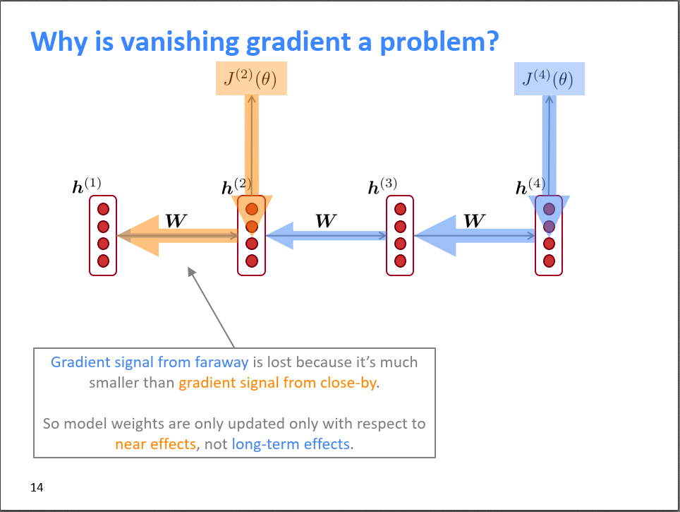

下图是一个更形象的例子，假设我们需要预测句子The writer of the books下一个单词，由于梯度消失，books对下一个词的影响比writer对下一个词的影响更大，导致模型错误的预测成了are，但这显然是不对的。

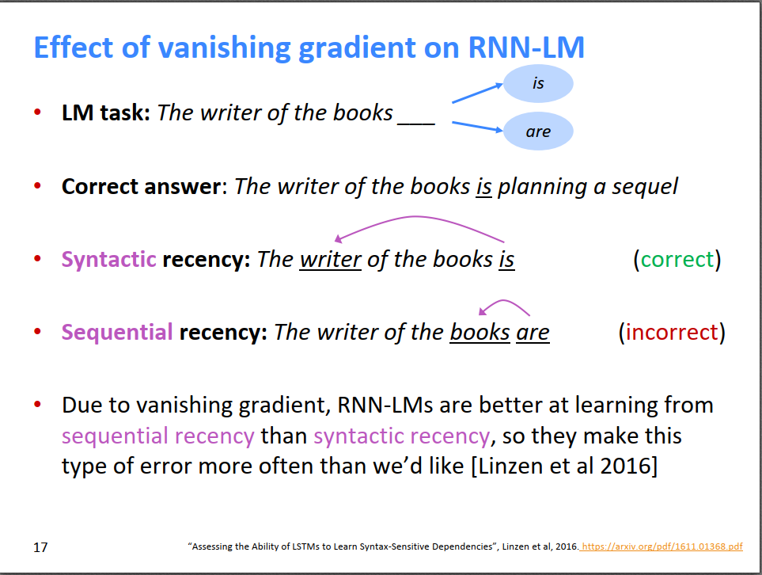

类似的，如果梯度爆炸，则根据梯度下降的更新公式，参数会一瞬间更新非常大，导致网络震荡，甚至出现Inf或NaN的情况。

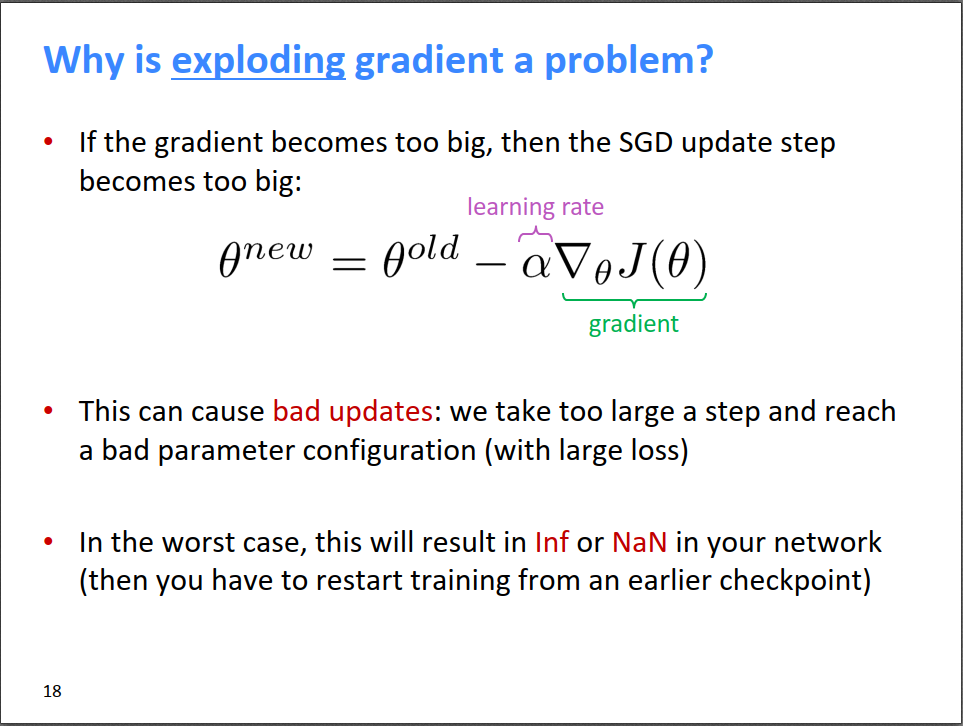

梯度爆炸一个比较好的解决方法是梯度裁剪，即如果发现梯度的范数大于某个阈值，则以一定的比例缩小梯度的范数，但不改变其方向。如下下图所示，左子图是没有梯度裁剪的情况，由于RNN的梯度爆炸问题，导致快接近局部极小值时，梯度很大，参数突然爬上悬崖，然后又飞到右边一个随机的区域，miss掉了中间的局部极小值。右子图是增加了梯度裁剪之后，更新步伐变小，参数稳定在局部极小值附近。

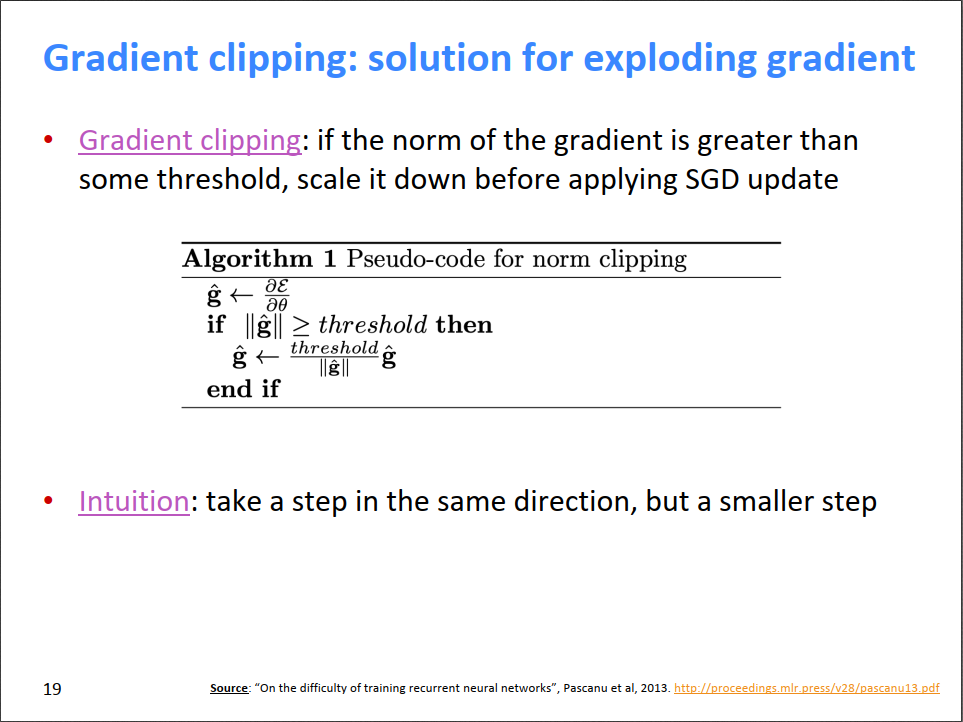  |  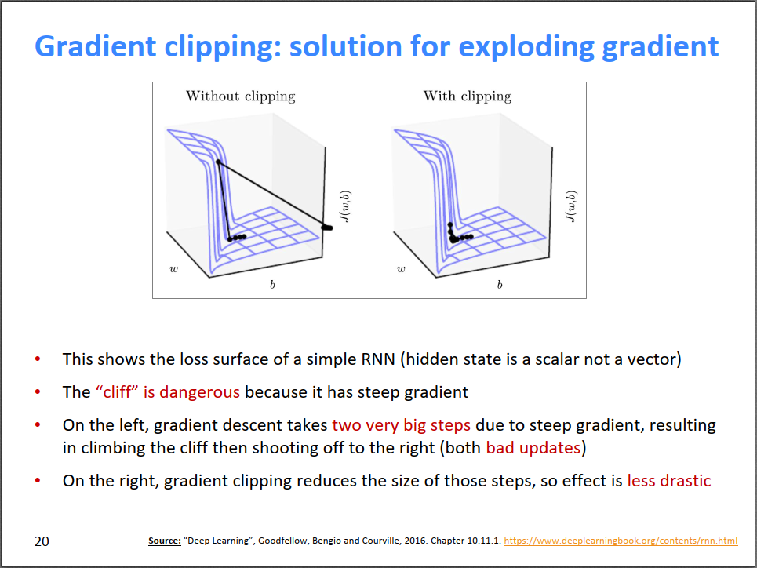
:-------------------------:|:-------------------------:

总的来说，梯度爆炸相对好解决，但梯度消失就没那么简单了。在RNN中，每个时刻\(t\)，都改写了前一个时刻的隐状态，而由于梯度消失问题，长距离以前的状态对当前时刻的影响又很小，所以导致无法建模长距离依赖关系。那么，如果把每个时刻的状态单独保存起来，是否能解决长距离依赖问题呢？

# LSTM

LSTM就是这样一个思路，请大家结合如下两幅图来理解：

* （下图）首先，从宏观上来说，LSTM的隐层神经元不仅包含隐状态\(h_t\)，还专门开辟了一个cell来保存过去的“记忆”\(c_t\)，LSTM希望用\(c_t\)来传递很久以前的信息，以达到长距离依赖的目的。所以LSTM隐层神经元的输入是上一时刻的隐状态\(h_{t-1}\)和记忆\(c_{t-1}\)，输出是当前时刻的隐状态\(h_t\)和希望传递给下一个时刻的记忆\(c_t\)。
* （上图）每个时刻\(t\)，为了调控遗忘哪些记忆，写入哪些新记忆，LSTM设置了两个门，分别是遗忘门\(f^{(t)}\)和写入门\(i^{(t)}\)。它们都是上一时刻的隐状态\(h^{(t-1)}\)和当前时刻的输入\(x^{(t)}\)的函数。\(f^{(t)}\)控制遗忘哪些记忆，即\(f^{(t)}\circ c^{(t-1)}\)；\(i^{(t)}\)控制写入哪些新记忆，即\(i^{(t)}\circ \tilde c^{(t)}\)，其中\(\tilde c^{(t)}\)即为期望写入的新记忆，它也是\(h^{(t-1)}\)和\(x^{(t)}\)的函数。最终，新时刻\(t\)的记忆就是这两部分的组合，请看上图\(c^{(t)}\)表达式。
* （上图）输出门\(o^{(t)}\)控制哪些记忆需要输出到下一个隐状态\(h^{(t)}\)，\(o^{(t)}\)自己又是\(h^{(t-1)}\)和\(x^{(t)}\)的函数。

大家结合上图的公式和下图的示意图就不难理解了。

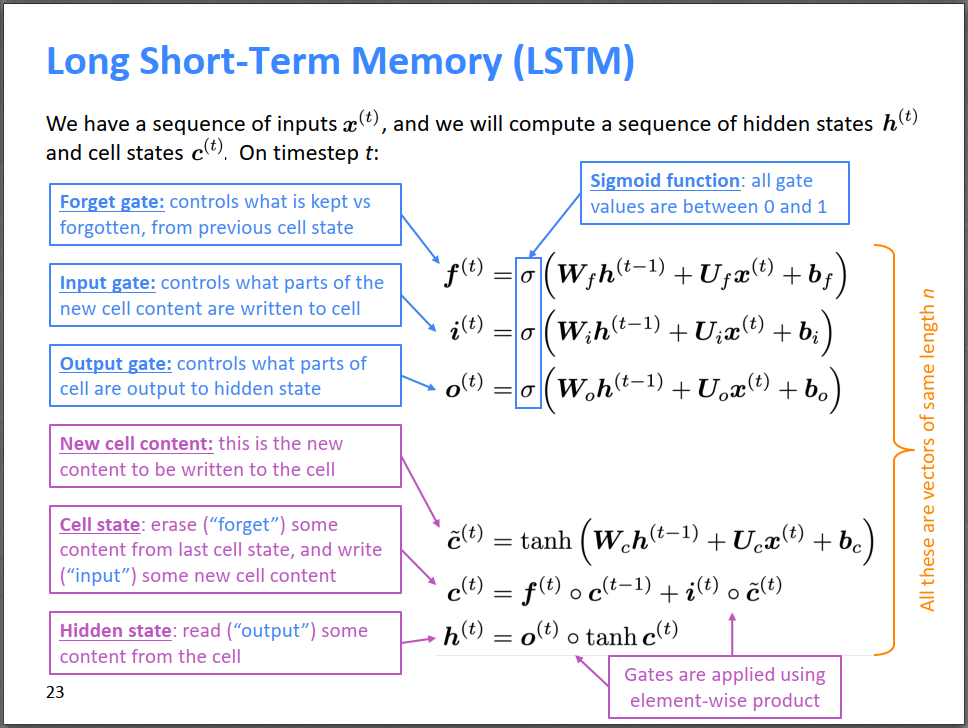  |  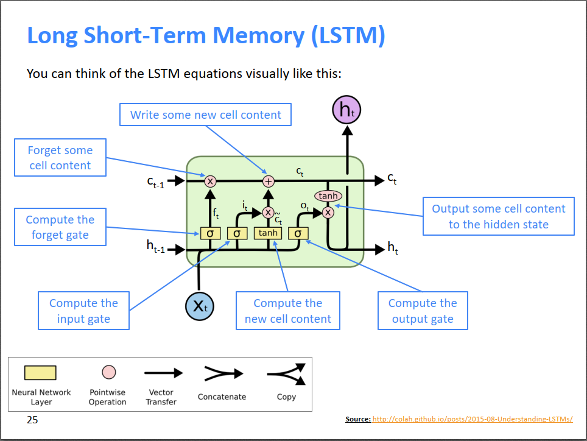
:-------------------------:|:-------------------------:

LSTM解决梯度消失最直接的方法就是，遗忘门选择不遗忘，每一时刻的\(f^{(t)}\)都选择记住前一时刻的记忆\(c^{(t-1)}\)，然后直接传递给下一时刻。那么，所有前\(t-1\)时刻的记忆都会被完整的传递给第\(t\)时刻，从而对\(t\)时刻的输出产生影响。

而朴素RNN无法保存前期状态的原因就是因为朴素RNN把之前时间步的信息都一股脑存储在隐状态\(h^{(t)}\)中了，隐状态\(h^{(t)}\)成为了整个网络的瓶颈，一旦出现梯度消失，则很久以前的信息对当前时刻的影响就微乎其微了。LSTM的关键就是开辟了一个新的cell来存储记忆，这个新的cell相当于记忆的一条捷径，时刻\(t\)除了可以像常规RNN一样通过\(h^{(t-1)}\)来获取很久以前的信息，还可以通过cell存储的记忆\(c^{(t-1)}\)来便捷地获取到很久以前的信息，所以隐状态\(h^{(t)}\)不再成为整个网络的瓶颈，有新的cell来分担。

需要提醒的是，虽然LSTM开辟新的cell来存储记忆，但这个记忆也会受到连续梯度相乘的影响，所以依然存在梯度消失或梯度爆炸的问题，但从实际效果来看，LSTM性能很不错，也很鲁棒。

# GRU

另一种能缓解RNN梯度消失的网络——GRU。为了简化LSTM，GRU又没有cell了，但依然保留了门来控制信息的传递。首先看下图最后一个公式，当前时刻的隐状态\(h^{(t)}\)等于上一时刻的隐状态\(h^{(t-1)}\)和新写入的隐状态\(\tilde h^{(t)}\)的加权平均，通过更新门\(u^{(t)}\)来控制它们之间的比例，\(u^{(t)}\)是上一时刻的隐状态\(h^{(t-1)}\)和当前时刻的输入\(x^{(t)}\)的函数。新写入的隐状态\(\tilde h^{(t)}\)又通过一个重置门\(r^{(t)}\)来控制，类似的，\(r^{(t)}\)也是\(h^{(t-1)}\)和\(x^{(t)}\)的函数。

个人觉得，GRU中的更新门\(u^{(t)}\)类似于LSTM中的输出门\(o^{(t)}\)；GRU中的重置门\(r^{(t)}\)类似于LSTM中的遗忘门\(f^{(t)}\)和写入门\(i^{(t)}\)的组合；GRU中新写入的隐状态\(\tilde h^{(t)}\)类似于LSTM中的细胞记忆\(c^{(t)}\)。所以，可以把GRU看作LSTM的简化版本。

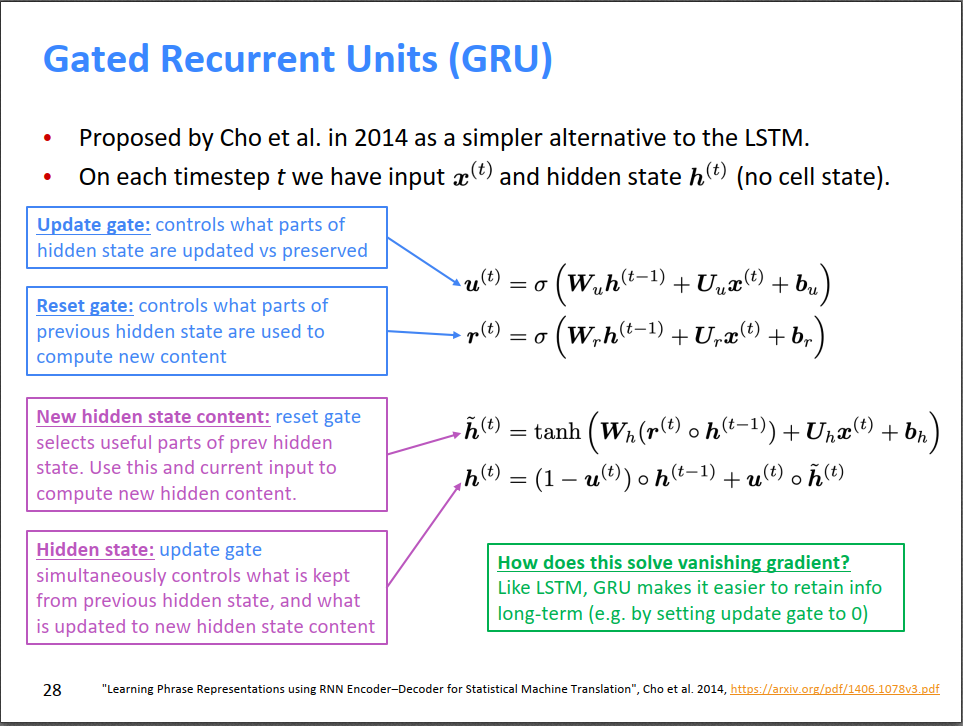

直观来说，GRU和LSTM类似，解决梯度消失的策略就是新增\(u^{(t)}\)来控制\(h^{(t-1)}\)和\(\tilde h^{(t)}\)的比例，如果\(u^{(t)}=0\)，则\(h^{(t)}=h^{(t-1)}\)，即\(t\)时刻的隐状态和上一时刻的隐状态相同，虽然这肯定效果不好，但至少说明GRU是有能力保留之前的隐状态的。

GRU和LSTM的性能差不多，但GRU参数更少，更简单，所以训练效率更高。但是，如果数据的依赖特别长且数据量很大的话，LSTM的效果可能会稍微好一点，毕竟参数量更多。所以默认推荐使用LSTM。

# 其他缓解梯度消失的策略

由于链式法则，或者所选非线性激活函数的原因，不仅仅RNN，所有神经网络都存在梯度消失或者梯度爆炸的问题，比如[全连接网络](https://bitjoy.net/posts/2019-03-18-neural-networks-and-deep-learning-3-1-gradient-vanishing/)和CNN。一些通用解决方法如下：

ResNet。因为梯度是在传递的过程中逐渐减小并消失的，如果跨越好几层直接进行连接，天然能保持远距离信息。个人理解，这就相当于买家和卖家直接相连，没有中间商赚差价\(\mathcal F(x)\)，买到的价格最接近卖出的价格\(x\)。能一定程度上减弱梯度消失的问题。

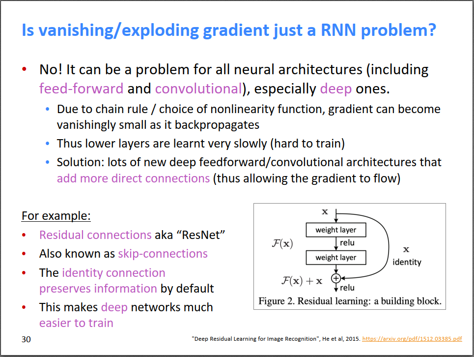

更激进的是DenseNet，把跨越多层之间的很多神经元都连起来，也就是说有更多的线路没有中间商赚差价，进一步减弱梯度消失问题。

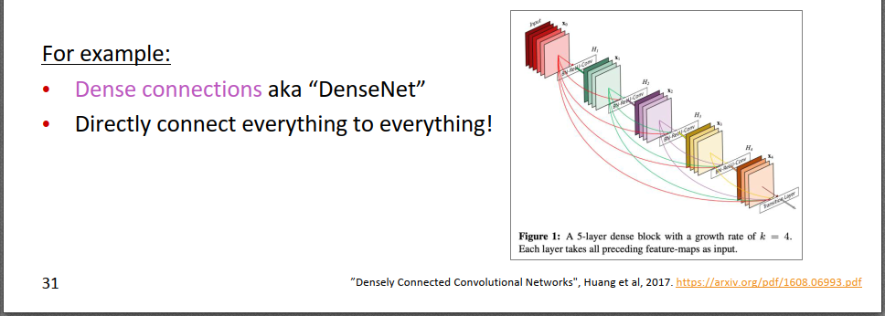

HighwayNet。借鉴了LSTM和GRU的思路，不是像ResNet一样直接新增一条直连线路\(x\)，而是搞一个平衡因子\(u\)，卖家到买家的价格由\(u\)进行调和平均：\(u*\mathcal F(x)+(1-u)*x\)，用\(u\)来控制多少走中间商，多少走直连线路。

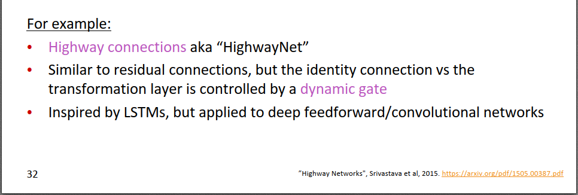

虽然所有神经网络都存在梯度消失的问题，但RNN的这个问题更严重，因为它连乘的是相同的权重矩阵W，而且RNN针对的是序列问题，往往更深。

# 双向RNN

假设我们在对句子进行情感分类，如下图所示。对于terribly这个词，常规RNN，terribly的梯度只能看到左边的信息，看不到右边的信息，因为网络是从左到右的。单独看terribly或者从左往右看，在没有看到exciting时，可能认为terribly是贬义词，但是如果跟右边的exciting结合的话，则意思变为强烈的褒义词，所以有必要同时考虑左边和右边的信息。

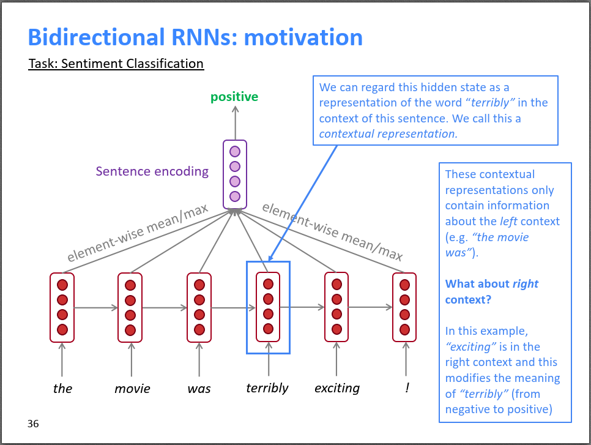

双向RNN包含两个RNN，一个从左往右，一个从右往左，两个RNN的参数是独立的。最后把两个RNN的输出拼接起来作为整体输出。那么，对于terribly这个词，它的梯度能同时看到左边和右边的信息。

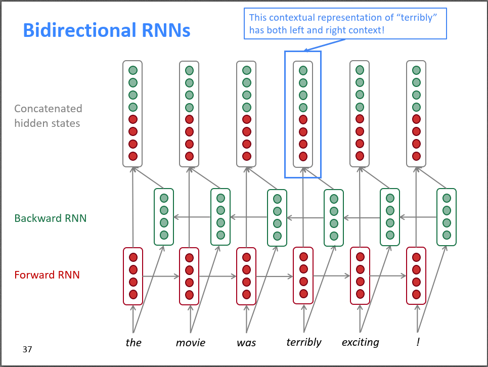

由于双向RNN对于某个时刻\(t\)，既需要知道\(t\)时刻前的信息（Forward RNN），又需要知道\(t\)时刻之后的信息（Backward RNN），所以双向RNN无法用于学习语言模型，因为语言模型只知道时刻\(t\)之前的信息，下一时刻的词需要模型来预测。对于包含完整序列的NLP问题，双向RNN应该是默认选择，它通常比单向RNN效果更好。

# 多层RNN

前面展示的RNN从时间\(t\)的维度上来说可以认为是多层的，但是RNN还可以从另一个维度来增加层数。如下图所示，将上一层（RNN layer 1）的输出作为下一层（RNN layer 2）的输入，不断堆叠下去，变成一个多层RNN。通常来说，深度越大，性能越好，如果梯度下降能训练好的话。

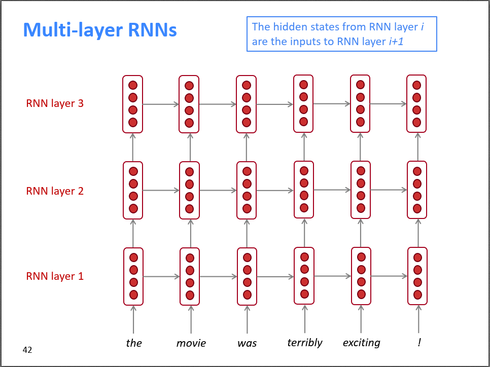

RNN的层数通常不会很深，不会像CNN一样，达到上百层，RNN通常2层，最多也就8层。一方面是RNN的梯度消失问题比较严重，另一方面是RNN训练的时候是串行的，不易并行化，导致网络太深的话训练很花时间。

---

总结，一图胜千言。

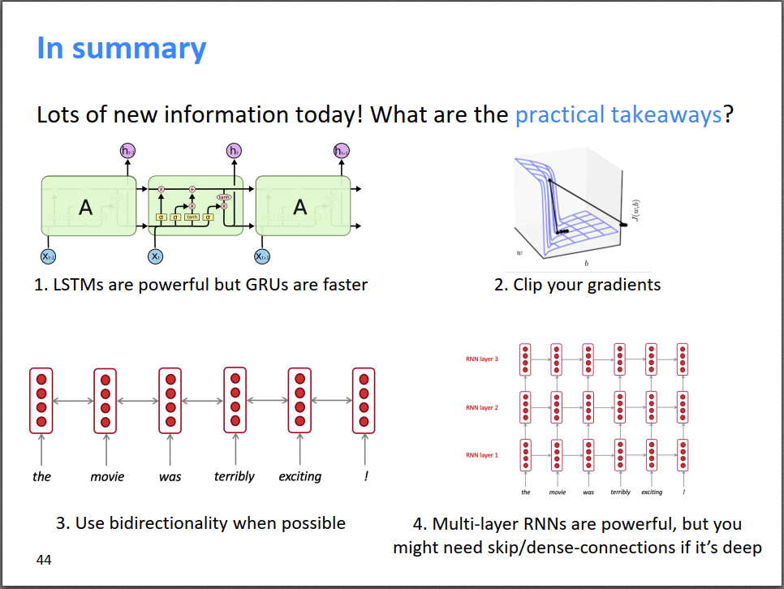