今天介绍另一个NLP任务——机器翻译，以及神经网络机器翻译模型seq2seq和一个改进技巧attention。

机器翻译最早可追溯至1950s，由于冷战的需要，美国开始研制由俄语到英语的翻译机器。当时的机器翻译很简单，就是自动从词典中把对应的词逐个翻译出来。

后来在1990s~2010s，统计机器翻译（Statistical Machine Translation, SMT）大行其道。假设源语言是法语\(x\)，目标语言是英语\(y\)，机器翻译的目标就是寻找\(y\)，使得\(P(y|x)\)最大，也就是下图的公式。进一步，通过贝叶斯公式可拆分成两个概率的乘积：其中\(P(y)\)就是之前介绍过的语言模型，最简单的可以用n-gram的方法；\(P(x|y)\)是由目标语言到源语言的翻译模型。为什么要把\(P(y|x)\)的求解变成\(P(x|y)*P(y)\)？逐个击破的意思，\(P(x|y)\)专注于翻译模型，翻译好局部的短语或者单词；而\(P(y)\)就是之前学习的语言模型，用来学习整个句子\(y\)的概率，专注于翻译出来的句子从整体上看起来更加通顺、符合语法与逻辑。所以问题就转化为怎样求解\(P(x|y)\)。

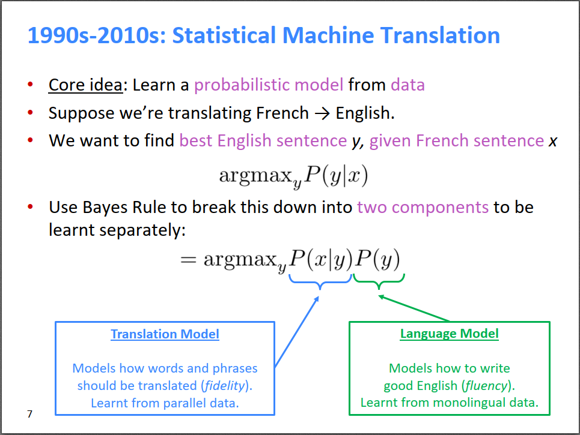

SMT进一步把\(P(x|y)\)分解成\(P(x,a|y)\)，其中\(a\)表示一个对齐alignment，可以认为是两种语言之间单词和单词或短语和短语的一个对齐关系。如下图所示是一个英语和法语的alignment。对齐本身就很复杂，存在1对1，1对多，多对1，多对多等情况，所以\(P(x,a|y)\)的求解在给定\(y\)的情况下，不但要考虑对齐方案\(a\)的情况\(P(a|y)\)，还需要考虑对齐之后词与词的翻译情况\(P(x|a,y)\)，可能的情况非常多。

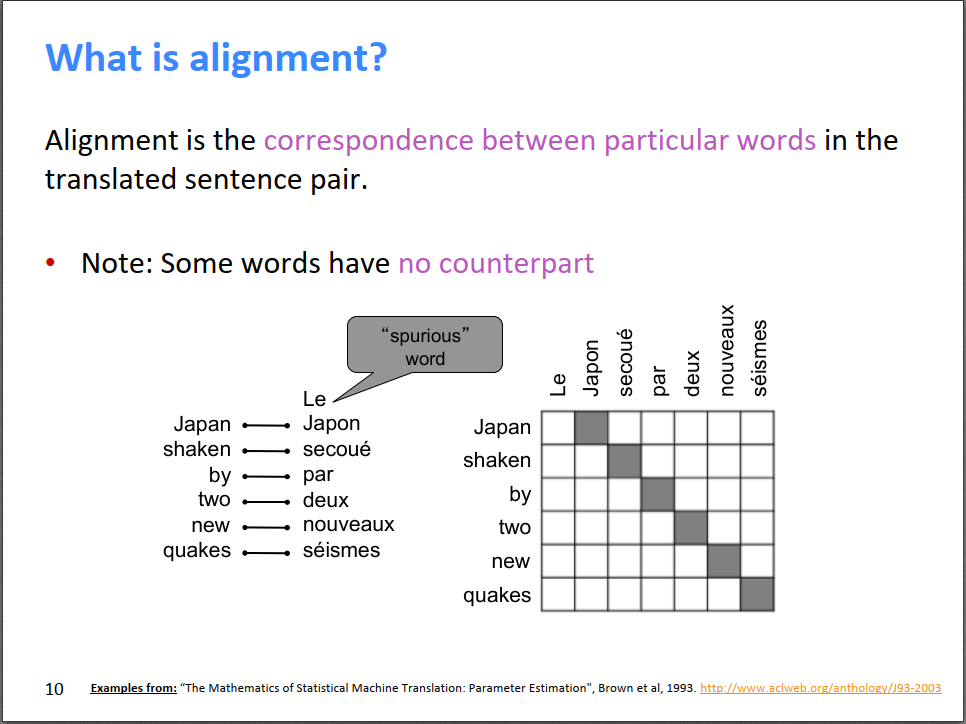

那么，SMT怎样找到\(\arg max_y\)呢？穷举所有情况是不可能的，启发式搜索是可行的。形象描述就是在搜索过程中，对概率较低的路径进行剪枝，只保留概率较大的翻译情况。如下图的搜索树，对于概率较低的路径就不往下搜索了。

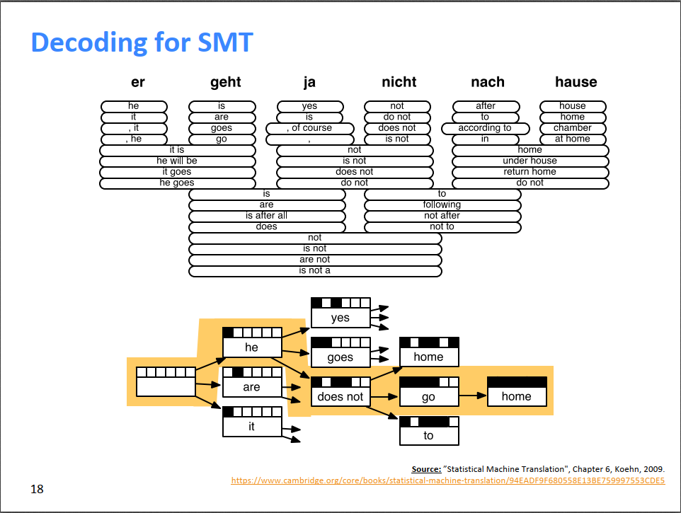

总之，统计机器翻译非常复杂，有很多的子模块，需要很多的人工干预和特征工程。

---

2014年，seq2seq模型横空出世，神经网络机器翻译（Neural Machine Translation, NMT）方兴未艾。seq2seq顾名思义，就是从序列到序列的模型，因为机器翻译的源语言和目标语言都是seq。

seq2seq的NMT如下图所示，它由两个RNN组成，左边的红色部分称为Encoder RNN，它负责对源语言进行编码（Encode）；右边的绿色部分称为Decoder RNN，它负责对目标语言进行解码（Decode）。首先，Encoder RNN可以是任意一个RNN，比如朴素RNN、LSTM或者GRU。Encoder RNN负责对源语言进行编码，学习源语言的隐含特征。Encoder RNN的最后一个神经元的隐状态作为Decoder RNN的初始隐状态。Decoder RNN是一个条件语言模型，一方面它是一个语言模型，即用来生成目标语言的；另一方面，它的初始隐状态是基于Encoder RNN的输出，所以称Decoder RNN是条件语言模型。Decoder RNN在预测的时候，需要把上一个神经元的输出作为下一个神经元的输入，不断的预测下一个词，直到预测输出了结束标志符\<END\>，预测结束。Encoder RNN的输入是源语言的word embeding，Decoder RNN的输入是目标语言的word embeding。

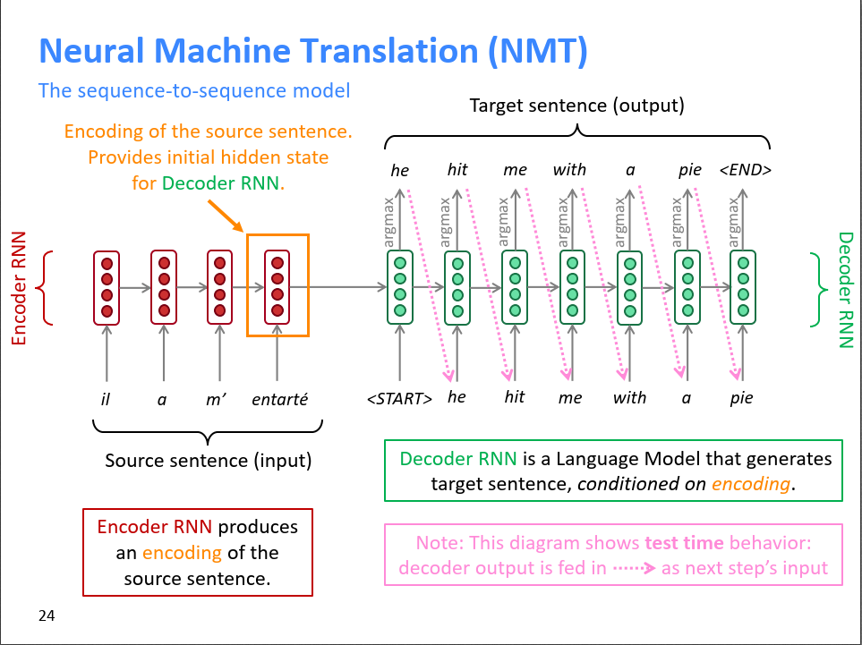

seq2seq是一个很强大的模型，不但可以用来做机器翻译，还可以用来做很多NLP任务，比如自动摘要、对话系统等。

seq2seq作为一个条件语言模型，形式化来说，它直接对\(P(y|x)\)进行建模，在生成\(y\)的过程中，始终有\(x\)作为条件，正如下图的条件概率所示。

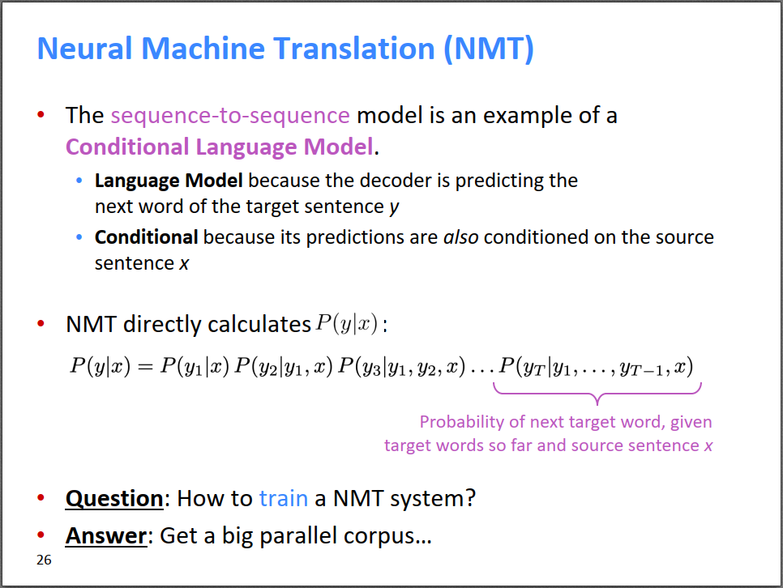

上面介绍了seq2seq的预测过程，seq2seq的训练过程如下图所示。训练的时候，我们同时需要源语言和翻译好的目标语言，分别作为Encoder RNN和Deocder RNN的输入。对于Encoder RNN没什么好说的。Decoder RNN在训练阶段，每一个时间步的输入是提供的正确翻译词，输出是预测的下一个时间步的词的概率分布，比如在\(t=4\)，预测输出是\(\hat y_4\)，而正确答案是“with”，根据交叉熵损失函数，\(J_4=-\log P(“with”)\)。总的损失函数就是所有时间步的损失均值。

seq2seq的训练过程是end2end的，即把Encoder RNN和Decoder RNN作为一个整体进行训练，不会像SMT一样有很多的子模块单独训练。当然seq2seq也可以单独对encoder和deconder进行训练优化，再组合，但是这个效果不一定会比整体优化encoder和deconder更好。

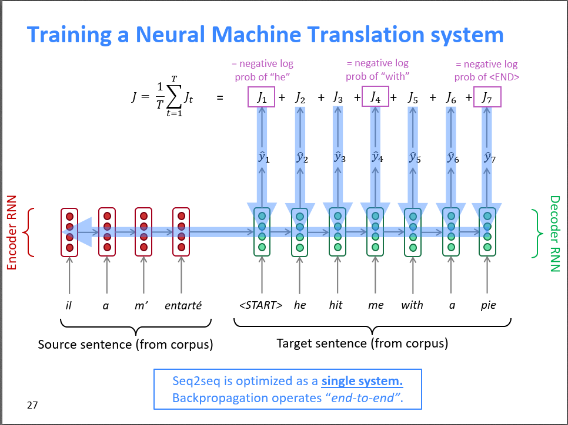

上上张图介绍的seq2seq的预测过程，实际上是一个贪心的预测过程，即在Decoder RNN的每一步都贪心选择\(\hat y_t\)概率最大的那个词。但是贪心只能保证每一步是最优的，无法保证预测出来的句子整体是最优的。特别是如果在\(t\)时刻贪心选择的词不是全局最优，会导致\(t\)时刻往后的所有预测词都是错误的，没有回头路了。但是如果每个时间步都穷举所有可能的情况的话，时间复杂度\(O(V^T)\)又太高了。

Beam search搜索策略是贪心策略和穷举策略的一个折中方案，它在预测的每一步，都保留Top-k高概率的词，作为下一个时间步的输入。k称为beam size，k越大，得到更好结果的可能性更大，但计算消耗也越大。请注意，这里的Top-k高概率不仅仅指当前时刻的\(\hat y_t\)的最高概率，而是截止目前这条路径上的累计概率之和，如下图的公式所示。

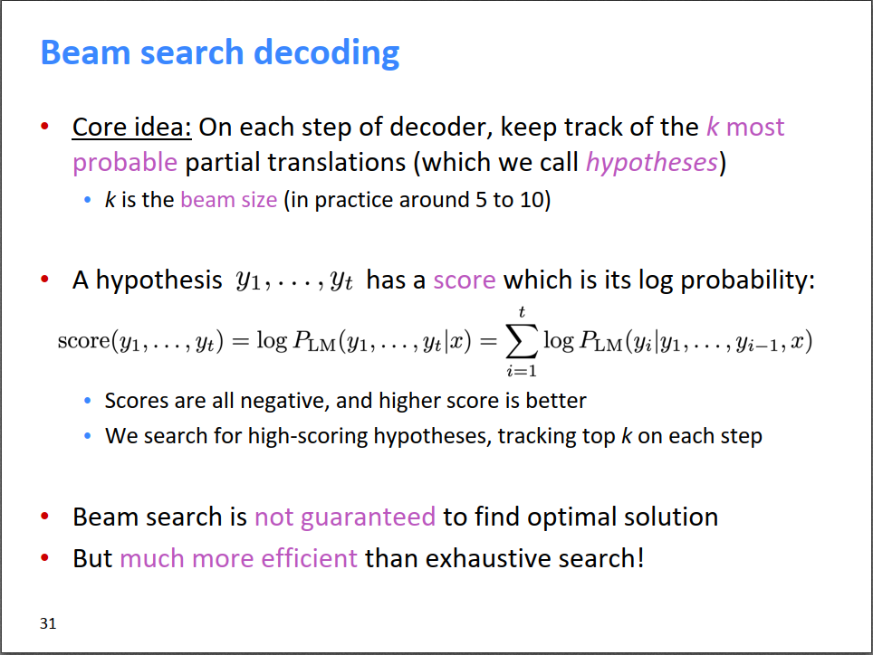

举例如下，假设\(k=2\)，第一个时间步保留Top-2的词为”he”和”I”，他们分别作为下一个时间步的输入。”he”输入预测输出前两名是”hit”和”struck”，则”hit”这条路的累加概率是”he”的概率加上”hit”的概率=-1.7，类似的可以算出其他几个词对应路径的概率打分。最后在这4条路上保留\(k=2\)条路，所以”hit”和”was”对应路径保留，作为下一个时间步的输入；”struck”和”got”对应路径被剪枝。

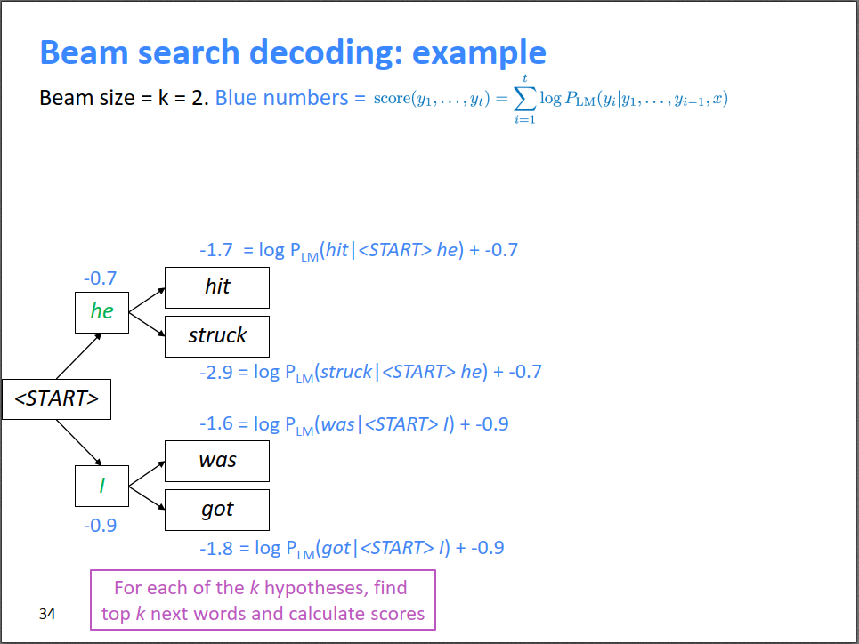

最终的搜索树如下图所示，可以看到在每个时间步都只保留了\(k=2\)个节点往下继续搜索。最后”pie”对应的路径打分最高，通过回溯法得到概率最高的翻译句子。请注意，beam search作为一种剪枝策略，并不能保证得到全局最优解，但它能以较大的概率得到全局最优解，同时相比于穷举搜索极大的提高了搜索效率。

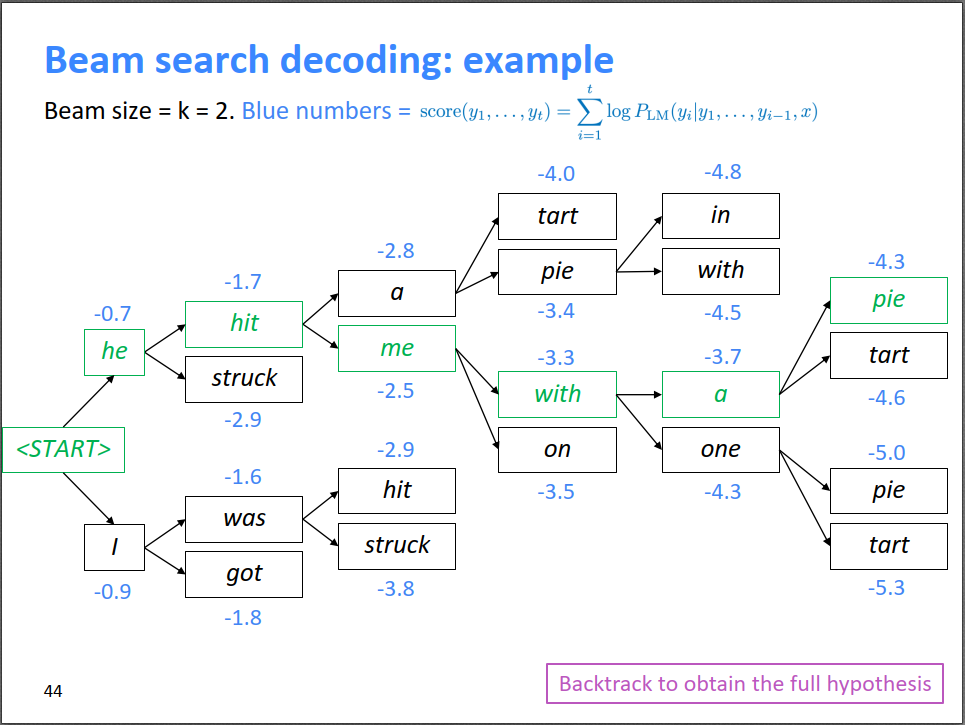

在beam search的过程中，不同路径预测输出结束标志符\<END\>的时间点可能不一样，有些路径可能提前结束了，称为完全路径，暂时把这些完全路径放一边，其他路径接着beam search。beam search的停止条件有很多种，可以设置一个最大的搜索时间步数，也可以设置收集到的最多的完全路径数。

当beam search结束时，需要从n条完全路径中选一个打分最高的路径作为最终结果。由于不同路径的长度不一样，而beam search打分是累加项，累加越多打分越低，所以需要用长度对打分进行归一化，如下图所示。那么，为什么不在beam search的过程中就直接用下面的归一化打分来比较呢？因为在树搜索的过程中，每一时刻比较的两条路径的长度是一样的，即分母是一样的，所以归一化打分和非归一化打分的大小关系是一样的，即在beam search的过程中就没必要对打分进行归一化了。

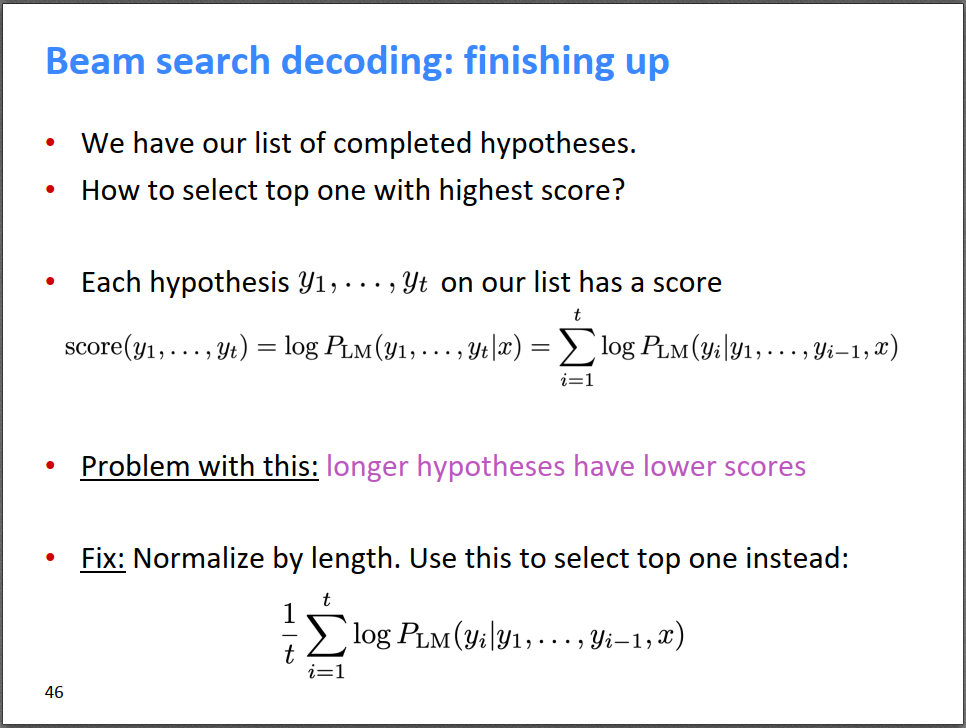

NMT相比于SMT的优点：

1. 性能更好，表现在：翻译更流程，RNN擅长语言模型；能更好的利用上下文关系；能利用短语相似性
2. 模型更简单，只需要一个神经网络，端到端训练即可，简单方便
3. 不需要很多的人工干预和特征工程，对于不同的语言，网络结构保持一样，只需要换一下词向量

NMT的不足：

1. 难以解释，表现在：难以调试，难以解释出错原因
2. 难以控制，比如难以加入一些人工的规则，难以控制NMT不输出什么，由此可能会脑一些笑话甚至导致安全问题

---

# 如何评价机器翻译

机器翻译的自动化评价指标通常使用Bilingual Evaluation Understudy, BLEU，笼统的来说，BLEU衡量机器翻译结果和人类的翻译结果（标注答案）的n-gram的overlap，overlap越多，打分越高。其形式化的计算公式如下图所示（来自课程作业assignment 4）。

给定源语言\(s\)，以及它的\(k\)个人类翻译结果作为参考答案\(r_1,…,r_k\)，需要评价一个机器翻译结果\(c\)的质量，给出BLEU打分。首先，我们计算修正的n-gram精度\(p_n\)，假设取\(n=1,2,3,4\)，计算方法为公式(15)。其中分子为对于机器翻译结果\(c\)中的每一个n-gram，统计其在所有参考答案句子中出现次数的最大值，然后和这个n-gram在\(c\)中的出现次数取最小值，所有n-gram的这个值再加起来作为分子。分母为\(c\)中所有n-gram在\(c\)中出现次数之和。由此可见\(p_n\leq 1\)。

下一步，因为参考答案不止一个，所以需要对每个参考答案分配一个权重\(\lambda_n\)，再组合起来，就是公式(17)的最后一项。还需要考虑一个问题，BLEU会对太短的机器翻译结果进行惩罚。因为如果MT想要提高precision的话，只需要翻译输出很短的句子，而且是那些MT认为很可靠的句子，n-gram的重合度会很高，即\(p_n\)很高。但是，很短的句子有可能损失了源句子很多重要的信息，所以需要惩罚。惩罚项如公式(16)所示，BLEU以跟\(c\)句子长度最接近的长度\(r^*\)作为参考进行罚分。

虽然BLEU为MT提供了一套自动化的评价方法，但BLEU也不是完美的。因为它基于n-gram，假设机器翻译出来的是另一种优美的表达方法，但人给出的正确翻译结果是常规翻译，那么他们之间的n-gram的overlap可能不高，导致正确翻译的打分反而得分低。

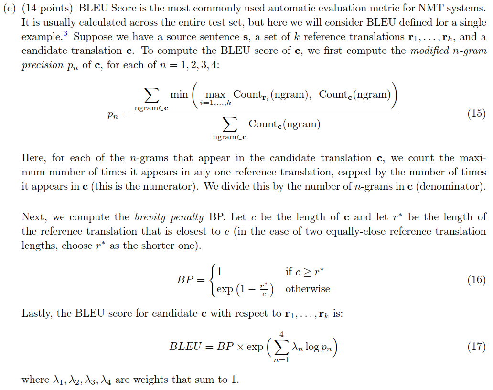

---

# 注意力机制Attention

最后介绍提升机器翻译性能的一大利器——注意力机制Attention。首先回顾一下朴素的seq2seq模型，我们用Encoder RNN的最后一个神经元的隐状态作为Decoder RNN的初始隐状态，也就是说Encoder的最后一个隐状态向量需要承载源句子的所有信息，成为整个模型的“信息”瓶颈。

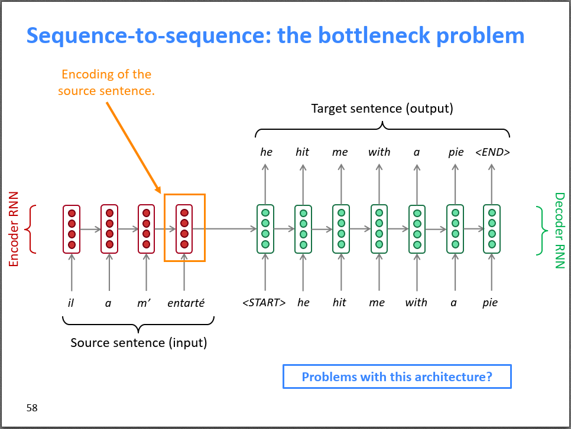

Attention机制就是为了解决这个“信息”瓶颈而设计的，请大家结合下面的示意图和公式进行理解。宏观上来说，Attention把Decoder RNN的每个隐层和Encoder RNN的每个隐层直接连起来了，还是“减少中间商赚差价”的思路，由于有这个捷径，Encoder RNN的最后一个隐状态不再是“信息”瓶颈，信息还可以通过Attention的很多“直连”线路进行传输。

具体来说，在时刻\(t\)，Decoder第\(t\)时刻的隐状态\(s_t\)和Encoder所有时刻的隐状态\(h_1,…,h_N\)做点积，得到N个标量Attention score，作为Encoder每个隐状态的权重，然后使用softmax对这些权重进行归一化，得到Attention distribution。这个Attention distribution相当于Decoder在时刻\(t\)对Encoder所有隐状态的注意力分布，如下图所示，”he”时刻的注意力主要分布在Encoder的第2和第4个词上，这不正是前面介绍的SMT的对齐alignment操作吗！Attention自动学习到了这种对齐操作，只不过是soft alignment。

接下来，对Encoder所有隐状态使用Attention distribution进行加权平均，得到Attention output \(a_t\)。把\(a_t\)和该时刻的隐状态\(s_t\)拼起来再进行非线性变换得到输出\(\hat y_2\)。有时，也可以把上一时刻的Attention output和当前的输入词向量拼起来作为一个新的输入，输入到Decoder RNN中。

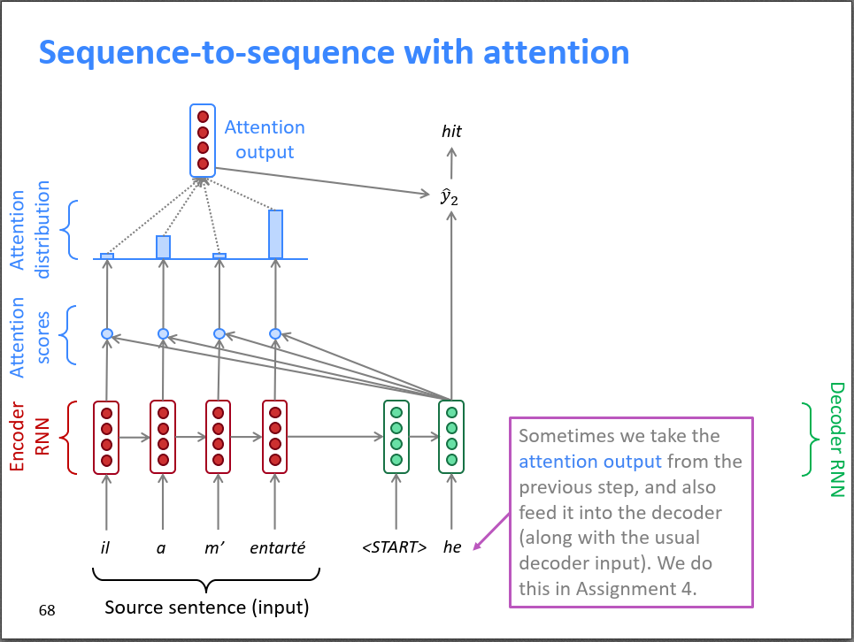  |  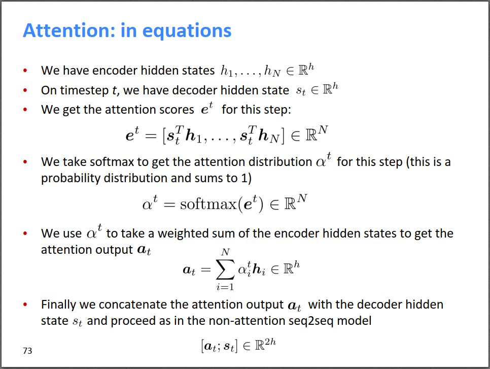
:-------------------------:|:-------------------------:

Attention优点：

1. 提高NMT性能，让Decoder更多的关注于时刻\(t\)需要翻译的词。
2. 解决了NMT的“信息”瓶颈问题。
3. 有助于缓解梯度消失问题，因为Decoder的每一时间步都和所有Encoder的隐状态相连了，相当于某种捷径，减少了“中间商赚差价”。
4. 有助于增加NMT的可解释性，解释为什么时刻\(t\)翻译输出了某个词，可以通过查看Attentioin distribution来解释。免费得到了一个soft alignment，太棒了。

现在，Attention已经变成了深度学习的一个的通用技术，并不局限于seq2seq和MT。Attention更一般的定义是：给定一系列values集合\(H=[h_1,…,h_N]\)，和一个查询\(s\)，用\(s\)和\(H\)中的每个向量做点积，得到\(s\)对\(H\)的注意力分布。然后用这个分布对\(H\)进行加权平均得到\(H\)的一个摘要summary或者说Attention output。\(H\)中的\(h\)可以任意多个，但因为最后对U进行了加权平均得到的attention output的维度和\(h\)是一样的。Attention的形式化过程如下图所示。

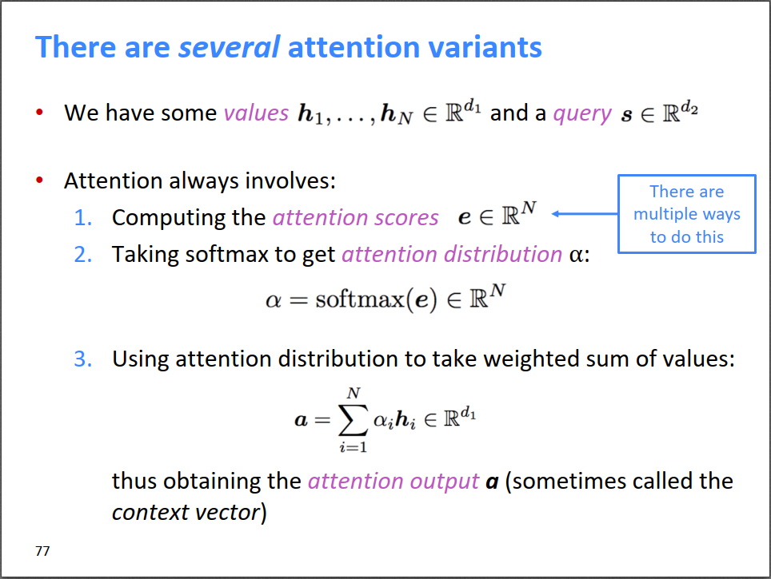

Attention还有很多变种，如下图所示，3种变化换汤不换药，就是在query和values怎样相乘得到Attention scores上做文章。

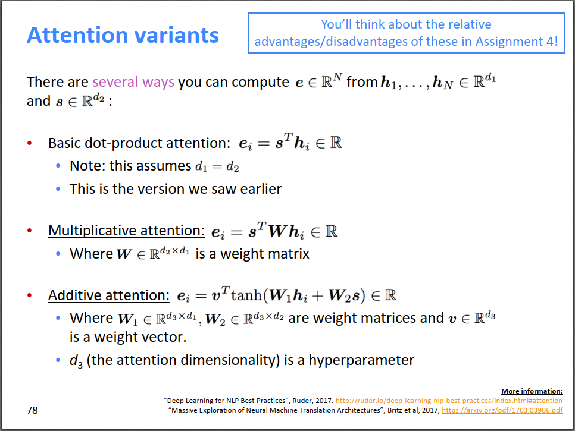

最后总结展望，虽然seq2seq自2014年横空出世以来，机器翻译取得了巨大的进展，但MT依然还有很多待解决的问题，比如：

1. 源语言或目标语言中的词不在词典中，怎么办，sub-word modeling…
2. 领域不匹配，比如在维基百科这种较正式的语料库中训练，但用来翻译twitter这种口语或者非正式语料。
3. 长文本的翻译，目前介绍的都只是翻译一个句子，句子相对来说还是比较短的，如果要翻译一篇论文或一本书，那么怎样考虑非常长距离的上下文依赖关系？
4. 如果需要翻译的两种语言的标注集很少，怎么办？
5. 对一些惯用语、俚语等翻译容易闹笑话。