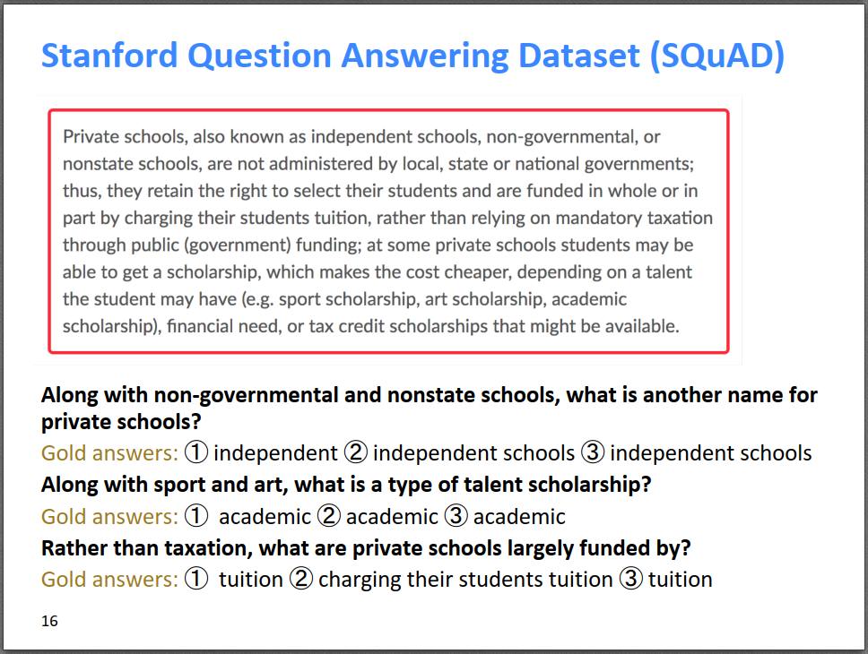
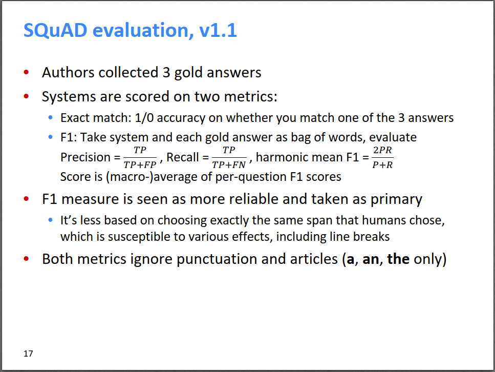
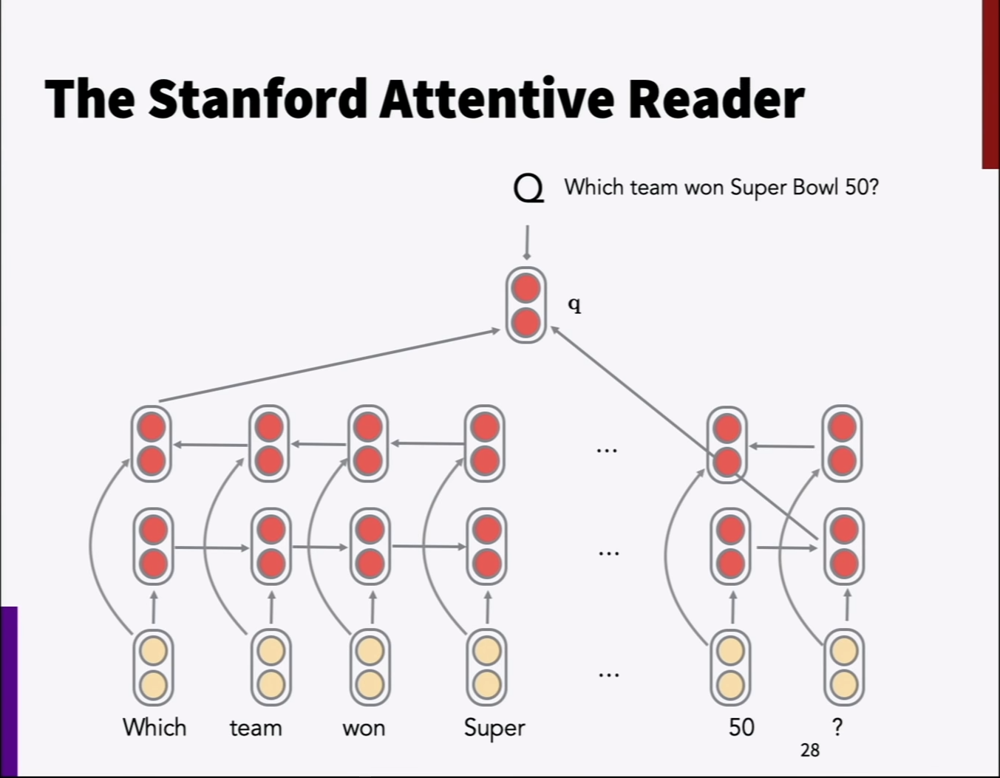
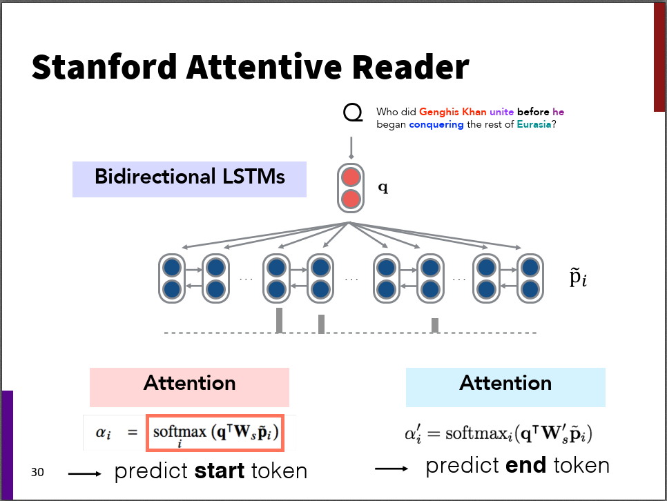
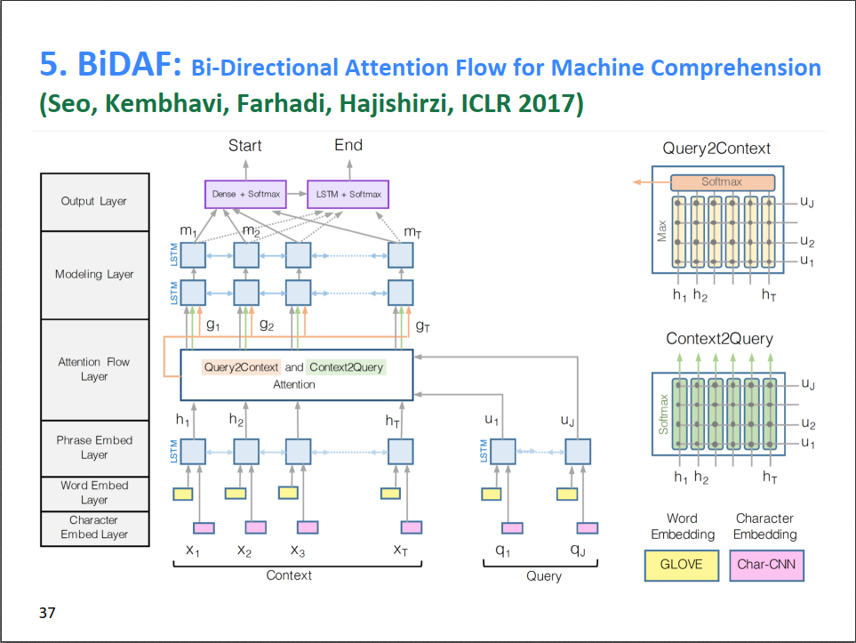

这节课的内容比较简单，是问答系统（Question Answering, QA）的入门介绍。

# QA简介

首先，为什么需要QA？目前各大搜索引擎对于一个查询，给出的都是一个结果列表。但是很多查询是一个问题，答案也往往比较确定，比如“现任美国总统是谁？”，此时，返回一堆结果列表就显得太过啰嗦了，尤其是在手机等移动设备上搜索时，简单的给出回答也许会更好一些。另一方面，智能手机上的助手如Siri、Google Now之类的，用户期望的也是简洁的答案，而不是一堆网页列表。

QA系统的组成主要有两个部分，一部分是根据问题检索到相关的文档，这部分是传统的信息检索的内容；另一部分是对检索到的文档进行阅读理解，抽取出能回答问题的答案，这部分就是本文要介绍的QA系统。

QA的历史可追溯到上世纪七十年代，但真正取得突破性进展也就是最近几年。2015/2016年，几个大规模QA标注数据集的发表，极大的推动了这个领域的发展。这其中比较有名的数据集是斯坦福大学发布的Stanford Question Answering Dataset (SQuAD)。

SQuAD数据集的每一个样例包含一段描述P，一个问题Q，以及对Q的人工标注答案A。为了使数据集更加鲁棒，对于每个问题，都给出了三个人工标注答案。每个答案都是描述P中的一小段文字，称为一个span。所以，问题相对来说比较简单，答案可以直接从描述中提取sub-sequence得到。

QA系统的评价指标有两个，一个是确定性匹配Exact match，即对于每个问题，模型给出的回答如果和3个答案中的任意一个完全匹配，则加1分，否则不加分。另一个是F1指标，使用词袋模型（不考虑词的顺序），对于每个问题，模型给出的回答和3个答案中的每一个计算F1，这个问题的F1是3个F1的最大值，最终得分是所有问题的F1打分的均值。Exact match和F1都不考虑标点符号和冠词。相对来说，F1比Exact match更可靠和鲁棒一些。

经过两年的两三年的刷榜，SQuAD数据集的最好性能已经超越了人类的性能，为了增加数据集的难度，斯坦福后续推出升级版本SQuAD 2.0。

由于1.1版本的问题都有答案，所以QA系统变成了一个排序系统，只需要把Answer列表中排名第一的结果输出就好了。2.0在1.1的基础上，增加了没有答案的问题，可以理解为假问题，对系统造成干扰。此时就要求系统判断这个问题能否从描述P中获得答案，如果没有答案的话，就不输出任何回答\<No Answer\>。对于没有答案的问题，如果系统没有输出答案，得1分，否则输出任何答案都得0分。

SQuAD数据集的局限性：

1. 回答都是span-based类型的，没有yes/no、计数、why等的问答。
2. 由于构造问题q的时候，已知了描述P，那么q和P的描述会很像，无论是用词还是语法。而搜索引擎面临的真实情况往往是，q根本不知道P是什么，有可能q和P的描述在行文及用词上有很大差别。
3. 描述P比较简单，因为答案是一个span，所以模型把q和P匹配，找到可能的答案位置就行。实际的复杂场景有可能要综合好几个句子的信息，还要理解不同的指代关系等才能得出最终答案。

虽然SQuAD数据集还有不少局限性，但由于其是一个well-targeted、well-structured、clean dataset，在QA发展初期，还是为促进QA发展立下了汗马功劳。

# Stanford Attentive Reader

下面介绍一下Chris Manning组针对SQuAD数据集开发的QA系统——Stanford Attentive Reader。该系统目前虽然不是最好性能，但它包含QA的基本模块，可以作为QA的一个baseline模型。

首先模型对问题q进行表征的方法如下，输入是q中每个词的词向量，然后使用一个Bi-LSTM提取句子特征，由于是双向的LSTM，所以模型把正向和反向的LSTM的最后一个隐状态拼接起来，作为对整个句子的表征。

由于SQuAD数据集的回答都是描述P中的一个span，那么，模型只需要预测出这个span在P中的起始位置和终止位置即可，具体方法如下图所示。其实也很简单，上一步我们得到的句子的表征向量q，下一步，我们对描述P也使用Bi-LSTM，得到描述P中每个词的表征向量\(\tilde p_i\)。然后，使用两次Attention，用q查询集合\(P=[\tilde p_1,…,\tilde p_n]\)，得到答案span的起始位置\(\alpha_i\)和终止位置\(\alpha’_i\)。另外，由于\(q\)和\(\tilde p_i\)的维度可能不一样，又或者为了提升模型性能，在计算Attention score的时候，不是简单的向量点积，而是采用了线性变换的方法，增加了参数\(W\)。

后来，Chris Manning组又推出了升级版本Stanford Attentive Reader++，主要包括两个方面。首先，对表征问题的网络进行了改进，\(q\)不仅包含Bi-LSTM的两个尾结点的隐状态，而是包含整个问题所有隐状态的加权平均，而且网络层数增加到了3层。其次，对描述P的表征方面，原来的输入只包含词向量，现在还包含语言特征（如POS、NER的标签）、词频、以及近义词的相似度等。改进版模型性能提升了不少。

另一个比较流行的QA系统是BiDAF，如下图所示，这里不再详细介绍。它的特点一方面输入不仅包含词向量，还包含字符级别的特征。另一大创新是在Attention Flow Layer，相对于Stanford Attentive Reader，BiDAF的Attention是双向的，不但包含q对P的Attention，还包含P对q的Attention。

