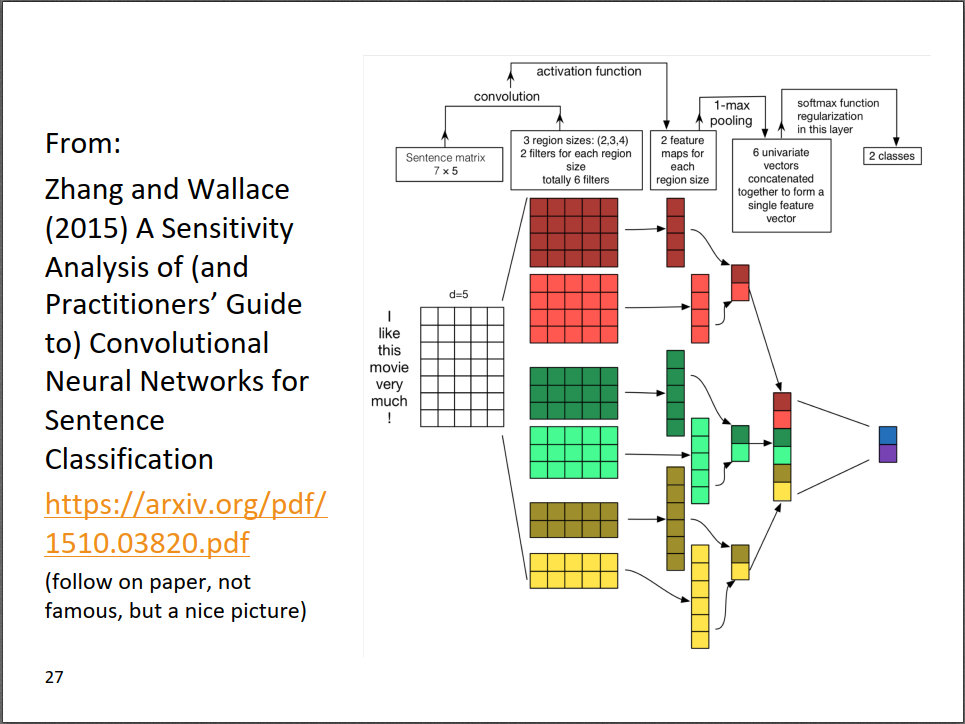
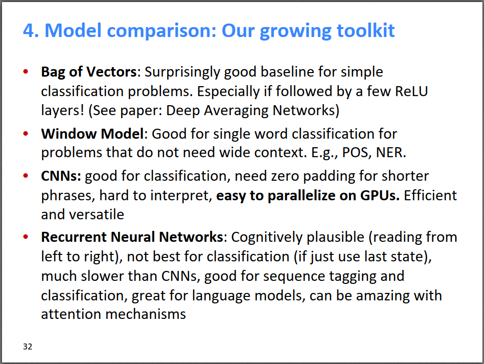

今天我们介绍如何使用CNN解决NLP问题。截止目前，我们学习了很多RNN模型来解决NLP问题，由于NLP是序列的问题，使用RNN这种循环神经网络是很符合直觉的，而且也取得了不错的效果。但是，由于RNN速度较慢，而且梯度消失问题比较严重，人们就想借用CV领域的CNN，看是否能解决NLP的问题。

我们在之前的博客中已经详细介绍过[卷积神经网络CNN](https://bitjoy.net/posts/2019-05-04-neural-networks-and-deep-learning-6-dl/)，这里不再详细介绍。下面我们以一篇paper中使用CNN对句子进行情感分类为例，简要介绍下怎样将CNN应用到NLP中。

上图是一个非常简单的CNN网络，用来对影评进行情感分类，输入是一个长度为7的句子，我们把每个词用长度为5的词向量来表示，则对于输入来说，得到了一个7×5的矩阵，这不就相当于一张图片了吗，后续操作就很像CV了。第二步，需要对输入“图片“进行卷积操作，请注意，虽然输入可以看做图片，但其本质上是“一维”的句子，所以我们设计卷积核大小时，卷积核的宽度要固定为5，保证卷积核能对完整的词向量进行操作。这里共设计了3个不同大小的卷积核，每种大小有2个卷积核，共6个卷积核。卷积操作完成之后得到了6个特征图，对每个特征图取max pooling再拼接起来，得到一个长为6的向量，这就是用CNN对句子抽取的特征向量。最后再接一个softmax进行二分类。

除了上图展示的CNN操作外，还有一些CNN操作有可能会用到：

1. 卷积操作的stride=k，每k行一个group进行卷积，默认卷积操作是k=1
2. 卷积操作的dilation=k，跨k行进行卷积，默认卷积操作是k=1
3. padding，上图卷积操作之后，feature map相比于输入维度变小了，如果要想保持维度不变，可对输入进行padding
4. max/avg pooling over time，上图的max pooling即为max pooling over time，即对整个句子所有时间步的feature取max
5. k-max pooling，对整个句子的所有时间步的feature取top-k的max值，同时保持feature的相对顺序不变，上述max pooling相当于1-max pooling
6. local max pooling，stride=k，对每k个feature取max，这个和CV里默认的max pooling是一样的，CV里就是画一个框取max
7. dropout=p，对于每个连接，随机以概率p丢弃，属于一种正则化技术，能有效增加模型的鲁棒性
8. skip connections，之前讲过很多次了，直连线路，没有中间商赚差价
9. batch normalization，对每次卷积操作的输出进行z-score标准化，使得均值为0，标准差为1，能有效增加模型的鲁棒性
10. 卷积核大小为1×1的卷积，相当于卷积前后的feature map的全连接，但又比全连接的参数少，因为一个卷积核的参数是共享的

最后，给出我们目前所学的工具箱：

* 词袋模型：对于一个句子，简单的把所有词的词向量进行平均，也能取得不错的baseline效果
* 基于滑动窗口的模型：对于POS、NER等不需要很长的上下文信息的问题来说，效果不错
* CNN：对分类问题效果很好，容易在GPU上并行，所以效率很高
* RNN：对于NLP问题来说，符合认知，对分类问题效果不是很好（如果只用最后一个隐状态的话），加上Attention性能提升明显，特别适合序列标注、语言模型等序列问题

