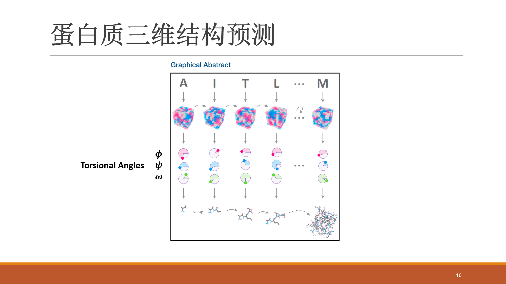

首先放出本文的Hightlights：

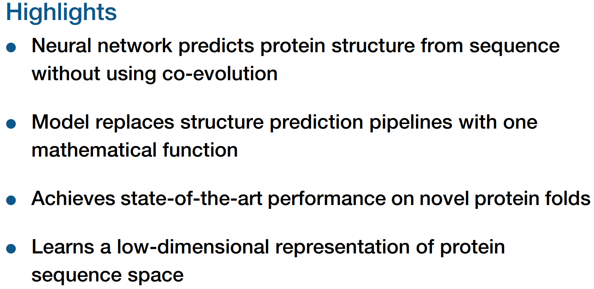

蛋白质三级结构预测一般分为两种方法，一种是基于模板的预测方法（Template-Based Modeling, TBM），另一种是从头测序方法（Free Modeling, FM）。TBM方法目前已经能达到比较好的预测精度，但并不是所有蛋白都有同源模板，当模板蛋白和目标蛋白的相似性低于某个阈值时，TBM方法的性能就会比较差。而传统的FM方法，需要过多的人工特征，使得整个流程非常复杂。

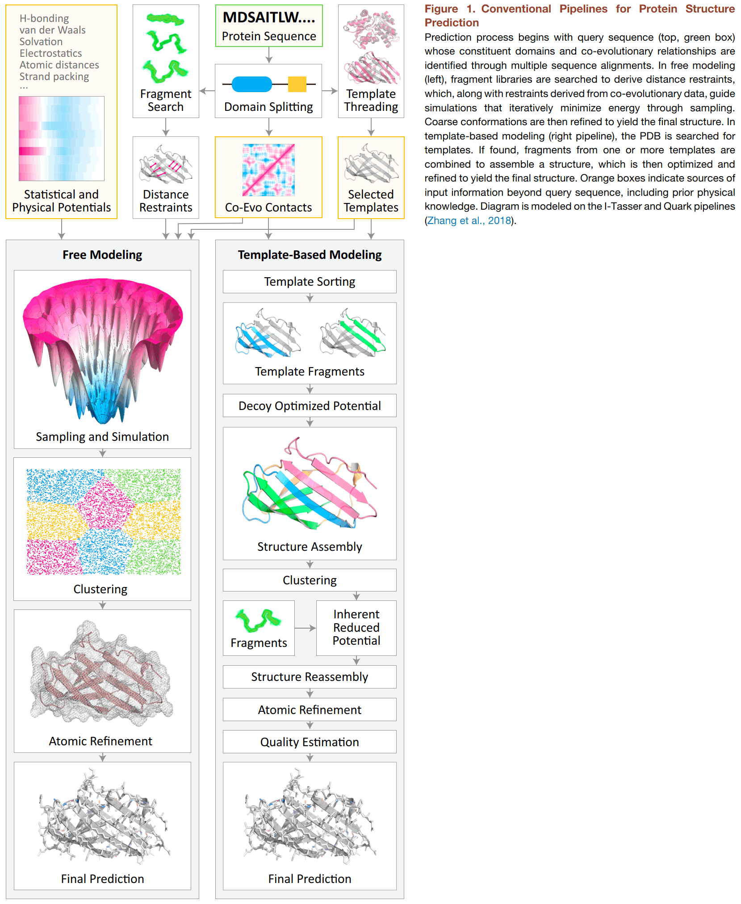
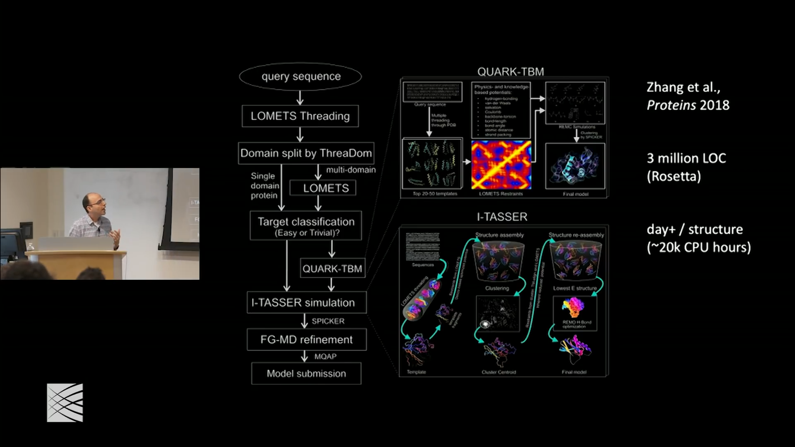

作者在一次报告中，将传统的蛋白质结构预测算法（上图）比作10年前的图像识别算法（下图），虽然10年前的图像识别算法也能达到比较好的性能，但需要很多人工设计的特征，比如SIFT特征等，不够简洁漂亮。随着深度学习的兴起，现在图像识别不再需要人工设计特征，只要搭建好神经网络，输入原始图片即可完成识别和分类，性能比之前的人工方法还要好。所以，作者也希望能提出一个简洁、纯深度学习的模型来预测蛋白质的三级结构。

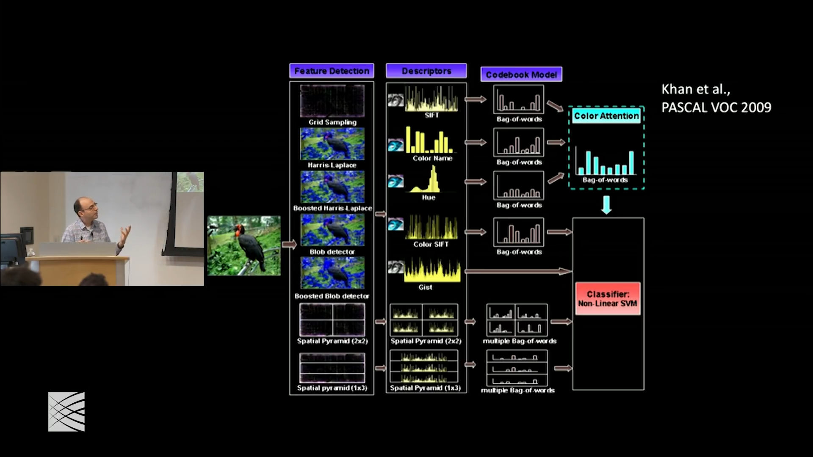

本文的模型（Recurrent Geometric Networks, RGN）从宏观上来说就如博客开篇的图片所示，非常的简洁漂亮，输入是蛋白质的一维序列，经过神经网络，输出是每个氨基酸残基的三个扭转角，然后再通过三维重构，得到蛋白质的笛卡尔坐标。

更具体来说，RGN包括三个部分，分别是模型预测、三维重构和误差反向传播，下面分别介绍这三个部分。

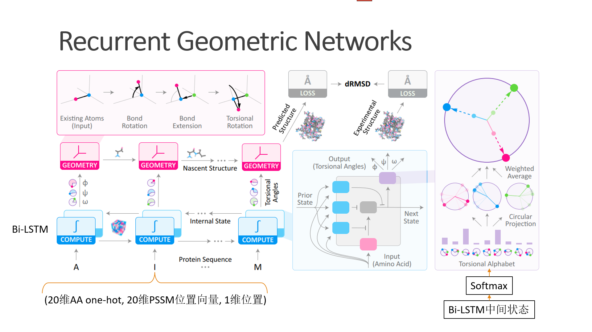

模型预测是上图的左下角部分，即输入是蛋白质序列，输出是每个氨基酸残基的三个扭转角。因为每个氨基酸对应三个扭转角输出，每个氨基酸和其上下文的氨基酸有关联，所以使用双向LSTM最合适不过了。Bi-LSTM没什么好讲的，关键讲讲其模型的输入和输出。输入部分，作者把每个氨基酸编码成一个41维的向量，如上图所示，其中包括20维氨基酸的one-hot向量（因为只有20种氨基酸）、20维PSSM位置向量和1维具体的位置信息。其中的PSSM位置向量可以理解为这个位置上的不同氨基酸的概率分布，由于有20种氨基酸，所以PSSM向量维度也是20。网上没有找到氨基酸的PSSM向量示例，找到一个DNA的，如下图，每个位置上，字母越大表示出现该核苷酸的概率越大，换成氨基酸是类似的道理。所以整个网络的输入，除了PSSM矩阵，没有任何人工设计的特征，已经很优雅了。

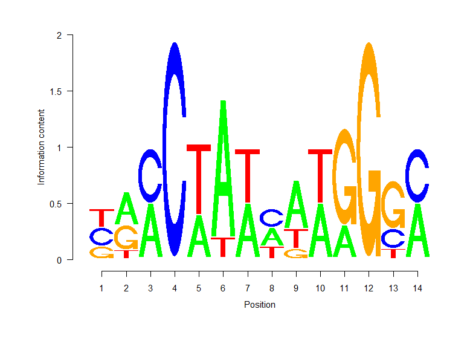
https://davetang.org/muse/2013/10/01/position-weight-matrix/

Bi-LSTM的输出是三个扭转角，但并不是三个实数这么简单。作者首先把整个拉氏图平面聚类，比如聚类成m=60个点，然后就把输出离散化成60类的分类问题。分类输出采用Softmax归一化，这样就会得到60类的概率分布，如RGN网络图最右边的子图所示。60类的概率分布再通过加权平均的方式得到最终的三个扭转角的实数值。我很好奇为什么需要经过一个离散再加权平均的方法，Bi-LSTM直接回归输出三个扭转角的实数不是更省事吗？

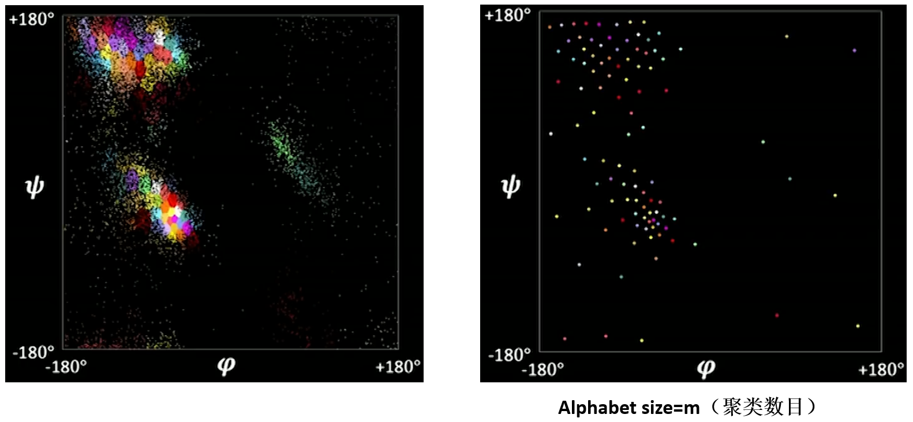

预测得到三个扭转角之后，进入RGN的第二个阶段，就是三维重构，在RGN网络图的左上角。三维重构说起来也简单，就是根据每个氨基酸残基的三个扭转角，重构出蛋白质的三维结构。由于常规的蛋白质三维结构坐标系是笛卡尔坐标系（直角坐标系），所以需要把扭转角坐标转换为笛卡尔坐标，以便于求解误差。这个部分作者没有细说，因为是另一篇论文：[Parallelized Natural Extension Reference Frame: Parallelized Conversion from Internal to Cartesian Coordinates](https://onlinelibrary.wiley.com/doi/full/10.1002/jcc.25772)。

最后就是怎样求解误差以及误差反向传播了。这个也比较有意思，想想看，对于一条长为L的蛋白质序列，给定预测的三维结构和真实的三维结构，怎样计算它们之间的误差。不能直接对应坐标相减，因为有可能两个坐标系的坐标原点不一样。作者的方法是这样的：对于预测结构，求每两个氨基酸的距离差，就是\(\tilde{d}_{j,k}\)；对于真实结构，也做类似的操作。这样做的好处是抹掉了坐标原点的影响，用两点之间的相对距离来表示三维结构。然后，对真实的\(\tilde{d}_{j,k}^{(exp)}\)和预测的\(\tilde{d}_{j,k}^{(pred)}\)再求二范数\(||D||_2\)，最后除以长度进行归一化，就得到了误差dRMSD。

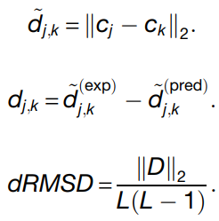

上述dRMSD误差相比于之前领域内常用的TMscore，好处就是可微分，可自动求导，可梯度下降了；另外，如上所述，dRMSD不要求预测结构和真实结构进行对齐；但是有一点是dRMSD对size敏感，而且不能识别镜面对称这种错误结构，比如左手和右手的结构是镜面对称的，如果真实结构是左手，但模型预测成了右手，dRMSD是检测不到这种错误的。

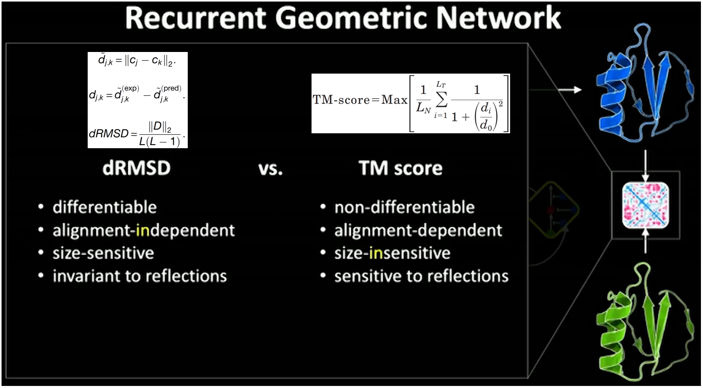

模型介绍完毕，训练和测试数据集来自CASP竞赛。作者把每一届CASP比赛的数据集作为测试集，从CASP7~CASP12；每一届比赛之前公布的所有PDB数据集（seq, structure）作为对应测试集的训练集。其中，CASP11分出一部分作为验证集，用来优化网络超参数。

测试结果如Table 1所示，可以看到，在没有模板的FM类别中，本文的RGN预测误差是最小的；在有模板的TBM类别中，RGN的性能几乎垫底，当然这里参与评测的都是当届比赛中Top-5的模型，所以RGN和这5个模型比是垫底，但差距是很小的。

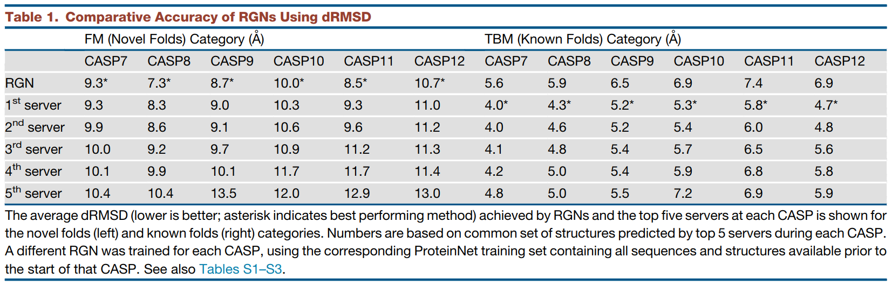

另外，作者提到，在TBM类别的数据集中，CASP的参赛模型比较依赖模板的质量。具体来说，对于真实的结构，如果模板结构和真实结构误差很小（y轴），则模型的预测结构和真实结构的误差也很小（x轴），这两个变量成一定的线性相关关系（第一行）。而对于本文的RGN，则没有这种相关关系，说明RGN一视同仁，不会受模板质量的影响，因为RGN是纯深度学习的模型，根本就没有用到模板。

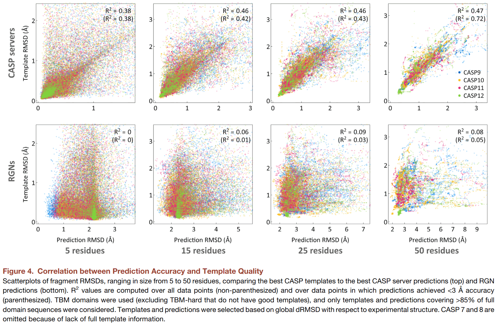

在预测速度上，RGN虽然需要训练几周甚至上月的时间，但预测速度是毫秒级别的，是评测的几个模型中最快的。快速的RGN能使一些新的应用成为可能，比如药物发现、蛋白质设计等。

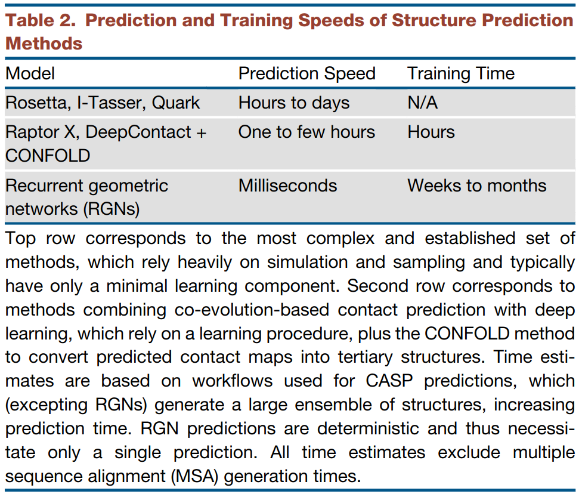

最后，总结一下本文的主要工作、创新点和局限性：

三个特点：
* torsional angles，局部信息
* geometric units ，全局信息
* dRMSD，局部+全局

创新点：
* 简洁，Model replaces structure prediction pipelines with one mathematical function
* 另辟蹊径，纯deeplearning，不依赖structural templates、co-evolutionary information、energy model等，本文预测融合了本文方法和领域知识的新模型有望解决蛋白质结构预测问题

局限性：
* 依赖PSSM矩阵

本文作者来自哈佛医学院系统药理学实验室，文章只有作者一个人，很了不起了。哈佛医学院的另一个教授评价作者：“AlQuraishi 研究的特点在于，一名埋头在哈佛医学院和波士顿生物医学社区丰富研究生态系统中的研究人员，居然能够在计算机科学最热门的领域里抗衡谷歌等巨头。——Peter Sorger”，太棒了，我也想做这样的研究。

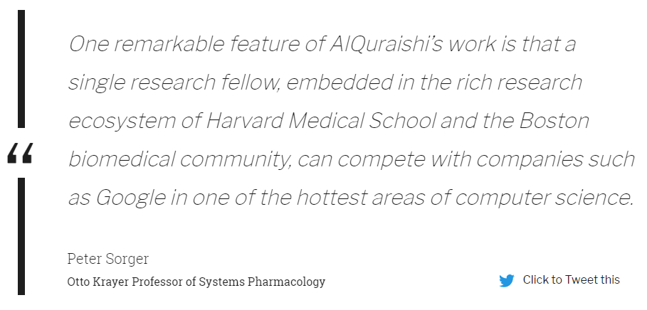

最后，请欣赏作者做的一个动图，展示了蛋白质一维序列在训练过程中，不断调整其三维结构，误差RMSD不断减小，直到和真实结构吻合的过程。

该论文的重要参考资料：

* 论文：[https://www.sciencedirect.com/science/article/abs/pii/S2405471219300766](https://www.sciencedirect.com/science/article/abs/pii/S2405471219300766)
* 作者在Broad Institute的报告：[https://www.youtube.com/watch?v=HOVdHAnC8LI](https://www.youtube.com/watch?v=HOVdHAnC8LI)
* 哈佛医学院官方报道：[https://hms.harvard.edu/news/folding-revolution](https://hms.harvard.edu/news/folding-revolution)
* 作者个人博客（很有意思，干货很多）：[https://moalquraishi.wordpress.com](https://moalquraishi.wordpress.com/)

最后，分享几篇大厂出品的和蛋白质结构预测相关的计算文章：

* 同样来自哈佛医学院，发表在ICLR2019：[Learning Protein Structure with a Differentiable Simulator](https://openreview.net/forum?id=Byg3y3C9Km)
* 来自FAIR：[Biological structure and function emerge from scaling unsupervised learning to 250 million protein sequences](https://www.biorxiv.org/content/10.1101/622803v2)
* 来自谷歌：[Using Deep Learning to Annotate the Protein Universe](https://www.biorxiv.org/content/10.1101/626507v4)