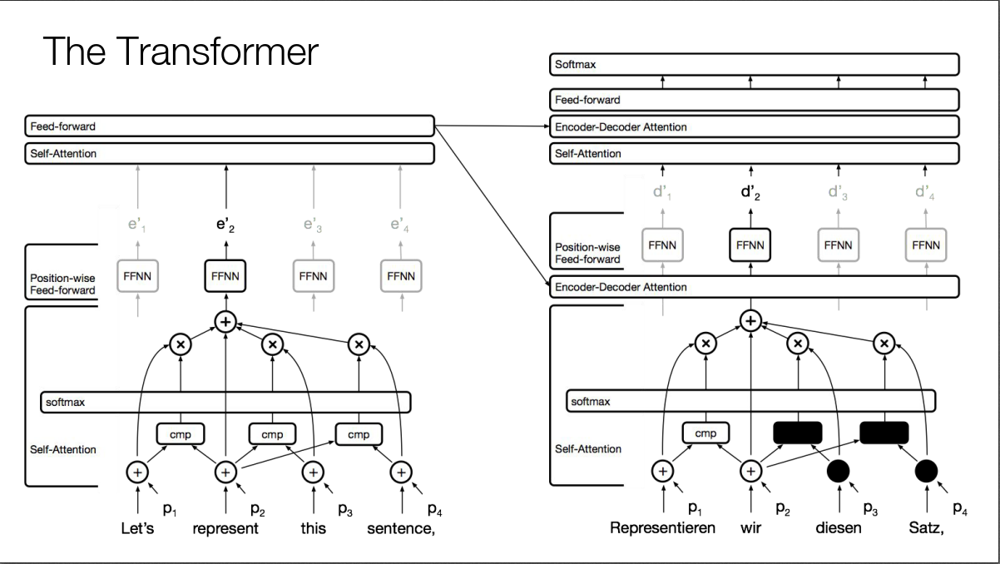
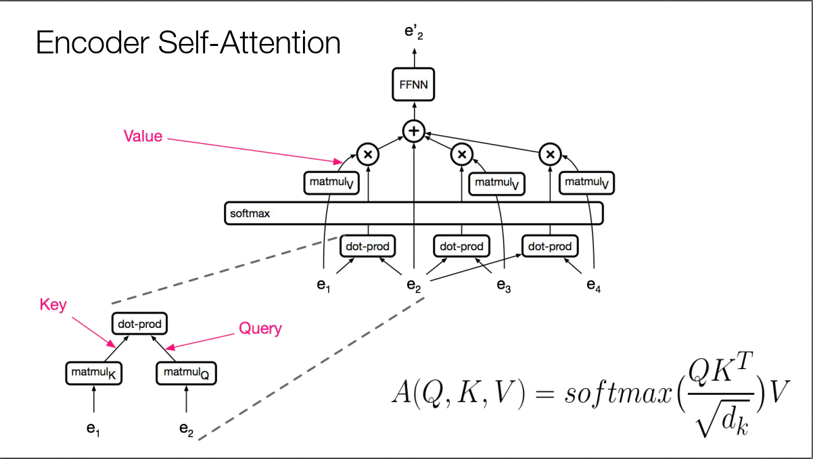
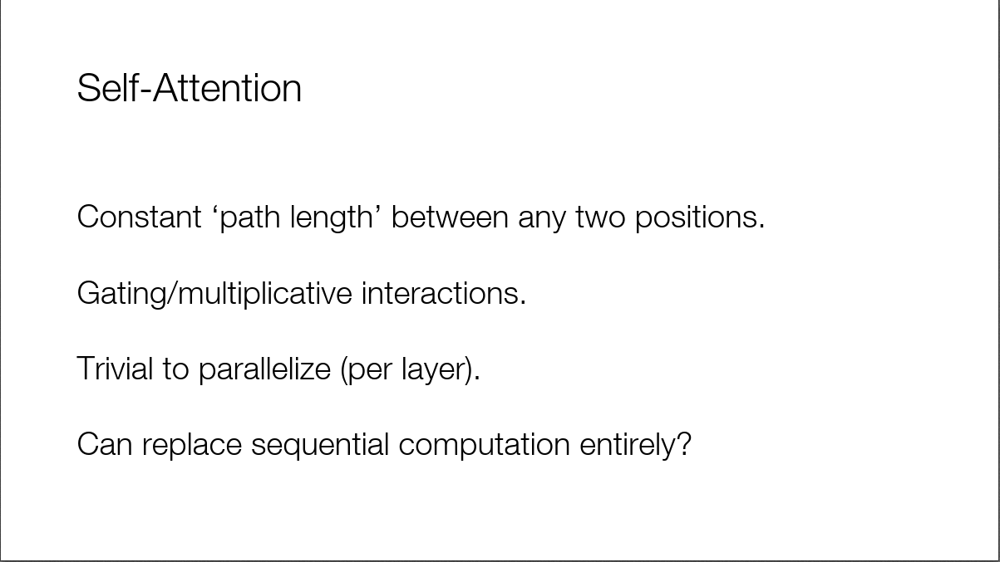
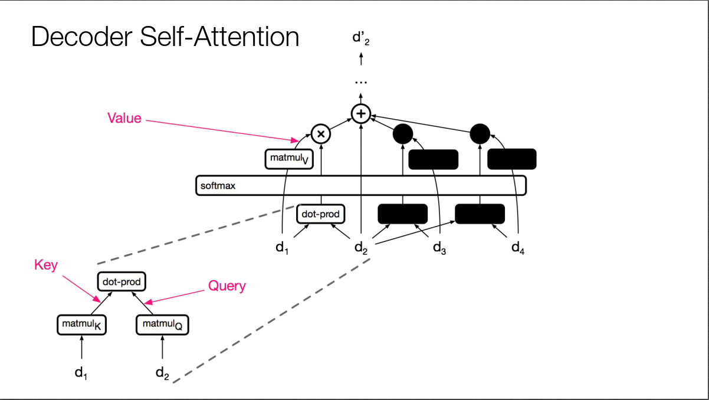
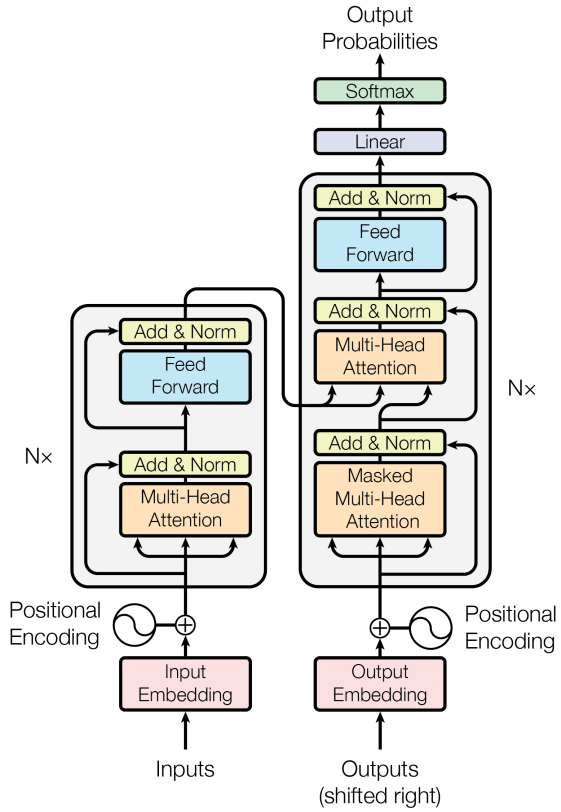
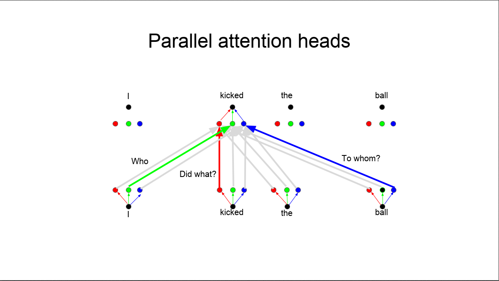

今天介绍大名鼎鼎的Transformer，它于2017年出自谷歌的论文《Attention Is All You Need》（[https://arxiv.org/pdf/1706.03762.pdf](https://arxiv.org/pdf/1706.03762.pdf)），用Attention实现机器翻译模型，并取得了新的SOTA性能。

传统的机器翻译模型一般是结合RNN和Attention，可以看我之前的博客介绍：[CS224N（1.31）Translation, Seq2Seq, Attention](https://bitjoy.net/posts/2019-08-02-cs224n-0131-translation-seq2seq-attention/)。虽然RNN+Attention的组合取得了不错的效果，但依然存在一些问题。由于RNN是序列依赖的模型，难以并行化，训练时间较长；且当句子很长时由于梯度消失难以捕捉长距离依赖关系。虽然相继推出的LSTM和GRU能一定程度上缓解梯度消失的问题，但这个问题依然存在。而且LSTM和GRU难以解释，我们根本不知道当前timestep依赖远的词多一点还是近的词多一点。

Transformer的思想很激进，它完全抛弃了RNN，只保留Attention，从其论文标题可见一斑。RNN无法并行化的根本原因是它的正向和反向传播是沿着句子方向（即水平方向），要想实现并行化，肯定不能再走水平方向了。于是，Transformer完全抛弃水平方向的RNN，而是在垂直方向上不断叠加Attention。由于每一层的Attention计算只和其前一层的Attention输出有关，所以当前层的所有词的Attention可以并行计算，互不干扰，这就使得Transformer可以利用GPU进行并行训练。

具体来说，Transformer的结构如下图所示。我们知道end2end的机器翻译模型一般都是Encoder+Decoder的组合，Encoder对源句子进行编码，将编码信息传给Decoder，Decoder翻译出目标句子。Transformer也不例外，下图左边即为Encoder，右边即为Decoder。

Encoder的每一层有两个子层组成，包括Self-Attention和Feed-forward neural network (FFNN)。FFNN就是常规的全连接网络，没什么可说的，下面重点介绍Self-Attention。

Encoder Self-Attention的结构如下图所示，由于此时是Encoder阶段，对于每个词，都能看到句子中所有其他的词（对应到RNN里面就是可以用双向的RNN）。假设我们想要抽取第二个词”represent”的特征表示。首先，对第二个词的词向量\(e_2\)进行线性变换，即乘以矩阵\(matmul_Q\)，得到Query，这就是标准Attention中的Query。其次，对周围所有的其他词，比如\(e_1\)，也进行线性变换，变换矩阵为\(matmul_K\)，得到很多的Key。然后，Query和所有Key做点积，并用softmax归一化，得到了Query在周围词上的Attention score distribution。接着，周围词乘以另一个线性变换矩阵\(matmul_V\)，变换为Value。最后，Value和Attention score distribution进行加权求和，并加上\(e_2\)自己，送给FFNN。图中右下角的公式中的分母只是个缩放因子。

回顾一下，一个标准的Attention包括三个向量：Q、K、V，其中Q为用来查询的Query，K表示被查询的Key，V表示被查询的Value。其中的K和V来源相同，只是经过了不同的变换。形象描述就是：计算Q在K上分配的注意力\(QK^T\)，然后从V中取出这部分注意力的值\(softmax(\frac{QK^T}{\sqrt{d_k}})V\)。

Self-Attention的优点。因为每个词都和周围所有词做attention，所以任意两个位置都相当于有直连线路，可捕获长距离依赖。而且Attention的可解释性更好，根据Attention score可以知道一个词和哪些词的关系比较大。易于并行化，当前层的Attention计算只和前一层的值有关，所以一层的所有节点可并行执行self-attention操作。计算效率高，一次Self-Attention只需要两次矩阵运算，速度很快。

Transformer的Decoder部分每一层有三个子层组成，包括Self-Attention、Encoder-Decoder Attention和FFNN。Decoder的Self-Attention如下图所示，和Encoder的Self-Attentoin非常像，只不过当要Decoder第二个词时，用黑框蒙住了第三、四个词的运算（设置值为-1e9）。因为对于机器翻译来说，Encoder时能看到源句子所有的词，但是翻译成目标句子的过程中，Decoder只能看到当前要翻译的词之前的所有词，看不到之后的所有词，所以要把之后的所有词都遮住。所以这个Attention也叫Masked Self-Attention。这也说明Transformer只是在Encoder阶段可以并行化，Decoder阶段依然要一个个词顺序翻译，依然是串行的。

不要忘了我们的任务是机器翻译，Decoder Self-Attention只用到了翻译出来的目标句子的前缀信息，还没用到源句子的信息，这部分就在Encoder-Decoder Attention中。前面说了对于源句子，通过Encoder的Self-Attention+FFNN，源句子的每个词都有一个输出向量，这些输出向量作为Encoder-Decoder Attention的Keys和Values，而从目标句子当前要翻译的词的Decoder Self-Attention出来的向量就是Encoder-Decoder Attention的Query。从下图可以看到，Encoder上面出来指向右边Multi-Head Attention的两个箭头就是Keys和Values，而从下面出来指向Multi-Head Attention的一个箭头就是Query。Encoder-Decoder Attention的作用就是看看当前要翻译的词在源句子中各个词上的注意力情况。

我们知道Attention机制是位置无关的，因为对于每个词，它都和句子中的所有词直连求Attention score，跟词在句子中的位置没有关系。但是句子作为一种线性结构，词在句子中的顺序对句子的含义至关重要。为了考虑词的位置信息，词在输入Attention前，把词向量和词在句子中的位置Positional Encoding加起来，得到一个新的向量，输入到Attention中，如上图所示。这个Positional Encoding可通过公式计算得到，这里不展开。

上图的Attention前面都有一个修饰词Multi-Head，也就是下图的Parallel attention heads。前面提到一个标准的Attention包括三个向量Q、K、V，它们分别由原始的查询向量和特征向量乘以矩阵\(matmul_Q\)、\(matmul_K\)、\(matmul_V\)得到。如果一个词在计算Attention时，选用多个不同的\(matmul_Q\)、\(matmul_K\)、\(matmul_V\)，得到的Attention输出向量也就不同了，这正好可以用来表示一个词在句子中的不同作用。比如句子“华为是一家中国的公司”中的“华为”，它的语义是一家公司，它在句子中的成分是主语，也就是说一个词至少有其语义信息和句法信息，如果只用一套\(matmul_Q\)、\(matmul_K\)、\(matmul_V\)，则只能得到一种含义，如果设置多套\(matmul_Q\)、\(matmul_K\)、\(matmul_V\)，则能提取到这个词更多的信息。于是，在对每个词进行Attention时，都会设置多套\(matmul_Q\)、\(matmul_K\)、\(matmul_V\)，提取多个Attention输出向量，然后拼接起来，这就是Multi-Head Attention，或者说Parallel attention heads。我个人理解多套\(matmul_Q\)、\(matmul_K\)、\(matmul_V\)相当于CNN中不同的kernal，相当于不同的特征提取器。

课上还介绍了利用Transformer生成图片和音乐的应用，感兴趣的同学可以搜索相关论文看一看。

有关Transformer的介绍，还可参考如下三个链接：

* [http://jalammar.github.io/illustrated-transformer/](http://jalammar.github.io/illustrated-transformer/)
* [https://zhuanlan.zhihu.com/p/48508221](https://zhuanlan.zhihu.com/p/48508221)
* [https://zhuanlan.zhihu.com/p/44121378](https://zhuanlan.zhihu.com/p/44121378)