今天要介绍的内容比较多，但都是概述性的内容，主要了解自然语言生成领域的进展。

---

# Section 1: Recap LMs and decoding algorithms

之前已经讲过什么是语言模型，语言模型就是给定句子中的一部分词，要求预测下一个词是什么。形式化表述就是预测\(P(y_t|y_1,…,y_{t-1})\)，其中的\(y_1,…,y_{t-1}\)就是目前已知的词，\(y_t\)就是要预测的下一个词。

条件语言模型是指除了已知\(y_1,…,y_{t-1}\)，还给定了\(x\)，这个\(x\)就是提供给语言模型的额外的信息。比如机器翻译的\(x\)就是源语言的句子信息；自动摘要的\(x\)就是输入的长文；对话系统的\(x\)就是历史对话内容等。

需要提醒的是，语言模型在训练阶段，输入Decoder的是正确的词，这种方法被称为Teacher Forcing，即不论上一步的输出是什么，都强制给这一步输入正确的词。而如果在测试阶段，Decoder的输入是上一步的输出。

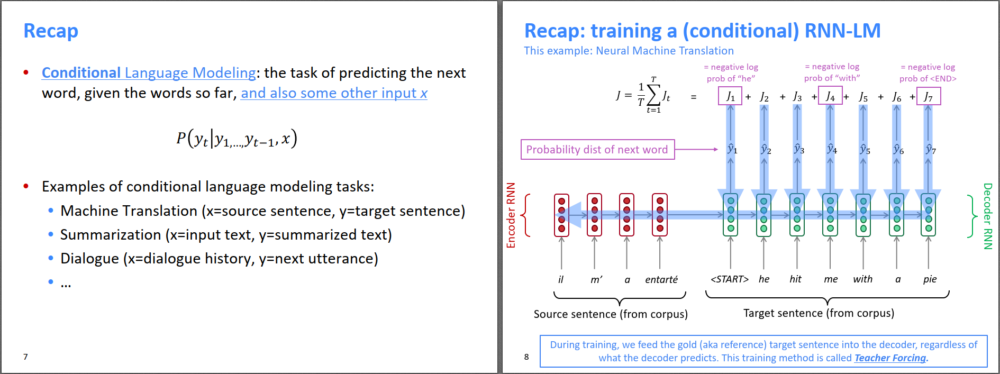

在机器翻译那期的博客中（[CS224N（1.31）Translation, Seq2Seq, Attention](https://bitjoy.net/posts/2019-08-02-cs224n-0131-translation-seq2seq-attention/)），我们曾提到过在测试阶段，语言模型的Decoder有两种策略，一种是Greedy search，另一种是Beam search。Greedy search是指当前步的输入是上一步输出中概率最大的词。而Beam searh是指不但保留概率最大的词，还要保留概率在Top-k的词，那么在每一个时间步，都会有k条路径，最后选一条概率最大的路径。

那么，Beam search中保留的Top-k到底取多少合适呢？当k=1时，Beam search退化为Greedy search，产生的句子可能会不够自然，甚至难以理解。增大k会使得产生的句子的全局概率更大，读起来会更通顺一些。但是k的增大也会带来一些问题，比如：计算量增大；对于NMT任务，k的增大会导致翻译出来的句子更短，BLEU得分更低；对于对话系统，k的增大会导致产生的句子过于“安全”和“通用”，也就是和当前对话没有太大关系但又比较通顺的句子。

比如下面右图的例子，k=1时，回答和对话有点关系，但句子语法有问题；k=6时，句子很同时，但感觉答非所问。

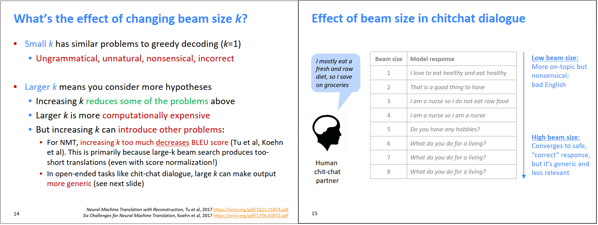

事实上，除了Greedy search和Beam search，还有其他的decoding方法。下面是两种基于采样的decoding方法。

Pure sampling：每个时间步t，根据softmax输出的概率分布进行采样，来决定t时刻最终输出的词。Top-n sampling：只在概率top-n的词中采样，相当于对Pure sampling的概率分布进行truncate。两种方法都是单路径的，不像Beam search那样保留多条路径。由于两种方法都是通过采样决定输出，属于随机算法，所以每次运行算法输出都不一样，可增加句子的多样性，比较适合于对话系统。

还有一种可以改变语言模型输出概率的方法，就是Softmax temperature，带温度的Softmax，如下图所示。当t越大，分布变得越扁平，削弱了大和小的差别；t越小，则分布变得越尖，大的越大，小的越小。配合不同的decoding算法，可以控制产生句子的流畅度、平庸度、或者新奇度等。

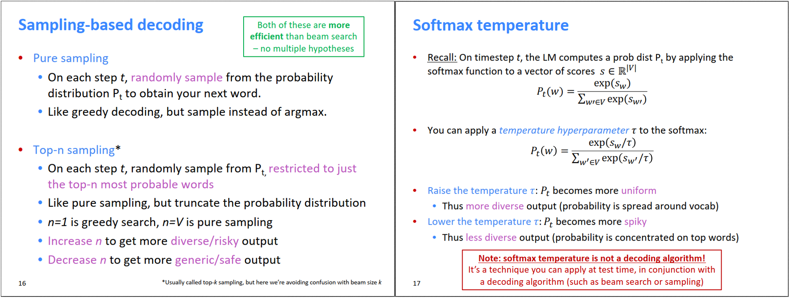

以下是语言模型的decoding算法小结。

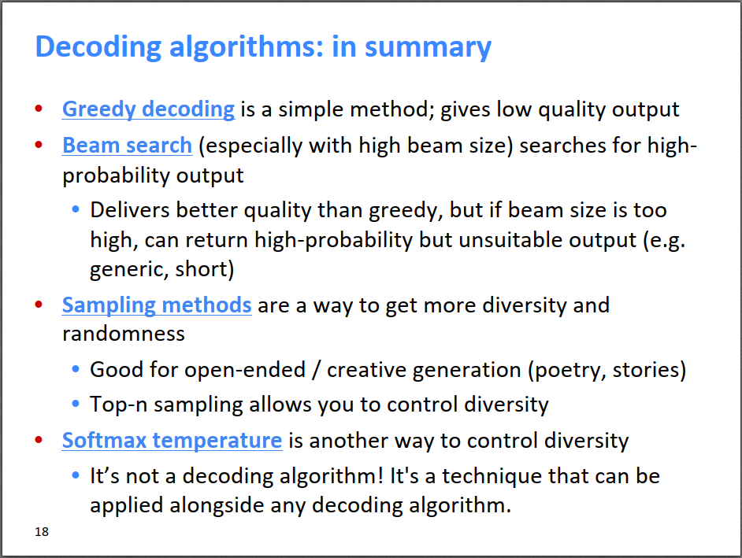

---

# Section 2: NLG tasks and neural approaches to them

自然语言生成是一类生成新文本的任务，包括机器翻译、自动摘要、对话系统（聊天机器人）、写作机器人、看图写作等。下面对其中几个任务进行简单的介绍。

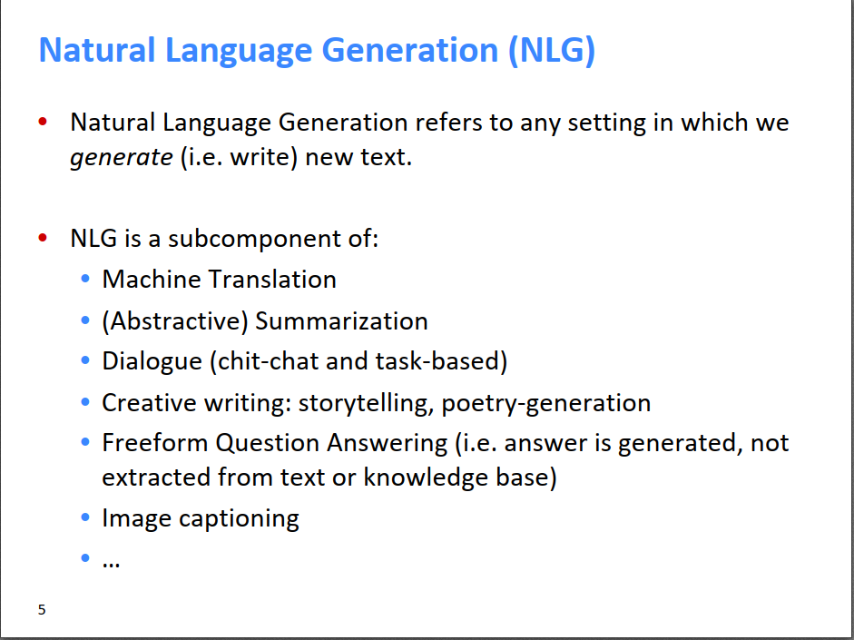

自动摘要的定义是，给定长文本x，要求生成短文本y，y能概括x的主要内容。自动摘要又分为x是单文档或多文档两类。

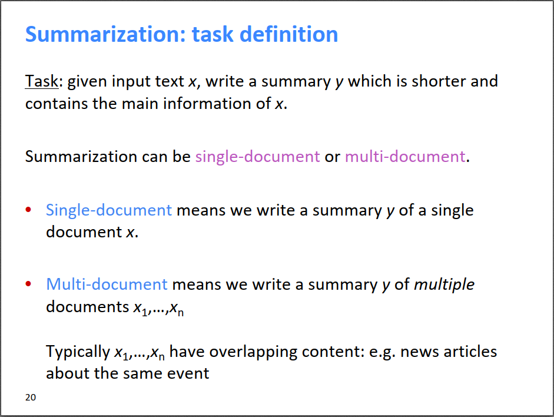

（左图）自动摘要的一些数据集。Summarization：根据长文本写一个短句子作为长文本的摘要，就是常规意义的自动摘要。Sentence simplification：把复杂的句子转换为简单的句子，通常转换后的句子比源句子短，主要是换成更简单易懂的词，用简单的句子结构替代复杂的句子结构等，比如把新闻转换为儿童容易读懂的新闻。

（右图）两种自动摘要的策略对比。Extractive summarization是指摘要的句子从原文中提取；Abstractive summarization是指使用语言模型生成新的句子作为摘要。前者类似于从原文中高亮某些关键句子，后者相当于用笔创作出新的句子作为摘要。

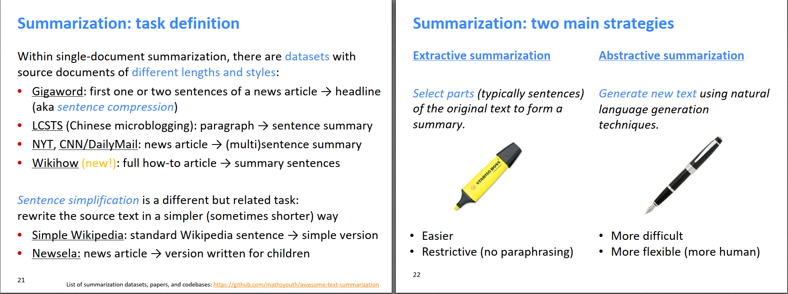

前神经网络时代的自动摘要大多数是Extractive summarization，是一个pipeline，很复杂，可能会用到各种不同的算法。

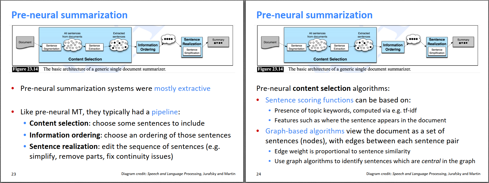

自动摘要的评价指标ROUGE。ROUGE和BLEU类似，都是基于模型输出和标准答案之间的n-gram的overlap，但是ROUGE不会对太短的摘要进行惩罚，而且ROUGE对不同的n-gram打分是分开的，而BLEU综合了n=1,2,3,4的n-gram结果。BLEU更关注precision，所以对太短（可能没有包含源句子的意思）的翻译有惩罚。ROUGE更关注recall，从其名称就可以看出来，在某个长度限制下，尽量包含长文的信息。）

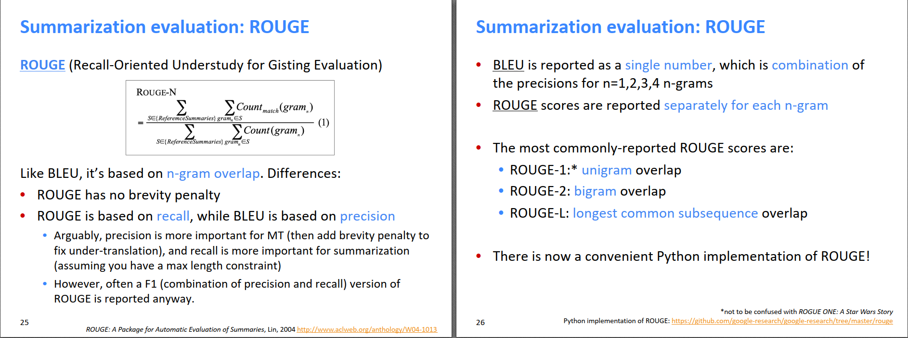

2015年开始，基于神经网络的自动摘要方法蓬勃发展。基本思路是把自动摘要看成从长句子到短句子的翻译任务，使用seq2seq+attention的方法解决，效果还不错。下图是一些技巧，感兴趣的可以搜索原文阅读。

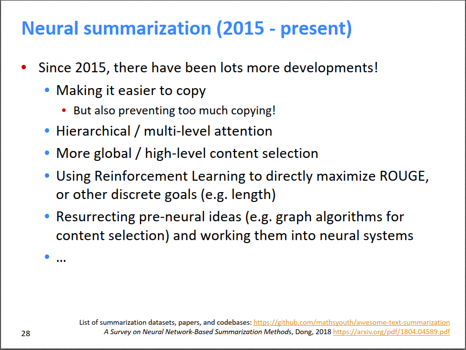

对话系统的分类：assistive：个人助手型；co-operative：协作型；adversarial：对抗型，辩论？chit-chat：聊天机器人；therapy：心理咨询师？

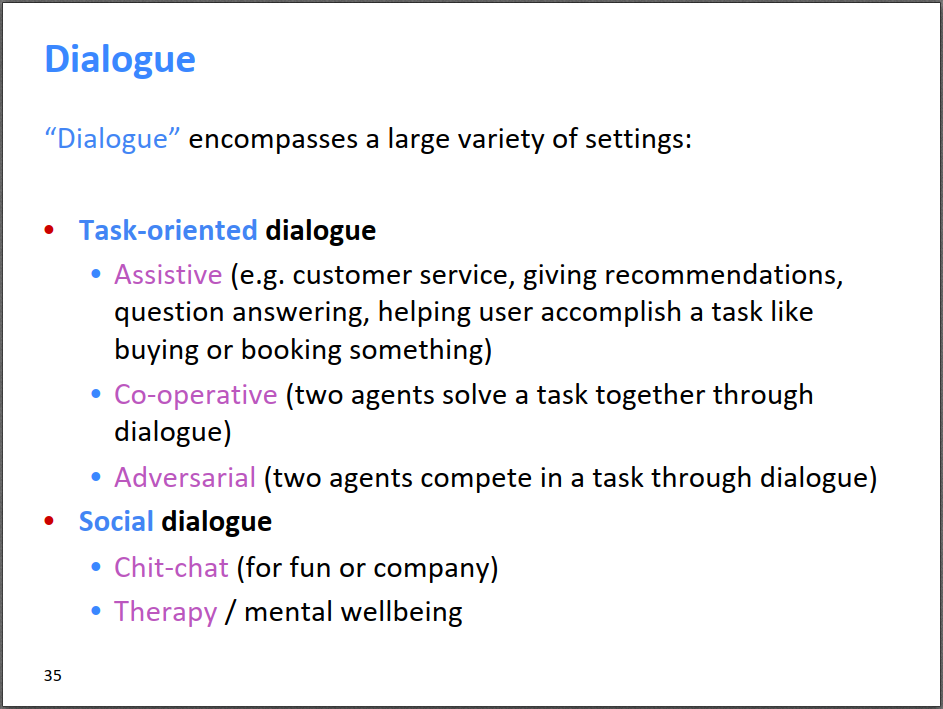

神经网络之前的做法是，事先设计一些问答模板，根据场景，给模板填充不同的内容。或者使用信息检索的方式，从问答库中检索问答。

2015年后，很多人开始用seq2seq+attention的方法做问答系统，但存在一些问题，如下。

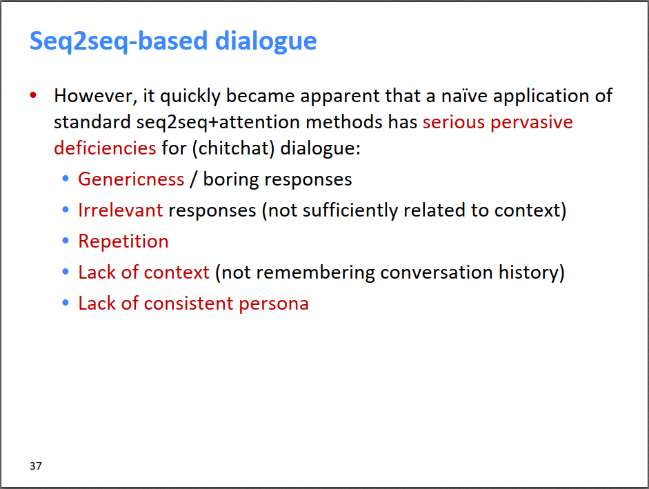

---

# Section 3: NLG evaluation

目前对自然语言生成模型没有特别好的评价指标，像BLEU和ROUGE都是基于n-gram的overlap。因为是n-gram的overlap，ROUGE对extractive summarization的打分会稍微高一点。这也很好理解，因为extractive summarization是从长文中截取一部分短语，无论是人工标注的答案还是模型输出，都会更容易一些，n-gram的overlap也就更高一些。而abstractive summarization的话，人工标注的答案由于标注的人的不同，用词等各方面都会不同，模型输出也不同，导致n-gram的overlap较低。对于对话系统，由于更加灵活开放，就更没有什么好的指标了。

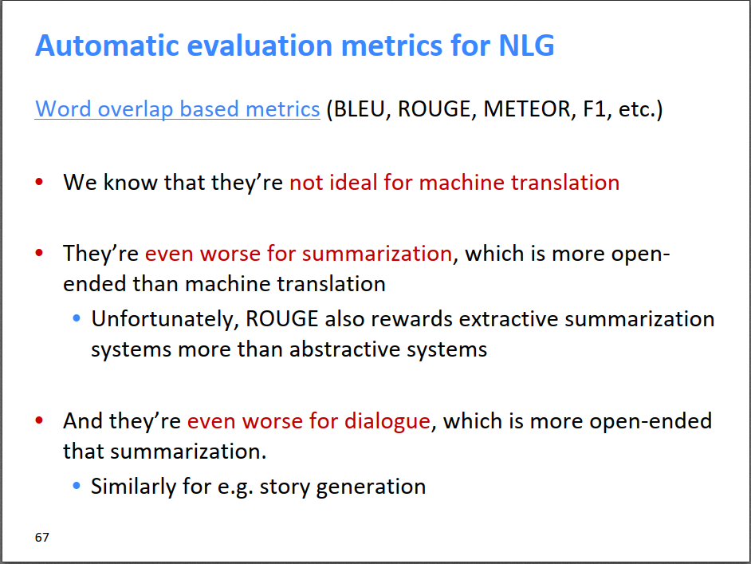

其他指标也不是很好：perplexity困惑度是用来衡量LM自身的好坏，但不能衡量NLG的好坏，比如一个句子非常通顺，用perplexity衡量的得分会很好，但如果这个句子不能很好的概括文章的摘要的话，那么它在自动摘要任务中的得分就很差。

基于word embeeding的指标，想法不错。我们知道BLEU和ROUGE都是基于n-gram的overlap，是离散的，而我们真正想要衡量的是翻译出来的句子含义是否正确，自动摘要生成的句子能否表达原文的意思等。也就是说，本质上我们要衡量的是生成的句子的含义是否符合要求。n-gram只是字面上的overlap，字面overlap不高并不代表表达的意思不对。所以基于word embedding的指标的想法是：比较生成的文本的词向量和标准答案的词向量是否相近，由于词向量是学到了词的隐含意思，那么基于word embedding相似度的方法也就能衡量生成句子和标准答案的相似度。但是，这种方法算出来的相似度和人判断的相似度的相关性依然不是特别好。

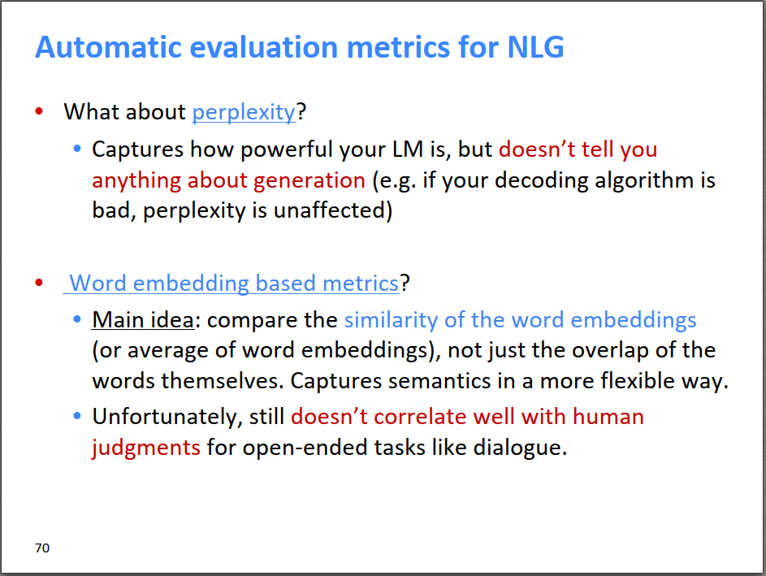

目前来说，对于NLG任务，还没有一个能衡量生成句子总体好坏的Overall的指标，但是可以用一些细分指标，重点关注生成文本在某方面的表现，比如流畅度、多样性、相关性等。

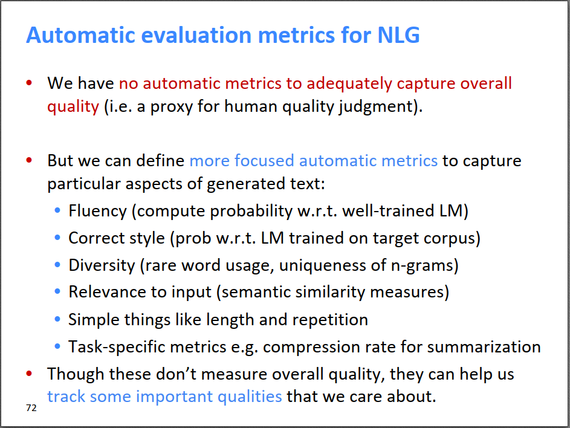

---

# Section 4: Thoughts on NLG research, current trends, and the future

在自然语言生成方面，未来的趋势可能有。

融合离散潜在因素。

句子生成时，并行生成所有的词，而不是像现在这样生成第t个词后才生成第t+1个词。这个方向我估计未来会有较大的进展，现在Transformer已经突破了Encoder阶段的串行问题，估计未来在Decoder也会有类似Transformer的工作出现。

训练阶段，除了Teacher forcing之外的方法。

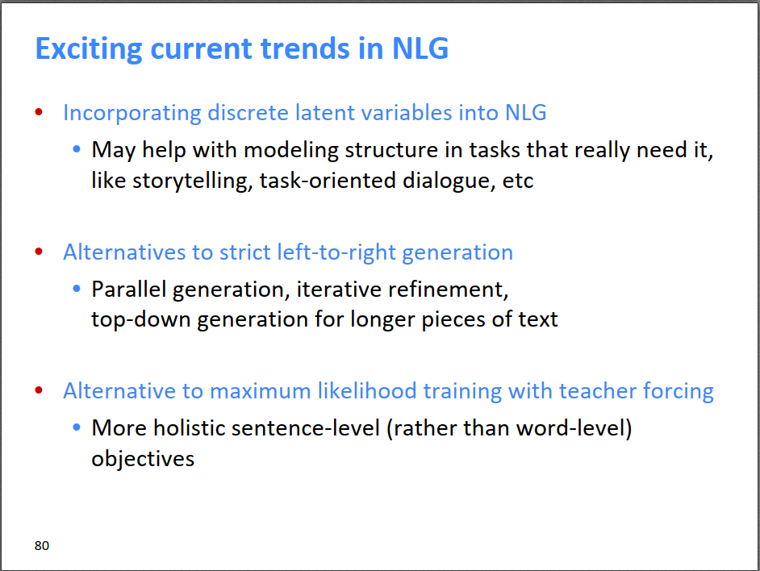

由于今天的课程概述性的内容很多，博客里也引了课上的很多PPT，感兴趣的可以直接看完整版的课件： [https://github.com/01joy/stanford-cs224n-winter-2019/raw/master/2.26/cs224n-2019-lecture15-nlg.pdf](https://github.com/01joy/stanford-cs224n-winter-2019/raw/master/2.26/cs224n-2019-lecture15-nlg.pdf)

