今天介绍的内容是指代消解（Coreference Resolution）。指代（mention）是指句子中出现的名词、名词短语、代词等，指代消解就是把指向同一实体（entity）的指代聚类到一起的过程。比如下面的两句话，蓝色的词就是很多的指代，需要找出来哪些指代是指向同一个实体。比如Barack Obama、his、He都是指奥巴马。

下面的例子是比较简单的情况，事实上，在真实的语言中，情况更加复杂，比如有些指代可能表示多个实体。比如“他们”，可能同时指代了“小明”和“小王”，这种指代对于现在的NLP模型来说比较难，暂时不考虑。

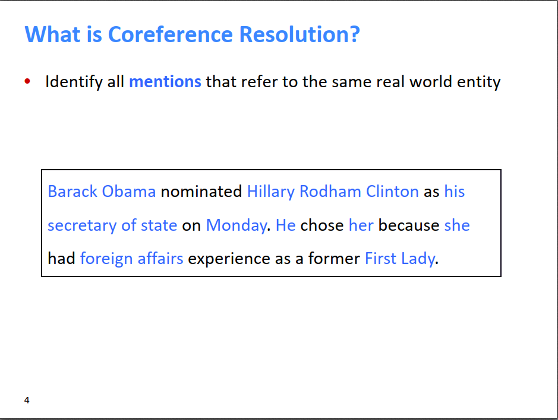

指代消解有很多应用场景，比如知道代词的含义之后，能更好地理解全文，进而能更准确的进行机器翻译，另外，在对话系统中进行指代消解能产生更正确的回答句子。

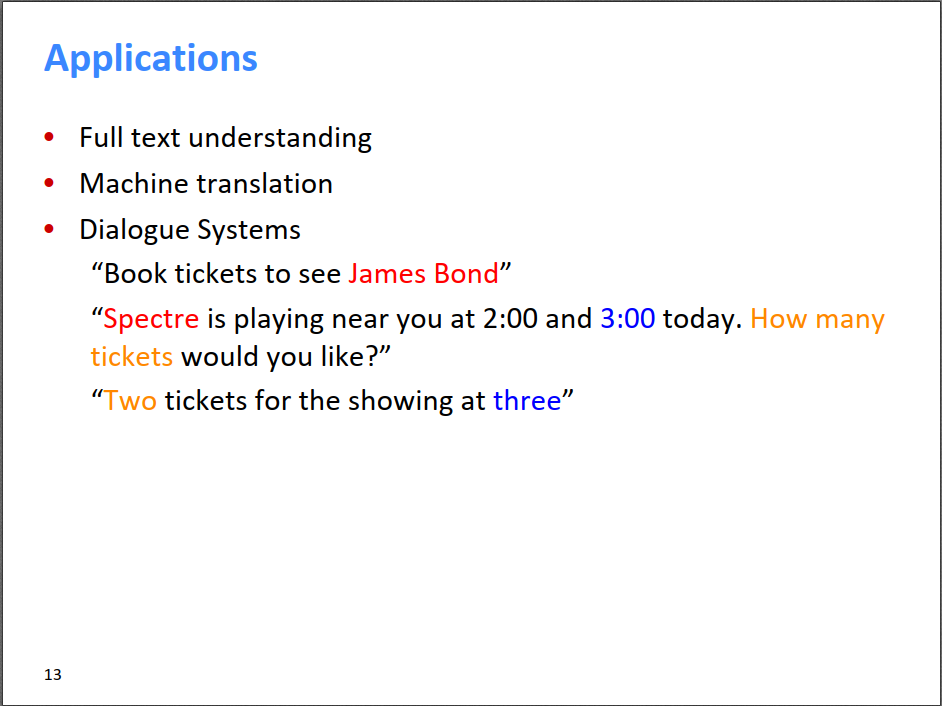

---

指代消解主要有两个步骤。第一步是指代识别（mention detection），即找出句子中所有的指代，这一步相对简单。第二步才是进行真正的指代消解（coreference resolution），这一步比较难，也是本节课的主要内容。

指代（Mention）是指句子中的一个短语（span），它可以是代词、也可以是命名实体、还可以是名词短语。指代识别的方法有多种，比如词性标注（POS）、命名实体识别（NER）、语法分析器（parser）等。

指代识别虽然相比于指代消解更简单，但也不是那么简单，它也有它自己的一些难题。比如下面列出的几个例子其实就不是指代，但用POS、NER等方法有可能把它们找出来，导致找出过多的指代（over-generates）。

一个简单的方法是，指代识别阶段尽量保召回率，保留所有找到的可能是指代的词，都参与后期的指代消解。如果一个指代没有找到它的共同指代（coreference），则说明这个指代是孤立的（singleton mention），有可能是指代识别阶段找到的不是指代的词，直接把它扔掉即可。

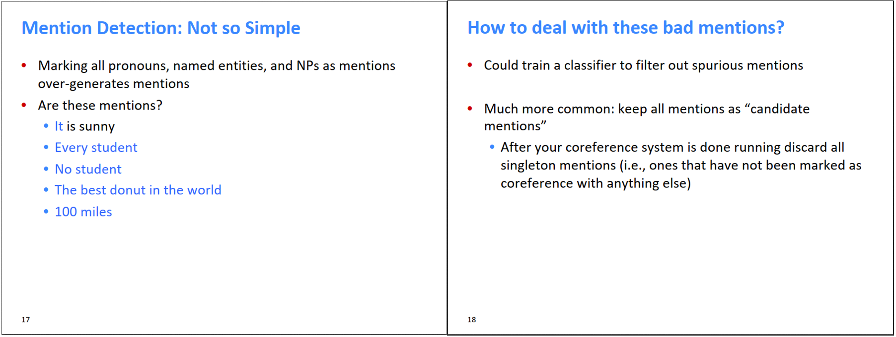

---

指代消解发展至今，经历了四种不同的方法，分别是Rule-based、Mention pair、Mention Ranking和Clustering。下面分别介绍每一种方法。

1976年Hobbs提出了基于规则的朴素算法，被后人称为Hobbs算法。该方法有9个步骤，包含了很多规则，非常繁琐，这里就不具体介绍了。Hobbs算法虽然是基于规则的，但在当时取得了不错的效果，现在也常常作为该领域的baseline模型。但是因为该方法是基于规则的，有很多指代消解没法解决。比如下图的两组例子，它们的句子结构完全相同，但指代不同，基于规则的Hobbs算法如果正确消解了第一个句子的指代，则肯定无法正确消解第二个句子的指代。

很明显，要想同时正确消解两个句子的指代，必须像人一样理解句子的含义。所以，指代消解也可以作为图灵测试之外的实验，用来测试AI的智力。如果AI能100%准确完成指代消解，AI的智力也就达到了人类的水平。

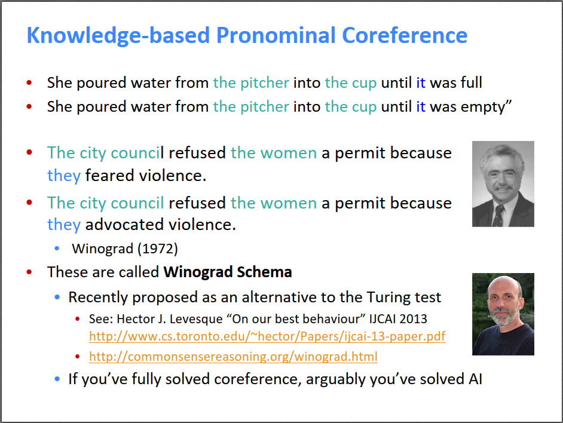

---

比较简单的Mention pair的方法。该方法把指代消解问题转化为一个二分类问题。从左到右遍历句子，每找到一个指代，就把它和前面找到的每个指代作为一个pair，问分类器这个pair是否指代同一个实体，如果是的话，就把它们连起来。二分类的损失就是交叉熵。很简单的一个模型。

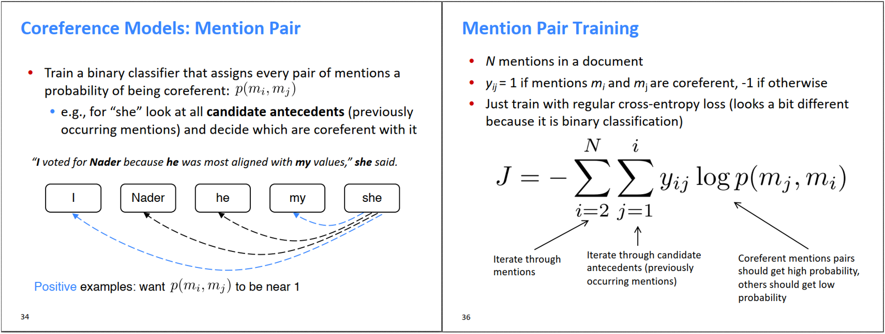

该模型在测试的时候，设定一个概率阈值，比如把所有概率超过0.5的指代pair都连起来，然后所有连在一起的指代作为一个聚类。如果一个指代不与任何其他指代连接，则它可能不是一个指代。这种方法有over-cluster的风险，即万一有一根线连错了，则会导致原本属于两个cluster的所有指代归为一个类。

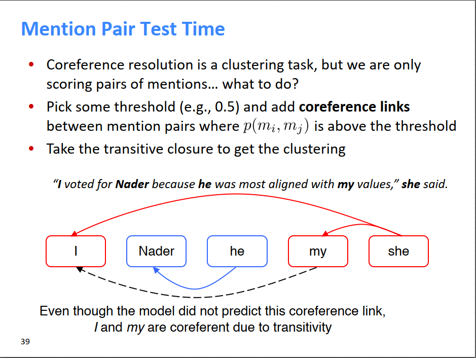

Mention pair模型的不足：对于很长的句子，可能会找到很多指代，而一个指代的先行词（antecedent）往往只有一个，但mention pair方法却把它和它前面的所有指代都pair进行指代消解。比如下面的例子，最后的he明确的指代是紧邻它的前一个Nader，但却需要把he和前面的4个指代都pair进行消解，无形中增加了计算量。可能的解决方法是只让模型预测一个先行词，也就是mention ranking方法。

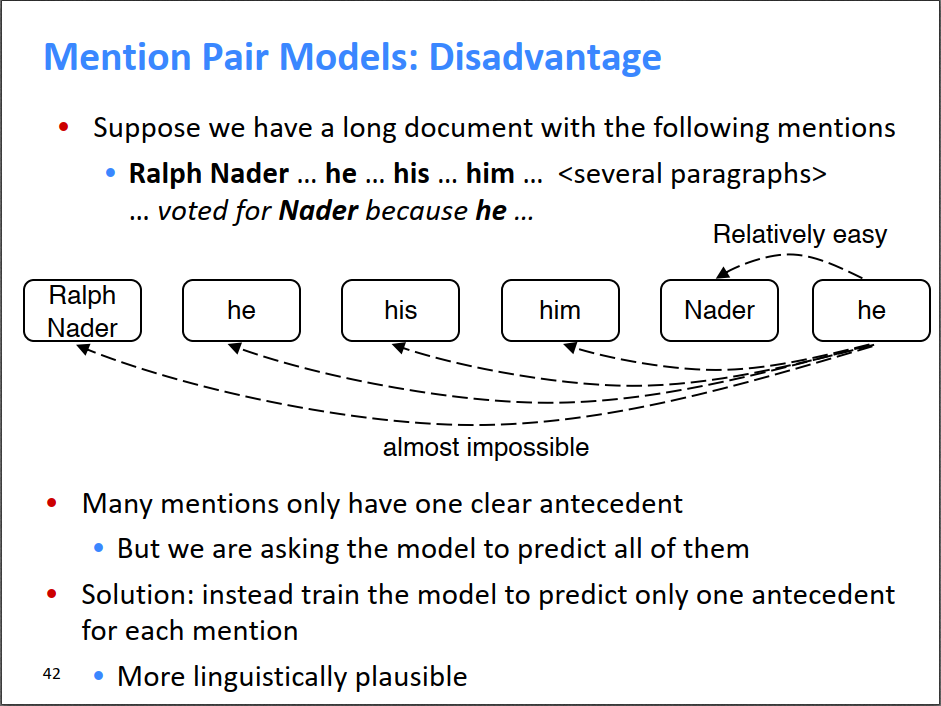

---

Mention ranking的方法。每个指代同时和前面所有指代打分，用softmax归一化，找出概率最大的先行词，添加一条连边。注意需要添加一个NA节点，因为有的指代可能第一次出现，前面没有先行词，或者这个指代根本就不是一个真正的指代。

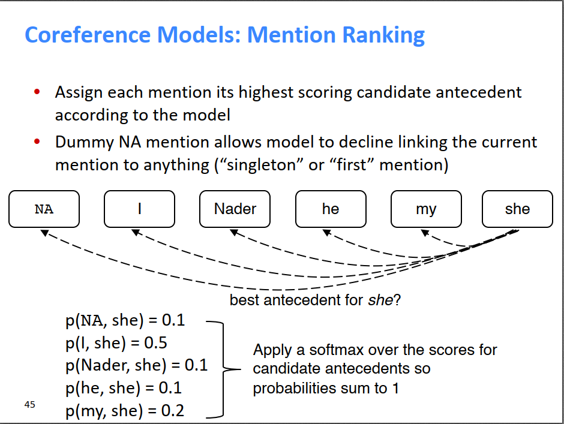

Mention ranking在训练时的损失函数如下：i：对于每一个指代；j：看看其前面的所有指代，最大化i所指代的j的概率\(1(y_{ij}=1)p(m_j,m_i)\)。

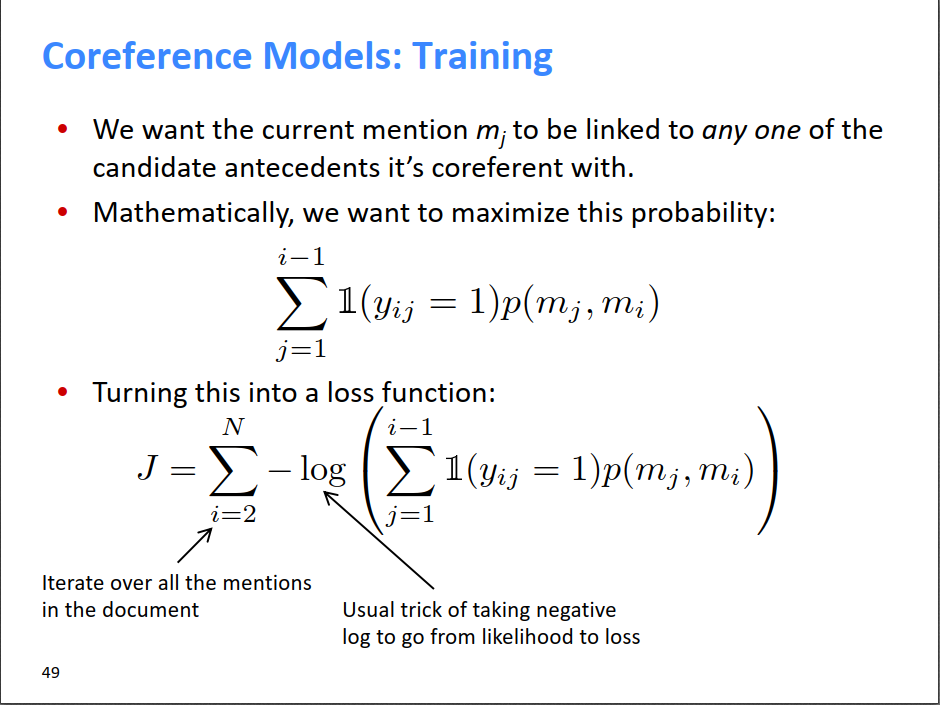

测试的时候与mention pair类似，把有边连的指代聚类到一起。

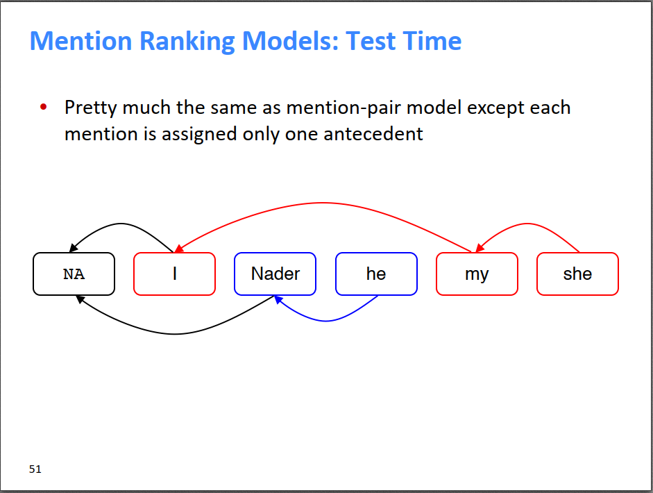

---

前面的内容都是假设我们计算好了任意两个指代是coreference的概率，那么，如何来计算这个概率呢？主要有三种方法，分别是Non-neural statistical classifier、Simple neural network和More advanced model using LSTMs, attention。下面分别介绍这三种方法。

A. Non-neural statistical classifier。统计机器学习方法，抽取每个指代的各种特征，然后用机器学习分类器来计算两个指代是coreference的概率。这里面的特征包括人称、性别一致性，语义相容性等等，如下图所示。

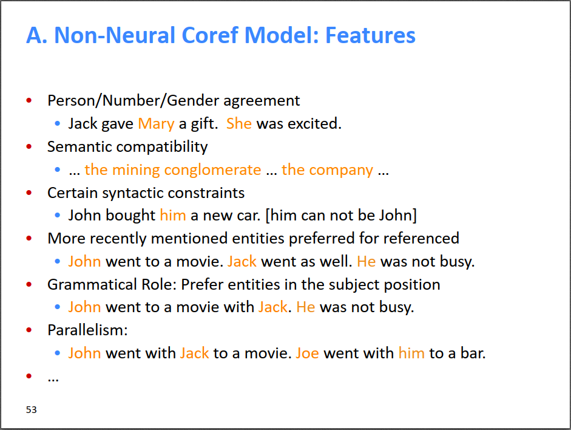

---

B. Neural Coref Model。输入是候选先行词和当前指代词的词向量，还需要加入一些额外的特征（Additional Feature），也就是上面统计机器学习方法里用到的一些特征。中间是FFNN，即全连接网络，最后输出两个指代是coreference的概率。

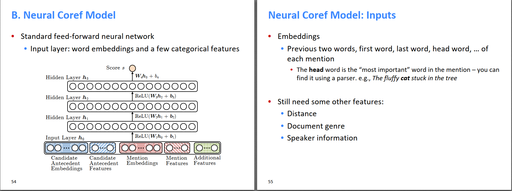

---

C. End-to-end Model。end2end模型是目前指代消解的SOTA模型，它把指代识别和指代消解两个任务融合到一起，用一个模型来解决。

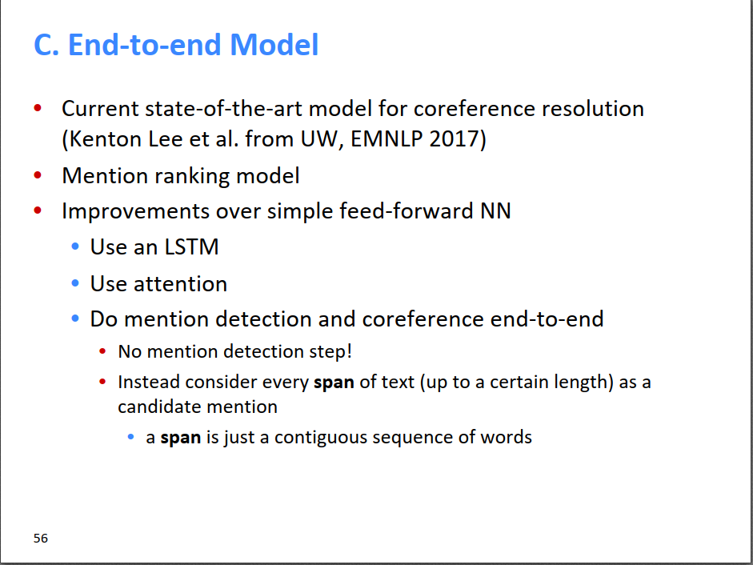

它的网络结构如下左图所示。由于该模型同时完成了指代识别和指代消解两个任务，所以它需要枚举句子中任意两个词之间的span是否是一个指代，以及这个指代与其他指代是否是coreference的关系。

具体来说，对于每个词i，输入网络中的是这个词的词向量以及charCNN词向量拼接起来的向量。然后送入bi-LSTM中，提取bi-LSTM两个LSTM的隐藏层向量，拼接起来作为词i的特征向量\(x^*\)。枚举包含词i的起始位置START(i)和终止位置END(i)，由起始位置到终止位置构成一个span，假设这个span可能是一个指代。一个span由向量\(g_i\)表示，它包含4个部分，分别是：span的起始和终止位置的特征向量\(x^*_{START(i)}\)和\(x^*_{END(i)}\)，包含这个span的起始和终止位置的特征；这个span的attention表示向量\(\hat{x_i}\)，提取这个span表示的核心信息，比如the black cat中cat是核心信息；以及一些额外的特征\(\phi(i)\)。

一个span的attention表示向量\(\hat{x_i}\)计算公式如下右图。span中每个词的特征向量经过全连接网络FFNN，得到一个attention打分，softmax归一化得到归一化的attention打分分布，最后加权平均起来。

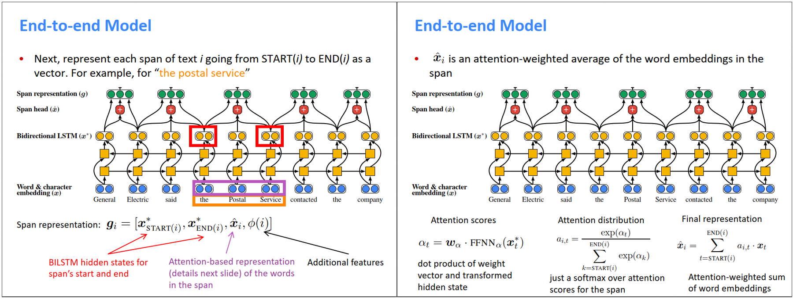

抽取了所有span的特征向量\(g_i\)后，需要完成两个任务，一是判断这个span是否是一个指代，二是判断任意两个span是否是coreference的关系。对于任意两个span i和j，它们的打分公式如下图所示，包含三部分，分别表示三个意思：span i是一个指代吗、span j是一个指代吗、span i和span j是coreference关系吗。三部分的概率计算方法也是全连接网络FFNN的方法。

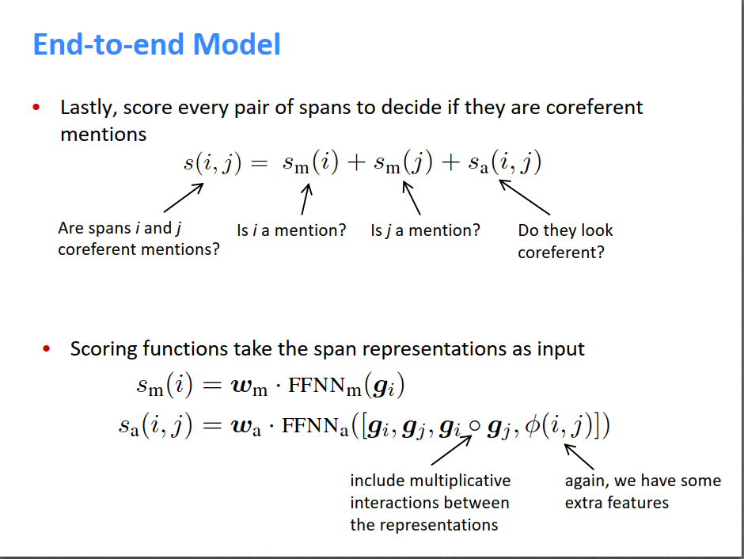

这个模型虽然是一个end2end的方法，看起来比较漂亮，同时完成了指代识别和指代消除两个任务，但它的复杂度太高了。假设句子中有T个词，枚举所有span需要O(T^2)的复杂度，然后枚举任意两个span又需要span^T的复杂度，综合起来就是O(T^4)的复杂度。由于复杂度太高，这个模型需要一个剪枝过程，其实就相当于需要一个指代识别器提前把指代找出来，这样就省去了枚举span的O(T^2)的复杂度。

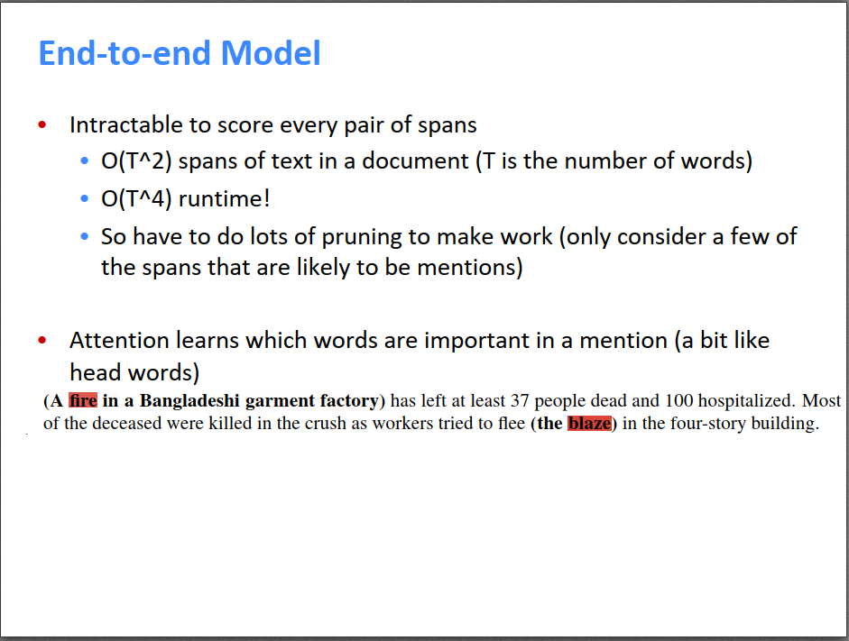

---

最后，介绍一种层次聚类的方法，是Manning老师提出来的。该方法的核心思想是说，在找到指代的情况下，指代消解的过程本质上是一个聚类的过程，所以我们对所有指代做一个聚类，一个类中的所有指代就表示同一个实体，是coreference的关系。那么，使用哪种聚类方法呢，使用自底向上的层次聚类方法agglomerative clustering。

以下图为例，对于找到的4个指代，我们发现Google和the company的关系比较近，Google Plus和the product的关系也比较近，首先把它们各自聚到一类。注意，此时对计算机来说，Google和Google Plus的关系无法判断，一方面它们在字面上有n-gram的overlap，但另一方面在句子中的含义可能不一样，这个时候还比较难判断它们是否有coreference的关系。但是，当cluster 1和cluster 2都形成之后，要判断{Google, the company}和{Google Plus, the product}的关系时，就比较容易了，因为the company和the product是比较容易区分的，由于它们在不同的类中，也就区分了Google和Google Plus。

层次聚类的方法相比于mention-pair的方法更简单，因为是类与类之间计算指代关系，一个类中有多个词，可以增加类之间的辨识度。

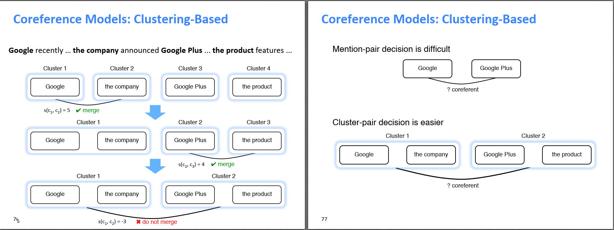

下面是对两个类进行相似度打分的模型，也是基于神经网络的方法，具体不介绍了。

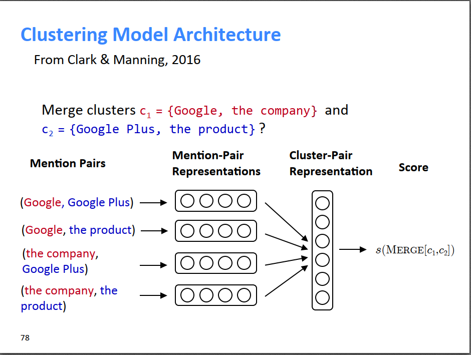

---

最后，介绍下指代消除的评价指标。上面提到，指代消除的过程本质上是聚类的过程，所以所有可用于评价聚类效果的指标都可以用来评价指代消除，比如指标MUC, CEAF, LEA, B-CUBED, BLANC等。

下图是一个B-cubed指标的例子，对于每个System cluster，计算其中的Gold cluster的Precision和Recall，然后取平均。如果欠聚类，则Precision很高，但Recall低；如果过聚类，则Recall很高，但Precision低，所以可以对P和R再求个F1。

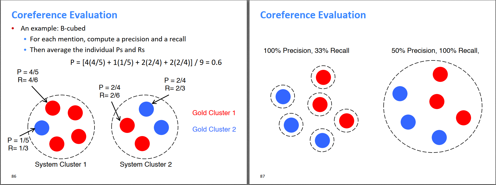

---

最后，指代消解领域目前的进展如下表所示，在OntoNotes数据集上，目前的SOTA就是上面介绍的end2end模型，该模型虽然比开始的Rule-based方法高了不少，但是本身的绝对性能其实还有很大的提升空间。

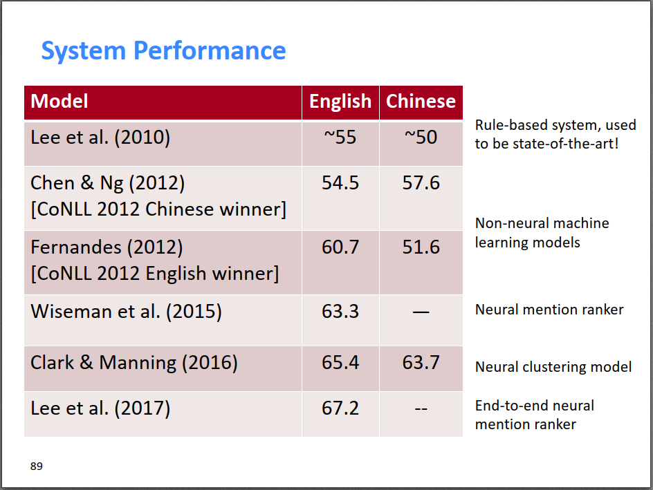
