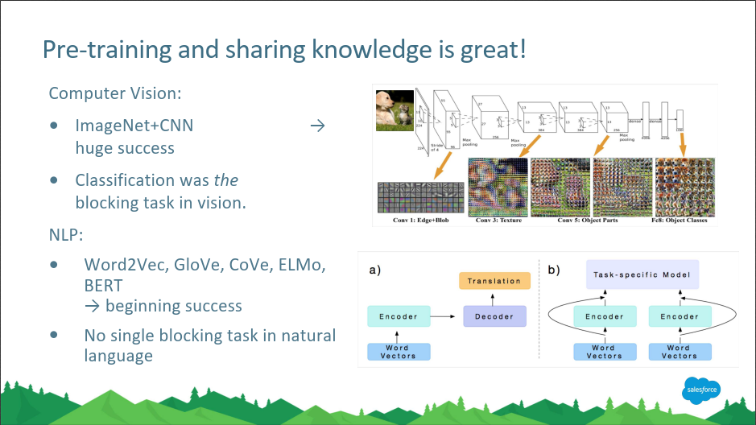
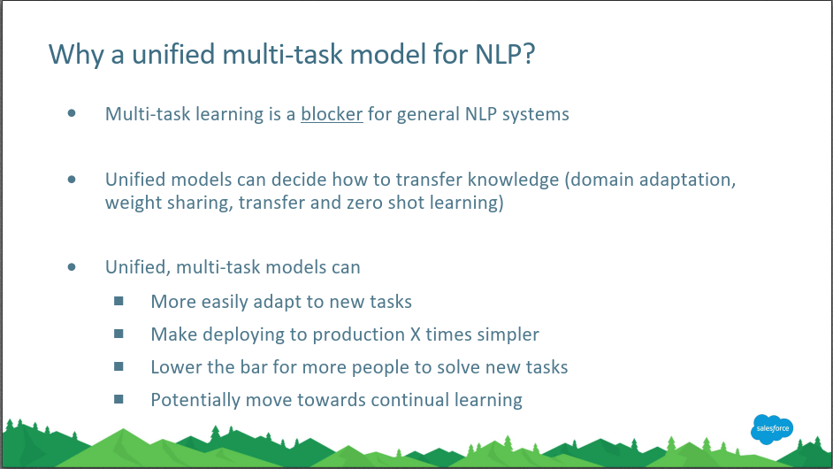
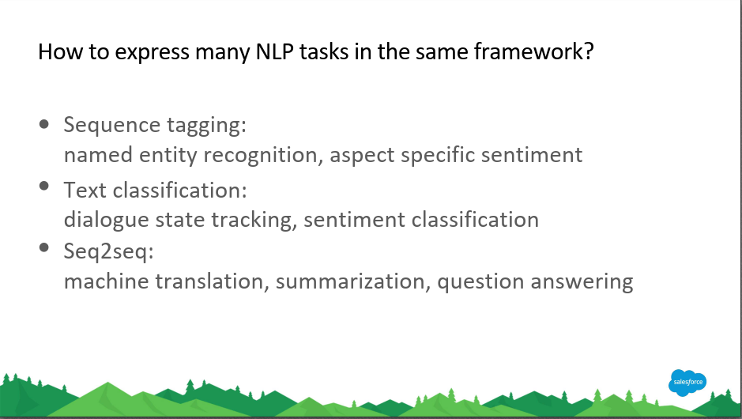
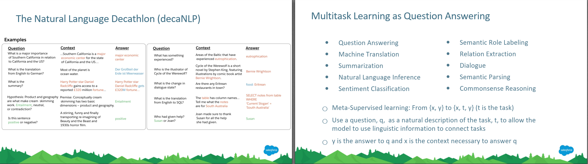
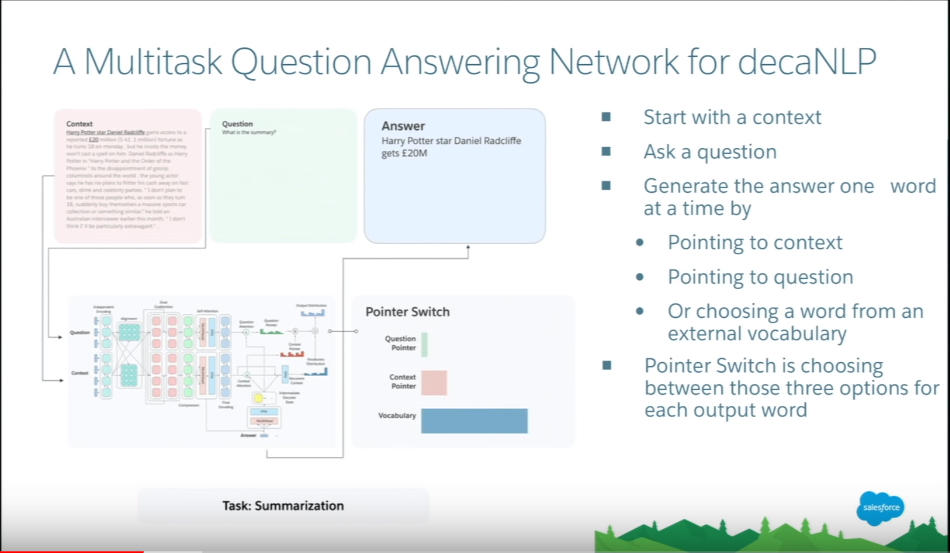
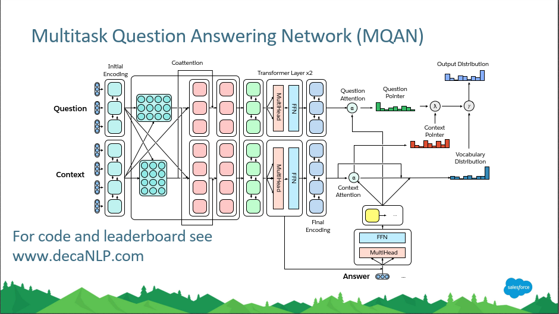
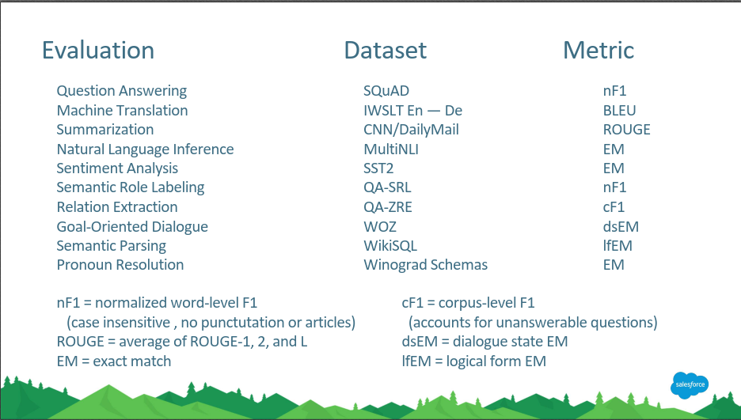
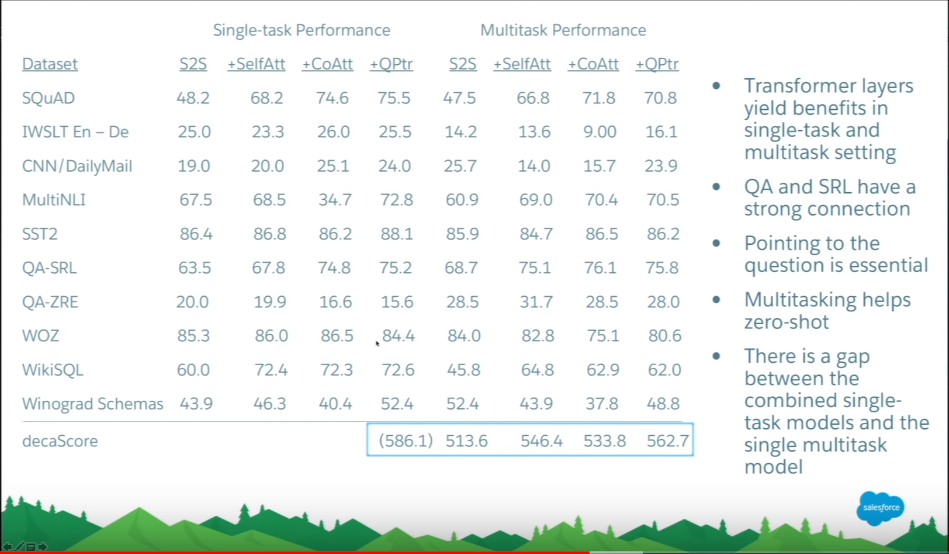
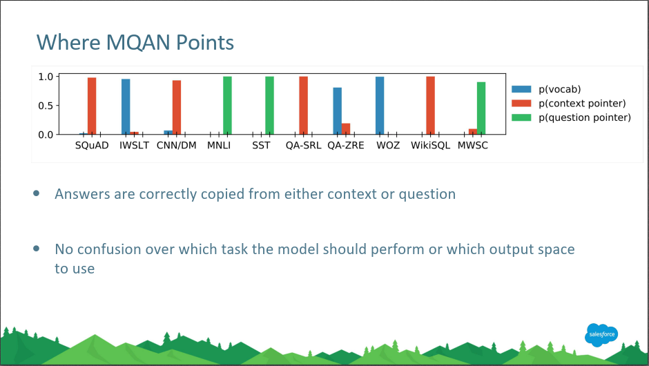
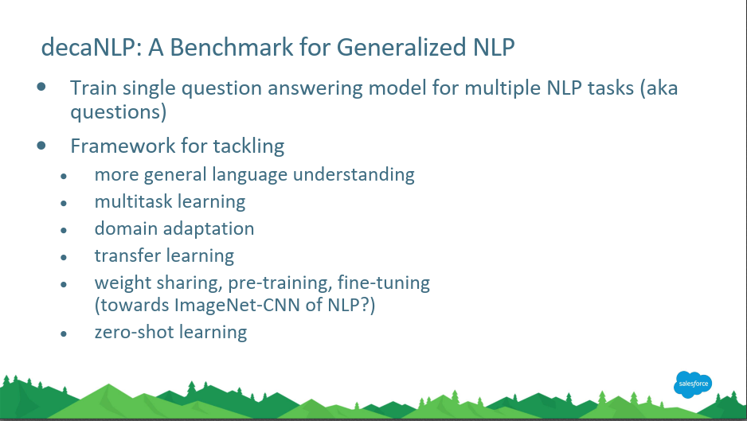

今天介绍NLP中的多任务学习。

我们知道预训练和参数共享在CV中很重要，很多模型都会在ImageNet上预训练，然后迁移到具体的任务中进行微调。这种方式能够成功的原因是很多CV任务几乎都是以分类为基础任务，分类相当于CV的积木（building block），所以在ImageNet上训练的CNN分类模型迁移到其他CV任务中能起到很好的提升效果。

NLP中虽然也有一些预训练模块，比如预训练词向量，然后用到具体的NLP任务中，但也仅仅是将词向量作为下游模型的输入。在NLP中，并没有一个基础模型（包括模型的结构、权重等），能把整个基础模型迁移到下游任务进行微调，现在都是针对不同的问题设计专门的网络结构，比如POS、NER、NMT等，处于不同任务各自为政的局面。

在NLP中，一个统一的多任务基础模型可以很方便地进行模型迁移、模型部署，并且对这个基础模型的不断改进，可以不断提高下游模型的性能，有可能达到持续学习、持续提升的目的，而如果每个新的子模型都重新学习的话，相当于利用不到基础模型长期学习到的知识。

但是，NLP领域有很多任务，比如序列标注、命名实体识别是一类；对整个句子的分类是一类；还有就是seq2seq的机器翻译、自动摘要等，要怎样将这些不同的任务统一到一个模型中呢？

可以把所有NLP任务统一成QA任务。如下左图所示，机器翻译转换为QA任务就是问这个句子翻译成另一种语言是什么句子，句子情感分类就是问这个句子表达的是积极还是消极的含义等等，所以所有NLP任务都可以转换为QA任务。PPT中列出了10个NLP任务都可以转换为QA任务，所以这个统一的基础任务相当于十项全能选手（decaNLP）。

设计这样一个十项全能的NLP模型，需要满足如下三个条件。1. 必须对十项任务一视同仁，也就是喂给模型的数据不能包含这条数据具体是哪个任务，不能告诉模型这条数据是要做NMT，另一条数据要做QA等。2. 模型也不能包含针对不同任务的特殊模块，模型必须学会自己辨别不同的任务类型，并且进行内部切换，执行不同的操作。3. 此外，模型还应具备执行这10个任务之外的任务的能力，即zero shot learning。

如下图是这个多任务QA模型的一个全貌。首先给一个上下文Context，然后给一个问题Question，最后模型输出答案。输出答案的时候，每次产生一个词，这个词可能来自Question、Context、或者Vocabulary，所以有一个指针开关，指向这个词可能的来源分布。

模型细节如下图所示，基本上是以前学过的模块，这里只是把它们组合起来了。

输入：固定词向量GloVe和charCNN，然后用bi-LSTM进行编码（Initial Encoding），注意这个bi-LSTM是Question和Context共享的，共享一套参数。输出就是Question和Context的每个词的隐藏层特征向量，图中Question有3个词，所以Initial Encoding后面有一个3*4的矩阵，3行就表示Question中的3个词，Context有4个词，也是类似的。

Coattention：以Question为例，Question自己的bi-LSTM输出经过一个attention，然后拼上Context的bi-LSTM输出再过一个attention，所以相当于Question和Context进行了co-attention。Context的也类似。

Transformer：Coattention出来后经过一层bi-LSTM、两层Transformer、再经过一层bi-LSTM，得到Question和Context最终的编码。这里的bi-LSTM就是Question和Context独立的了。

输出：Question和Context的Final Encoding输出又经过Attention，综合Question、Context和Vocabulary得到输出词的分布。

在训练阶段，PPT底部还提供了Answer，供误差反传。

收集的10个数据集，虽然不同任务的评价指标不同，但他们的值理论上都在0~100之间，所以模型总的得分是10个子任务各自得分的累加和。

性能表如下，看起来在大多数任务上，针对该任务单独训练的模型比Multitask模型的性能要好，但是在QA Zero shot relation extraction（QA-ZRE）任务上，Multitask具有比较大的优势。

训练技巧。不同的训练方式可能对模型的性能产生影响，这里介绍两种方式，一种是Fully joint，另一种是Anti-Curriculum。Fully joint，有10个不同的数据集需要训练，训练的时候，从每个数据集中抽一部分数据出来，组成一个batch进行训练，而不是依次训练第一个、第二个数据集这样子。Anti-Curriculum，训练的时候先训练难的任务，比如先在机器翻译上训练，再在句子情感分类上训练，因为情感分类任务相对简单，如果先在这上面训练的话，很容易达到局部最优，到时候就很难爬出来再针对机器翻译训练了；而如果先在更难的机器翻译上训练的话，得到泛化能力更强的模型后再在情感分类上训练就容易得多了。仅仅是训练方式的不同，Anti-Curriculum比Fully joint的测试得分会有所提高。

但是多任务模型的性能依然弱于单任务模型，发现主要在机器翻译数据集上，多任务模型的性能较大地差于单任务模型，可能是因为机器翻译的输出词大多数不在Question和Context中，而是在Vocabulary中。作者近期又有很多改进，使得多任务一个模型的总性能已经很接近多个单任务模型的性能总和了。

最后，愿景，希望把decaNLP变成NLP的ImageNet-CNN模型，以后大家的模型都可以基于decaNLP进行fine-tune和改进。

