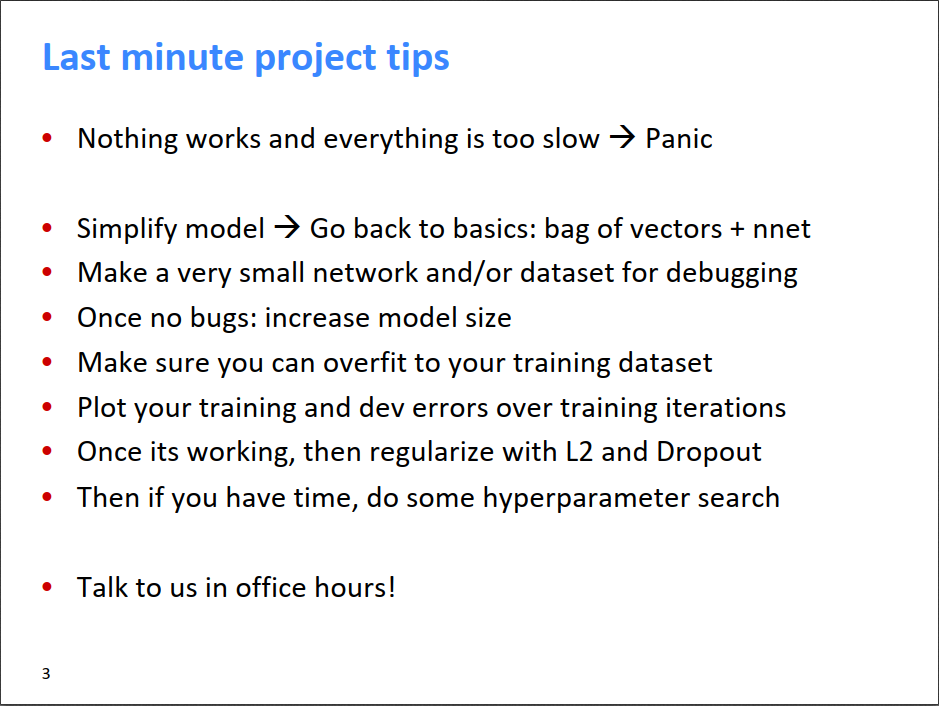
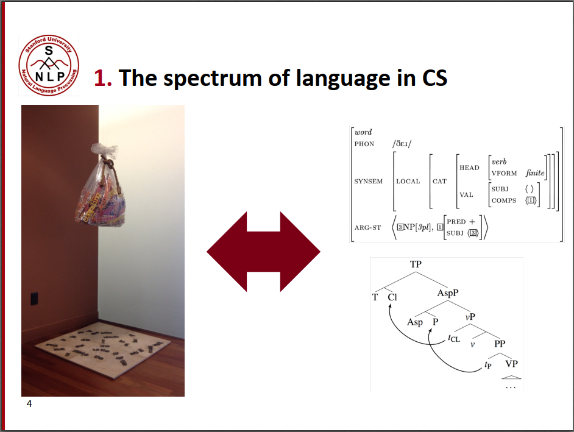
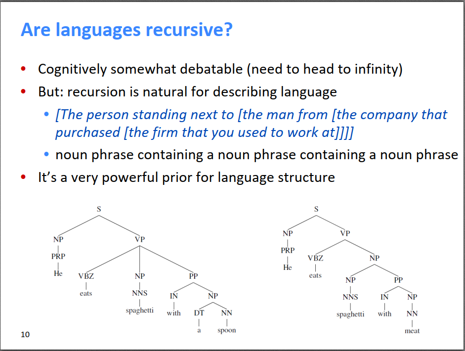
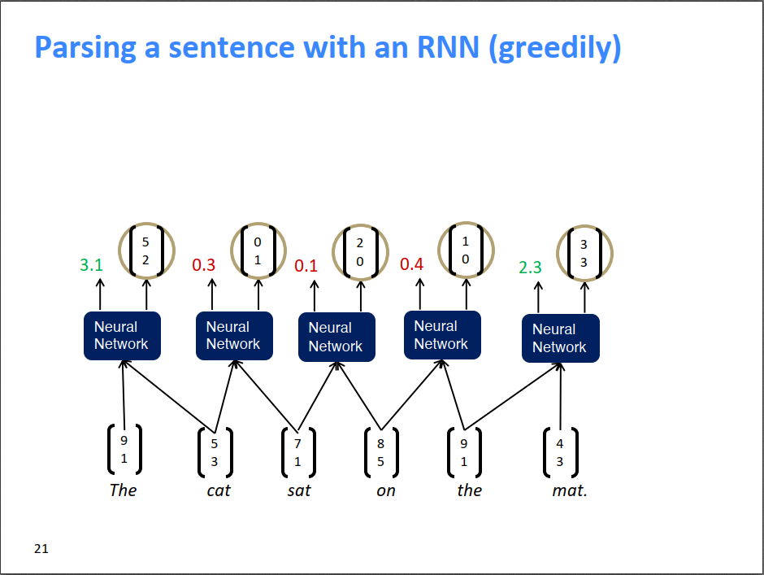
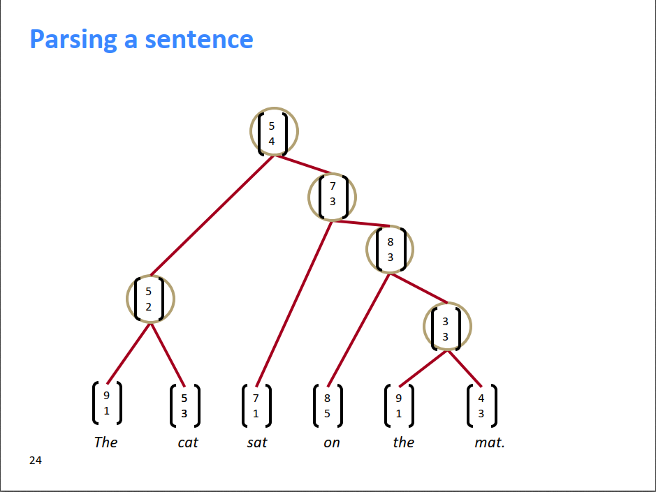

在开始今天的内容之前，给所有AI炼丹师的建议：

1. 简化模型，使用最简单的词袋模型
2. 使用很少的数据集进行训练和调试，比如就用10个样本，确保模型能够在10个样本上过拟合
3. 确认模型没问题之后，增加模型的复杂度
4. 画出训练集和测试集上的错误率变化曲线
5. 如果一切都符合预期的话，增加L2正则和Dropout
6. 搜索更优的超参数组合

今天要介绍的内容是成分句法分析（Constituency Parsing）。如下图是CS理解语言的两个极端，左边是bag of words，即词袋模型，把句子中的词完全独立出来，不管词与词之间的关系。右边就是对句子进行严格的成分句法分析，明确每个词在句子中充当的成分和依赖关系。本节课要讲的内容就是成分句法分析。

我们知道，我们的语言可以通过递归的方式表达含义，比如多个单词可以组成一个短语，多个短语又可以组成更长的短语，如此递归进行下去。类似的，单词在组成句子成分时也可以是递归的，比如短的名词短语NP可以组成长的NP，一级一级往上抽象，形成一个树形的句子成分结构。把一个句子转换为这样一个树形结构的过程就是成分句法分析的过程。

一个很简单的方法就是贪心的方法。对于一个句子，如下图所示的“The cat sat on the mat.”，对于任意相邻的两个词，它们可能组合成一个新的短语表达一个更完整的含义。那么，组合哪两个相邻的词呢？我们可以对所有相邻的两个词的词向量，输入到一个神经网络中，算出它们能组合成一个新的含义（新词）的概率（打分），以及这个新词的词向量。在所有组合中取打分最高的组合，把这个组合确定下来。比如下图中，The和cat组合后新的词的打分是最高分3.1，所以第一步把The cat组合起来，形成的新词的词向量是[5,2]。于是，就用[5,2]代替原来的The和cat，成为一个新词，和剩余的sat、on、the、mat.组成一个新的句子，再重复刚才的操作，直到建成一棵树，得到根节点。通过这种方法构建了一棵TreeRNN，训练的过程也是误差反向传播，各种求导。

贪心方法是最简单的成分句法分析的方法，后续针对这个方法有诸多改进，由于本人对这方面不感兴趣，本博客就不展开介绍了，感兴趣的可以去看这门课的视频。