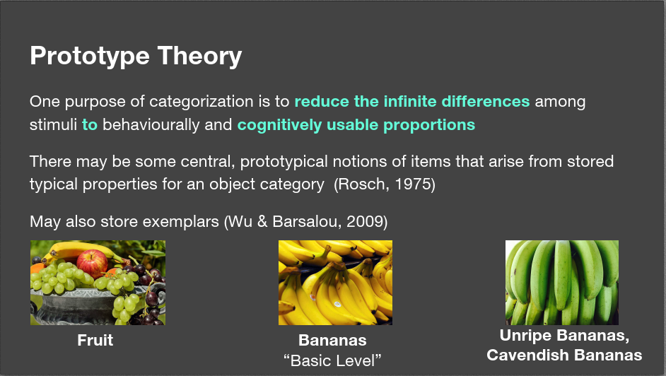
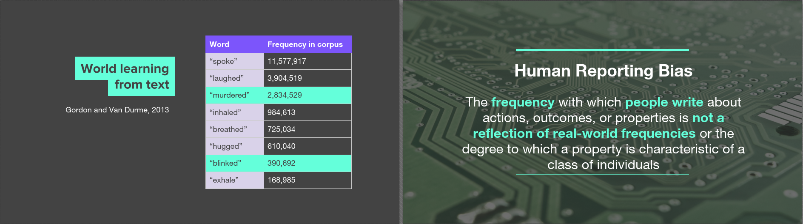
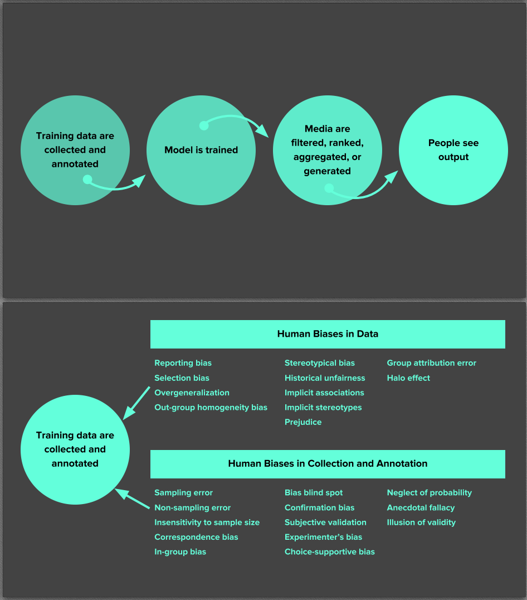
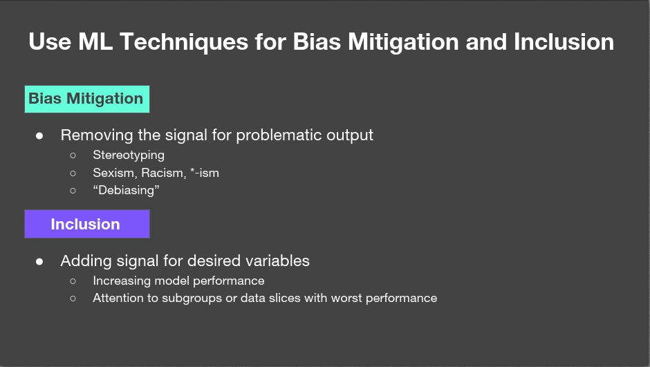

今天介绍AI的偏见，本质上，AI的偏见由人类的偏见导致。

看到成熟的黄颜色的香蕉，我们不会说这是黄颜色的香蕉，我们只会说这是香蕉，而如果看到未成熟的青色的香蕉，我们会特别说明这是未成熟的香蕉，或者说这是青色的香蕉。所以我们通常说香蕉时，其实暗含了它是黄颜色这个属性。

原型理论（Prototype Theory）说的就是这个意思，原型理论认为，我们在定义事物，并且给事物分类时，把这类事物中最常见的状态或实体定义为这一类的原型（Prototype）。同属于这一类，但具有不同特性的实物，只需要对原型增加修饰词来说明即可。比如香蕉这个例子，成熟的黄色的香蕉就是香蕉这一类别中的原型，它具有常见香蕉最典型的特征，而未成熟的香蕉最大的区别是颜色，所以我们可以用青色的香蕉来表示这是未成熟的香蕉的意思。

那么原型理论会对AI造成什么影响呢？由于原型是一类事物中的典型代表，人们在描述这类事物时，往往会省略原型的基本特征，而会重点描述某个具体事物的有差别的特征。这就导致不同事物出现在人类报道中的频率并不能反应事物真实发生的频率。

比如下面的例子，对于凶杀案，只要出现了，人们很可能就会报道，但对于眨眼睛，人们却很少报道。主要是因为眨眼睛是人类这个原型的基本特征，是众所周知的，而谋杀往往是少数人的特征，这个特征和人类原型是有显著差别的，所以人们在报道时反而更倾向于报道谋杀案，而不是眨眼睛。但事实上，每个人几乎每分钟都会眨眼睛，眨眼睛的真实频率远远大于凶杀案出现的频率，但相比于眨眼睛，人们更关注凶杀案，所以报道的凶杀案的数量远多于眨眼睛的数量。这就是人类在报道中出现的偏差，这种偏差反应了人类处理信息的方式以及人类对不同事物的关注程度。而AI模型是从数据中学习特征，由于人类报道的偏差，AI很可能会学到凶杀案比眨眼睛更常见这种荒唐的知识。

下图是常见的机器学习流程，在最开始的收集数据并建立标注集的过程中，会引入很多Human biases，包括上面提到的Reporting bias，这里就不具体介绍其他bias了。由于在整个pipeline的输入端就引入了bias，导致bias也跟着网络前向和反向传播，导致整个网络也是bias的，这个效应被称为Bias Network Effect。

一些可能的解决方法。比如去掉带有偏见的数据；评价模型在不同子类上的性能，有点类似于分开过滤的思想；对一批数据集，使用多任务学习等。

