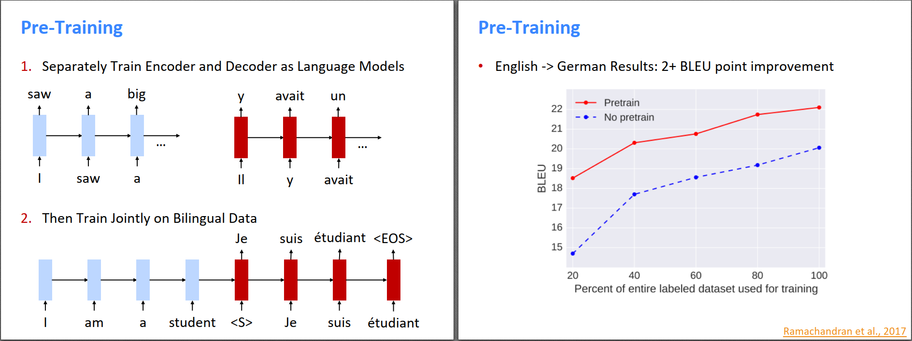
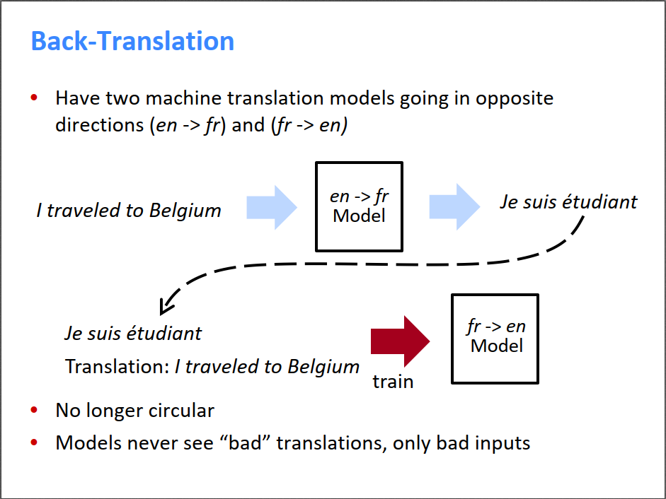
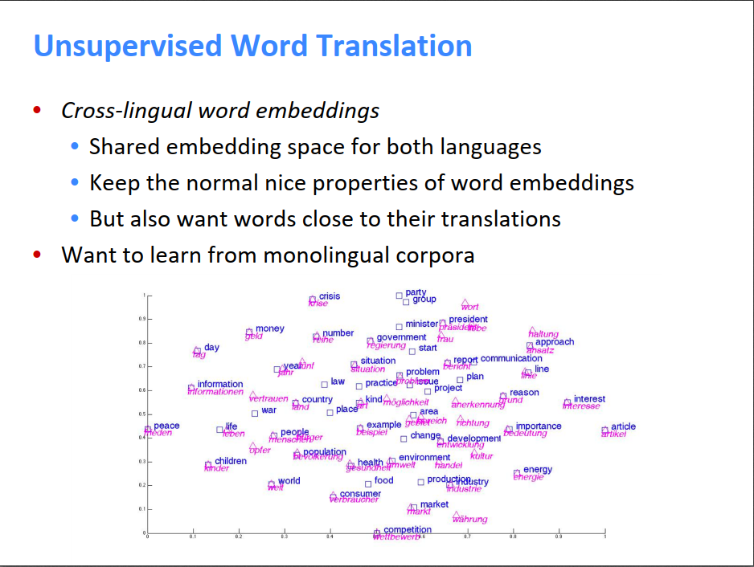
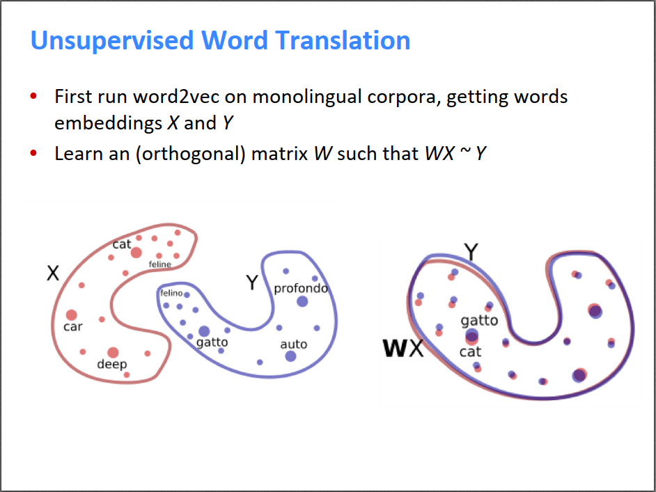
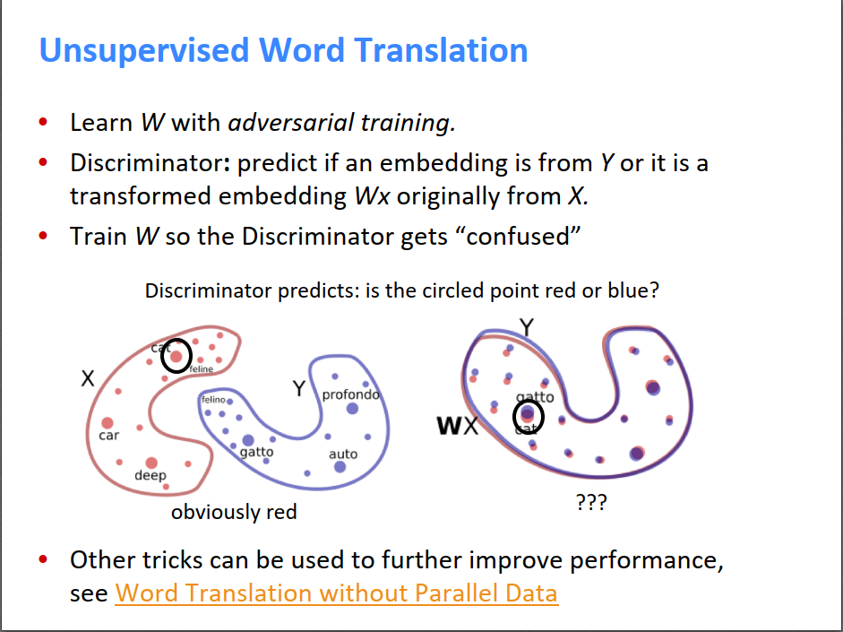
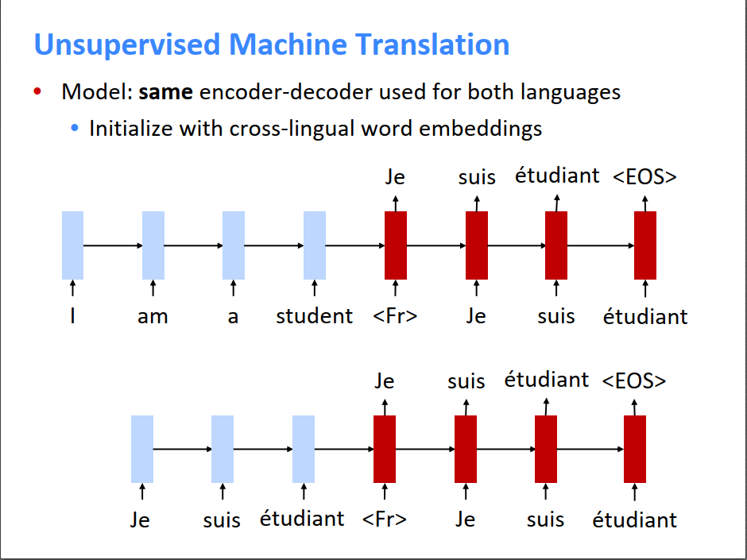
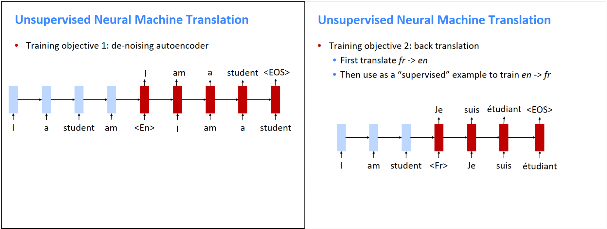
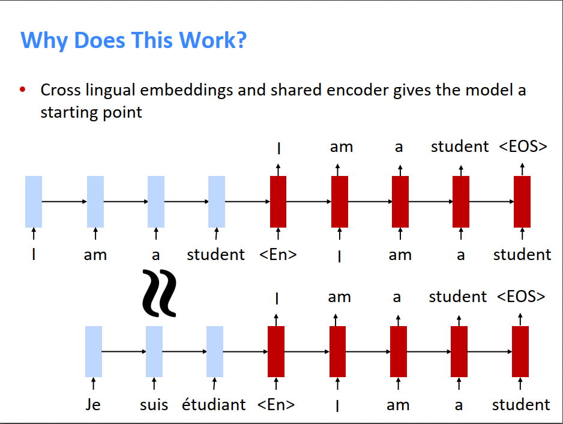

今天是该课程的最后一节课，介绍了使用未标注数据集进行NLP学习的方法，以及谈了谈NLP未来的发展方向。下面主要介绍使用未标注数据集进行NLP学习的方法。

我们知道，在机器翻译领域，特别缺少标注好的语料集。目前世界上有上千种语言，但用得最多的只有十几种。对于那些使用人数很少的语言，它们和其他语言之间标注好的翻译句子就更少了。如何使用少量标注集，甚至不用标注集，就能实现机器翻译功能，是NLP领域一个很有前景的发展方向。

之前的很多工作使用pre-training来提高机器翻译模型的性能。具体方法是，先在源语言和目标语言的语料集上分别训练一个语言模型，这是无监督的，这个语言模型可以学到不同词的含义。然后在翻译模型中，用源语言的语言模型初始化Encoder权重，用目标语言的语言模型初始化Decoder权重。使用pre-training的模型相比于不使用pre-training的模型的BLEU大概有2分的提高。

Pre-training的问题是，由于预训练是在两种语言上独立进行的，两种语言在预训练期间没有交互过程。

下面的Back-Translation比较有意思。比如我们要训练一个英语到法语的翻译器，初始化的时候让模型随便从英语翻译成法语。同时，训练一个法语到英语的翻译器，把上一个翻译器输出的法语翻译成英语。有点像练功的时候左右互搏，也有点像AlphaGo自己教自己下棋，随着训练的进行，两个模型的翻译能力都得到了提升。

当然这有一些问题，如果两个模型一开始都一无所知，则可能前一个模型的输出是随机的，后一个模型的输入是随机的，模型根本学不到任何知识，无法收敛。所以更好的做法是，有少量的标注数据，两个模型先在标注数据上学到一个比较差的模型；然后用这个比较差的模型左右互搏，相当于可以粗略的标注一部分新数据；然后又在标注数据上训练；如此循环往复。实验结果表明，使用Back-Translation和大量无标注数据集之后，翻译模型的性能有大幅提升。

Back-Translation要求我们还是需要少量的标注数据，用来启动左右互搏的过程。那么如果有两种语言X和Y，我们没有X和Y的任何翻译好的句子pair，但依然想翻译它们，怎么办。这时候，可以先从简单的单词翻译做起。在训练X和Y各自的词向量时，可以把它们的词向量映射到同一个空间，则空间中相近的词的含义也相近。对于X中的一个词x，只需要在词向量空间中选与x最接近的Y中的词y，则y可以作为x的翻译。这种把多种语言的词向量统一对齐到一个空间之后的词向量称为跨语言的词向量，也就是说从这个空间中取一个词向量，虽然它的含义是固定的，但可以转换成任意一种语言的具体的词。

那么，关键问题就是怎样把X和Y的词向量对齐。我们知道word2vec有一个很好的特点就是，它训练出来的词向量能够保持比较好的空间结构。举例来说，对于X中的词x和Y中的词y，即使它们的含义很接近，但如果直接把x和y放到同一个空间中，它们的距离可能还是比较大，因为X和Y的词向量坐标系可能就不一样。但是，对于X中的两个词x1和x2，如果它们分别对应Y中的两个词y1和y2，则在X空间中，x1和x2的距离应该与Y空间中y1和y2的距离相近，也就是说两个空间的整体结构是一样的。如下图所示，X和Y对齐的过程就是找出它们的变换矩阵W。由于我们只希望将它们的坐标系进行变换对齐，并不想改变里面的数据分布，所以变换矩阵W最好是正交的。

学习矩阵W的过程也很有意思，这里介绍了一种对抗学习的方式。有一个生成器，用来生成矩阵W。有一个判别器，它想要区分一个词向量是Y中的词向量，还是X中的词向量经过W变换得到的。起初，由于X和Y的空间分布不同，W也是随机的，判别器可以很容易地区分Y和WX。但是随着对抗的进行，W越来越准，最后WX和Y重合了，此时判别器傻傻分不清楚，它只能随机猜，有50%的几率猜对。所以学习矩阵W的过程就是让判别器懵圈的过程。

上述是非监督的词与词的翻译，怎样由此得到非监督的句子与句子的翻译呢？

我们首先使用上述的跨语言的词向量，然后使用相同的encoder-decoder来编码和解码两种语言。解码的时候，设置一个标志位，告诉decoder要把目标含义用哪种语言表达出来，就是下图的\<Fr\>标签。

然后有两个训练目标，第一个目标是对源句子进行微小的打乱，然后让encoder恢复原来的句子。第二个目标是使用上文提到的back translation进行左右互搏（所以好像还是需要少量标注集？）。

这种方法有效是因为输入的词向量是跨语言词向量，输入一个英文句子就相当于输入了一个法文句子。又因为使用的encoder是相同的，所以英文句子在进行第一个目标训练时，隐含学到了将法语翻译为英语的能力。

上述的非监督词与词、句子与句子的翻译，只有在源语言和目标语言比较像的情况下才能取得比较好的效果，比如英语、法语、德语比较像，可以用。但英语和土耳其语差别比较大，这种非监督方法的效果就比较差。语言像不像涉及到很多方面，比如语法结构、句子结构、用词顺序等等。