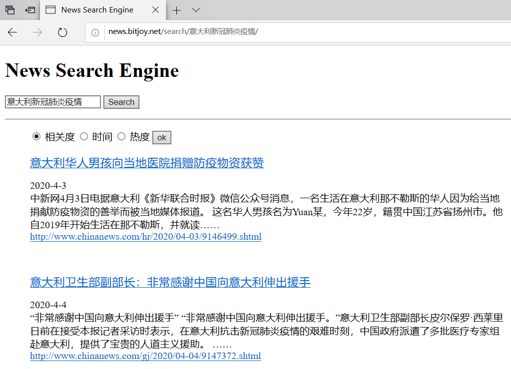

时隔多年，我发现我写的[和我一起构建搜索引擎系列](https://bitjoy.net/categories/%E5%92%8C%E6%88%91%E4%B8%80%E8%B5%B7%E6%9E%84%E5%BB%BA%E6%90%9C%E7%B4%A2%E5%BC%95%E6%93%8E/)是我的博客中访问量最高的内容，截至目前该搜索引擎的GitHub项目已经收获了上百个Star和Fork。这几天我又回顾了一下这个项目，并进行了部分的更新和修改，以及将该搜索引擎部署到了我的个人网站上，以便展示和外网访问。以下是我将搜索引擎部署到个人网站上的截图，大家可以访问 [http://news.bitjoy.net/](http://news.bitjoy.net/) 进行测试。



下面分别介绍新增的爬虫，对打分的修改和部署到服务器上的过程。

新增爬虫。我们之前是抓取[搜狐新闻](http://news.sohu.com/1/0903/61/subject212846158.shtml)的数据，但是这个页面自从2018年之后就没再更新过，难道是被很多爬虫爬了之后停更了吗。经过多方查找，我发现[中国新闻网的滚动新闻](http://www.chinanews.com/scroll-news/news1.html)上的新闻数据特别全，从2008年至今，每天的新闻都有，而且新闻类型丰富、格式规整。于是，我重现写了一个爬虫程序：[spider.chinanews.com.py](https://github.com/01joy/news-search-engine/blob/master/code/spider.chinanews.com.py)，运行该爬虫会自动从网站上爬取最近5天的新闻数据，并整理成xml格式。

在编写爬虫的过程中，有两点建议。一是一定要捕获异常，因为爬虫在运行的过程中会遇到各种异常情况，比如突然断网了、某个URL无效、连接超时等等，如果不捕获异常，爬虫很容易崩溃停止，有可能爬了一整天都前功尽弃了。二是要控制抓取频率，宁愿让爬虫抓取频率慢一点，也不要让网站封了你的爬虫，一旦被封，要解禁估计要等好几个小时，还不如爬的时候慢一点，可以一直爬；我的策略是，遇到异常时，无条件睡眠10分钟，因为异常很可能是服务器察觉到爬虫然后拒绝响应了；还有就是每抓取到500条新闻后睡眠3分钟。在这两条策略下，我的爬虫运行一天一夜都没问题，可以连续抓取几万条新闻。

---

修改打分。之前在介绍[检索模型](https://bitjoy.net/posts/2016-01-07-introduction-to-building-a-search-engine-4/)时，我设计了一个基于新闻热度的打分公式，该公式的热度是综合了BM25相关性打分和新闻发布时间的一个函数。后来我在测试时发现由于BM25打分可能是负数（在df很大时），会导致计算热度打分时对数异常。于是，我把热度公式中的对数函数更换为了sigmoid函数，新的热度公式如下：

$$hot_{score}=k_1*sigmoid(BM25_{score})+\frac{k_2}{t_{now}-t_{news}}$$

---

线上部署。Flask是一个基于python的很轻量的web服务，之前我们通过本地[http://127.0.0.1:5000/](http://127.0.0.1:5000/)访问该搜索引擎服务，现在我把它部署到线上，和我的这个博客在一个VPS中。线上部署的步骤如下。

首先是准备新闻数据。由于我的VPS性能很弱，所以我只爬了约2500条新闻，并构建好了数据库等文件。

然后是准备服务器环境，如果是性能比较弱的VPS，建议安装[Minicoda](https://docs.conda.io/en/latest/miniconda.html)，否则直接安装正常版本的[Anaconda](https://www.anaconda.com/distribution/)。有了conda环境之后，就按之前的步骤安装lxml、jieba、Flask。此时，在web文件夹运行main.py后，可以通过服务器的内网访问，但外网还不能访问。

[为了让外网也能访问，需要在运行Flask应用时指定host=”0.0.0.0″，此外还需要指定端口，如port=5000](https://github.com/01joy/news-search-engine/blob/master/web/main.py#L155)。此时，可通过服务器的ip:port的方式访问到Flask服务。

你也可以申请一个域名，将域名指向你的服务器，并设置port=80，此时就可以通过域名直接访问Flask服务了。

由于我的VPS上已经运行了Nginx服务，搭建了两个wordpress博客，所以我希望能够通过子域名的方式访问我的搜索引擎服务。比如直接访问 [http://news.bitjoy.net/](http://news.bitjoy.net/) 就可访问搜索引擎。此时，我们需要在DNS设置上将news.bitjoy.net这个二级域名指向服务器IP（我用的是DNSPOD），然后我们可以用通过news.bitjoy.net:5000的方式访问搜索引擎。但我希望只输入域名访问，省掉输入端口的操作。如果只输入域名news.bitjoy.net，默认访问的是服务器的80端口，但80端口已经给了Nginx的wordpress。为了实现输入news.bitjoy.net，访问的是5000端口，需要对Nginx进行设置，告诉它从 news.bitjoy.net:80进来的流量都转给 news.bitjoy.net:5000。为此，需要在Nginx的配置文件中增加一个虚拟主机，我的VPS上的文件路径是/usr/local/nginx/conf/vhost，这个文件夹下存放了所有网站的Nginx配置文件。新增一个配置文件news.bitjoy.net.conf，表示需要对访问 news.bitjoy.net 的网站的设置。内容如下，就是告诉Nginx，从news.bitjoy.net:80进来的流量，都交给localhost:5000处理。这里的localhost:5000就是ip:5000，前面我们已经对Flask进行了设置，所以访问ip:5000就可以访问我们的搜索引擎服务了。

```
server {
    listen 80;
    server_name news.bitjoy.net;

    location / {
        proxy_pass http://localhost:5000;
    }
}
```

综上所述，流量走过的路径是这样的：

1. 访问news.bitjoy.net
2. 等价于访问news.bitjoy.net:80
3. Nginx将流量转发给localhost:5000
4. localhost:5000等价于ip:5000
5. Flask收到流量，开始处理

新增了Nginx的配置文件后，使用命令service nginx restart重启Nginx，此时就可直接通过二级域名访问Flask了。最后，可以使用nohup命令运行Flask并将其置于后台，这样关于服务器的远程连接后，Flask依然会运行。