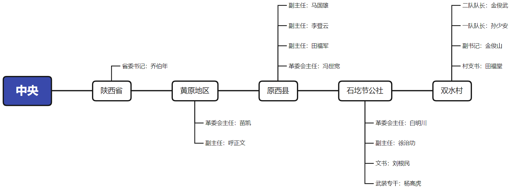
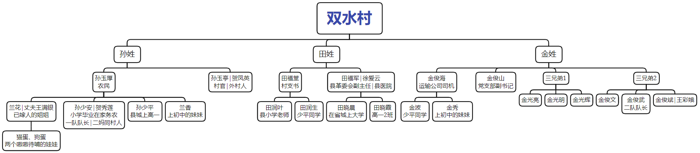

# 前言

今年刚毕业参加工作，前期有点迷茫，就很想看一些励志书，寻找一点儿精神力量，就想到了《平凡的世界》，这段时间陆陆续续看完了第一部，来写一下读后感吧。

《平凡的世界》是路遥在上世纪80年代创作的长篇小说，讲述了1975-1985年间黄土高原的农村生活，是一幅全景式描写农村普通老百姓在文革后期到改革开放时期的生活变迁的鸿篇巨著。我自己是农村出身，对书中的描写非常熟悉和亲切，很多时候能在孙少安孙少平两兄弟身上看到自己的影子，既有对出身感到自卑敏感的一面，也有强烈的渴望走出去的一腔热血。目前刚看完第一部，讲述的是两兄弟高中到结婚前后的故事，还处在人生的起步阶段，相信到最后两位都会有很不错的未来。看网上的评价，很多名人在成名之前都受到过这本书的鼓舞，比如马云、潘石屹等人。这部作品的人物有数百个，相信每个人都能从书中找到自己的影子，找到前进的力量，真心推荐给所有人，特别是所有年轻人。

# 故事梗概

第一部的故事主要发生在1975-1977年间，地点在黄土高原地区虚构出来的双水村，行政架构如下图所示，双水村位于陕西省-黄原地区-原西县-石圪节公社-双水村，可以简单把黄原地区理解为市，石圪节公社理解为乡。

《平凡的世界》讲述的就是双水村普通老百姓的平凡的故事。双水村主要由三个姓氏的家族成员组成，孙姓、田姓和金姓。简单来说，孙姓家族是典型的忠厚、老实、贫穷的农民家庭；田姓家族是农村中具有威望、且家族成员在村县里有一官半职的家族；金姓家族有旧时代的地主和新时代的营商人员，家庭条件较好，但在文革时期政治身份较低。下图是双水村的人物族谱，下面详细介绍每个家族的人物故事，建议对照族谱理解。

# 家族介绍

孙姓家族是本文的主角，父辈孙玉厚是地道的农民出身，忠厚老实，每天面朝黄土背朝天拉扯着家中四个儿女，年轻时还为弟弟孙玉亭操碎了心。大女儿兰花嫁给了村里游手好闲的王满银，家里一地鸡毛。大儿子孙少安知道家里的困难，虽然学习成绩优秀，但高小毕业之后毅然放弃学业，返乡务农挣工分。二儿子孙少平是全家人的希望，他刻苦学习想要走出农村，到更广阔的天地去发展。小女儿兰香，听话懂事，知道家里的难处，虽然年纪小，但力所能及帮忙做家务。总而言之，孙玉厚一家是典型的农村老百姓的一家，贫穷，家里儿女多；既有游手好闲令人烦的亲戚（王满银、孙玉亭），也有愿意伸出援手的知心朋友（金俊海）；家中长兄通常早早辍学赚钱补贴家用，弟弟妹妹听话懂事，想要通过自己的奋斗改变家族的命运。这样的家庭，在中国有千千万，上世纪80年代有，今天也有，未来也仍然存在，每个时代的读者都能从孙家找到自家生活的影子。

田姓家族是村里比较有名望的家族，家中当官的人比较多。首先父辈田福堂是村里的一把手村支书，其次弟弟田福军是县上的二把手革委会副主任，因此，田家人虽然也是农民，但家庭条件还算不错。田福堂的大女儿田润叶小时候和孙少安一起读的小学，后来孙少安辍学之后，润叶继续读初中高中，高中毕业之后在县里的一个小学当老师，算是吃上了公家的饭碗。小儿子田润生和孙少平是同学，一起在县城读高中。田福军是人大毕业的高材生，在县革委会任副主任，是县里的二把手；妻子徐爱云是县医院的医生；儿子田晓晨在省城上大学；女儿田晓霞和少平、润生同学，在县城读高中。可以看到，田家虽然也是农民，但由于父辈有个一官半职，后代能够接受更多更好的教育，自然未来的发展也不会差到哪里去。

金姓家族是双水村的大家族，人口众多，大多聚居在双水村的金家湾。金姓家族原来是双水村的主宰，出过很多地主，虽然到了新中国打土豪分田地，金家人的政治身份普遍比较低，但由于家底厚实，家庭条件都还不错，在双水村算是有钱一族。可能是金姓家族人比较多的缘故，他们的职业选择也五花八门，有跑运输的金俊海一家，他们一家无论是长辈还是晚辈，和孙玉厚一家关系都很不错，不是亲戚胜似亲戚。有吃公家饭的副书记金俊山一家。还有因父辈是地主而抬不起头来的金光亮三兄弟。以及年轻气盛担任二队队长的金俊武三兄弟。

以上就是双水村三大姓氏的简单介绍，虽然本文介绍的是整个双水村的故事，但故事的核心主角是孙玉厚的两个儿子，孙少安和孙少平，两个人的成长故事和心路历程代表了社会变革下千千万万个中国农村青年的成长故事和心路历程。下面重点介绍下这两兄弟的成长故事。

# 孙少安的故事

孙少安是家里的大儿子，小学时和田润叶同学。少安上学时成绩优秀，但由于家里人口多，只有父亲一个劳动力，父亲辛苦不说，家里还常年吃不饱穿不暖。为了分担父亲的压力，少安高小毕业之后就辍学回家务农了，由于能力出众，还当上了一队的生产队长。润叶虽然作为一个女孩子，但家里条件比较好，因此一直读到高中毕业，之后在县城当上了老师，有了体面的工作。润叶高中毕业没多久，就到了该谈婚论嫁的时候，此时，县里的副主任李登云的儿子李向前疯狂追求润叶。由于润叶的二爸福军和登云是县政府的同事，登云的老婆和润叶的二妈也同是县医院的同事，李登云一家人以及润叶的二爸二妈都来牵线搭桥撮合这门婚事。

然而，润叶内心的真爱却是小学同学少安，他们两从小青梅竹马，关系特别好，即使后来润叶去县里继续读书而少安回乡务农，两人依然保持着很好的关系。虽然两人家庭条件相差很大，但润叶并不介意，还主动向少安暗示了自己的心意。少安何尝不想与润叶相好，但少安清醒地认识到并且也察觉到，婚姻不单单是两个人的事情，更是两个家庭的事情，即使润叶同意与他相好，但润叶的父亲——村长田福堂——肯定不会同意。况且，少安家里那么穷，个个都是农民，每天只能吃黑面膜还吃不饱，自家住的窑洞也不够，而润叶在县城有着体面的工作，如果两人真的结婚，难道要润叶放弃体面的工作跟着自己回村种田吗？亦或者他少安日后要当个吃软饭的，靠润叶养活？对于前者，少安于心不忍；对于后者，少安低不下那个头。

于是，少安决定不再与润叶见面，从润叶的世界中消失。此外，少安遵从父亲的建议，从隔壁山西省找了一个媳妇贺秀莲。秀莲虽然是少安二妈贺凤英的同村人，但秀莲的性格很好（不是贺凤英之类人），而且不要任何彩礼。此外，秀莲自己是农家人没读过多少书，也不嫌弃少安家穷，手脚也勤快，是个干农活做家务的好帮手。对于少安来说，虽然他的内心也许更喜欢润叶，但从现实出发，秀莲也许是更适合结婚的对象。

润叶原本还有勇气和精力对抗李登云一家和她二妈一家的联合攻势，但当她得知少安已经娶了秀莲之后，润叶的精神防线全线崩溃，她太难过了，她爱着的少安哥，居然忍心让她孤军奋战，即使在她表明心意之后，少安哥也无动于衷。算了吧，放弃吧，屈服于命运吧。润叶最终答应了与李向前的婚事，但婚后两人徒有夫妻之名，实则关系连陌生人都不如。润叶不可能喜欢向前，但她没有选择，她一个农村出身的弱女子，在县城两大政治势力面前，她孤军奋战。润叶的这段经历是悲惨的，她过于优秀，以至于少安只能对她敬而远之；但她又不够优秀和强大，无法自己决定自己的命运。

对于少安来说，也许所有读者都希望少安能够突破思维局限，勇敢地释放自己，答应润叶，去追求幸福的爱情。但是，现实告诉少安这是不可能的，他不仅仅代表他自己，还代表着他那贫穷的父亲和需要上学的弟弟妹妹，所谓长兄如父，他肩上担负着养育家庭的重任。他是一个男人，男人就应该在门外，就应该是家庭的经济支柱，怎么能让女人养家呢。从少安的故事中，可以看到农村青年在与城里人交往过程中的自卑，或者是内心敏感且要强的一面。当然，在那个年代，虽然润叶家庭条件稍好，但毕竟也是农民的孩子，和少安的条件差距其实不如现在农村人和城里人的差距那么大。所以，对于少安拒绝润叶，与其说少安是自卑的，不如说少安是理性的，他希望通过对润叶的不打扰，换取润叶更加幸福的未来，同时维护自己作为男人的尊严以及自家在双水村的脸面。少安失去了甜美的爱情，换来了更加现实的婚姻，作为农村人的少安，他的处理方式是得体的，是理性的。

# 孙少平的故事

孙少平是家里的小儿子，得益于他哥早早辍学回家帮衬，少平得以到县城念高中。虽然勉强上得起学，但因为家里太穷了，在学校的伙食一直很不好，每天吃的都是最差的黑面膜和丙菜。很巧的是，班上的女生郝红梅处境与他同样艰难，由于两个人经常一起领黑面膜和丙菜，一来二往，惺惺相惜，互相产生了美妙的好感，我相信此时少平和红梅之间的情愫是纯洁且美好的。然而好景不长，两人的关系被班上的跛脚女侯玉英识破并当众戳穿。他们毕竟还只是高中生，并不知道爱情是什么，他们只知道，侯玉英戳穿了他们彼此之间妙不可言的关系，让双方在同学们眼中都蒙了羞。于是，两人陷入了很长的冷静期。

少平作为一个穷小子，在县城高中认识的第一个人就是红梅，可以说红梅是那个时期少平最重要的精神支柱。所以，即使在冷静期，少平仍然对红梅抱有一丝希望，他觉得红梅只是碍于面子，不愿意与他在公共场合交往，只要假以时日，当红梅放开之后，会继续回到他的身边。然而，新的学期开始了，少平却发现红梅处处在有意躲避着他，而且还发现红梅开始在各种场合与班长顾养民在一起。原来，红梅也想明白了，她家里很苦，她不想跟着少平继续苦一辈子，她要改变命运。于是，红梅选择和有钱人的孩子顾养民交往。得知这一切后，少平幼小的心灵受到了沉重的打击，他不但失去了最重要的精神支柱，而且开始怀疑人生。不过，对于孙少平来说，他也要对生活的教训说一声谢谢，这件事的前后经历，也许实际上对他并没有坏处，他是失去了一些情感上的温柔，但也将变得更加坚强。去奋发图强吧，去搏击长空吧，更广阔的未来等着你去探索。

慢慢的，少平逐渐走出了红梅事件的阴影，他开始参加一些集体活动，甚至被选派去黄原地区讲故事。通过一起参加演出活动和讲故事活动，少平和隔壁班的田晓霞熟络起来。晓霞是县革委会副主任田福军的小女儿，是润叶和润生的堂妹，和少平、润生都在县高中读书，只不过是另一个班的，两人之前联系不多。通过晓霞，少平接触到了更大的世界。晓霞爱读书，也读过很多书，她经常拉着少平去学校的报栏看报纸，还不时发表一些和社会上截然不同的看法。少平被晓霞的个性和对事情非同一般的认识强烈地吸引了，这种心理决然不同于他和郝红梅的那种状态，他当初对红梅是一种感情要求，而现在对晓霞则是一种从内心产生的佩服。从此以后，少平被晓霞引到了另一个天地，晓霞经常一起拉着少平看报，还借《参考消息》、《各国概要》以及各种国外名著给少平看。所有这些都给少平精神上带来前所未有的满足，很大程度上，少平已经不再是原来的少平了，他竭力想要挣脱和超越他出身的阶层。

高中毕业之后，少平和润生回到了双水村，在孙玉亭和田福堂的共同“策划”下，双水村学校办起了初中班，少平和润生这两个高中毕业生走马上任，当起了老师。当老师自然比下地干活好，轻松不说，还有全额工分加额外补助。

对于孙少平来说，虽然他暂时还无法走出双水村，但得益于受过更好的教育，看过更多的书，了解更广阔的世界，他的精神实际上包含了农村的系列和农村以外的系列，两者是矛盾统一的。一方面，他摆脱不了农村的影响，另一方面，他又不愿受农村的局限。在他今后一生中，不论是生活在农村，还是生活在城市，他也许将永远会是这样一种混合型的精神气质。

# 改革开放的前夜

时代的车轮滚滚向前，1976年伟人逝世、四人帮被粉碎、十年文革结束，大家的思想开始松动起来。作为一队生产队长，孙少安清楚地认识到，目前农民贫穷的根本原因是人民公社，所有社员集体劳动、吃大锅饭，导致浑水摸鱼者众，社员的生产积极性不高。此外，少安还从外面听到安徽有些村已经搞起了包产到组。怀着对温饱生活的向往，少安激动地和一队队员商量，也草拟了一份包产到组的合同，他把一队分成了几个承包责任组，每组制定了生成目标，达标有奖、未达标有惩罚，来个社会主义劳动竞赛。事情传到书记田福堂耳朵里，田福堂都懵了，这孙少安是要搞资本主义复辟啊。涉及到政治路线的问题，田福堂不敢擅作主张，一级一级往上报，从村到公社，再到县里，最后上报到黄原地区，最终地区革委会主任苗凯下达了终审判决，坚决制止孙少安的行为。虽然孙少安的自发性改革以失败告终，但通过这一事件，各级领导对目前农业的生产状况有了更为深刻的认识，部分人开始反思人民公社化存在的问题，大家的思想也开始松动起来。

随着时代的发展，无论是扎根农村搞生产的孙少安，还是向往外面的世界的孙少平，他们即将走向舞台的中央，取代以田福堂为代表的老一辈建设者，新的世界正在孕育而生，敬请期待第二部的内容。

# 读后感

看这本书的过程中，也在同步看央视的《路遥先生》纪录片（[https://www.bilibili.com/video/BV1fb411p7gx](https://www.bilibili.com/video/BV1fb411p7gx)）。纪录片非常精彩，李野默老师富有磁性的配音，辅以路遥自己悲壮而有力的随笔《早晨从中午开始》作为旁白，再加上陈忠实、贾平凹等大家深刻的点评，非常值得推荐。

从纪录片中了解到，路遥小时候家里特别穷，7岁过继给外县的伯父，伯父家里也很穷，吃不饱、穿不暖。虽然条件艰苦，但路遥酷爱文学和写作，开始写诗，后来写小说。在中篇小说《惊心动魄的一幕》、《人生》获得了巨大成功的情况下，路遥没有沾沾自喜，蛰伏十年，去田间地头、煤矿深井体验生活，最终创作出了伟大的《平凡的世界》。虽然《平凡的世界》获得了矛盾文学奖，但路遥太穷了，穷得连去北京领奖的车旅费都没有。

路遥，一个超脱世俗品味的人，他为文学而生，在文学创作的道路上，他翻过一座座高山，不断超越自己，热烈地燃烧着自己的生命。路遥的作品激励着一代又一代中国青年，在全面建成小康社会的今天，仍然具有强大的精神力量。

> 路遥的作品一直被读者阅读着、喜欢着，他的声音就留在一代又一代的读者心间，这个人的生命也就延续着。——陈忠实