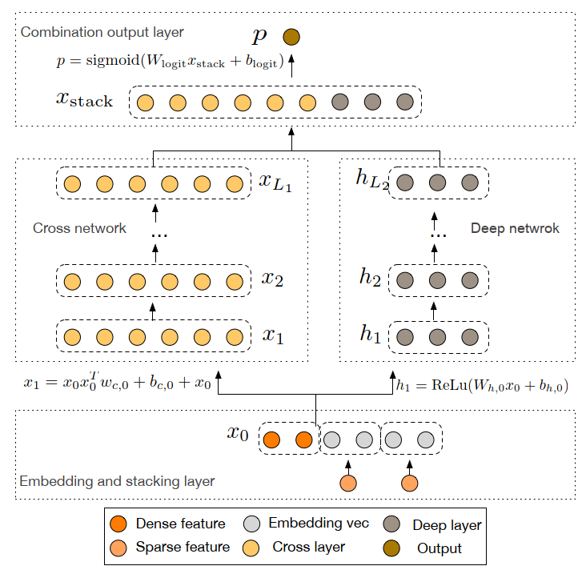
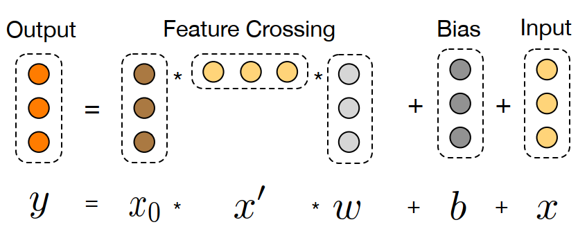
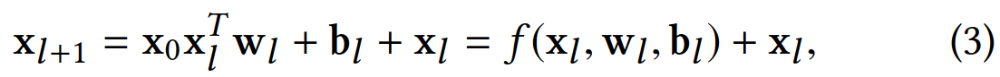
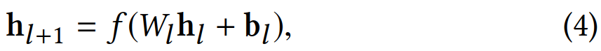

# 摘要

特征工程是很多预测模型成功的关键因素，然而特征工程并不简单，且通常需要人工设计或穷举搜索。通用DNN模型能够学习到所有隐式的特征交叉，但并不是所有特征交叉都有用、都能学好。本文提出Deep & Cross Network (DCN)，它保留了DNN模型，同时引入了一个新的交叉网络cross network，交叉网络能更加高效地学习特定阶以内的特征交叉。特别地，DCN在每一层都进行显式的、自动的特征交叉，既不需要人工特征工程，也不会增加太多的模型复杂度。实验结果表明，DCN在CTR任务和非CTR任务上都取得了显著的性能优势，且内存消耗最低。

# 简介

CTR预估对CPC（cost-per-click）广告很重要，而特征交叉对CTR预估很重要。目前的特征交叉依赖于手工或穷举完成，并且很难泛化到没见过的特征交叉上。

本文提出了一个新的神经网络cross network，它能自动地进行显式特征交叉。Cross network包含多层网络，每增加一层网络会产生更高一阶的特征交叉，同时保留上一层的特征交叉结果。所以层数越多，交叉阶数越高，最高交叉阶数取决于网络的层数。除了cross network，我们仍然保留了传统的DNN网络，cross network和DNN网络组成Depp & Cross Network (DCN)。在DCN中，cross network和DNN网络联合训练，其中cross network以较小的参数量捕捉显式的特征交叉，而DNN网络以较多的参数量捕捉非常复杂的、隐式的特征交叉。实验表明DCN具有显著的性能优势。

# 相关工作

因子分解机相关的工作如FM、FFM，表示能力不足。通用DNN网络，很强大，可以近似任何（arbitrary）函数。然而，在现实问题中，感兴趣的特征交叉往往不是任意的（arbitrary）。在Kaggle比赛中，大多数获胜方案中使用的是手工交叉的特征，它们的阶数比较低，并且是显式的、有效的；而DNN网络学习到的特征是隐式的，且是高度非线性的。因此，有必要设计一个网络，它能自动学习到有限阶的显式的特征交叉，且比通用DNN更加高效。

# 主要贡献

* 设计了一个cross network，它能在每一层进行显式的、自动的特征交叉，无需人工特征工程。
* Cross network简单高效，随着网络层数的加深，特征交叉的阶数也不断上升，且网络能学习到从低阶到高阶的所有交叉项，所有交叉项的系数也各不相同。
* Cross network内存高效，易于实现。
* 实验结果表明，DCN比DNN的目标损失更低，且参数量少了一个数量级。

# DCN网络结构

图1 DCN网络结构

# Embedding层

CTR预估任务的输入特征既有稠密特征（例如身高、体重等），也有稀疏特征（例如性别、国籍等）。在DCN网络的输入层，会先将稀疏特征通过embedding矩阵变换为低维稠密向量（图1最低层的右边两个Sparse feature），然后和其他稠密特征拼接在一起作为整体的输入特征\(x_0\)。

# Cross Network

图2 Cross layer图解

Cross Network的每一个交叉层如图2所示。核心就是公式(3)，即第\(l+1\)层的交叉结果\(x_{l+1}\)等于对第\(l\)层的结果\(x_l\)做一个变换\(f(x_l,w_l,b_l)\)然后加上\(x_l\)。这里加\(x_l\)有点像ResNet的思想，就是直连，保留上一次交叉的结果。

公式(3)的核心操作是\(x_0x_l^T\)，通过这个操作，一方面可以产生从1到\(l+1\)阶的所有交叉项；另一方面\(x_0x_l^T\)的维度是d\*d（d为\(x_0\)的维度），使得系数\(w_l\)是一个d*1的向量而不是矩阵，即\(w_l\)只需要很少的参数量就能增加一阶的特征交叉。由于每增加一层，只增加两个维度为d的参数向量\(w_l\)和\(b_l\)，所以对于\(L_c\)层的cross network，参数量是\(d*L_c*2\)，相比于DNN的参数量要少得多。

手工推算一下，可得：

$$
x_1=x_0*x_0*w_0+b_0+x_0=x_0^2w_0+b_0+x_0
$$

$$
x_2=x_0*x_1*w_1+b_1+x_1=x_0^3w_0w_1+x_0^2(w_0+w_1)+x_0(b_0w_1+1)+b_0+b_1
$$

可以看到，随着网络层数的增加，交叉的阶数也不断上升，而且完整包括了从0到\(l+1\)的交叉项，每个交叉项的系数也各不相同。

# Deep Network

深度网络就是经典的MLP，公式如下：

由于参数\(W_l\)是一个矩阵，故DNN的参数量远多于cross network。

# Combination layer

最后将cross network和deep network的输出拼接起来，过一个logits layer，预测当前item的CTR。本文使用point-wise的方法，即训练样本是每个item是否点击，所以是一个二分类问题，损失函数是交叉熵损失。

# 实验结果

相比于DNN、FM等方法，DCN的测试误差最低，且参数量、内存开销最小。此外，作者还将DCN用于其他非CTR的分类任务中，也取得了性能优势。

# 总结

DCN的思路简单、巧妙，通过\(x_0\)和上一层的交叉结果相乘，则所有交叉项的阶数都上升一阶，所以随着层数的增加，交叉阶数也在不断增加。通过控制网络层数可以控制需要交叉的最高阶数。而且\(x_0x_l^T\)的设计，每层增加的参数量也很小，不错。

不足的是，\(x_0x_l^T\)的设计，所有特征都无差别交叉了，而且是对所有特征的bit位进行交叉，粒度很细。但是，并不是所有特征交叉都有效，特别是bit-level的特征交叉。能否以feature vector为最小单位进行特征交叉呢？或者自动选择对哪些特征进行交叉，比如融入注意力机制？