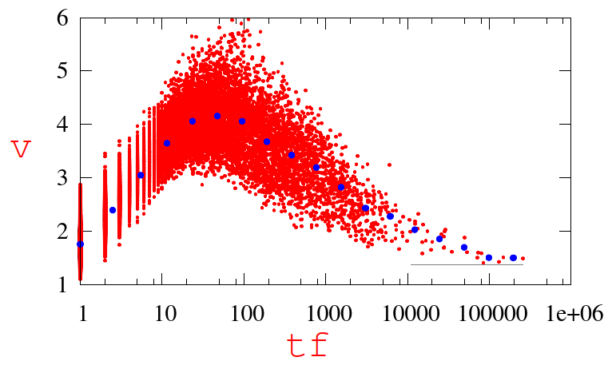

这篇论文严格来说是一个实验报告（report），作者分析了使用word2vec训练得到的词向量的特点，提出使用词频和词向量的模长来衡量词的重要性。

整篇论文的核心就是上面这张图。作者将arXiv上理论高能物理范围内的论文都下载下来，提取所有论文摘要，并使用word2vec默认参数进行训练，得到所有词的词向量。使用词向量的模长和词频绘制了上图。

由图可知，当词频小于30时，随着词频的增大，词向量的模长也增加；但当词频大于30后，词频继续增大时，词向量的模长呈减小趋势。作者分析发现，对于词频比较小的词，这些词所在的上下文相对固定，而word2vec正是通过词的上下文来学习词向量的，因此在word2vec训练的时候，这些词的词向量的更新方向相对固定，所以随着词频的增大，这些词的词向量在某个固定方向走得越远，故向量模长越大。但是对于词频很大的词，这些词很可能是多义词（比如may即可以做名词也可以做助动词），则在word2vec训练的时候，词向量会频繁往不同方向上更新，虽然词频很大更新了很多步，但由于分散在了多个不同方向上，故离初始点的距离并不远，即模长并不长。常见的停用词就是后者的典型代表。

因此，作者提出同时使用向量模长和词频来衡量词的重要性，如果这两个值都很大，则说明这个词很重要，而且很可能是某个子领域的专用词，只出现在特定的上下文中，类似于IDF很大。