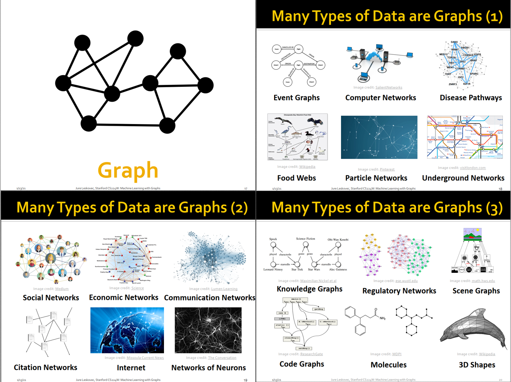
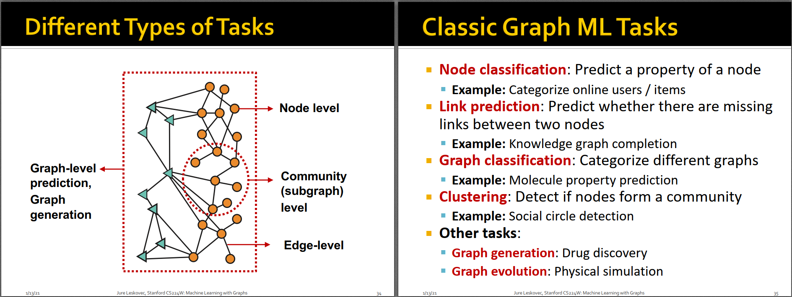
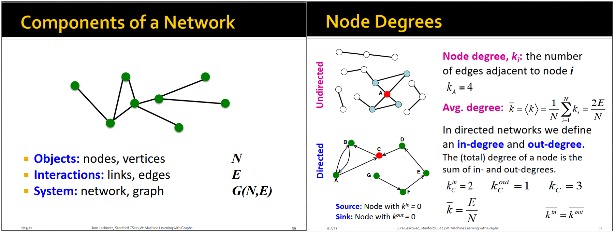
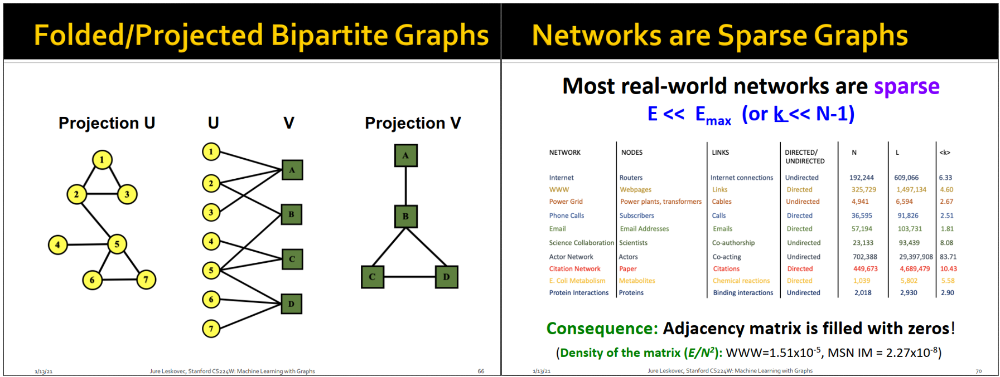

# 前言

最近的工作涉及到图神经网络，打算系统学习下这方面的内容。首先搜集了相关的教材，发现市面上的教材大多数是罗列论文的形式，不太适合初学者入门。后来找到了斯坦福CS224W这门公开课，打算入坑，一是之前学习过[斯坦福CS224N](https://bitjoy.net/categories/stanford-cs224n-nlp-with-deep-learning/)，感觉不错；二是CS224W这门课的老师是GraphSAGE的作者Jure Leskovec，有大佬背书错不了。

* CS224W主页：[http://web.stanford.edu/class/cs224w/](http://web.stanford.edu/class/cs224w/)
* Winter 2021版主页：[http://snap.stanford.edu/class/cs224w-2020/](http://snap.stanford.edu/class/cs224w-2020/)
* Winter 2021版视频：[https://www.youtube.com/playlist?list=PLoROMvodv4rPLKxIpqhjhPgdQy7imNkDn](https://www.youtube.com/playlist?list=PLoROMvodv4rPLKxIpqhjhPgdQy7imNkDn)，Jure Leskovec是斯洛文尼亚人，英语不是很标准，建议打开YouTube的字幕。

# 背景介绍

图（Graph）是描述实体（entity）和关系（relation）的一种通用语言形式，它由节点（vertex或node）和连接节点的边组成，很多数据类型都可以用图的形式来描述。

图1 图及其应用实例

目前常见的图有两类：
* 第一类是网络（network），也称为自然图，例如：
    * 社交网络，全球70亿人形成一个大网络
    * 通信网络，例如通过电话、邮件、交易等形成的网络
    * 生物医药网络，例如基因、蛋白质之间形成的网络
    * 大脑中的成千上万的神经元形成的网络
* 第二类是通过抽象表示形成的图，例如
    * 人工组织形成的信息网络、知识网络
    * 软件中的代码调用形成的网络
    * 分子网络、场景图、基于粒子的物理模拟等

现有的机器学习工具箱主要针对图像、文本和语音，对图的机器学习处理工具相对较少，因为图是不规则的数据，难以处理。对图的处理主要有以下难点：
* 图不是欧几里得数据结构，没有固定的大小和拓扑结构
* 图上的节点没有固定的顺序，也没有参考点，是去中心化的
* 图会随着时间动态变化，并且图中常常会融合多模态信息

本课程的两个重点：
* Deep learning in graphs，即图上的深度学习算法
* Representation learning，即图表示学习，将图中的节点嵌入到一个低维稠密向量中，使得网络中相似节点的embedding距离接近

本课程的主要内容包括：
* 传统方法：Graphlets，Graph Kernels
* 节点嵌入方法：DeepWalk，Node2Vec
* 图神经网络：GCN，GraphSAGE，GAT，Theory of GNNs
* 知识图谱：TransE，BetaE
* 图上的深度生成网络
* 图在生物医药，科学和工业上的应用

# 图机器学习应用

图可以有很多应用场景，这些应用可以分为节点水平的（nodel level）、边水平的（edge level）、子图水平的（subgraph level）和图水平的（graph level）。下面逐一举例：

* Node-level：节点分类（node classification），例如预测节点的属性。节点回归？例如AlphaFolde使用GNN预测每个氨基酸在三维空间中的位置坐标，从而预测蛋白质的结构。感觉和GNN关系不太大吧？具体得看论文了。
* Edge-level：链接预测（link prediction），预测两个节点之间是否存在边。例如在推荐系统中，预测user是否会购买item等。另外还可以用于预测药物的副作用，例如任意两种药组合吃，是否会产生副作用，产生哪种副作用，都是针对边的任务。
* Sub-graph level：地图导航，预测预期到达时间（ETA）。DeepMind和Google Maps合作的一个工作，很有意思：[https://www.deepmind.com/blog/traffic-prediction-with-advanced-graph-neural-networks](https://www.deepmind.com/blog/traffic-prediction-with-advanced-graph-neural-networks)。简单来说，把每条路分段（supersegment），每段表示成一个点，一条路的相邻段（点）连边，交叉路口的段（点）连边。通过GNN的消息传递，一条路的拥堵信息，可以传递到相邻的路。很自然的想法，也符合实际情况，比如在这条路拥堵了，司机可能就会走相邻的路，进而会影响相邻的路的ETA。问题是，GNN对图很敏感，不同地区、地段的路网图差异很大，有的路网小，有的路网大，因此不同training run之间的方差很大。一开始想到用lr decay来缓解。后来使用MetaGradients让模型自动调整学习率。使用多个loss，多目标学习防止过拟合。
* Graph-level：例如新药发现：节点是原子、边是各种键，生成一个graph，就是一种新的复合物。物理模拟：动态图，节点表示粒子，有属性比如速度、动量，然后下一个时刻有新的位置，不断进化变化，类似RNN，可以模拟出粒子的动态变化过程。

图2 图机器学习应用场景

# 图的表示方法

构成图的基本要素包括顶点集合***N***和边集合***E***，可以用\(G(N,E)\)来表示一张图。

根据边是否有方向，可以将图分为无向图和有向图，无向图即图中的边没有方向，有向图即图中的边有方向。

对于无向图G，每个顶点的度就是该顶点所连边的数目，由于一条边连接了两个顶点，贡献了2个度，所以所有顶点的平均度数=2E/N。

对于有向图，顶点的度可分为入度和出度，如图3所示，顶点C的入度为2，出度为1。所有顶点的平均入度=平均出度=E/N。如果某个顶点的入度为0，则称该顶点为源点，例如顶点G；如果某个顶点的出度为0，则称该顶点为槽点（sink），就像水槽一样，只进不出；如果某个顶点的入度和出度都为0，则称该顶点为孤立点。

图3 图的表示方法和顶点的度

二部图是指图中有两类顶点集合U和V，U中的顶点只和V中的顶点有连边，V中的顶点只和U中的顶点有连边，U集合内部以及V集合内部都没有连边，如图4所示。对于二部图，可以把二部图投影到U集合上，即把和V中同一顶点有连边的U中的顶点都连起来，例如U中的顶点1、2、3都和V中的顶点A有连边，所以把顶点1、2、3互相连起来。通过这种操作，可以把二部图分别投影到集合U或集合V上。通过这种方式，可以把异质图转换为同质图，有关异质图和同质图的概念以后会介绍到。

个人觉得投影操作可以简化二部图，比如对于author、paper构成的二部图，投影到author之后，可以清晰地看出来哪些author有合作关系，以及哪些author的度比较大，是大作家等。

图4 二部图、投影图；稀疏图

图是一种非欧几里得结构化数据，不能直接存储，需要转换为结构化的数据进行存储。表示图的方式有三种：
* 邻接矩阵（adjacency matrix）：对于有N个顶点的图，通过N*N的矩阵A来表示，如果顶点i和顶点j之间有连边，则A_ij=1，否则等于0。由于大多数图都是稀疏图（如图4），即每个顶点只和其他少数顶点有连边，所以矩阵A中大多数元素都是0，是非常稀疏的。所以如果用邻接矩阵来存储稀疏图的话，会很浪费空间。
* 边的列表（edge list）：即把所有的边以二元组形式存储起来，例如(v1, v2)、(v1, v3)、(v2, v3)。。。这种方式虽然节省了空间，但不方便后续处理，比如计算顶点的度这么简单的任务也需要比较复杂的操作。
* 邻接表(adjacency list)：即把每个顶点及其邻居存储起来，比如(v1: v2, v3)表示v1的邻居有v2和v3。邻接表的方式既可以节省存储空间，又能很快得到每个顶点的邻居列表，是比较常用的存储方式。

图的其他属性：
* 带权图：不同边有不同权重的图
* 自回路图：顶点包含自回路的图
* 重图（Multi-graph）：两个顶点间有多条不同的边
* 无向图中的连通图和非连通图：连通图是指任意两个顶点都能到达的图，反之就是非连通图
* 有向图中的强连通图：任意两个节点能通过有向边互相到达；有向图中的弱连通图：不考虑边的方向，可以连通的图
* 有向图的强联通分量：局部子图是强连通的

总结：作为本课程的第一节课，主要介绍了图的应用场景、图的表示方法。
