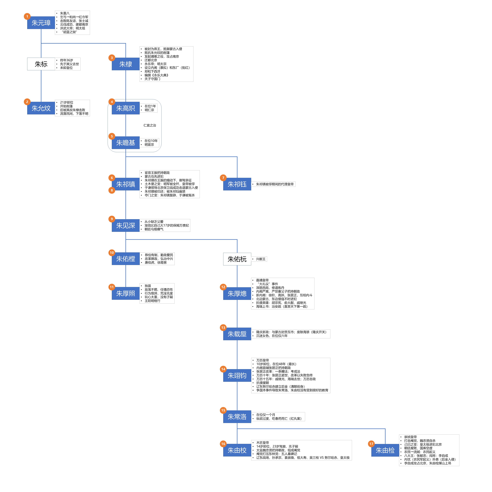

[之前看过《明朝那些事儿》](https://bitjoy.net/categories/%E6%98%8E%E6%9C%9D%E9%82%A3%E4%BA%9B%E4%BA%8B%E5%84%BF/)，但过段时间就忘了。最近读客给寄了《南明史》，想着在阅读《南明史》之前，先复习下明朝历史，故根据《明朝那些事儿》整理得到下面的明朝皇帝列表及大事记，感兴趣的同学自取。可点击查看大图。

明朝共经历16位皇帝，17个年号，其中第6位皇帝朱祁镇被蒙古俘虏后又复辟，故其在位两次，有两个年号。

