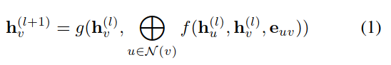
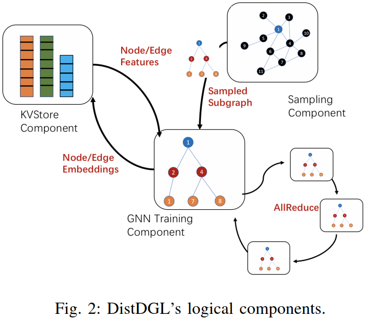
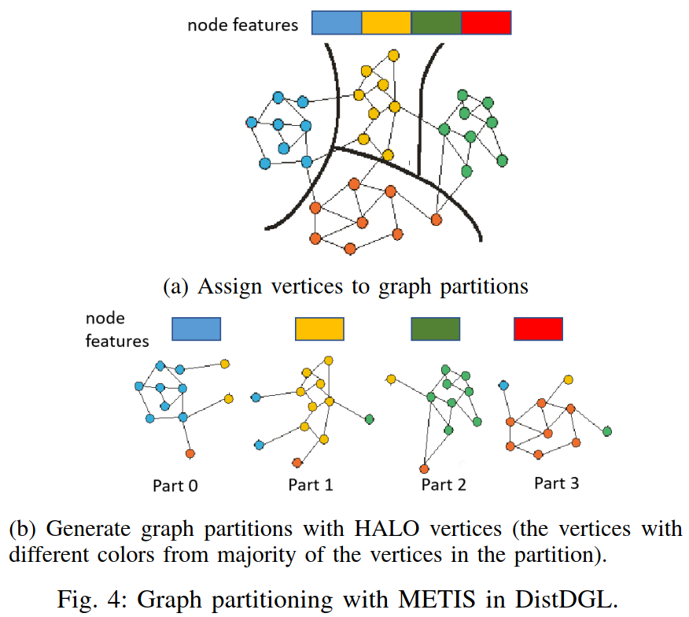
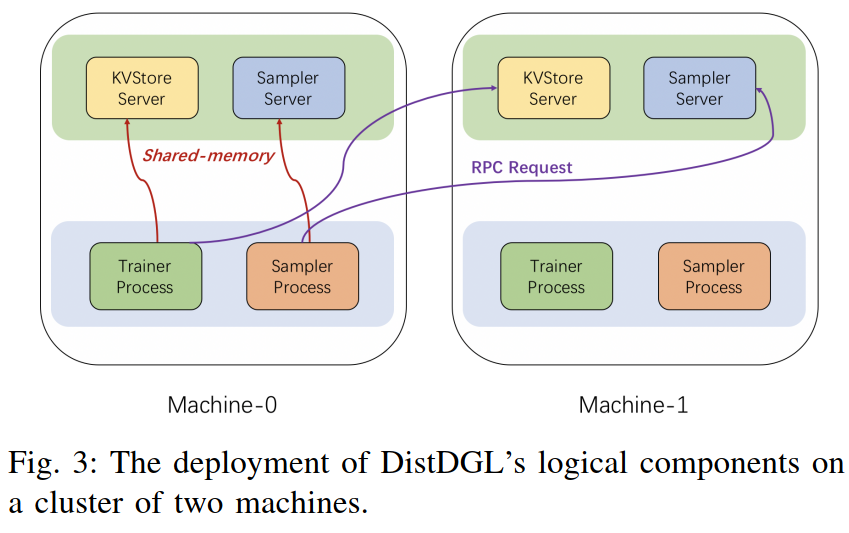

# 前言

工业界的图规模都非常大，少说也是上千万的顶点+上亿的边，单机训练不现实，必须借助多机分布式训练。然而目前主流的图训练框架PyG、DGL对图的多机分布式训练支持都不太好。工业界好像阿里的Euler、百度的PGL可以支持分布式训练。今天介绍一下亚马逊DGL针对分布式训练所做的优化。

# 摘要

GNN广泛应用在推荐、搜索、风控等领域，在这些领域，图的规模往往非常大，有数以亿计的顶点和万亿的边。为支持大规模图的分布式训练，本文提出了DistDGL，它能以mini-batch的方式在多机上进行分布式训练。DistDGL基于DGL框架，它将图数据分布在多台机器上，并基于数据分布，将计算也分布在多台机器上（owner-compute rule）。DistDGL以同步更新的方式进行训练。为了减小分布式训练的通信开销，DistDGL使用一个高效、轻量的图分割算法对图进行分割，在分割时设计了多个负载均衡约束，使得每个分割的子图达到较好的负载均衡。此外，为了减小跨机器的通信，DistDGL在每个子图中保留了halo nodes（正文会介绍到），并且使用了稀疏embedding更新策略。这些优化策略使得DistDGL在分布式训练时能达到较好的高并行效率和内存可扩展性。实验结果表明，在分布式训练时，随着计算资源的增大，DistDGL的训练速度可以线性增长。在16台机器组成的分布式环境中，DistDGL仅用13秒就可以完成1亿节点+30亿边的一个epoch的训练。DistDGL是DGL的一部分，已开源在：[https://github.com/dmlc/dgl/tree/master/python/dgl/distributed](https://github.com/dmlc/dgl/tree/master/python/dgl/distributed)。

# 简介

GNN很有用，但是现实世界中的网络都很大，比如Facebook的社交网络、Amazon的用户商品关系网络等。

GNN分布式训练的难点：
- GNN中每个训练样本（顶点）不是独立的，是相互依赖的，比如为了训练顶点A，必须采样A的邻居，随着GNN层数的增大，采样的邻居数目呈指数上升。而CV、NLP中每条样本是相互独立的。
- GNN的多机分布式训练的通信数据主要是图数据（顶点和边，及其属性），而CV、NLP的分布式训练的通信数据主要是网络参数、梯度等，需要通信的数据类型不同，导致CV、NLP的分布式训练优化技术无法直接迁移到GNN的分布式训练中。
- 此外，神经网络大多采用同步更新的分布式训练策略（难道不是异步？），因此需要尽量做到不同机器或者worker的负载均衡。由于图的特殊结构，不同顶点的度差异很大，即不同子图的负载差异很大，所以如何实现GNN训练时的负载均衡，也是一个难点。

# 背景介绍

## GNN

以消息传递的方式来解读GNN，每一层GNN可以用下面的公式来概括。\(\mathbf{h}_v^{(l+1)}\)和\(\mathbf{h}_v^{l}\)分别表示节点\(v\)在第\(l+1\)层和第\(l\)层的向量表示。\(f\)表示节点\(v\)和每个邻居\(u\)计算消息；\(\oplus\)表示邻居聚合函数；\(g\)用来更新节点表示。

作者将GNN的参数分为两部分，一部分是网络参数，即上面的\(f\)、\(\oplus\)和\(g\)。另一部分是节点本身的embedding参数，对于transductive模型来说，节点本身有embedding，故有这部分参数；但对于inductive模型，节点本身没有embedding参数，节点的embedding表示是通过网络参数生成的。

为了区分这两部分参数，作者将网络参数称为稠密参数dense parameters，所有dense参数在每个mini-batch都需要被全部更新。作者将顶点本身的embedding参数称为稀疏参数sparse parameters，每个mini-batch只需要更新该batch涉及到的顶点的稀疏参数即可。

## Mini-batch training

GNN进行mini-batch训练时的基本流程如下：
1. 从训练集中随机采样N个顶点，这部分顶点称为target vertices
2. 对每个target vertex随机采样最多K个邻居顶点
3. 对每个target vertex，通过聚合其邻居的信息得到target vertex的表示

上述流程是一层GNN的训练过程，如果GNN有多层，则邻居采样的过程会递归进行下去。

# 方法

## DistDGL分布式训练框架

DistDGL的核心可以用上面的图来表示。DistDGL包含三个组件：
- Trainer，即图中的GNN Training Component，其中放大的GNN Training Component只是右边3个之一的放大图而已。Trainer主要是用来训练的，即进行前向传播和反向传播的。
- Sampler，即图中的Sampling Component，用来采样邻居的。
- KVStore，即图中的KVStore Component，用来存储顶点和边的特征，以及相应的embedding。

对照背景介绍中的mini-batch training过程，DistDGL的训练过程如下：
1. Trainer随机采样N个顶点作为target vertices
2. Trainer向Sampler请求采样target vertices的邻居
3. Trainer向KVStore请求target vertices及其邻居的属性信息
4. Trainer开始分布式训练，并使用AllReduce方式同步更新dense参数（网络参数）；并将sparse参数（embedding）存储到KVStore中

## 主要优化点

### 图分割及负载均衡

这是DistDGL最核心的优化点。为了实现高效的分布式训练，DistDGL首先使用METIS图分割算法把图分割成多个子图，不同子图分布式存储在不同机器上；然后把不同子图的计算也分配到存储数据的机器上。做到数据在哪里，计算就在哪里（owner-compute rule），最大程度利用数据和计算的局部性，减小网络通信。

如下图所示，METIS算法以最小割的方式分割图网络，即如果每条边都有不同的权重的话，METIS希望分割的时候切割的边的权重之和最小，由此可以尽量把有密切连接的节点分割到同一个子图中。

我没仔细研究METIS算法，我理解METIS还需要一个约束，即需要分割成多少个子图，或者每个子图最多有多少个顶点之类的。要不然什么都不分割，直接输出全图，则割最小是0。

如果某一条边被分割了，其所连的两个顶点被分割到两个不同的子图中了，称这样的顶点为HALO vertices（通俗理解就是边缘点）。如果需要采样HALO顶点的邻居，则需要跨子图进行采样，涉及到网络通信。为了避免网络通信成为瓶颈，DistDGL会在两个子图中都保留HALO顶点的另一端顶点。在这种情况下，如果只涉及到HALO顶点的一跳采样的话，不需要跨子图通信。DistDGL通过冗余存储HALO顶点，以减小网络通信。由于GNN网络的邻居采样一般只会有2-3跳，所以这种策略应该能避免大部分跨子图通信。

由于同一批数据只需要在开始训练时做一次分割，相对于漫长的N个epoch训练时间来说，分割图的时间开销被分摊了，可以忽略不计。

分割完图之后，DistDGL把不同子图分配到不同机器上。在训练的时候，由于trainer、sampler和KVStore需要互相交换数据，为了提高数据交换效率，DistDGL把属于同一个子图的trainer、sampler和KVStore分配到了同一台机器上，则三者之间的通信可以直接通过共享内存的方式进行内存拷贝，大幅减小了网络通信带来的延时。

如下图所示，同一台机器上的Trainer、Sampler和KVStore是共享内存的。

文中还提到在METIS分割图的时候，增加了很多约束条件，以达到负载均衡的目的。我理解默认METIS在进行分割的时候，可能只保证不同子图的顶点数大致相同，在这个约束下去最小化割。然而子图的顶点数相同，并不代表子图的负载也相同，还涉及到子图中边的数目，不同类型顶点的数目分布等等。因此DistDGL在METIS子图分割时还增加了很多约束条件，使得分割的子图在训练的时候尽量达到负载均衡。

### 分布式KVStore

DistDGL把顶点和边的属性特征及embedding存储在分布式KVStore中，DistDGL开发了自己的分布式KVStore，而不是使用现成的比如Reddis，原因是更方便自定义功能，比如把属于同一个子图的顶点、边、特征存储到同一个机器上，优化了网络传输，实现稀疏embedding的异步更新等。

### 分布式Sampler

Trainer训练和Sampler采样是并行进行的，简单理解就是，Trainer在训练当前Epoch数据的时候，Sampler就已经在异步采样下一个Epoch的数据了，充分利用计算资源，实现流水线作业。类似的，局部采样和远程网络RPC通信也可以overlap“同步”进行，使得局部采样感受不到远程通信的等待时间。

### Mini-batch训练

更新网络参数（dense参数）时，采用的是同步更新策略all reduce，确保网络收敛精度更高。更新embedding参数（sparse参数）时，采用的是异步更新策略。由于前面设计的图分割及负载均衡策略，不同trainer间overlap的顶点比较少，故顶点embedding异步更新时遇到的冲突也比较少，对精度的影响微乎其微。

# 实验

和阿里的Euler对比，DistDGL速度快2倍。主要速度优势在于data copy，由于DistDGL把数据和计算分配到一台机器，利用局部性原理，其跨机器通信很少，而同一台机器的通信是共享内存的，所以速度显著快于Euler的网络通信。

DistDGL自己实现的sparse embedding比Pytorch自带的快70倍，因为DistDGL只进行子图局部的embedding更新，且是异步更新的。

可扩展性方面，DistDGL随着计算资源的增加，训练速度呈线性加速，很不错。

消融实验：图分割算法，对比了随机分割、默认的METIS分割、带多个约束的METIS分割。带多个约束的METIS分割效果最好，默认的METIS在某些情况下甚至不如随机分割，因为它会导致不同子图的负载很不均衡。而增加额外的多个约束之后，能明显改善负载均衡。这说明不仅需要降低网络通信的开销，确保不同trainer的负载均衡也很重要。

# 评价

是一篇系统相关的文章，需要对系统、算法都有一定的了解。

核心思想是对图进行分割，利用数据和计算的局部性，将同一子图的数据和计算放在同一台机器上，以尽量减少跨机器的通信。很朴素的思想，但是能用到GNN上还是挺有意思的。

有个疑问是：为什么网络参数（dense参数）要用all reduce同步更新？论文说神经网络的分布式训练大多采用同步更新，但是我怎么感觉大多数采用的是PS的异步更新策略呀？？如果使用异步更新的话，是不是负载不均衡带来的影响就没那么大了呢？

另外就是测试的数据集有点少，只测试了OGB数据集。感觉DistDGL对图的分布很敏感啊，如果分布很不一样的话，加速效果还有这么明显吗？比如对于那种很均匀的图，可能效果和随机分割差不多了？

最后，写作还可以再提升，比如多个负载均衡的策略，没太看懂，建议直接给出形式化的数学公式，比如METIS的优化目标和约束等。Fig 5也没看懂，有看懂的小伙伴请留言。