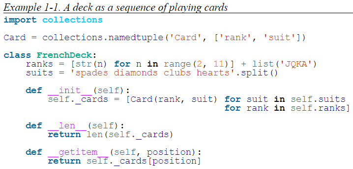
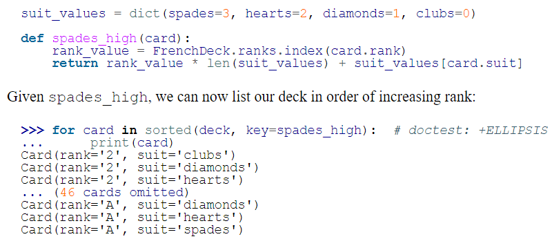

今天开始学习《Fluent Python 2nd》，Python进阶好书。第二版今年3月份刚刚出版，以最新Python 3.10为基础进行介绍。

第一个案例是Python风格的扑克牌类：

短短几行代码，包含了Python很多有趣的特性，咱们一一道来。

**（1）第一点就是collections.namedtuple的使用**。比如这里使用collections.namedtuple定义了一个Card类，这个类的名称是Card，有两个命名成员rank和suit，分别表示扑克牌的数字和花色。

通常情况下，如果我们要定义一个Card，带两个属性rank和suit，需要使用class来进行定义，比较繁琐。但是对于扑克牌这种类，它只有属性（即数字和花色），没有方法，且属性一旦赋值就不可修改。则可以用collections.namedtuple来方便快速的定义一个命名类（命名tuple）。通过Card = collections.namedtuple('Card', ['rank', 'suit'])一行代码就实现了上面的定义，非常简洁高效。

**（2）Python类的成员变量和实例的成员变量**。上述FrenchDeck可以理解为“一张扑克牌桌子”的类，桌子上放了一副扑克牌。FrenchDeck有两个类的成员变量ranks和suits，这两个变量没有self.前缀，它们属于FrenchDeck这个类，所以可以直接用类名访问，即通过FrenchDeck.ranks或FrechDeck.suits访问。

而我们看FrenchDeck的构造函数__init__中有一个变量self._cards，它带有self.，此类变量就是类的实例的成员变量，只能通过实例进行访问，无法通过类名进行访问。一般我们将实例的成员变量以下划线_开头进行命名，以示区别。

类的成员变量也能通过实例进行访问，但实例的成员变量无法通过类进行访问。

比如定义deck=FrenchDeck()，则deck既可以访问实例的成员变量_cards，也能访问类的成员变量ranks和suits。但FrenchDeck只能访问ranks和suits，无法访问_cards。

如果实例变量和类变量同名，则通过实例访问时只能访问到同名的实例变量。由于类只能访问类变量，所以是否同名对通过类访问类变量没有影响。

**（3）实现了内置的__len__和__getitem__方法**。这两个方法都是python内置的方法，前者返回实例长度，后者返回指定下标的元素。实现了__len__之后，如果外部调用len(deck)，则Python解释器会隐含调用deck.\_\_len\_\_()。实现了__getitem__自后，如果外部调用deck[i]，则Python解释器会隐含调用deck.\_\_getitem\_\_(i)。

实现了__len__和__getitem__之后，相当于外部函数可以知道FrenchDeck实例的总长度，同时能取到任意下标的元素。因此，FrenchDeck实例看起来很像list，也可以支持诸如切片、随机采样、遍历等操作。仔细想想，切片、随机采样、遍历这些操作，其实只需要知道实例的总长度和随机访问下标这两个操作就可以了，而通过实现__len__和__getitem__这两个方法，FrenchDeck已经实现了这两个方法，所以也就支持前面说的那些操作了。

如果需要对扑克牌进行排序，则还需要为Card自定义排序函数，或者在sorted函数传入key。下面定义了key函数是spades_high，即计算每张牌的分值大小，以这个分值作为key排序的依据。

