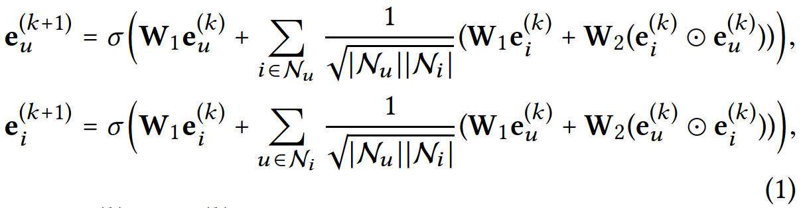
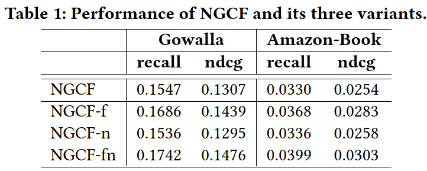
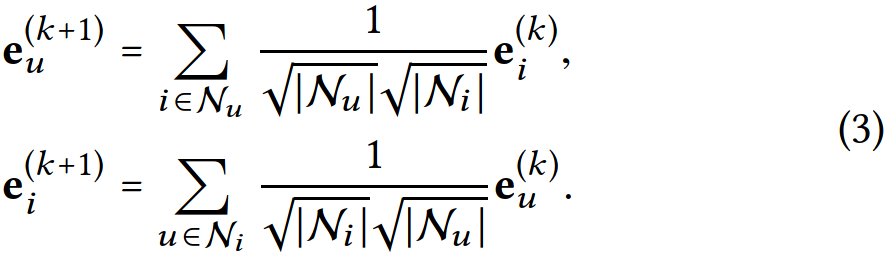
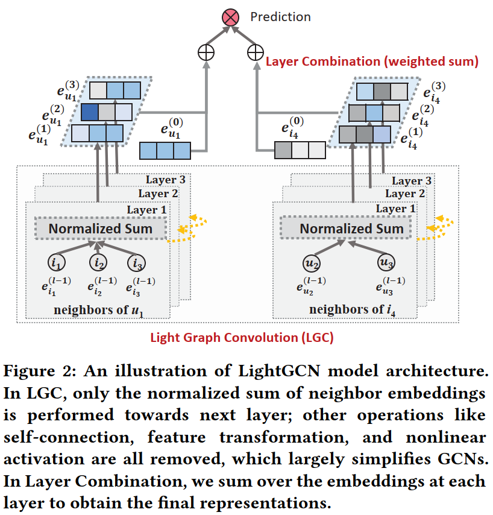
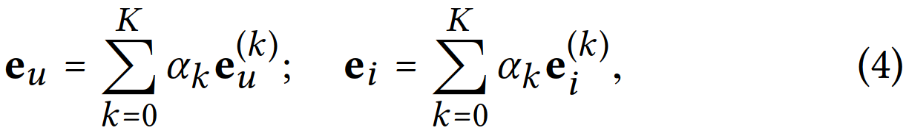
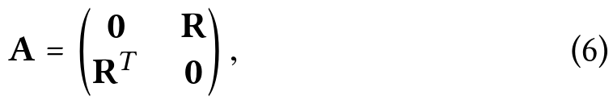
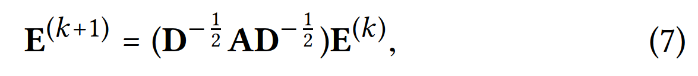
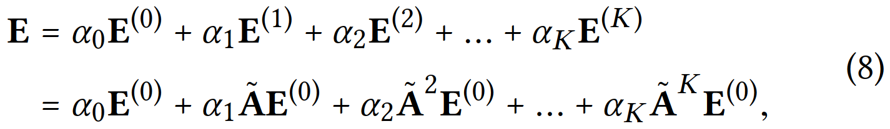

# 摘要

GCN模型是不是越复杂越好呢？这篇文章分析发现，GCN中常用的矩阵变换（feature transformation）和非线性激活函数（nonlinear activation）没有作用，甚至有反作用，据此作者提出了一个非常简单的GCN模型LightGCN，模型参数只有节点的embedding。这么简单的模型在推荐任务上，比大多数复杂模型的性能都要好，而且作者从理论分析了如此设计存在的若干好处。

# 简介

作者所在团队在2019年发表了一个NGCF的模型，该模型基于user和item的交互关系网络，使用GCN训练得到user和item的embedding，然后使用embedding相似度进行推荐。

简单来说，第k+1层的user和item的embedding使用如下公式计算。其中的W1是直接对embedding进行变换的矩阵，W2是对user和item点乘之后进行变换的矩阵；而σ是非线性激活函数。

以user为例，右边有两项，第一项是对user在第k层的embedding进行矩阵变换；第二项是邻居聚合。其中邻居聚合又有两项，第一项是对item的embedding进行矩阵变换；第二项是对user和item点乘之后进行矩阵变换。

作者发现，对于协同过滤任务来说，由于user和item都只有ID本身，没有很多的属性，所以并不需要复杂的矩阵变换和非线性激活函数。言下之意是，如果节点有丰富的属性信息的话，非线性变换和激活有用？感觉可以这么理解：有些属性重要，有些属性不重要，所以需要非线性激活函数进行识别？如果只有节点ID的话，ID的embedding的所有维度都是重要的，不需要非线性激活，直接线性加权聚合就行了。

然后作者对NGCF模型进行了简单的消融实验，如下表所示，NGCF就是原始的NGCF，NGCF-f、-n、-fn分别表示去掉矩阵变换W1和W2、去掉非线性激活函数σ、同时去掉W1、W2和σ。很意外的是，-f、-n、-fn居然都比原始的NGCF效果好，而且-fn效果最好。说明对于只有user和item顶点，没有属性的网络来说，不用过于复杂的矩阵变换和非线性激活，效果反而更好。

按道理NGCF的参数空间比NGCF-f大，且前者能覆盖后者（只需要把W1和W2设置成单位矩阵），为什么前者的效果反而比后者差呢？作者进一步分析了两者训练时的loss和recall曲线，发现NGCF的参数空间虽然比NGCF-f大，但其收敛后的loss更大，recall更小。也就是说训练效果反而不如NGCF-f。作者认为，加入过多的矩阵变换和非线性变换，导致模型过于复杂，难以训练到较好的效果。据此，作者提出了一个更简单的模型LightGCN，具体看下一节介绍。

# 方法

既然前面分析说矩阵变换和非线性激活函数会起副作用，LightGCN的方法非常简单，就是把这两个操作去掉。如公式3所示，每个节点的embedding表示直接等于其邻居的embedding的线性加权求和，既没有矩阵变换，也没有非线性激活函数，如此的简单。而且，对比公式3和公式1可知，LightGCN没有显式使用自回路，即计算某个节点的embedding的时候，只用了其邻居的embedding，没有用自己的embedding；而NGCF在公式1中使用了自回路。

其网络结构图如下：

最后，节点的最终embedding等于其各层embedding的加权求和。如公式4所示，权重系数α可以手工指定，也可以使用注意力网络来自动学习。为简便起见，本文直接设置为等权重，所有系数都等于1/(K+1)，相当于所有层embedding求平均。

节点最终embedding等于各层embedding的加权求和有如下三个好处：
- GNN存在over-smoothing的问题，即随着网络层数越深，深层网络的输出结果趋向于相同。即所有节点的最后一层的输出有可能很接近。而如果把所有层加起来的话，能一定程度上缓解这个问题
- GNN不同层捕获的语义信息不一样，使用所有层输出能增强表达能力，这个和CNN的道理是类似的。
- 所有层embedding求和可以捕获自回路的信息。也就是说虽然公式3没有显式使用自回路，但计算顶点最终embedding时（公式4）可以隐含自回路的信息，这个后面会给出证明。

除此之外，由于LightGCN很简单，所以也很好训练，更容易收敛，收敛效果更好。总之，虽然LightGCN很简单，但它很强大，而且有很多好处。

# 模型分析

接下来，作者分析了为什么LightGCN可以学习到自回路，其证明思路是这样的。另一篇工作SGCN和这篇工作很像，也做了很多简化，且显式添加了自回路。作者通过分析发现LightGCN可以表达SGCN的形式，间接说明LightGCN隐含可以考虑自回路。下面是具体的证明过程。

首先定义user和item的交互矩阵\(\mathbf{R}\in \mathbb{R}^{M\times N}\)，其中M和N分别表示user和item的个数。\(\mathbf{R}_{ui}\)为1表示u和i有交互，等于0表示没有交互。则全图的邻接矩阵可以表示为公式6：

公式3的矩阵形式可以表示成公式7，其中矩阵D为度矩阵。对照下[原始的GCN公式](https://www.cnblogs.com/denny402/p/10917820.html)，其实就是把原始GCN的变换矩阵W和非线性激活函数σ去掉了。

由于LightGCN是将多层embedding加权求和，所以最终结果是公式8：

然后作者对SGCN的公式进行了简单的变换，发现形式上和公式8是一致的，所以LightGCN也能隐含学习到自回路特征。

此外，作者还分析了另一个模型APPNP，APPNP借鉴pagerank的思想，可以缓解GNN过深带来的over-smoothing问题。然后作者如法炮制，对APPNP的公式进行变换，发现也和公式8等价，所以LightGCN也能缓解GNN的over-smoothing问题。其实这个从LightGCN不只使用最后一层，而是使用所有层embedding就能得到这个结论，不需要这么大费周章证明。

# 实验

最后是实验环节。作者将LightGCN和本文开头提到的NGCF进行了对比，实验结果表明，LightGCN的性能相比NGCF有显著提升，而且比NGCF-fn也高。作者提到，虽然NGCF-fn已经去掉了矩阵变换和非线性激活函数，但NGCF-fn仍然还有自回路、user和item的点积、dropout等等，还是比较复杂，不好训练。而LightGCN非常简单，只有embedding和邻居的线性加权，所以LightGCN还是比NGCF-fn好。真的很神奇啊，照这个说法，难道连dropout也会起副作用？

此外，在消融实验中，作者还对比了LightGCN和LightGCN-single，LightGCN-single是只用LightGCN的最后一层作为节点的embedding。作者发现，当网络层数增大到4层时，LightGCN-single性能显著下降，出现了over-smoothing的问题。而LightGCN由于多层组合的操作，不会有over-smoothing的问题。考虑到性能和收益，LightGCN使用了3层神经网络。

# 评价

结果有些意外，LightGCN这么简单的模型，效果居然比复杂模型还要好？感觉即使是NGCF，模型也不复杂啊，和CV、NLP那些大模型相比简单多了，怎么就训练不好了呢？难道是GNN特有的现象？

感觉和数据有关，本文测试的数据是只包含user和item顶点，顶点没有属性。如果是属性图的话，也许结论会有变化。

不过至少提供了调参的思路：去掉矩阵变换、去掉非线性激活函数、甚至是去掉dropout。。。另外重要的一点是，不要只用最后一层的embedding，而是组合所有层的embedding进行加权求和。

另外，本文开篇提到的NGCF和本文是同一批作者，自己批判自己一年前发表的工作，不免让人担心这篇工作的可靠性。。。以及当时的NGCF难道没有做本文开篇的消融实验吗？难道不应该吗？