# 前言

这节课主要介绍传统的图机器学习方法。传统方法主要分为两步，第一步人工设计特征，第二步使用各种机器学习方法进行预测。因此，特征工程在传统图机器学习方法中有很重要的地位。本节课主要介绍图上的特征工程方法，分别介绍针对节点（node-level）、边（link-level）和图（graph-level）的特征工程方法。

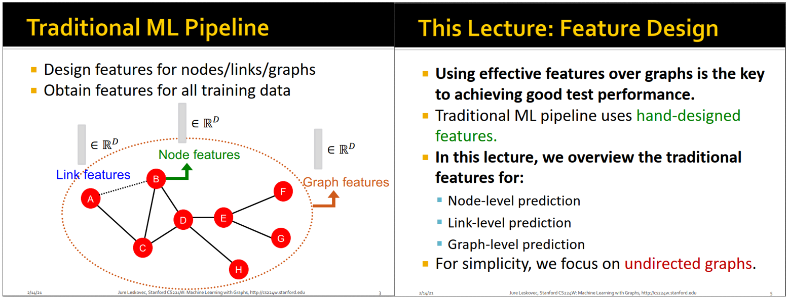

# 针对节点的特征工程方法

节点水平的特征主要有四类，下面分别介绍。
* 节点的度（node degree）
* 节点的中心性（node centrality）
* 节点的集聚系数（clustering coefficient）
* 非同构子图（graphlets）

## 节点的度

节点的度，这个最好理解了，即该节点的所连边的数目，或者说该节点的直接邻居数目。如果是有向图，还分为出度和入度。

节点的度的不足是，没有考虑到不同邻居的重要性不同，只要有一个邻居，度就加1，即认为所有邻居的重要性是相同的。

## 节点的中心性

节点的中心性这个特征考虑了节点的重要性，有多个中心性指标，如下：
* 特征向量中心性（Engienvector centrality）
* 中介中心性（Betweenness centrality）
* 接近中心性（Closeness centrality）

**特征向量中心性**的定义是：节点v的重要性=v的邻居的重要性的和，除以λ进行归一化。
根据定义可知，特征向量中心性是递归定义的，写成矩阵形式就是Ac=λc，特征向量c的每个维度就是每个顶点的特征向量中心性的值。

忘记了怎么求特征值和特征向量的同学可以复习一下：[https://blog.csdn.net/Junerror/article/details/80222540](https://blog.csdn.net/Junerror/article/details/80222540)。

算出最大特征值λ_max对应的特征向量c_max之后，节点v的特征向量中心性就是向量c_max的第v个分量。具体看维基百科：[https://zh.wikipedia.org/zh-cn/%E7%89%B9%E5%BE%81%E5%90%91%E9%87%8F%E4%B8%AD%E5%BF%83%E6%80%A7](https://zh.wikipedia.org/zh-cn/%E7%89%B9%E5%BE%81%E5%90%91%E9%87%8F%E4%B8%AD%E5%BF%83%E6%80%A7)。

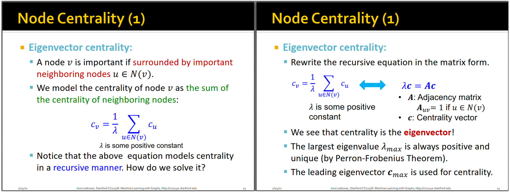

如果说特征向量中心性有点难以理解和计算的话，接下来介绍的中介中心性和接近中心性就很好理解了。

**中介中心性**，顾名思义，就是节点作为中介（枢纽）的重要性。计算方法是，所有节点对(s,t)的最短路径穿过节点v的比例。(s,t)的最短路径可以认为是(s,t)之间的交通要道，如果这条路径穿过节点v的话，说明v在交通要道上，所以v是很重要的中介枢纽。具体计算方法见下图，即v在所有(s,t)的最短路径中出现的比例。

**接近中心性**也很好理解，就是节点v与图中其他节点的接近程度。计算方法是：v到其他节点的最短路径之和的倒数。如果一个节点越中心，则它到其他节点的最短路径越短，则接近中心性越大。比如下图的D就比A更中心，所以D的接近中心性更大。

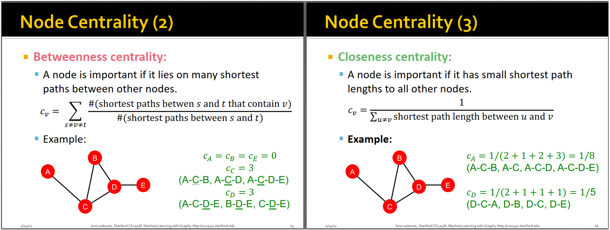

## 节点的集聚系数

集聚系数是个很有意思的指标，它描述的不是节点本身，而是节点的邻居的集聚程度。其计算公式如下图所示，分子是v的邻居形成的边的数目，分母是v的邻居理论上能形成最多的边的数目，分母用来归一化的。

集聚系数=1表示v的邻居都两两认识，=0表示v的邻居两两都不认识。集聚系数越大，表示邻居聚集程度越高，越有可能是一个紧密的团体。

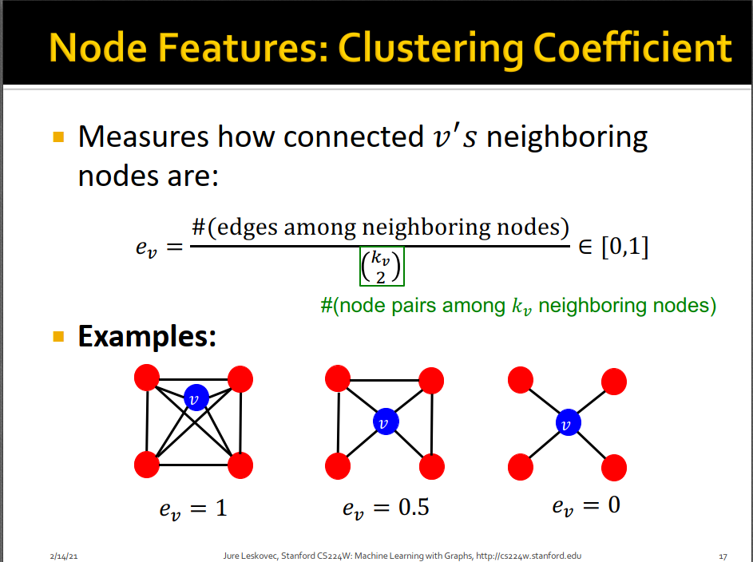

## 非同构子图

非同构子图的英文定义是：rooted connected non-isomorphic subgraphs，很准确啊，有根的连通的非同构子图。比如下图中3个节点的graphlets有3个，G1中目标节点（根节点）在1和2形成的子图是不一样的（不同构），而在G2中3个点的位置是等价的，所以G2只有1个graphlet，加起来就是3个graphelts。从2个节点到5个节点，能形成的graphlets总数是73个。

Graphlet Degree Vector（GDV）是基于graphlets的特征，它计算以目标节点v为根，能形成的不同graphlets的数目向量，相当于描述了v周围不同子结构的子图个数。如下子图3所示，红色节点v的2-3个节点的GDV向量是[2,1,0,2]。如果统计节点v周围的2~5个节点（包含v自己）形成的graphlets的数目，则会得到一个维度为73的GDV向量，相当于节点v的一个特征向量。这个73维度的特征向量是节点v周围四跳（4-hop）的结构信息。

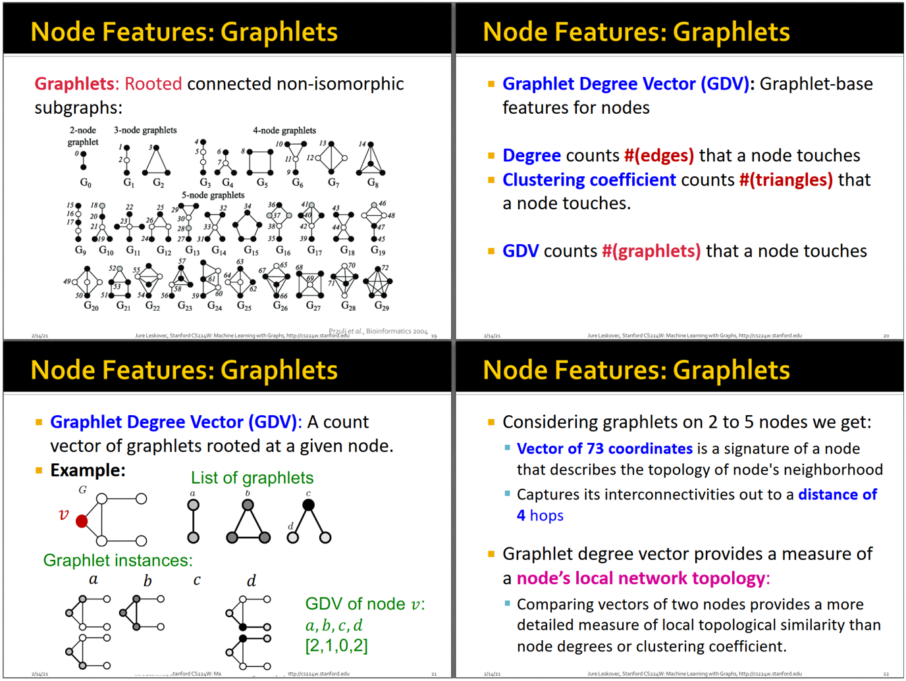

小结一下节点的特征大概可以分成两类，一类是基于重要性的特征，例如节点的度、节点的中心性；另一类是基于结构的特征，例如节点的度、集聚系数、非同构子图个数向量。基于重要性的特征可用于预测网络中的重要节点，例如社交网络中的名人节点；基于结构的特征可用于预测网络中不同节点的不同功能，例如蛋白质相互作用网络中不同蛋白质的功能，因为不同的局部子结构往往蕴含了不同的功能。

--------------------------------------------------------------------------------

# 针对边的特征工程方法

针对边<A,B>的特征工程方法，固然可以把节点A和B的节点特征concat起来作为边<A,B>的特征，但是丢失了很多边特有的信息，效果不一定好。专门针对边设计的特征工程方法有三个，下面分别介绍：
* 基于距离的特征（Distance-based feature）
* 局部邻居重叠比例（Local neighborhood overlap）
* 全局邻居重叠比例（Global neighborhood overlap）

## 基于距离的特征
两点之间的最短路径长度，这个最好理解了，可以用Dijkstra算法和Floyd算法求解。然而最短路径无法捕捉两个节点的共同邻居数目，比如下图中BH和BE的最短路径都是2，但BH有两个共同邻居CD，而BE只有一个共同邻居D，如果只用最短路径这个特征，则无法区分BH和BE这两对节点。

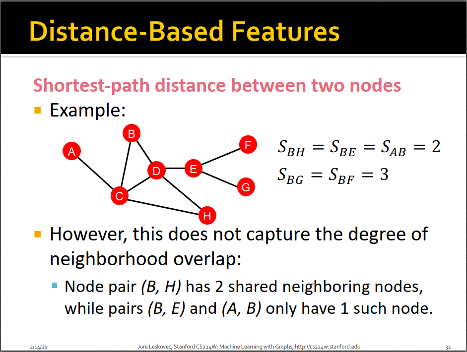

## 局部邻居重叠比例

局部邻居重叠比例衡量两个节点的邻居重叠程度，比如简单的Common neighbors直接计算两个节点的共同邻居数目；Jaccard's coefficient用邻居交集数目除以并集数目做了归一化。

Adamic-Adar index的计算方法是所有共同邻居的度的对数分之一加和。它的直观含义是，如果共同邻居的度越小，则说明两个节点的关系越紧密。比如下图中，A和B的共同邻居是C，C的度是4，说明C除了连接了A和B，还连了另外2个节点。如果C的度越大，则说明A和B占C的邻居的重要性越低；反之，如果C只连了A和B，则说明A和B通过C这个枢纽连接的关系很重要。举个简单的例子，比如两个人都喜欢一个很小众的电影，则他们的兴趣可能会很接近，但如果都喜欢一个大众电影，则他们的关系可能没那么强烈。

局部邻居重叠比例的问题是：只考虑了一跳直接相连的邻居，没有考虑间接相连的邻居（潜在关系），后面介绍的全局邻居重叠比例可以解决这个问题。

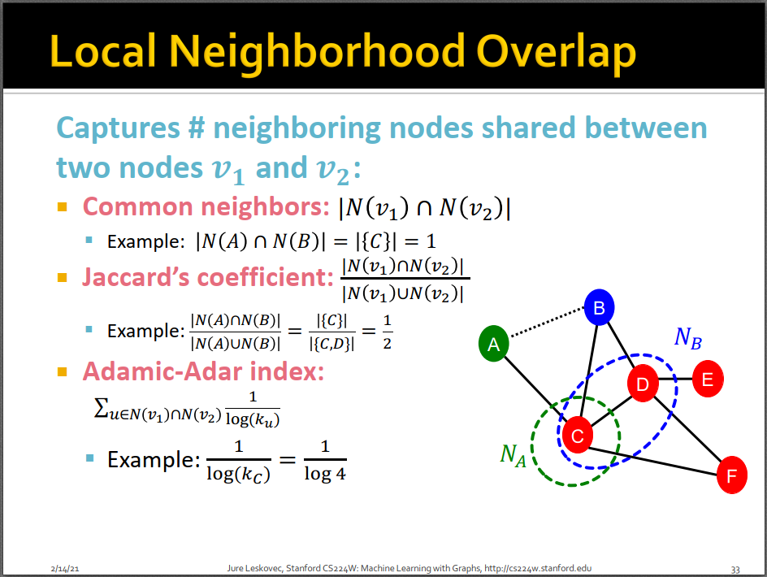

## 全局邻居重叠比例

Katz index统计的是任意两个节点之间任意长度的路径的个数。在计算Katz index的时候，需要计算两个节点uv之间长度为l的路径个数。计算方法是邻接矩阵的l次方。

如下的子图2中，直观理解，假设邻接矩阵为A，则A^1就是邻接矩阵本身，有连边就是1，没有连边就是0，则A_uv要么是1要么是0，即uv长度为1的路径要么是1（有连边），要么是0（没连边）。即A^1中每个元素A_uv记录了节点u和v之间长度为1的路径数目。

A^2=A*A，比如A_12，用A的第一行（记录了节点1连了哪些边），乘以A的第2列（记录了节点2连了哪些边）。这两个向量在相乘的时候，如果对应元素都是1，说明这个元素（节点）和1、2都有连边，是1、2的公共邻居，作为桥梁，可以连成一条长度为2的路径。把两个向量相乘再相加，就是长度为2的路径的总数。

以此类推，则A^l记录了任意两个节点u和v之间长度为l的路径个数。

如下子图4，Katz index就是把节点v1和v2之间路径依次为1、2、...∞的路径个数加权求和了，β是一个衰减因子，长度越长的路径，权重越小。

最后的数学形式倒是挺简洁的，公式推导可看这里：[https://blog.csdn.net/chuhang123/article/details/103289413](https://blog.csdn.net/chuhang123/article/details/103289413)

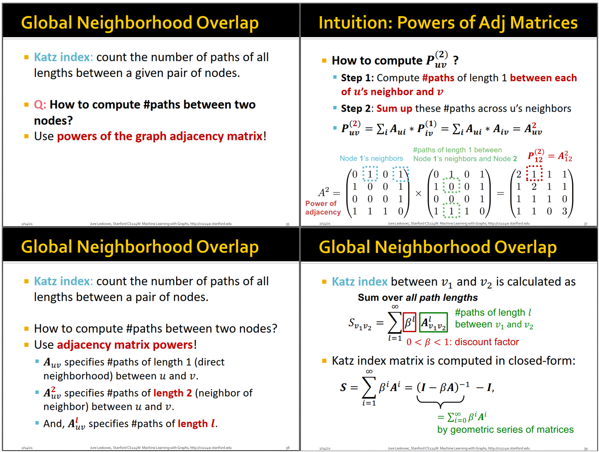

--------------------------------------------------------------------------------

# 针对图的特征工程方法

针对图的特征工程方法主要是核方法（Kernel methods），这里的核方法和SVM中的核方法是一个意思，都是把特征映射到高维空间，在高维空间的特征交互可以用低维空间的核矩阵来表示。

图上的核方法的核心思想是bag-of-words，即统计不同子图（相当于words）的个数，比如下图子图4中是统计不同度的节点的个数，则这里度为k的节点就是一个不同的word，最后得到bag-of-words向量，比如[1,2,1]。前面介绍针对节点的特征工程时，其中的GDV向量本质上是bag of graphlets。

在介绍针对图的特征工程方法时，会介绍两种核方法：Graphlet Kernel和Weisfeiler-Lehman Kernel。

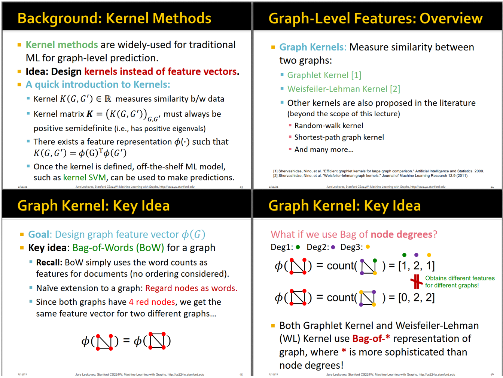

## Graphlet Kernel

graph-level的graphlet特征和node-level的graphlet特征不太一样。graph-level的graphlet可以不联通，且没有rooted，所以简单理解就是比如k=3时，graphlet就是3个顶点可以连成的不同形状（不同构）的图，如下图子图2，k=3时，有4个graphlet。

如下子图3，给定这样一个图，k=3时不同graphlets的数目向量为[1,3,6,0]。举个例子，比如算有多少个g2时，只需要保证考察的3个点中只有2条边，至于这3个点和其他点是否有连边，并不影响其是否符合g2这个graphlet，只要被考察的3个点满足只有2条边就行。所以这个图一共可以找出3个g2出来。

类似的，计算有多少个g3时，只需要保证考察的3个点有一条边，有一个孤立点就行，至于这个孤立点和这3个点之外的其他点是否有连边，并不影响其是否符合g3这个graphlet。

得到图的graphlet个数向量之后，相当于得到了图的graph-level的特征向量，graph kernel就是对两个图的graphlet向量进行各种运算了。

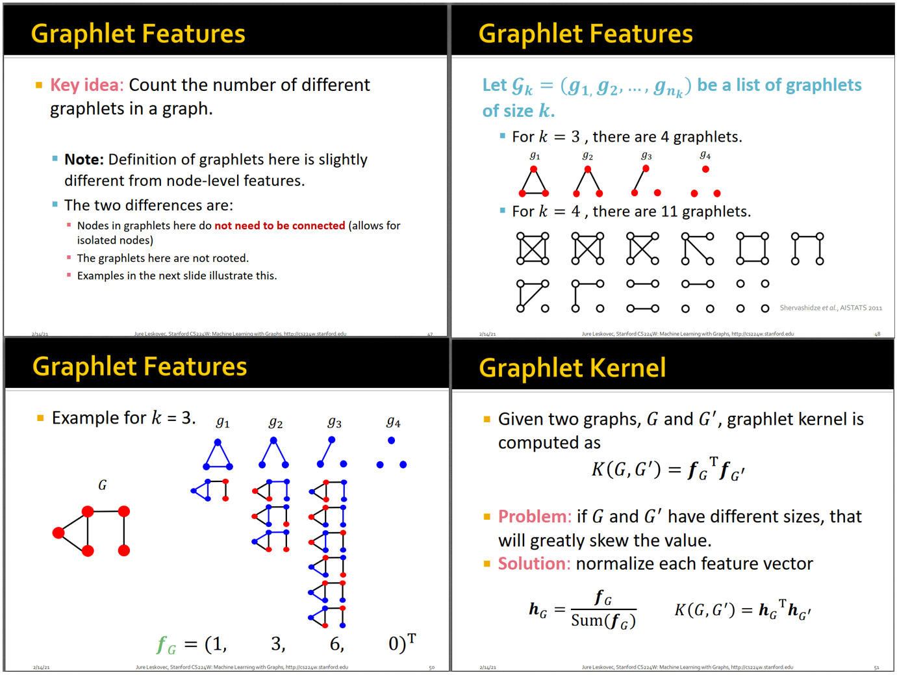

## Weisfeiler-Lehman Kernel

由于判断子图是否同构是一个NP-Hard问题，计算graphlet向量成本太高了，Weisfeiler-Lehman kernel是一个更加高效的针对图的特征工程方法。

Weisfeiler-Lehman Kernel（WL Kernel）的思想是通过聚合邻居的特征来更新自身节点的特征，已经有GNN的味道了。实现的算法是color refinement算法，具体来说，就是给每个节点一个初始的颜色，然后每次聚合邻居的颜色，然后进行某种HASH运算，得到更新后的颜色；然后再进行聚合；如此循环往复，聚合K次之后，就能得到K-跳邻居的信息了。这不就是GraphSAGE吗哈哈。

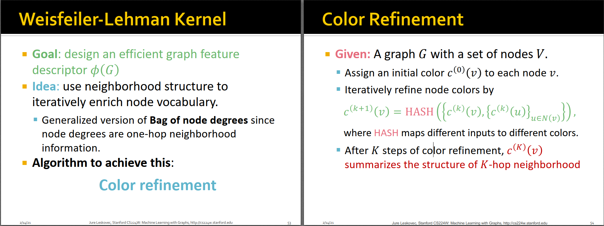

如下是课上的一个例子：初始的时候所有节点的颜色都是1，然后通过聚合邻居颜色并hash进行更新，迭代了几轮之后，计算迭代过程中出现过的所有不同颜色的节点的个数，得到WL向量。最后两个图的WL向量就可以进行各种运算了，比如点乘得到49。

WL Kernel的计算很高效，其每一步邻居聚合的时间复杂度和边的数目是线性关系。

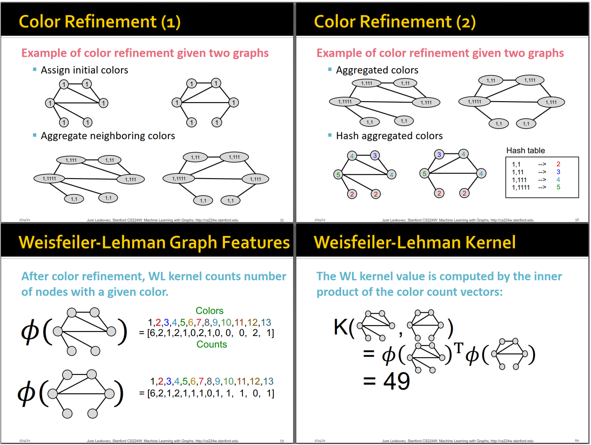

小结一下，针对图的特征工程方法中，核心思想是词袋模型，比如Graphlet kernel相当于bag-of-graphlets，而WL kernel相当于bag-of-colors。

